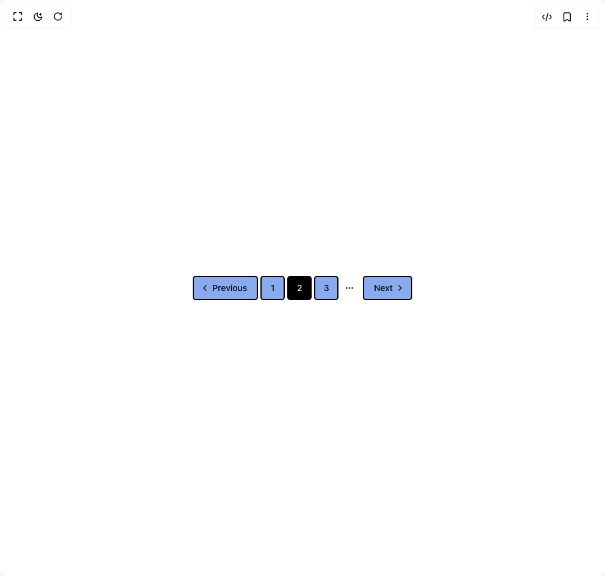

# Build Pagination in BuilderStudio

> Build this component in our Agentic IDE: [BuilderStudio](https://builderstudio.dev).
>
> Join the BuilderStudio community on [Discord](https://discord.gg/QdWeSGCqfe) and [Reddit](https://reddit.com/r/builderstudio).



## Component

- Author group: `samke`
- Component: `pagination`
- Variant: `pagination-demo`
- Rendered HTML snapshot: [`rendered.html`](rendered.html)

## BuilderStudio prompt

You are implementing a React component based on a component reference.

## Component identity

- Author: samke
- Component slug: pagination
- Demo slug: pagination-demo
- Title: pagination
- Description: 

## Goal

Recreate this component in a React + TypeScript + Tailwind CSS project. Preserve the visual layout, spacing, colors, border radius, shadows, interaction behavior, animation behavior, responsive behavior, and dark mode behavior shown in the rendered demo.

## Implementation requirements

- Use React and TypeScript.
- Use Tailwind CSS classes whenever possible.
- Keep the component self-contained unless the source files require helper components.
- If the source uses CSS variables, custom CSS, animations, or keyframes, include them.
- If the source uses external packages, list and use the required packages.
- Preserve accessibility attributes, button semantics, links, keyboard behavior, and ARIA attributes when visible in the source.
- Do not replace the component with a simplified placeholder.
- Return complete production-ready code.

## Dependencies

No reference metadata available.

## Rendered DOM snapshot

This is the rendered demo HTML extracted from the live preview. Use it to verify structure, class names, visible content, and layout.

```html
<div id="root"><div class="relative flex items-center justify-center h-screen w-full m-auto p-16 bg-background text-foreground"><div class="absolute lab-bg inset-0 size-full"><div class="absolute inset-0 bg-[radial-gradient(#00000021_1px,transparent_1px)] dark:bg-[radial-gradient(#ffffff22_1px,transparent_1px)]"></div></div><div class="flex w-full justify-center relative"><nav role="navigation" aria-label="pagination" class="mx-auto flex w-full justify-center"><ul class="flex flex-row items-center gap-1"><li class=""><a class="inline-flex items-center justify-center whitespace-nowrap rounded-base text-sm font-base ring-offset-white transition-all [&amp;_svg]:pointer-events-none [&amp;_svg]:size-4 [&amp;_svg]:shrink-0 focus-visible:outline-none focus-visible:ring-2 focus-visible:ring-black focus-visible:ring-offset-2 disabled:pointer-events-none disabled:opacity-50 text-mtext bg-main border-2 border-border h-10 px-4 py-2 gap-1 pl-2.5" aria-label="Go to previous page" href="#"><svg xmlns="http://www.w3.org/2000/svg" width="24" height="24" viewBox="0 0 24 24" fill="none" stroke="currentColor" stroke-width="2" stroke-linecap="round" stroke-linejoin="round" class="lucide lucide-chevron-left h-4 w-4" aria-hidden="true"><path d="m15 18-6-6 6-6"></path></svg><span>Previous</span></a></li><li class=""><a class="inline-flex items-center justify-center whitespace-nowrap rounded-base text-sm font-base ring-offset-white transition-all gap-2 [&amp;_svg]:pointer-events-none [&amp;_svg]:size-4 [&amp;_svg]:shrink-0 focus-visible:outline-none focus-visible:ring-2 focus-visible:ring-black focus-visible:ring-offset-2 disabled:pointer-events-none disabled:opacity-50 text-mtext bg-main border-2 border-border h-10 w-10" href="#">1</a></li><li class=""><a aria-current="page" class="inline-flex items-center justify-center whitespace-nowrap rounded-base text-sm font-base ring-offset-white transition-all gap-2 [&amp;_svg]:pointer-events-none [&amp;_svg]:size-4 [&amp;_svg]:shrink-0 focus-visible:outline-none focus-visible:ring-2 focus-visible:ring-black focus-visible:ring-offset-2 disabled:pointer-events-none disabled:opacity-50 border-2 border-border h-10 w-10 bg-black text-white" href="#">2</a></li><div class="items-center md:flex hidden"><li class=""><a class="inline-flex items-center justify-center whitespace-nowrap rounded-base text-sm font-base ring-offset-white transition-all gap-2 [&amp;_svg]:pointer-events-none [&amp;_svg]:size-4 [&amp;_svg]:shrink-0 focus-visible:outline-none focus-visible:ring-2 focus-visible:ring-black focus-visible:ring-offset-2 disabled:pointer-events-none disabled:opacity-50 text-mtext bg-main border-2 border-border h-10 w-10" href="#">3</a></li><li class=""><span aria-hidden="true" class="flex h-9 w-9 items-center justify-center"><svg xmlns="http://www.w3.org/2000/svg" width="24" height="24" viewBox="0 0 24 24" fill="none" stroke="currentColor" stroke-width="2" stroke-linecap="round" stroke-linejoin="round" class="lucide lucide-ellipsis h-4 w-4" aria-hidden="true"><circle cx="12" cy="12" r="1"></circle><circle cx="19" cy="12" r="1"></circle><circle cx="5" cy="12" r="1"></circle></svg><span class="sr-only">More pages</span></span></li></div><li class=""><a class="inline-flex items-center justify-center whitespace-nowrap rounded-base text-sm font-base ring-offset-white transition-all [&amp;_svg]:pointer-events-none [&amp;_svg]:size-4 [&amp;_svg]:shrink-0 focus-visible:outline-none focus-visible:ring-2 focus-visible:ring-black focus-visible:ring-offset-2 disabled:pointer-events-none disabled:opacity-50 text-mtext bg-main border-2 border-border h-10 px-4 py-2 gap-1 pr-2.5" aria-label="Go to next page" href="#"><span>Next</span><svg xmlns="http://www.w3.org/2000/svg" width="24" height="24" viewBox="0 0 24 24" fill="none" stroke="currentColor" stroke-width="2" stroke-linecap="round" stroke-linejoin="round" class="lucide lucide-chevron-right h-4 w-4" aria-hidden="true"><path d="m9 18 6-6-6-6"></path></svg></a></li></ul></nav></div></div></div>
```

## Reference source files

No reference source files were available.
