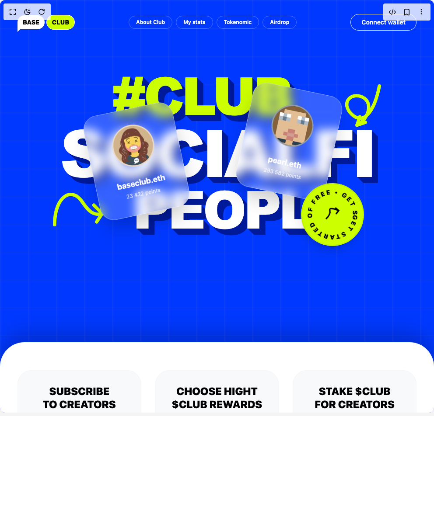

# Build Hero in BuilderStudio

> Build this component in our Agentic IDE: [BuilderStudio](https://builderstudio.dev).
>
> Join the BuilderStudio community on [Discord](https://discord.gg/QdWeSGCqfe) and [Reddit](https://reddit.com/r/builderstudio).



## Component

- Author group: `samurai-ai-api`
- Component: `hero`
- Variant: `default`
- Rendered HTML snapshot: [`rendered.html`](rendered.html)

## BuilderStudio prompt

You are implementing a React component based on a component reference.

## Component identity

- Author: Samurai-ai-api
- Component slug: hero
- Demo slug: default
- Title: hero
- Description: 

## Goal

Recreate this component in a React + TypeScript + Tailwind CSS project. Preserve the visual layout, spacing, colors, border radius, shadows, interaction behavior, animation behavior, responsive behavior, and dark mode behavior shown in the rendered demo.

## Implementation requirements

- Use React and TypeScript.
- Use Tailwind CSS classes whenever possible.
- Keep the component self-contained unless the source files require helper components.
- If the source uses CSS variables, custom CSS, animations, or keyframes, include them.
- If the source uses external packages, list and use the required packages.
- Preserve accessibility attributes, button semantics, links, keyboard behavior, and ARIA attributes when visible in the source.
- Do not replace the component with a simplified placeholder.
- Return complete production-ready code.

## Dependencies

No reference metadata available.

## Rendered DOM snapshot

This is the rendered demo HTML extracted from the live preview. Use it to verify structure, class names, visible content, and layout.

```html
<div id="root"><div class="w-screen min-h-screen flex justify-center items-center"><div class="w-screen min-h-screen flex justify-center items-center"><div class="w-full h-full min-h-screen"><div class="min-h-screen bg-[#0038FF] flex flex-col font-sans selection:bg-[#CCFF00] selection:text-black relative overflow-hidden w-full"><div class="absolute inset-0 bg-[linear-gradient(to_right,#ffffff15_1px,transparent_1px),linear-gradient(to_bottom,#ffffff15_1px,transparent_1px)] bg-[size:4rem_4rem] pointer-events-none z-0"></div><nav class="relative z-20 flex items-center justify-between px-6 py-6 md:px-10 md:py-8 max-w-[1440px] mx-auto w-full"><div class="flex items-center gap-1"><div class="bg-white text-black font-black tracking-tight text-xs md:text-sm px-3 py-1.5 rounded-2xl rounded-bl-sm relative shadow-sm">BASE<div class="absolute -bottom-1.5 left-0 w-3 h-3 bg-white" style="clip-path: polygon(0px 0px, 100% 0px, 0px 100%);"></div></div><div class="bg-[#CCFF00] text-black font-black text-xs md:text-sm px-3 py-1.5 rounded-full border-[1.5px] border-white shadow-sm">CLUB</div></div><div class="hidden md:flex items-center space-x-2"><a href="#" class="px-4 py-1.5 rounded-full border border-white/30 text-white text-xs font-semibold hover:bg-white/10 transition-colors">About Club</a><a href="#" class="px-4 py-1.5 rounded-full border border-white/30 text-white text-xs font-semibold hover:bg-white/10 transition-colors">My stats</a><a href="#" class="px-4 py-1.5 rounded-full border border-white/30 text-white text-xs font-semibold hover:bg-white/10 transition-colors">Tokenomic</a><a href="#" class="px-4 py-1.5 rounded-full border border-white/30 text-white text-xs font-semibold hover:bg-white/10 transition-colors">Airdrop</a></div><button class="px-6 py-2 rounded-full border border-white text-white text-xs md:text-sm font-semibold hover:bg-white hover:text-[#0038FF] transition-colors">Connect wallet</button></nav><main class="flex-1 relative z-10 pt-8 pb-32 md:pt-12 md:pb-48 px-4 flex flex-col items-center justify-center w-full max-w-[1440px] mx-auto"><div class="relative w-full max-w-5xl mx-auto flex flex-col items-center justify-center text-center z-10 mt-4 mb-16"><div class="w-full flex flex-col items-center relative z-10 space-y-2 md:space-y-4"><div class="w-full flex justify-start pl-[10%] md:pl-[25%] relative z-30"><h1 class="text-[clamp(4.5rem,12vw,160px)] font-black leading-[0.85] tracking-tighter text-[#CCFF00] m-0 p-0 uppercase" style="font-family: &quot;Arial Black&quot;, Impact, sans-serif; text-shadow: rgb(0, 26, 153) 1px 1px 0px, rgb(0, 26, 153) 2px 2px 0px, rgb(0, 26, 153) 3px 3px 0px, rgb(0, 26, 153) 4px 4px 0px, rgb(0, 26, 153) 5px 5px 0px, rgb(0, 26, 153) 6px 6px 0px, rgb(0, 26, 153) 7px 7px 0px, rgb(0, 26, 153) 8px 8px 0px, rgb(0, 26, 153) 9px 9px 0px, rgb(0, 26, 153) 10px 10px 0px, rgb(0, 26, 153) 11px 11px 0px, rgb(0, 26, 153) 12px 12px 0px, rgb(0, 26, 153) 13px 13px 0px, rgb(0, 26, 153) 14px 14px 0px;">#CLUB</h1></div><div class="w-full flex justify-center relative z-20"><h1 class="text-[clamp(5rem,15vw,220px)] font-black leading-[0.85] tracking-tighter text-white m-0 p-0 uppercase" style="font-family: &quot;Arial Black&quot;, Impact, sans-serif; text-shadow: rgb(0, 26, 153) 1px 1px 0px, rgb(0, 26, 153) 2px 2px 0px, rgb(0, 26, 153) 3px 3px 0px, rgb(0, 26, 153) 4px 4px 0px, rgb(0, 26, 153) 5px 5px 0px, rgb(0, 26, 153) 6px 6px 0px, rgb(0, 26, 153) 7px 7px 0px, rgb(0, 26, 153) 8px 8px 0px, rgb(0, 26, 153) 9px 9px 0px, rgb(0, 26, 153) 10px 10px 0px, rgb(0, 26, 153) 11px 11px 0px, rgb(0, 26, 153) 12px 12px 0px, rgb(0, 26, 153) 13px 13px 0px, rgb(0, 26, 153) 14px 14px 0px;">SOCIALFI</h1></div><div class="w-full flex justify-start pl-[15%] md:pl-[30%] relative z-10"><h1 class="text-[clamp(4.5rem,12vw,160px)] font-black leading-[0.85] tracking-tighter text-white m-0 p-0 uppercase" style="font-family: &quot;Arial Black&quot;, Impact, sans-serif; text-shadow: rgb(0, 26, 153) 1px 1px 0px, rgb(0, 26, 153) 2px 2px 0px, rgb(0, 26, 153) 3px 3px 0px, rgb(0, 26, 153) 4px 4px 0px, rgb(0, 26, 153) 5px 5px 0px, rgb(0, 26, 153) 6px 6px 0px, rgb(0, 26, 153) 7px 7px 0px, rgb(0, 26, 153) 8px 8px 0px, rgb(0, 26, 153) 9px 9px 0px, rgb(0, 26, 153) 10px 10px 0px, rgb(0, 26, 153) 11px 11px 0px, rgb(0, 26, 153) 12px 12px 0px, rgb(0, 26, 153) 13px 13px 0px, rgb(0, 26, 153) 14px 14px 0px;">PEOPLE</h1></div></div><div class="absolute inset-0 w-full h-full pointer-events-none"><div class="absolute bottom-[10%] left-[5%] md:left-[20%] z-30 pointer-events-auto" style="transform: translateY(-0.756712px);"><div class="w-40 md:w-52 aspect-[3/3.5] bg-white/20 backdrop-blur-md border border-white/40 rounded-[2rem] p-5 flex flex-col items-center justify-center rotate-[-12deg] shadow-2xl hover:rotate-0 transition-transform duration-500"><div class="w-16 h-16 md:w-24 md:h-24 bg-[#D2B48C] rounded-full flex items-center justify-center mb-4 shadow-inner border-[3px] border-white/50 overflow-hidden"></div><div class="text-center mt-2"><p class="font-bold text-sm md:text-lg text-white">baseclub.eth</p><p class="text-[10px] md:text-xs text-white/80 mt-1">23 422 points</p></div></div></div><div class="absolute top-[15%] right-[5%] md:right-[22%] z-30 pointer-events-auto" style="transform: translateY(-18.342px);"><div class="w-40 md:w-52 aspect-[3/3.5] bg-white/20 backdrop-blur-md border border-white/40 rounded-[2rem] p-5 flex flex-col items-center justify-center rotate-[12deg] shadow-2xl hover:rotate-0 transition-transform duration-500"><div class="w-16 h-16 md:w-24 md:h-24 bg-[#2C3E50] rounded-full flex items-center justify-center mb-4 shadow-inner border-[3px] border-white/50 overflow-hidden"></div><div class="text-center mt-2"><p class="font-bold text-sm md:text-lg text-white">pearl.eth</p><p class="text-[10px] md:text-xs text-white/80 mt-1">293 582 points</p></div></div></div><div class="absolute bottom-[0%] left-[0%] md:left-[10%] w-24 h-24 md:w-32 md:h-32 z-20"><svg viewBox="0 0 100 100" class="w-full h-full text-[#CCFF00] stroke-current overflow-visible" fill="none" stroke-width="6" stroke-linecap="round" stroke-linejoin="round"><path d="M10,90 C 10,40 40,20 60,50 C 70,65 80,75 95,70"></path><path d="M80,55 L95,70 L85,85"></path></svg></div><div class="absolute top-[5%] right-[0%] md:right-[10%] w-24 h-24 md:w-32 md:h-32 z-20"><svg viewBox="0 0 100 100" class="w-full h-full text-[#CCFF00] stroke-current overflow-visible" fill="none" stroke-width="6" stroke-linecap="round" stroke-linejoin="round"><path d="M90,10 C 80,60 60,80 40,60 C 20,40 40,20 60,30 C 80,40 70,70 50,80"></path><path d="M65,75 L50,80 L55,65"></path></svg></div><div class="absolute bottom-[-10%] right-[0%] md:right-[15%] z-40 pointer-events-auto"><div class="relative w-28 h-28 md:w-36 md:h-36 bg-[#CCFF00] rounded-full flex items-center justify-center shadow-xl rotate-12 hover:scale-105 transition-transform cursor-pointer border-[3px] border-black/5"><div class="absolute inset-1 animate-[spin_10s_linear_infinite]"><svg viewBox="0 0 100 100" class="w-full h-full"><path id="circlePath" d="M 50, 50 m -36, 0 a 36,36 0 1,1 72,0 a 36,36 0 1,1 -72,0" fill="none"></path><text class="text-[11px] font-black tracking-[0.18em] uppercase" fill="black"><textPath href="#circlePath" startOffset="0%">GET STARTED OF FREE • GET STARTED OF FREE •</textPath></text></svg></div><div class="absolute inset-0 flex items-center justify-center"><svg viewBox="0 0 100 100" class="w-10 h-10 text-black stroke-current overflow-visible" fill="none" stroke-width="8" stroke-linecap="round" stroke-linejoin="round"><path d="M20,80 Q 40,50 30,30 T 80,20"></path><path d="M60,10 L80,20 L70,40"></path></svg></div></div></div></div></div></main><section class="bg-white text-black rounded-t-[2.5rem] md:rounded-t-[3.5rem] px-6 py-12 md:px-10 md:py-16 relative z-20 shadow-[0_-20px_50px_rgba(0,0,0,0.2)] mt-auto w-full"><div class="max-w-6xl mx-auto grid grid-cols-1 md:grid-cols-3 gap-6 md:gap-8"><div class="bg-[#F8F9FA] rounded-[2rem] p-8 flex flex-col items-center text-center relative h-64 border border-gray-100"><h3 class="text-xl md:text-2xl uppercase leading-tight mb-2 font-black">SUBSCRIBE<br>TO CREATORS</h3><p class="text-[10px] md:text-xs text-black/60 font-bold mb-auto">you will receive $CLUB every second</p><div class="relative w-full flex justify-center mt-6"><div class="flex items-center bg-[#0038FF] rounded-2xl p-2 pr-16 text-white shadow-lg relative z-10"><div class="w-8 h-8 bg-[#D2B48C] rounded-full mr-3 border border-white/30 overflow-hidden flex-shrink-0"></div><div class="text-left"><p class="text-[10px] font-bold leading-none">baseclub.eth</p><p class="text-[8px] text-white/70 leading-none mt-1">23 422 points</p></div></div><div class="absolute right-2 top-1/2 transform -translate-y-1/2 bg-[#CCFF00] text-black font-black text-[10px] px-3 py-2 rounded-xl z-20 shadow-md">20.24 $CLUB</div></div><div class="hidden md:block absolute -right-12 bottom-8 w-16 h-16 z-30"><svg viewBox="0 0 100 100" class="w-full h-full text-black stroke-current overflow-visible" fill="none" stroke-width="5" stroke-linecap="round" stroke-linejoin="round"><path d="M20,80 Q 40,20 80,40"></path><path d="M60,20 L80,40 L50,60"></path></svg></div></div><div class="bg-[#F8F9FA] rounded-[2rem] p-8 flex flex-col items-center text-center relative h-64 border border-gray-100"><h3 class="text-xl md:text-2xl uppercase leading-tight mb-2 font-black">CHOOSE HIGHT<br>$CLUB REWARDS</h3><p class="text-[10px] md:text-xs text-black/60 font-bold mb-auto">each account has a different of $CLUB</p><div class="relative w-full flex justify-center mt-6"><div class="flex items-center bg-[#0038FF] rounded-full p-1.5 text-white shadow-lg"><div class="bg-white/20 text-white font-bold text-sm px-4 py-2 rounded-full mr-2">20.4220</div><div class="font-bold text-xs px-4">$CLUB</div></div><div class="absolute -bottom-6 right-1/3 bg-[#CCFF00] rounded-full p-2.5 shadow-lg transform rotate-12 z-20"><svg viewBox="0 0 24 24" class="w-4 h-4 text-black stroke-current" fill="none" stroke-width="3" stroke-linecap="round" stroke-linejoin="round"><path d="M7 17L17 7M17 7H7M17 7V17"></path></svg></div></div><div class="hidden md:block absolute -right-12 bottom-8 w-16 h-16 z-30"><svg viewBox="0 0 100 100" class="w-full h-full text-black stroke-current overflow-visible" fill="none" stroke-width="5" stroke-linecap="round" stroke-linejoin="round"><path d="M20,80 Q 40,20 80,40"></path><path d="M60,20 L80,40 L50,60"></path></svg></div></div><div class="bg-[#F8F9FA] rounded-[2rem] p-8 flex flex-col items-center text-center relative h-64 border border-gray-100"><h3 class="text-xl md:text-2xl uppercase leading-tight mb-2 font-black">STAKE $CLUB<br>FOR CREATORS</h3><p class="text-[10px] md:text-xs text-black/60 font-bold mb-auto">you will receive $CLUB every month</p><div class="flex flex-col items-center bg-[#CCFF00] rounded-[2rem] px-6 py-4 text-black shadow-lg mt-6 relative w-full max-w-[200px]"><p class="text-[9px] font-bold uppercase tracking-wider mb-1">EST. Monthly $CLUB</p><p class="text-xl font-black">188.34257</p><div class="absolute -bottom-2 left-8 w-5 h-5 bg-[#CCFF00] transform rotate-45"></div></div></div></div></section></div></div></div></div></div>
```

## Reference source files

No reference source files were available.
