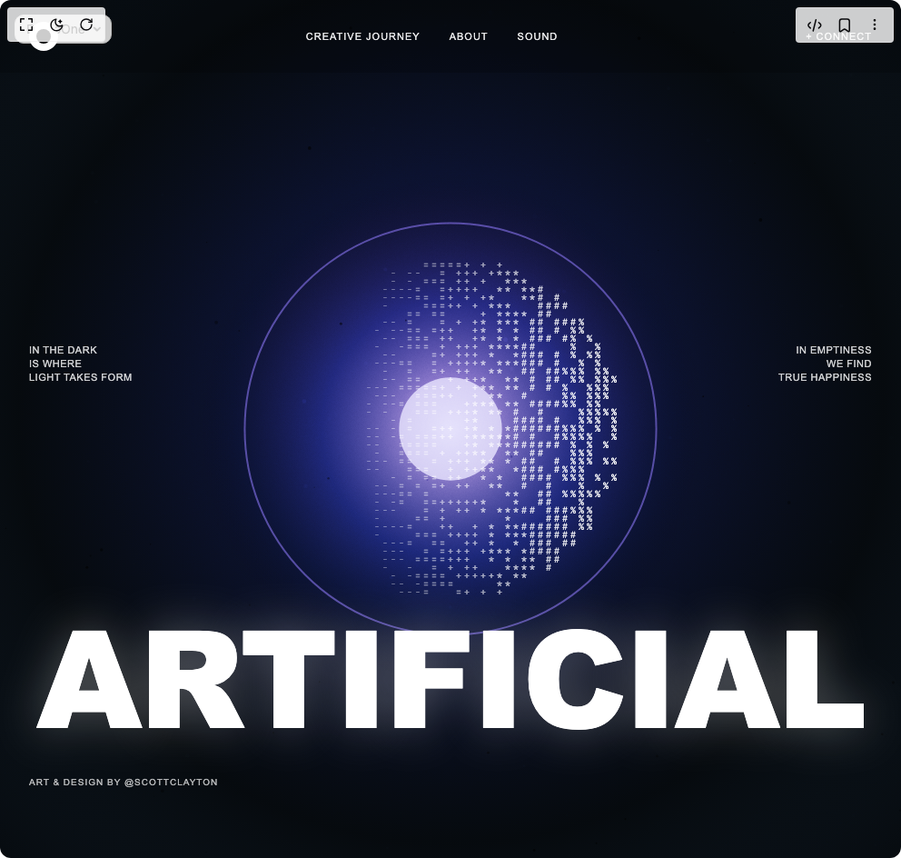

# Build Artificial Hero in BuilderStudio

> Build this component in our Agentic IDE: [BuilderStudio](https://builderstudio.dev).
>
> Join the BuilderStudio community on [Discord](https://discord.gg/QdWeSGCqfe) and [Reddit](https://reddit.com/r/builderstudio).



## Component

- Author group: `scottclayton3d`
- Component: `artificial-hero`
- Variant: `default`
- Rendered HTML snapshot: [`rendered.html`](rendered.html)

## BuilderStudio prompt

You are implementing a React component based on a component reference.

## Component identity

- Author: Scottclayton3d
- Component slug: artificial-hero
- Demo slug: default
- Title: artificial-hero
- Description: 

## Goal

Recreate this component in a React + TypeScript + Tailwind CSS project. Preserve the visual layout, spacing, colors, border radius, shadows, interaction behavior, animation behavior, responsive behavior, and dark mode behavior shown in the rendered demo.

## Implementation requirements

- Use React and TypeScript.
- Use Tailwind CSS classes whenever possible.
- Keep the component self-contained unless the source files require helper components.
- If the source uses CSS variables, custom CSS, animations, or keyframes, include them.
- If the source uses external packages, list and use the required packages.
- Preserve accessibility attributes, button semantics, links, keyboard behavior, and ARIA attributes when visible in the source.
- Do not replace the component with a simplified placeholder.
- Return complete production-ready code.

## Dependencies

No reference metadata available.

## Rendered DOM snapshot

This is the rendered demo HTML extracted from the live preview. Use it to verify structure, class names, visible content, and layout.

```html
<div id="root"><div class="fixed top-4 left-4 z-10"><select class="appearance-none h-8 max-w-[200px] text-sm leading-tight rounded-lg pl-3 pr-7 py-0 border bg-background focus:outline-none focus:ring-0"><option value="named_DemoOne_DemoOne">DemoOne</option></select><div class="absolute top-1/2 transform -translate-y-1/2 right-2 pointer-events-none"><svg class="w-4 h-4 fill-current" viewBox="0 0 20 20"><path d="M5.516 7.548c.436-.446 1.043-.48 1.576 0L10 10.405l2.908-2.857c.533-.48 1.14-.446 1.576 0 .436.445.408 1.197 0 1.615l-3.734 3.705c-.533.534-1.39.534-1.923 0l-3.734-3.705c-.408-.418-.436-1.17 0-1.615z"></path></svg></div></div><div class="w-screen min-h-screen flex justify-center items-center"><div style="width: 100%; height: 100%; background: rgb(0, 0, 0);"><nav style="position: fixed; top: 0px; left: 0px; right: 0px; z-index: 100; padding: 1.5rem 2rem; display: flex; justify-content: space-between; align-items: center; background: rgba(0, 0, 0, 0.2);"><div style="width: 32px; height: 32px; border-radius: 50%; background: white; display: flex; align-items: center; justify-content: center;"><div style="width: 16px; height: 16px; border-radius: 50%; background: rgb(0, 0, 0);"></div></div><div style="display: flex; gap: 2rem; font-family: Arial, sans-serif; font-size: 11px; font-weight: 500; letter-spacing: 1px; text-transform: uppercase;"><a href="#" style="color: white; text-decoration: none; opacity: 0.9;">Creative Journey</a><a href="#" style="color: white; text-decoration: none; opacity: 0.9;">About</a><a href="#" style="color: white; text-decoration: none; opacity: 0.9;">Sound</a></div><div style="font-family: Arial, sans-serif; font-size: 11px; font-weight: 500; color: white; opacity: 0.9; letter-spacing: 1px; text-transform: uppercase;">+ Connect</div></nav><div style="position: fixed; bottom: 15%; left: 0px; right: 0px; z-index: 50; transform: translateY(0px); opacity: 1; transition: transform 0.1s ease-out; pointer-events: none;"><div style="font-family: &quot;Arial Black&quot;, Arial, sans-serif; font-size: clamp(4rem, 15vw, 12rem); font-weight: 900; color: white; text-align: center; line-height: 0.8; letter-spacing: -0.02em; text-shadow: rgba(255, 255, 255, 0.3) 0px 0px 50px; filter: contrast(1.2);">ARTIFICIAL</div></div><div style="position: fixed; left: 2rem; top: 40%; z-index: 50; transform: translateX(0px); opacity: 1; transition: transform 0.1s ease-out;"><div style="font-family: Arial, sans-serif; font-size: 11px; color: white; line-height: 1.4; letter-spacing: 0.5px; text-transform: uppercase; opacity: 0.8; max-width: 150px;">In the dark<br>is where<br>light takes form<br><br></div></div><div style="position: fixed; right: 2rem; top: 40%; z-index: 50; transform: translateX(0px); opacity: 1; transition: transform 0.1s ease-out;"><div style="font-family: Arial, sans-serif; font-size: 11px; color: white; line-height: 1.4; letter-spacing: 0.5px; text-transform: uppercase; opacity: 0.8; max-width: 150px; text-align: right;">In emptiness<br>we find<br>true happiness</div></div><div style="position: fixed; bottom: 8%; left: 2rem; z-index: 50; transform: translateY(0px); opacity: 1; transition: transform 0.1s ease-out;"><div style="font-family: Arial, sans-serif; font-size: 10px; color: white; letter-spacing: 1px; text-transform: uppercase; opacity: 0.7;">Art &amp; Design by @scottclayton</div></div><div style="position: sticky; top: 0px; width: 100%; height: 100vh;"><canvas width="992" height="944" style="position: absolute; top: 0px; left: 0px; width: 100%; height: 100%; background: rgb(0, 0, 0);"></canvas><canvas width="992" height="944" style="position: absolute; top: 0px; left: 0px; width: 100%; height: 100%; pointer-events: none; mix-blend-mode: overlay; opacity: 0.6;"></canvas></div><style>
        @import url('https://fonts.googleapis.com/css2?family=JetBrains+Mono:wght@300;400;500&display=swap');
        
        @keyframes grainMove {
          0% { 
            background-position: 0px 0px, 0px 0px, 0px 0px;
          }
          10% { 
            background-position: -5px -10px, 10px -15px, -10px 5px;
          }
          20% { 
            background-position: -10px 5px, -5px 10px, 15px -10px;
          }
          30% { 
            background-position: 15px -5px, -10px 5px, -5px 15px;
          }
          40% { 
            background-position: 5px 10px, 15px -10px, 10px -5px;
          }
          50% { 
            background-position: -15px 10px, 5px 15px, -10px -15px;
          }
          60% { 
            background-position: 10px -15px, -15px -5px, 15px 10px;
          }
          70% { 
            background-position: -5px 15px, 10px -10px, -15px 5px;
          }
          80% { 
            background-position: 15px 5px, -5px -15px, 5px -10px;
          }
          90% { 
            background-position: -10px -5px, 15px 10px, 10px 15px;
          }
          100% { 
            background-position: 0px 0px, 0px 0px, 0px 0px;
          }
        }
        
        a:hover {
          opacity: 1 !important;
          transition: opacity 0.2s ease;
        }
        
        * {
          box-sizing: border-box;
        }
      </style></div></div></div>
```

## Reference source files

No reference source files were available.
