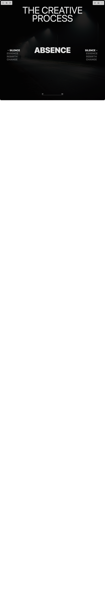

# Build Full Screen Scroll Fx in BuilderStudio

> Build this component in our Agentic IDE: [BuilderStudio](https://builderstudio.dev).
>
> Join the BuilderStudio community on [Discord](https://discord.gg/QdWeSGCqfe) and [Reddit](https://reddit.com/r/builderstudio).



## Component

- Author group: `scottclayton3d`
- Component: `full-screen-scroll-fx`
- Variant: `default`
- Rendered HTML snapshot: [`rendered.html`](rendered.html)

## BuilderStudio prompt

You are implementing a React component based on a component reference.

## Component identity

- Author: Scottclayton3d
- Component slug: full-screen-scroll-fx
- Demo slug: default
- Title: full-screen-scroll-fx
- Description: 

## Goal

Recreate this component in a React + TypeScript + Tailwind CSS project. Preserve the visual layout, spacing, colors, border radius, shadows, interaction behavior, animation behavior, responsive behavior, and dark mode behavior shown in the rendered demo.

## Implementation requirements

- Use React and TypeScript.
- Use Tailwind CSS classes whenever possible.
- Keep the component self-contained unless the source files require helper components.
- If the source uses CSS variables, custom CSS, animations, or keyframes, include them.
- If the source uses external packages, list and use the required packages.
- Preserve accessibility attributes, button semantics, links, keyboard behavior, and ARIA attributes when visible in the source.
- Do not replace the component with a simplified placeholder.
- Return complete production-ready code.

## Dependencies

No reference metadata available.

## Rendered DOM snapshot

This is the rendered demo HTML extracted from the live preview. Use it to verify structure, class names, visible content, and layout.

```html
<div id="root"><div class="w-screen min-h-screen flex justify-center items-center"><div class="w-screen min-h-screen flex justify-center items-center"><div class="fx" aria-label="Full screen scroll slideshow" style="--fx-font: &quot;Rubik Wide&quot;, system-ui, -apple-system, &quot;Segoe UI&quot;, Roboto, Arial, sans-serif; --fx-text: rgba(245,245,245,0.92); --fx-overlay: rgba(0,0,0,0.35); --fx-page-bg: #ffffff; --fx-stage-bg: #000000; --fx-gap: 1rem; --fx-grid-px: 2rem; --fx-row-gap: 10px;"><div class="fx-scroll"><div class="fx-fixed-section"><div class="pin-spacer" style="order: 0; place-self: auto; grid-area: auto; z-index: auto; float: none; flex-shrink: 1; display: block; margin: 0px; inset: 0px auto auto; position: relative; flex-basis: auto; overflow: visible; box-sizing: border-box; width: 992px; height: 4720px; padding: 0px 0px 3776px;"><div class="fx-fixed" style="translate: none; rotate: none; scale: none; left: 0px; top: 0.001px; margin: 0px; max-width: 992px; width: 992px; max-height: 944px; height: 944px; padding: 0px; box-sizing: border-box; position: fixed; transform: translate(0px, 0px);"><div class="fx-bgs" aria-hidden="true"><div class="fx-bg"><div class="fx-bg-overlay"></div></div><div class="fx-bg"><div class="fx-bg-overlay"></div></div><div class="fx-bg"><div class="fx-bg-overlay"></div></div><div class="fx-bg"><div class="fx-bg-overlay"></div></div></div><div class="fx-grid"><div class="fx-header"><div>The Creative</div><div>Process</div></div><div class="fx-content"><div class="fx-left" role="list"><div class="fx-track" style="translate: none; rotate: none; scale: none; transform: translate(0px, 45.6034px);"><div class="fx-item fx-left-item active" role="button" tabindex="0" aria-pressed="true" style="translate: none; rotate: none; scale: none; transform: translate(10px, 0px); opacity: 1;">Silence</div><div class="fx-item fx-left-item " role="button" tabindex="0" aria-pressed="false" style="translate: none; rotate: none; scale: none; transform: translate(0px, 0px); opacity: 0.35;">Essence</div><div class="fx-item fx-left-item " role="button" tabindex="0" aria-pressed="false" style="translate: none; rotate: none; scale: none; transform: translate(0px, 0px); opacity: 0.35;">Rebirth</div><div class="fx-item fx-left-item " role="button" tabindex="0" aria-pressed="false" style="translate: none; rotate: none; scale: none; transform: translate(0px, 0px); opacity: 0.35;">Change</div></div></div><div class="fx-center"><div class="fx-featured active"><h3 class="fx-featured-title">Absence</h3></div><div class="fx-featured "><h3 class="fx-featured-title">Stillness</h3></div><div class="fx-featured "><h3 class="fx-featured-title">Growth</h3></div><div class="fx-featured "><h3 class="fx-featured-title">Opportunity</h3></div></div><div class="fx-right" role="list"><div class="fx-track" style="translate: none; rotate: none; scale: none; transform: translate(0px, 45.7188px);"><div class="fx-item fx-right-item active" role="button" tabindex="0" aria-pressed="true" style="translate: none; rotate: none; scale: none; transform: translate(-10px, 0px); opacity: 1;">Silence</div><div class="fx-item fx-right-item " role="button" tabindex="0" aria-pressed="false" style="translate: none; rotate: none; scale: none; transform: translate(0px, 0px); opacity: 0.35;">Essence</div><div class="fx-item fx-right-item " role="button" tabindex="0" aria-pressed="false" style="translate: none; rotate: none; scale: none; transform: translate(0px, 0px); opacity: 0.35;">Rebirth</div><div class="fx-item fx-right-item " role="button" tabindex="0" aria-pressed="false" style="translate: none; rotate: none; scale: none; transform: translate(0px, 0px); opacity: 0.35;">Change</div></div></div></div><div class="fx-footer"><div class="fx-footer-title"><div></div></div><div class="fx-progress"><div class="fx-progress-numbers"><span>01</span><span>04</span></div><div class="fx-progress-bar"><div class="fx-progress-fill" style="width: 0%;"></div></div></div></div></div></div></div></div><div class="fx-end"><p class="fx-fin">fin</p></div></div><style>
          .fx {
            width: 100%;
            overflow: hidden;
            background: var(--fx-page-bg);
            color: #000;
            font-family: var(--fx-font);
            text-transform: uppercase;
            letter-spacing: -0.02em;
          }

          .fx-debug {
            position: fixed; bottom: 10px; right: 10px; z-index: 9999;
            background: rgba(255,255,255,0.8); color: #000; padding: 6px 8px; font: 12px/1 monospace; border-radius: 4px;
          }

          .fx-fixed-section { height: 500vh; position: relative; }
          .fx-fixed { position: sticky; top: 0; height: 100vh; width: 100%; overflow: hidden; background: var(--fx-page-bg); }

          .fx-grid {
            display: grid;
            grid-template-columns: repeat(12, 1fr);
            gap: var(--fx-gap);
            padding: 0 var(--fx-grid-px);
            position: relative;
            height: 100%;
            z-index: 2;
          }

          .fx-bgs { position: absolute; inset: 0; background: var(--fx-stage-bg); z-index: 1; }
          .fx-bg { position: absolute; inset: 0; }
          .fx-bg-img {
            position: absolute; inset: -10% 0 -10% 0;
            width: 100%; height: 120%; object-fit: cover;
            filter: brightness(0.8);
            opacity: 0;
            will-change: transform, opacity;
          }
          .fx-bg-overlay { position: absolute; inset: 0; background: var(--fx-overlay); }

          .fx-header {
            grid-column: 1 / 13; align-self: start; padding-top: 6vh;
            font-size: clamp(2rem, 9vw, 9rem); line-height: 0.86; text-align: center; color: var(--fx-text);
          }
          .fx-header > * { display: block; }

          .fx-content {
            grid-column: 1 / 13;
            position: absolute; inset: 0;
            display: grid; grid-template-columns: 1fr 1.3fr 1fr; /* L 30% / C 40% / R 30% vibe */
            align-items: center;
            height: 100%;
            padding: 0 var(--fx-grid-px);
          }

          .fx-left, .fx-right {
            height: 60vh; /* gives us room to center the active row */
            overflow: hidden;
            display: grid; align-content: center;
          }
          .fx-left { justify-items: start; }
          .fx-right { justify-items: end; }
          .fx-track { will-change: transform; }

          .fx-item {
            color: var(--fx-text);
            font-weight: 800;
            letter-spacing: 0em;
            line-height: 1;
            margin: calc(var(--fx-row-gap) / 2) 0;
            opacity: 0.35;
            transition: opacity 0.3s ease, transform 0.3s ease;
            position: relative;
            font-size: clamp(1rem, 2.4vw, 1.8rem);
            user-select: none;
            cursor: pointer;
          }
          .fx-left-item.active, .fx-right-item.active { opacity: 1; }
          .fx-left-item.active { transform: translateX(10px); padding-left: 16px; }
          .fx-right-item.active { transform: translateX(-10px); padding-right: 16px; }

          .fx-left-item.active::before,
          .fx-right-item.active::after {
            content: "";
            position: absolute; top: 50%; transform: translateY(-50%);
            width: 6px; height: 6px; background: var(--fx-text); border-radius: 50%;
          }
          .fx-left-item.active::before { left: 0; }
          .fx-right-item.active::after { right: 0; }

          .fx-center {
            display: grid; place-items: center; text-align: center; height: 60vh; overflow: hidden;
          }
          .fx-featured { position: absolute; opacity: 0; visibility: hidden; }
          .fx-featured.active { opacity: 1; visibility: visible; }
          .fx-featured-title {
            margin: 0; color: var(--fx-text);
            font-weight: 900; letter-spacing: -0.01em;
            font-size: clamp(2rem, 7.5vw, 6rem);
          }
          .fx-word-mask { display: inline-block; overflow: hidden; vertical-align: middle; }
          .fx-word { display: inline-block; vertical-align: middle; }

          .fx-footer {
            grid-column: 1 / 13; align-self: end; padding-bottom: 5vh; text-align: center;
          }
          .fx-footer-title { color: var(--fx-text); font-size: clamp(1.6rem, 7vw, 7rem); font-weight: 900; letter-spacing: -0.01em; line-height: 0.9; }
          .fx-progress { width: 200px; height: 2px; margin: 1rem auto 0; background: rgba(245,245,245,0.28); position: relative; }
          .fx-progress-fill { position: absolute; inset: 0 auto 0 0; width: 0%; background: var(--fx-text); height: 100%; transition: width 0.3s ease; }
          .fx-progress-numbers { position: absolute; inset: auto 0 100% 0; display: flex; justify-content: space-between; font-size: 0.8rem; color: var(--fx-text); }

          .fx-end { height: 100vh; display: grid; place-items: center; }
          .fx-fin { transform: rotate(90deg); color: #111; }

          @media (max-width: 900px) {
            .fx-content {
              grid-template-columns: 1fr; row-gap: 3vh;
              place-items: center;
            }
            .fx-left, .fx-right, .fx-center { height: auto; }
            .fx-left, .fx-right { justify-items: center; }
            .fx-track { transform: none !important; }
          }
        </style></div></div></div></div>
```

## Reference source files

No reference source files were available.
