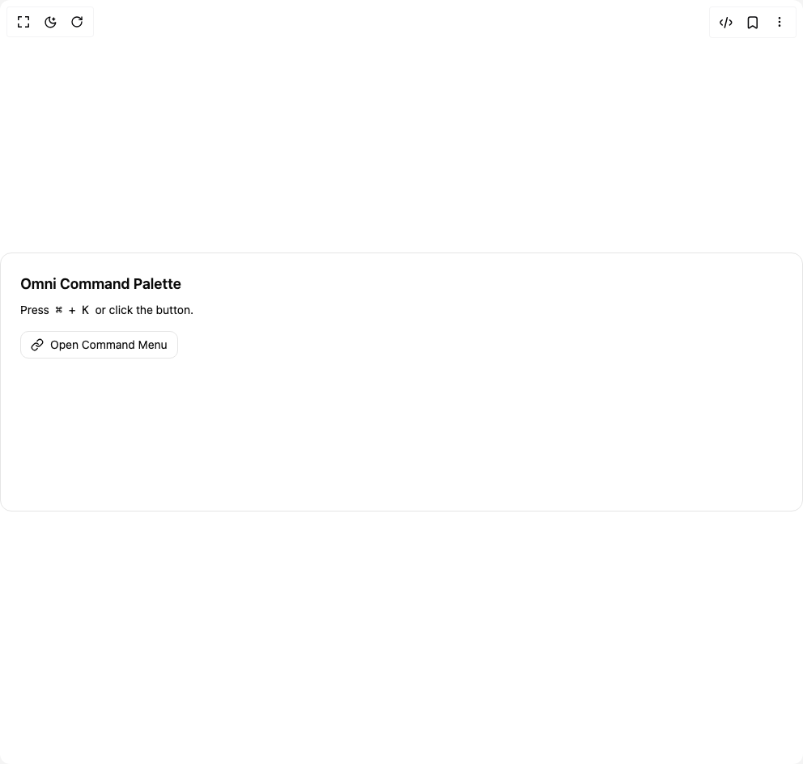

# Build Omni Command Palette in BuilderStudio

> Build this component in our Agentic IDE: [BuilderStudio](https://builderstudio.dev).
>
> Join the BuilderStudio community on [Discord](https://discord.gg/QdWeSGCqfe) and [Reddit](https://reddit.com/r/builderstudio).



## Component

- Author group: `scottclayton3d`
- Component: `omni-command-palette`
- Variant: `default`
- Rendered HTML snapshot: [`rendered.html`](rendered.html)

## BuilderStudio prompt

You are implementing a React component based on a component reference.

## Component identity

- Author: Scottclayton3d
- Component slug: omni-command-palette
- Demo slug: default
- Title: omni-command-palette
- Description: 

## Goal

Recreate this component in a React + TypeScript + Tailwind CSS project. Preserve the visual layout, spacing, colors, border radius, shadows, interaction behavior, animation behavior, responsive behavior, and dark mode behavior shown in the rendered demo.

## Implementation requirements

- Use React and TypeScript.
- Use Tailwind CSS classes whenever possible.
- Keep the component self-contained unless the source files require helper components.
- If the source uses CSS variables, custom CSS, animations, or keyframes, include them.
- If the source uses external packages, list and use the required packages.
- Preserve accessibility attributes, button semantics, links, keyboard behavior, and ARIA attributes when visible in the source.
- Do not replace the component with a simplified placeholder.
- Return complete production-ready code.

## Dependencies

No reference metadata available.

## Rendered DOM snapshot

This is the rendered demo HTML extracted from the live preview. Use it to verify structure, class names, visible content, and layout.

```html
<div id="root"><div class="w-screen min-h-screen flex justify-center items-center"><div class="w-screen min-h-screen flex justify-center items-center"><div class="relative min-h-[320px] w-full rounded-xl border bg-[hsl(var(--card))] p-6 text-[hsl(var(--foreground))]"><h2 class="mb-2 text-lg font-semibold">Omni Command Palette</h2><p class="mb-4 text-sm text-[hsl(var(--muted-foreground))]">Press <kbd class="rounded bg-[hsl(var(--muted))] px-1">⌘</kbd> + <kbd class="rounded bg-[hsl(var(--muted))] px-1">K</kbd> or click the button.</p><button class="inline-flex items-center gap-2 rounded-lg border bg-[hsl(var(--accent))]/20 px-3 py-1.5 text-sm hover:bg-[hsl(var(--accent))]/30"><svg xmlns="http://www.w3.org/2000/svg" width="24" height="24" viewBox="0 0 24 24" fill="none" stroke="currentColor" stroke-width="2" stroke-linecap="round" stroke-linejoin="round" class="lucide lucide-link size-4" aria-hidden="true"><path d="M10 13a5 5 0 0 0 7.54.54l3-3a5 5 0 0 0-7.07-7.07l-1.72 1.71"></path><path d="M14 11a5 5 0 0 0-7.54-.54l-3 3a5 5 0 0 0 7.07 7.07l1.71-1.71"></path></svg>Open Command Menu</button></div></div></div></div>
```

## Reference source files

No reference source files were available.
