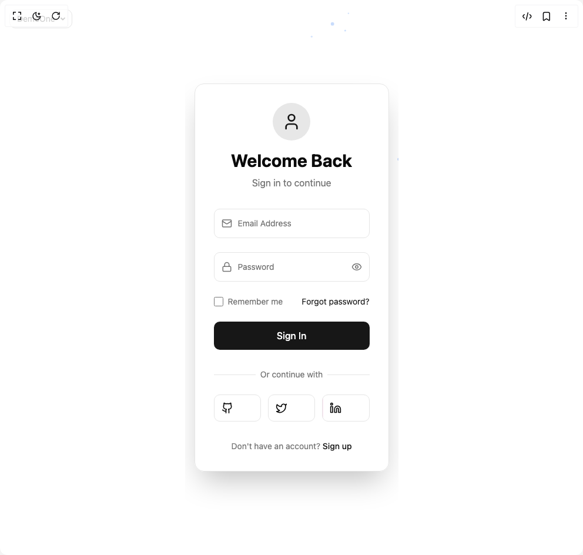

# Build Sign In Flo in BuilderStudio

> Build this component in our Agentic IDE: [BuilderStudio](https://builderstudio.dev).
>
> Join the BuilderStudio community on [Discord](https://discord.gg/QdWeSGCqfe) and [Reddit](https://reddit.com/r/builderstudio).



## Component

- Author group: `scottclayton3d`
- Component: `sign-in-flo`
- Variant: `default`
- Rendered HTML snapshot: [`rendered.html`](rendered.html)

## BuilderStudio prompt

You are implementing a React component based on a component reference.

## Component identity

- Author: Scottclayton3d
- Component slug: sign-in-flo
- Demo slug: default
- Title: sign-in-flo
- Description: 

## Goal

Recreate this component in a React + TypeScript + Tailwind CSS project. Preserve the visual layout, spacing, colors, border radius, shadows, interaction behavior, animation behavior, responsive behavior, and dark mode behavior shown in the rendered demo.

## Implementation requirements

- Use React and TypeScript.
- Use Tailwind CSS classes whenever possible.
- Keep the component self-contained unless the source files require helper components.
- If the source uses CSS variables, custom CSS, animations, or keyframes, include them.
- If the source uses external packages, list and use the required packages.
- Preserve accessibility attributes, button semantics, links, keyboard behavior, and ARIA attributes when visible in the source.
- Do not replace the component with a simplified placeholder.
- Return complete production-ready code.

## Dependencies

No reference metadata available.

## Rendered DOM snapshot

This is the rendered demo HTML extracted from the live preview. Use it to verify structure, class names, visible content, and layout.

```html
<div id="root"><div class="fixed top-4 left-4 z-10"><select class="appearance-none h-8 max-w-[200px] text-sm leading-tight rounded-lg pl-3 pr-7 py-0 border bg-background focus:outline-none focus:ring-0"><option value="named_DemoOne_DemoOne">DemoOne</option></select><div class="absolute top-1/2 transform -translate-y-1/2 right-2 pointer-events-none"><svg class="w-4 h-4 fill-current" viewBox="0 0 20 20"><path d="M5.516 7.548c.436-.446 1.043-.48 1.576 0L10 10.405l2.908-2.857c.533-.48 1.14-.446 1.576 0 .436.445.408 1.197 0 1.615l-3.734 3.705c-.533.534-1.39.534-1.923 0l-3.734-3.705c-.408-.418-.436-1.17 0-1.615z"></path></svg></div></div><div class="w-screen min-h-screen flex justify-center items-center"><div class="min-h-screen bg-background flex items-center justify-center p-4 relative overflow-hidden"><canvas class="absolute inset-0 pointer-events-none" width="992" height="944" style="z-index: 1;"></canvas><div class="relative z-10 w-full max-w-md"><div class="bg-card/80 backdrop-blur-xl border border-border rounded-2xl p-8 shadow-2xl"><div class="text-center mb-8"><div class="inline-flex items-center justify-center w-16 h-16 bg-primary/10 rounded-full mb-4"><svg xmlns="http://www.w3.org/2000/svg" width="24" height="24" viewBox="0 0 24 24" fill="none" stroke="currentColor" stroke-width="2" stroke-linecap="round" stroke-linejoin="round" class="lucide lucide-user w-8 h-8 text-primary" aria-hidden="true"><path d="M19 21v-2a4 4 0 0 0-4-4H9a4 4 0 0 0-4 4v2"></path><circle cx="12" cy="7" r="4"></circle></svg></div><h1 class="text-3xl font-bold text-foreground mb-2">Welcome Back</h1><p class="text-muted-foreground">Sign in to continue</p></div><form class="space-y-6"><div class="relative group"><div class="relative overflow-hidden rounded-lg border border-border bg-background transition-all duration-300 ease-in-out"><div class="absolute left-3 top-1/2 -translate-y-1/2 text-muted-foreground transition-colors duration-200 group-focus-within:text-primary"><svg xmlns="http://www.w3.org/2000/svg" width="18" height="18" viewBox="0 0 24 24" fill="none" stroke="currentColor" stroke-width="2" stroke-linecap="round" stroke-linejoin="round" class="lucide lucide-mail" aria-hidden="true"><rect width="20" height="16" x="2" y="4" rx="2"></rect><path d="m22 7-8.97 5.7a1.94 1.94 0 0 1-2.06 0L2 7"></path></svg></div><input class="w-full bg-transparent pl-10 pr-12 py-3 text-foreground placeholder:text-muted-foreground focus:outline-none" placeholder="" type="email" value=""><label class="absolute left-10 transition-all duration-200 ease-in-out pointer-events-none top-1/2 -translate-y-1/2 text-sm text-muted-foreground">Email Address</label></div></div><div class="relative group"><div class="relative overflow-hidden rounded-lg border border-border bg-background transition-all duration-300 ease-in-out"><div class="absolute left-3 top-1/2 -translate-y-1/2 text-muted-foreground transition-colors duration-200 group-focus-within:text-primary"><svg xmlns="http://www.w3.org/2000/svg" width="18" height="18" viewBox="0 0 24 24" fill="none" stroke="currentColor" stroke-width="2" stroke-linecap="round" stroke-linejoin="round" class="lucide lucide-lock" aria-hidden="true"><rect width="18" height="11" x="3" y="11" rx="2" ry="2"></rect><path d="M7 11V7a5 5 0 0 1 10 0v4"></path></svg></div><input class="w-full bg-transparent pl-10 pr-12 py-3 text-foreground placeholder:text-muted-foreground focus:outline-none" placeholder="" type="password" value=""><label class="absolute left-10 transition-all duration-200 ease-in-out pointer-events-none top-1/2 -translate-y-1/2 text-sm text-muted-foreground">Password</label><button type="button" class="absolute right-3 top-1/2 -translate-y-1/2 text-muted-foreground hover:text-foreground transition-colors"><svg xmlns="http://www.w3.org/2000/svg" width="18" height="18" viewBox="0 0 24 24" fill="none" stroke="currentColor" stroke-width="2" stroke-linecap="round" stroke-linejoin="round" class="lucide lucide-eye" aria-hidden="true"><path d="M2.062 12.348a1 1 0 0 1 0-.696 10.75 10.75 0 0 1 19.876 0 1 1 0 0 1 0 .696 10.75 10.75 0 0 1-19.876 0"></path><circle cx="12" cy="12" r="3"></circle></svg></button></div></div><div class="flex items-center justify-between"><label class="flex items-center space-x-2 cursor-pointer"><input class="w-4 h-4 text-primary bg-background border-border rounded focus:ring-primary focus:ring-2" type="checkbox"><span class="text-sm text-muted-foreground">Remember me</span></label><button type="button" class="text-sm text-primary hover:underline">Forgot password?</button></div><button type="submit" class="w-full relative group bg-primary text-primary-foreground py-3 px-4 rounded-lg font-medium transition-all duration-300 ease-in-out hover:bg-primary/90 focus:outline-none focus:ring-2 focus:ring-primary focus:ring-offset-2 disabled:opacity-50 disabled:cursor-not-allowed overflow-hidden"><span class="transition-opacity duration-200 opacity-100">Sign In</span><div class="absolute inset-0 bg-gradient-to-r from-transparent via-white/20 to-transparent -translate-x-full group-hover:translate-x-full transition-transform duration-1000 ease-in-out"></div></button></form><div class="mt-8"><div class="relative"><div class="absolute inset-0 flex items-center"><div class="w-full border-t border-border"></div></div><div class="relative flex justify-center text-sm"><span class="px-2 bg-card text-muted-foreground">Or continue with</span></div></div><div class="mt-6 grid grid-cols-3 gap-3"><button class="relative group p-3 rounded-lg border border-border bg-background hover:bg-accent transition-all duration-300 ease-in-out overflow-hidden"><div class="absolute inset-0 bg-gradient-to-r from-blue-500/20 via-purple-500/20 to-pink-500/20 transition-transform duration-500 -translate-x-full"></div><div class="relative text-foreground group-hover:text-primary transition-colors"><svg xmlns="http://www.w3.org/2000/svg" width="20" height="20" viewBox="0 0 24 24" fill="none" stroke="currentColor" stroke-width="2" stroke-linecap="round" stroke-linejoin="round" class="lucide lucide-github" aria-hidden="true"><path d="M15 22v-4a4.8 4.8 0 0 0-1-3.5c3 0 6-2 6-5.5.08-1.25-.27-2.48-1-3.5.28-1.15.28-2.35 0-3.5 0 0-1 0-3 1.5-2.64-.5-5.36-.5-8 0C6 2 5 2 5 2c-.3 1.15-.3 2.35 0 3.5A5.403 5.403 0 0 0 4 9c0 3.5 3 5.5 6 5.5-.39.49-.68 1.05-.85 1.65-.17.6-.22 1.23-.15 1.85v4"></path><path d="M9 18c-4.51 2-5-2-7-2"></path></svg></div></button><button class="relative group p-3 rounded-lg border border-border bg-background hover:bg-accent transition-all duration-300 ease-in-out overflow-hidden"><div class="absolute inset-0 bg-gradient-to-r from-blue-500/20 via-purple-500/20 to-pink-500/20 transition-transform duration-500 -translate-x-full"></div><div class="relative text-foreground group-hover:text-primary transition-colors"><svg xmlns="http://www.w3.org/2000/svg" width="20" height="20" viewBox="0 0 24 24" fill="none" stroke="currentColor" stroke-width="2" stroke-linecap="round" stroke-linejoin="round" class="lucide lucide-twitter" aria-hidden="true"><path d="M22 4s-.7 2.1-2 3.4c1.6 10-9.4 17.3-18 11.6 2.2.1 4.4-.6 6-2C3 15.5.5 9.6 3 5c2.2 2.6 5.6 4.1 9 4-.9-4.2 4-6.6 7-3.8 1.1 0 3-1.2 3-1.2z"></path></svg></div></button><button class="relative group p-3 rounded-lg border border-border bg-background hover:bg-accent transition-all duration-300 ease-in-out overflow-hidden"><div class="absolute inset-0 bg-gradient-to-r from-blue-500/20 via-purple-500/20 to-pink-500/20 transition-transform duration-500 -translate-x-full"></div><div class="relative text-foreground group-hover:text-primary transition-colors"><svg xmlns="http://www.w3.org/2000/svg" width="20" height="20" viewBox="0 0 24 24" fill="none" stroke="currentColor" stroke-width="2" stroke-linecap="round" stroke-linejoin="round" class="lucide lucide-linkedin" aria-hidden="true"><path d="M16 8a6 6 0 0 1 6 6v7h-4v-7a2 2 0 0 0-2-2 2 2 0 0 0-2 2v7h-4v-7a6 6 0 0 1 6-6z"></path><rect width="4" height="12" x="2" y="9"></rect><circle cx="4" cy="4" r="2"></circle></svg></div></button></div></div><div class="mt-8 text-center"><p class="text-sm text-muted-foreground">Don't have an account? <button type="button" class="text-primary hover:underline font-medium">Sign up</button></p></div></div></div></div></div></div>
```

## Reference source files

No reference source files were available.
