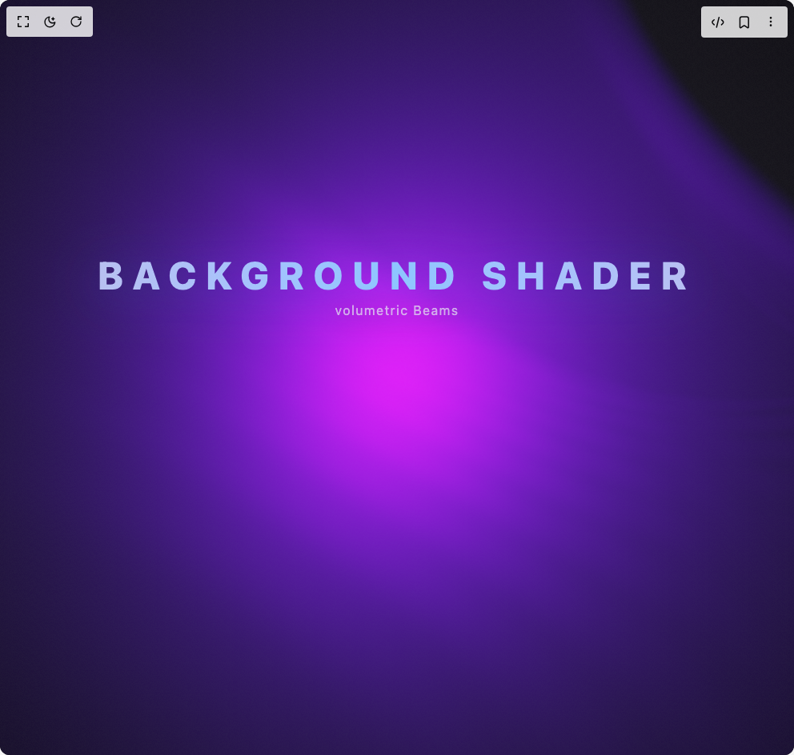

# Build Volumetric Beams in BuilderStudio

> Build this component in our Agentic IDE: [BuilderStudio](https://builderstudio.dev).
>
> Join the BuilderStudio community on [Discord](https://discord.gg/QdWeSGCqfe) and [Reddit](https://reddit.com/r/builderstudio).



## Component

- Author group: `scottclayton3d`
- Component: `volumetric-beams`
- Variant: `default`
- Rendered HTML snapshot: [`rendered.html`](rendered.html)

## BuilderStudio prompt

You are implementing a React component based on a component reference.

## Component identity

- Author: Scottclayton3d
- Component slug: volumetric-beams
- Demo slug: default
- Title: volumetric-beams
- Description: 

## Goal

Recreate this component in a React + TypeScript + Tailwind CSS project. Preserve the visual layout, spacing, colors, border radius, shadows, interaction behavior, animation behavior, responsive behavior, and dark mode behavior shown in the rendered demo.

## Implementation requirements

- Use React and TypeScript.
- Use Tailwind CSS classes whenever possible.
- Keep the component self-contained unless the source files require helper components.
- If the source uses CSS variables, custom CSS, animations, or keyframes, include them.
- If the source uses external packages, list and use the required packages.
- Preserve accessibility attributes, button semantics, links, keyboard behavior, and ARIA attributes when visible in the source.
- Do not replace the component with a simplified placeholder.
- Return complete production-ready code.

## Dependencies

No reference metadata available.

## Rendered DOM snapshot

This is the rendered demo HTML extracted from the live preview. Use it to verify structure, class names, visible content, and layout.

```html
<div id="root"><div class="w-screen min-h-screen flex justify-center items-center"><div class="w-screen min-h-screen flex justify-center items-center"><div class="fixed inset-0 bg-black"><div class="w-full h-full touch-none" style="position: relative; width: 100%; height: 100%; overflow: hidden; pointer-events: auto;"><div style="width: 100%; height: 100%;"><canvas data-engine="three.js r180" width="992" height="944" style="display: block; width: 992px; height: 944px;"></canvas></div></div><div class="pointer-events-none absolute inset-x-0 top-4 sm:top-6 md:top-80 z-10 flex justify-center"><div class="text-center"><h1 class="select-none font-extrabold uppercase tracking-[0.25em] text-2xl sm:text-3xl md:text-5xl bg-gradient-to-r from-indigo-200/90 via-blue-300 to-indigo-200/90 bg-clip-text text-transparent drop-shadow-[0_8px_32px_rgba(64,128,255,0.35)] ">Background Shader</h1><p class="mt-2 text-xs sm:text-sm md:text-base tracking-widest text-slate-200/70 drop-shadow-[0_4px_16px_rgba(0,0,0,0.45)] ">volumetric Beams</p></div></div></div></div></div></div>
```

## Reference source files

No reference source files were available.
