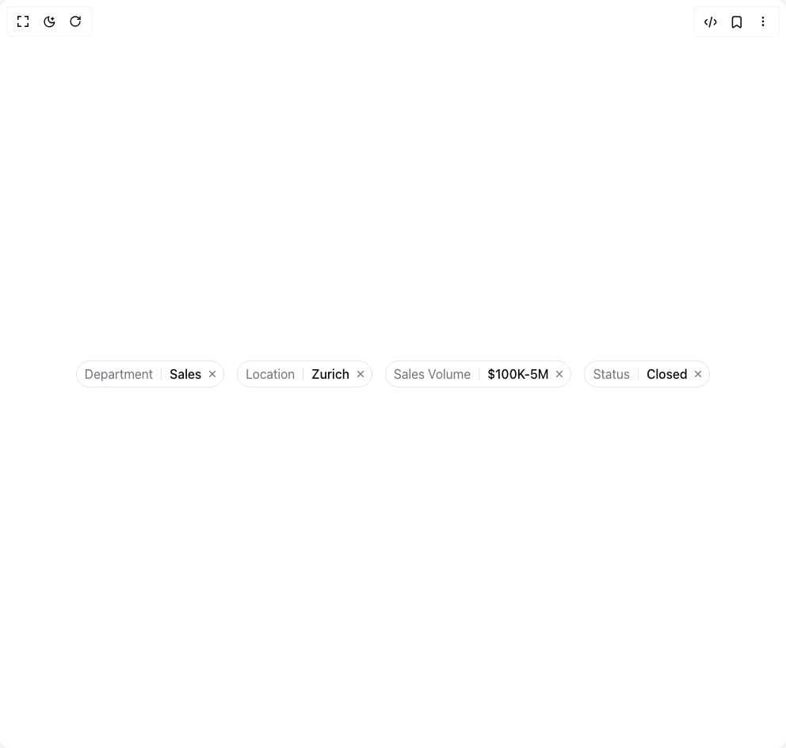

# Build Filter Badge in BuilderStudio

> Build this component in our Agentic IDE: [BuilderStudio](https://builderstudio.dev).
>
> Join the BuilderStudio community on [Discord](https://discord.gg/QdWeSGCqfe) and [Reddit](https://reddit.com/r/builderstudio).



## Component

- Author group: `serafim`
- Component: `filter-badge`
- Variant: `pill`
- Rendered HTML snapshot: [`rendered.html`](rendered.html)

## BuilderStudio prompt

You are implementing a React component based on a component reference.

## Component identity

- Author: serafim
- Component slug: filter-badge
- Demo slug: pill
- Title: filter-badge
- Description: 

## Goal

Recreate this component in a React + TypeScript + Tailwind CSS project. Preserve the visual layout, spacing, colors, border radius, shadows, interaction behavior, animation behavior, responsive behavior, and dark mode behavior shown in the rendered demo.

## Implementation requirements

- Use React and TypeScript.
- Use Tailwind CSS classes whenever possible.
- Keep the component self-contained unless the source files require helper components.
- If the source uses CSS variables, custom CSS, animations, or keyframes, include them.
- If the source uses external packages, list and use the required packages.
- Preserve accessibility attributes, button semantics, links, keyboard behavior, and ARIA attributes when visible in the source.
- Do not replace the component with a simplified placeholder.
- Return complete production-ready code.

## Dependencies

No reference metadata available.

## Rendered DOM snapshot

This is the rendered demo HTML extracted from the live preview. Use it to verify structure, class names, visible content, and layout.

```html
<div id="root"><div class="relative flex items-center justify-center h-screen w-full m-auto p-16 bg-background text-foreground"><div class="absolute lab-bg inset-0 size-full"><div class="absolute inset-0 bg-[radial-gradient(#00000021_1px,transparent_1px)] dark:bg-[radial-gradient(#ffffff22_1px,transparent_1px)]"></div></div><div class="flex w-full justify-center relative"><div class="flex flex-wrap justify-center gap-4"><span class="inline-flex items-center bg-background text-muted-foreground border rounded-tremor-full gap-x-2.5 py-1 pl-2.5 pr-1">Department<span class="h-4 w-px bg-border"></span><span class="font-medium text-foreground">Sales</span><button type="button" class="-ml-1.5 flex size-5 items-center justify-center text-muted-foreground hover:bg-muted hover:text-foreground rounded-tremor-full" aria-label="Remove"><svg viewBox="0 0 24 24" xmlns="http://www.w3.org/2000/svg" width="24" height="24" fill="currentColor" aria-hidden="true" class="remixicon size-4 shrink-0"><path d="M11.9997 10.5865L16.9495 5.63672L18.3637 7.05093L13.4139 12.0007L18.3637 16.9504L16.9495 18.3646L11.9997 13.4149L7.04996 18.3646L5.63574 16.9504L10.5855 12.0007L5.63574 7.05093L7.04996 5.63672L11.9997 10.5865Z"></path></svg></button></span><span class="inline-flex items-center bg-background text-muted-foreground border rounded-tremor-full gap-x-2.5 py-1 pl-2.5 pr-1">Location<span class="h-4 w-px bg-border"></span><span class="font-medium text-foreground">Zurich</span><button type="button" class="-ml-1.5 flex size-5 items-center justify-center text-muted-foreground hover:bg-muted hover:text-foreground rounded-tremor-full" aria-label="Remove"><svg viewBox="0 0 24 24" xmlns="http://www.w3.org/2000/svg" width="24" height="24" fill="currentColor" aria-hidden="true" class="remixicon size-4 shrink-0"><path d="M11.9997 10.5865L16.9495 5.63672L18.3637 7.05093L13.4139 12.0007L18.3637 16.9504L16.9495 18.3646L11.9997 13.4149L7.04996 18.3646L5.63574 16.9504L10.5855 12.0007L5.63574 7.05093L7.04996 5.63672L11.9997 10.5865Z"></path></svg></button></span><span class="inline-flex items-center bg-background text-muted-foreground border rounded-tremor-full gap-x-2.5 py-1 pl-2.5 pr-1">Sales Volume<span class="h-4 w-px bg-border"></span><span class="font-medium text-foreground">$100K-5M</span><button type="button" class="-ml-1.5 flex size-5 items-center justify-center text-muted-foreground hover:bg-muted hover:text-foreground rounded-tremor-full" aria-label="Remove"><svg viewBox="0 0 24 24" xmlns="http://www.w3.org/2000/svg" width="24" height="24" fill="currentColor" aria-hidden="true" class="remixicon size-4 shrink-0"><path d="M11.9997 10.5865L16.9495 5.63672L18.3637 7.05093L13.4139 12.0007L18.3637 16.9504L16.9495 18.3646L11.9997 13.4149L7.04996 18.3646L5.63574 16.9504L10.5855 12.0007L5.63574 7.05093L7.04996 5.63672L11.9997 10.5865Z"></path></svg></button></span><span class="inline-flex items-center bg-background text-muted-foreground border rounded-tremor-full gap-x-2.5 py-1 pl-2.5 pr-1">Status<span class="h-4 w-px bg-border"></span><span class="font-medium text-foreground">Closed</span><button type="button" class="-ml-1.5 flex size-5 items-center justify-center text-muted-foreground hover:bg-muted hover:text-foreground rounded-tremor-full" aria-label="Remove"><svg viewBox="0 0 24 24" xmlns="http://www.w3.org/2000/svg" width="24" height="24" fill="currentColor" aria-hidden="true" class="remixicon size-4 shrink-0"><path d="M11.9997 10.5865L16.9495 5.63672L18.3637 7.05093L13.4139 12.0007L18.3637 16.9504L16.9495 18.3646L11.9997 13.4149L7.04996 18.3646L5.63574 16.9504L10.5855 12.0007L5.63574 7.05093L7.04996 5.63672L11.9997 10.5865Z"></path></svg></button></span></div></div></div></div>
```

## Reference source files

No reference source files were available.
