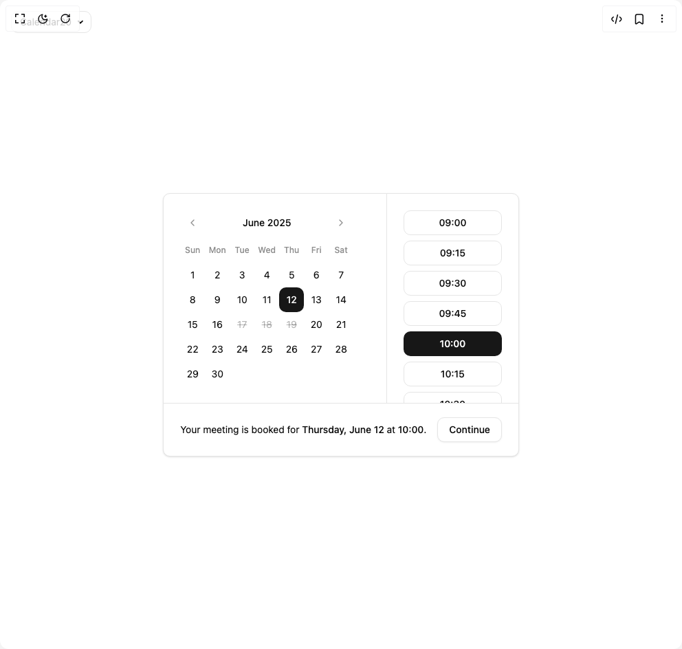

# Build Calendar With Time Pressets in BuilderStudio

> Build this component in our Agentic IDE: [BuilderStudio](https://builderstudio.dev).
>
> Join the BuilderStudio community on [Discord](https://discord.gg/QdWeSGCqfe) and [Reddit](https://reddit.com/r/builderstudio).



## Component

- Author group: `shadcn`
- Component: `calendar-with-time-pressets`
- Variant: `default`
- Rendered HTML snapshot: [`rendered.html`](rendered.html)

## BuilderStudio prompt

You are implementing a React component based on a component reference.

## Component identity

- Author: shadcn
- Component slug: calendar-with-time-pressets
- Demo slug: default
- Title: calendar-with-time-pressets
- Description: 

## Goal

Recreate this component in a React + TypeScript + Tailwind CSS project. Preserve the visual layout, spacing, colors, border radius, shadows, interaction behavior, animation behavior, responsive behavior, and dark mode behavior shown in the rendered demo.

## Implementation requirements

- Use React and TypeScript.
- Use Tailwind CSS classes whenever possible.
- Keep the component self-contained unless the source files require helper components.
- If the source uses CSS variables, custom CSS, animations, or keyframes, include them.
- If the source uses external packages, list and use the required packages.
- Preserve accessibility attributes, button semantics, links, keyboard behavior, and ARIA attributes when visible in the source.
- Do not replace the component with a simplified placeholder.
- Return complete production-ready code.

## Dependencies

No reference metadata available.

## Rendered DOM snapshot

This is the rendered demo HTML extracted from the live preview. Use it to verify structure, class names, visible content, and layout.

```html
<div id="root"><div class="fixed top-4 left-4 z-10"><select class="appearance-none h-8 max-w-[200px] text-sm leading-tight rounded-lg pl-3 pr-7 py-0 border bg-background focus:outline-none focus:ring-0"><option value="named_Calendar20_Calendar20">Calendar20</option></select><div class="absolute top-1/2 transform -translate-y-1/2 right-2 pointer-events-none"><svg class="w-4 h-4 fill-current" viewBox="0 0 20 20"><path d="M5.516 7.548c.436-.446 1.043-.48 1.576 0L10 10.405l2.908-2.857c.533-.48 1.14-.446 1.576 0 .436.445.408 1.197 0 1.615l-3.734 3.705c-.533.534-1.39.534-1.923 0l-3.734-3.705c-.408-.418-.436-1.17 0-1.615z"></path></svg></div></div><div class="w-screen min-h-screen flex justify-center items-center"><div class="rounded-lg border bg-card text-card-foreground shadow-sm gap-0 p-0"><div class="relative p-0 md:pr-48"><div class="p-6"><div class="rdp-root w-fit bg-transparent p-0 [--cell-size:--spacing(10)] md:[--cell-size:--spacing(12)]" data-mode="single"><div class="relative flex flex-col sm:flex-row gap-4"><nav class="absolute top-0 flex w-full justify-between z-10" aria-label=""><button type="button" class="inline-flex items-center justify-center whitespace-nowrap rounded-lg text-sm font-medium transition-colors outline-offset-2 focus-visible:outline-2 focus-visible:outline-ring/70 disabled:pointer-events-none disabled:opacity-50 [&amp;_svg]:pointer-events-none [&amp;_svg]:shrink-0 hover:bg-accent size-9 text-muted-foreground/80 hover:text-foreground p-0" aria-label="Go to the Previous Month"><svg xmlns="http://www.w3.org/2000/svg" width="16" height="16" viewBox="0 0 24 24" fill="none" stroke="currentColor" stroke-width="2" stroke-linecap="round" stroke-linejoin="round" class="lucide lucide-chevron-left rdp-chevron" orientation="left" aria-hidden="true"><path d="m15 18-6-6 6-6"></path></svg></button><button type="button" class="inline-flex items-center justify-center whitespace-nowrap rounded-lg text-sm font-medium transition-colors outline-offset-2 focus-visible:outline-2 focus-visible:outline-ring/70 disabled:pointer-events-none disabled:opacity-50 [&amp;_svg]:pointer-events-none [&amp;_svg]:shrink-0 hover:bg-accent size-9 text-muted-foreground/80 hover:text-foreground p-0" aria-label="Go to the Next Month"><svg xmlns="http://www.w3.org/2000/svg" width="16" height="16" viewBox="0 0 24 24" fill="none" stroke="currentColor" stroke-width="2" stroke-linecap="round" stroke-linejoin="round" class="lucide lucide-chevron-right rdp-chevron" orientation="right" aria-hidden="true"><path d="m9 18 6-6-6-6"></path></svg></button></nav><div class="w-full"><div class="relative mx-10 mb-1 flex h-9 items-center justify-center z-20"><span class="text-sm font-medium" role="status" aria-live="polite">June 2025</span></div><table role="grid" aria-multiselectable="false" aria-label="June 2025" class="rdp-month_grid"><thead aria-hidden="true"><tr class="rdp-weekdays"><th aria-label="Sunday" class="size-9 p-0 text-xs font-medium text-muted-foreground/80" scope="col">Sun</th><th aria-label="Monday" class="size-9 p-0 text-xs font-medium text-muted-foreground/80" scope="col">Mon</th><th aria-label="Tuesday" class="size-9 p-0 text-xs font-medium text-muted-foreground/80" scope="col">Tue</th><th aria-label="Wednesday" class="size-9 p-0 text-xs font-medium text-muted-foreground/80" scope="col">Wed</th><th aria-label="Thursday" class="size-9 p-0 text-xs font-medium text-muted-foreground/80" scope="col">Thu</th><th aria-label="Friday" class="size-9 p-0 text-xs font-medium text-muted-foreground/80" scope="col">Fri</th><th aria-label="Saturday" class="size-9 p-0 text-xs font-medium text-muted-foreground/80" scope="col">Sat</th></tr></thead><tbody class="rdp-weeks"><tr class="rdp-week"><td class="group size-9 px-0 text-sm" role="gridcell" data-day="2025-06-01"><button class="relative flex size-9 items-center justify-center whitespace-nowrap rounded-lg p-0 text-foreground outline-offset-2 group-[[data-selected]:not(.range-middle)]:[transition-property:color,background-color,border-radius,box-shadow] group-[[data-selected]:not(.range-middle)]:duration-150 focus:outline-none group-data-[disabled]:pointer-events-none focus-visible:z-10 hover:bg-accent group-data-[selected]:bg-primary hover:text-foreground group-data-[selected]:text-primary-foreground group-data-[disabled]:text-foreground/30 group-data-[disabled]:line-through group-data-[outside]:text-foreground/30 group-data-[outside]:group-data-[selected]:text-primary-foreground focus-visible:outline focus-visible:outline-2 focus-visible:outline-ring/70 group-[.range-start:not(.range-end)]:rounded-e-none group-[.range-end:not(.range-start)]:rounded-s-none group-[.range-middle]:rounded-none group-data-[selected]:group-[.range-middle]:bg-accent group-data-[selected]:group-[.range-middle]:text-foreground" type="button" tabindex="-1" aria-label="Sunday, June 1st, 2025">1</button></td><td class="group size-9 px-0 text-sm" role="gridcell" data-day="2025-06-02"><button class="relative flex size-9 items-center justify-center whitespace-nowrap rounded-lg p-0 text-foreground outline-offset-2 group-[[data-selected]:not(.range-middle)]:[transition-property:color,background-color,border-radius,box-shadow] group-[[data-selected]:not(.range-middle)]:duration-150 focus:outline-none group-data-[disabled]:pointer-events-none focus-visible:z-10 hover:bg-accent group-data-[selected]:bg-primary hover:text-foreground group-data-[selected]:text-primary-foreground group-data-[disabled]:text-foreground/30 group-data-[disabled]:line-through group-data-[outside]:text-foreground/30 group-data-[outside]:group-data-[selected]:text-primary-foreground focus-visible:outline focus-visible:outline-2 focus-visible:outline-ring/70 group-[.range-start:not(.range-end)]:rounded-e-none group-[.range-end:not(.range-start)]:rounded-s-none group-[.range-middle]:rounded-none group-data-[selected]:group-[.range-middle]:bg-accent group-data-[selected]:group-[.range-middle]:text-foreground" type="button" tabindex="-1" aria-label="Monday, June 2nd, 2025">2</button></td><td class="group size-9 px-0 text-sm" role="gridcell" data-day="2025-06-03"><button class="relative flex size-9 items-center justify-center whitespace-nowrap rounded-lg p-0 text-foreground outline-offset-2 group-[[data-selected]:not(.range-middle)]:[transition-property:color,background-color,border-radius,box-shadow] group-[[data-selected]:not(.range-middle)]:duration-150 focus:outline-none group-data-[disabled]:pointer-events-none focus-visible:z-10 hover:bg-accent group-data-[selected]:bg-primary hover:text-foreground group-data-[selected]:text-primary-foreground group-data-[disabled]:text-foreground/30 group-data-[disabled]:line-through group-data-[outside]:text-foreground/30 group-data-[outside]:group-data-[selected]:text-primary-foreground focus-visible:outline focus-visible:outline-2 focus-visible:outline-ring/70 group-[.range-start:not(.range-end)]:rounded-e-none group-[.range-end:not(.range-start)]:rounded-s-none group-[.range-middle]:rounded-none group-data-[selected]:group-[.range-middle]:bg-accent group-data-[selected]:group-[.range-middle]:text-foreground" type="button" tabindex="-1" aria-label="Tuesday, June 3rd, 2025">3</button></td><td class="group size-9 px-0 text-sm" role="gridcell" data-day="2025-06-04"><button class="relative flex size-9 items-center justify-center whitespace-nowrap rounded-lg p-0 text-foreground outline-offset-2 group-[[data-selected]:not(.range-middle)]:[transition-property:color,background-color,border-radius,box-shadow] group-[[data-selected]:not(.range-middle)]:duration-150 focus:outline-none group-data-[disabled]:pointer-events-none focus-visible:z-10 hover:bg-accent group-data-[selected]:bg-primary hover:text-foreground group-data-[selected]:text-primary-foreground group-data-[disabled]:text-foreground/30 group-data-[disabled]:line-through group-data-[outside]:text-foreground/30 group-data-[outside]:group-data-[selected]:text-primary-foreground focus-visible:outline focus-visible:outline-2 focus-visible:outline-ring/70 group-[.range-start:not(.range-end)]:rounded-e-none group-[.range-end:not(.range-start)]:rounded-s-none group-[.range-middle]:rounded-none group-data-[selected]:group-[.range-middle]:bg-accent group-data-[selected]:group-[.range-middle]:text-foreground" type="button" tabindex="-1" aria-label="Wednesday, June 4th, 2025">4</button></td><td class="group size-9 px-0 text-sm" role="gridcell" data-day="2025-06-05"><button class="relative flex size-9 items-center justify-center whitespace-nowrap rounded-lg p-0 text-foreground outline-offset-2 group-[[data-selected]:not(.range-middle)]:[transition-property:color,background-color,border-radius,box-shadow] group-[[data-selected]:not(.range-middle)]:duration-150 focus:outline-none group-data-[disabled]:pointer-events-none focus-visible:z-10 hover:bg-accent group-data-[selected]:bg-primary hover:text-foreground group-data-[selected]:text-primary-foreground group-data-[disabled]:text-foreground/30 group-data-[disabled]:line-through group-data-[outside]:text-foreground/30 group-data-[outside]:group-data-[selected]:text-primary-foreground focus-visible:outline focus-visible:outline-2 focus-visible:outline-ring/70 group-[.range-start:not(.range-end)]:rounded-e-none group-[.range-end:not(.range-start)]:rounded-s-none group-[.range-middle]:rounded-none group-data-[selected]:group-[.range-middle]:bg-accent group-data-[selected]:group-[.range-middle]:text-foreground" type="button" tabindex="-1" aria-label="Thursday, June 5th, 2025">5</button></td><td class="group size-9 px-0 text-sm" role="gridcell" data-day="2025-06-06"><button class="relative flex size-9 items-center justify-center whitespace-nowrap rounded-lg p-0 text-foreground outline-offset-2 group-[[data-selected]:not(.range-middle)]:[transition-property:color,background-color,border-radius,box-shadow] group-[[data-selected]:not(.range-middle)]:duration-150 focus:outline-none group-data-[disabled]:pointer-events-none focus-visible:z-10 hover:bg-accent group-data-[selected]:bg-primary hover:text-foreground group-data-[selected]:text-primary-foreground group-data-[disabled]:text-foreground/30 group-data-[disabled]:line-through group-data-[outside]:text-foreground/30 group-data-[outside]:group-data-[selected]:text-primary-foreground focus-visible:outline focus-visible:outline-2 focus-visible:outline-ring/70 group-[.range-start:not(.range-end)]:rounded-e-none group-[.range-end:not(.range-start)]:rounded-s-none group-[.range-middle]:rounded-none group-data-[selected]:group-[.range-middle]:bg-accent group-data-[selected]:group-[.range-middle]:text-foreground" type="button" tabindex="-1" aria-label="Friday, June 6th, 2025">6</button></td><td class="group size-9 px-0 text-sm" role="gridcell" data-day="2025-06-07"><button class="relative flex size-9 items-center justify-center whitespace-nowrap rounded-lg p-0 text-foreground outline-offset-2 group-[[data-selected]:not(.range-middle)]:[transition-property:color,background-color,border-radius,box-shadow] group-[[data-selected]:not(.range-middle)]:duration-150 focus:outline-none group-data-[disabled]:pointer-events-none focus-visible:z-10 hover:bg-accent group-data-[selected]:bg-primary hover:text-foreground group-data-[selected]:text-primary-foreground group-data-[disabled]:text-foreground/30 group-data-[disabled]:line-through group-data-[outside]:text-foreground/30 group-data-[outside]:group-data-[selected]:text-primary-foreground focus-visible:outline focus-visible:outline-2 focus-visible:outline-ring/70 group-[.range-start:not(.range-end)]:rounded-e-none group-[.range-end:not(.range-start)]:rounded-s-none group-[.range-middle]:rounded-none group-data-[selected]:group-[.range-middle]:bg-accent group-data-[selected]:group-[.range-middle]:text-foreground" type="button" tabindex="-1" aria-label="Saturday, June 7th, 2025">7</button></td></tr><tr class="rdp-week"><td class="group size-9 px-0 text-sm" role="gridcell" data-day="2025-06-08"><button class="relative flex size-9 items-center justify-center whitespace-nowrap rounded-lg p-0 text-foreground outline-offset-2 group-[[data-selected]:not(.range-middle)]:[transition-property:color,background-color,border-radius,box-shadow] group-[[data-selected]:not(.range-middle)]:duration-150 focus:outline-none group-data-[disabled]:pointer-events-none focus-visible:z-10 hover:bg-accent group-data-[selected]:bg-primary hover:text-foreground group-data-[selected]:text-primary-foreground group-data-[disabled]:text-foreground/30 group-data-[disabled]:line-through group-data-[outside]:text-foreground/30 group-data-[outside]:group-data-[selected]:text-primary-foreground focus-visible:outline focus-visible:outline-2 focus-visible:outline-ring/70 group-[.range-start:not(.range-end)]:rounded-e-none group-[.range-end:not(.range-start)]:rounded-s-none group-[.range-middle]:rounded-none group-data-[selected]:group-[.range-middle]:bg-accent group-data-[selected]:group-[.range-middle]:text-foreground" type="button" tabindex="-1" aria-label="Sunday, June 8th, 2025">8</button></td><td class="group size-9 px-0 text-sm" role="gridcell" data-day="2025-06-09"><button class="relative flex size-9 items-center justify-center whitespace-nowrap rounded-lg p-0 text-foreground outline-offset-2 group-[[data-selected]:not(.range-middle)]:[transition-property:color,background-color,border-radius,box-shadow] group-[[data-selected]:not(.range-middle)]:duration-150 focus:outline-none group-data-[disabled]:pointer-events-none focus-visible:z-10 hover:bg-accent group-data-[selected]:bg-primary hover:text-foreground group-data-[selected]:text-primary-foreground group-data-[disabled]:text-foreground/30 group-data-[disabled]:line-through group-data-[outside]:text-foreground/30 group-data-[outside]:group-data-[selected]:text-primary-foreground focus-visible:outline focus-visible:outline-2 focus-visible:outline-ring/70 group-[.range-start:not(.range-end)]:rounded-e-none group-[.range-end:not(.range-start)]:rounded-s-none group-[.range-middle]:rounded-none group-data-[selected]:group-[.range-middle]:bg-accent group-data-[selected]:group-[.range-middle]:text-foreground" type="button" tabindex="-1" aria-label="Monday, June 9th, 2025">9</button></td><td class="group size-9 px-0 text-sm" role="gridcell" data-day="2025-06-10"><button class="relative flex size-9 items-center justify-center whitespace-nowrap rounded-lg p-0 text-foreground outline-offset-2 group-[[data-selected]:not(.range-middle)]:[transition-property:color,background-color,border-radius,box-shadow] group-[[data-selected]:not(.range-middle)]:duration-150 focus:outline-none group-data-[disabled]:pointer-events-none focus-visible:z-10 hover:bg-accent group-data-[selected]:bg-primary hover:text-foreground group-data-[selected]:text-primary-foreground group-data-[disabled]:text-foreground/30 group-data-[disabled]:line-through group-data-[outside]:text-foreground/30 group-data-[outside]:group-data-[selected]:text-primary-foreground focus-visible:outline focus-visible:outline-2 focus-visible:outline-ring/70 group-[.range-start:not(.range-end)]:rounded-e-none group-[.range-end:not(.range-start)]:rounded-s-none group-[.range-middle]:rounded-none group-data-[selected]:group-[.range-middle]:bg-accent group-data-[selected]:group-[.range-middle]:text-foreground" type="button" tabindex="-1" aria-label="Tuesday, June 10th, 2025">10</button></td><td class="group size-9 px-0 text-sm" role="gridcell" data-day="2025-06-11"><button class="relative flex size-9 items-center justify-center whitespace-nowrap rounded-lg p-0 text-foreground outline-offset-2 group-[[data-selected]:not(.range-middle)]:[transition-property:color,background-color,border-radius,box-shadow] group-[[data-selected]:not(.range-middle)]:duration-150 focus:outline-none group-data-[disabled]:pointer-events-none focus-visible:z-10 hover:bg-accent group-data-[selected]:bg-primary hover:text-foreground group-data-[selected]:text-primary-foreground group-data-[disabled]:text-foreground/30 group-data-[disabled]:line-through group-data-[outside]:text-foreground/30 group-data-[outside]:group-data-[selected]:text-primary-foreground focus-visible:outline focus-visible:outline-2 focus-visible:outline-ring/70 group-[.range-start:not(.range-end)]:rounded-e-none group-[.range-end:not(.range-start)]:rounded-s-none group-[.range-middle]:rounded-none group-data-[selected]:group-[.range-middle]:bg-accent group-data-[selected]:group-[.range-middle]:text-foreground" type="button" tabindex="-1" aria-label="Wednesday, June 11th, 2025">11</button></td><td class="group size-9 px-0 text-sm rdp-selected" role="gridcell" aria-selected="true" data-day="2025-06-12" data-selected="true"><button class="relative flex size-9 items-center justify-center whitespace-nowrap rounded-lg p-0 text-foreground outline-offset-2 group-[[data-selected]:not(.range-middle)]:[transition-property:color,background-color,border-radius,box-shadow] group-[[data-selected]:not(.range-middle)]:duration-150 focus:outline-none group-data-[disabled]:pointer-events-none focus-visible:z-10 hover:bg-accent group-data-[selected]:bg-primary hover:text-foreground group-data-[selected]:text-primary-foreground group-data-[disabled]:text-foreground/30 group-data-[disabled]:line-through group-data-[outside]:text-foreground/30 group-data-[outside]:group-data-[selected]:text-primary-foreground focus-visible:outline focus-visible:outline-2 focus-visible:outline-ring/70 group-[.range-start:not(.range-end)]:rounded-e-none group-[.range-end:not(.range-start)]:rounded-s-none group-[.range-middle]:rounded-none group-data-[selected]:group-[.range-middle]:bg-accent group-data-[selected]:group-[.range-middle]:text-foreground" type="button" tabindex="0" aria-label="Thursday, June 12th, 2025, selected">12</button></td><td class="group size-9 px-0 text-sm" role="gridcell" data-day="2025-06-13"><button class="relative flex size-9 items-center justify-center whitespace-nowrap rounded-lg p-0 text-foreground outline-offset-2 group-[[data-selected]:not(.range-middle)]:[transition-property:color,background-color,border-radius,box-shadow] group-[[data-selected]:not(.range-middle)]:duration-150 focus:outline-none group-data-[disabled]:pointer-events-none focus-visible:z-10 hover:bg-accent group-data-[selected]:bg-primary hover:text-foreground group-data-[selected]:text-primary-foreground group-data-[disabled]:text-foreground/30 group-data-[disabled]:line-through group-data-[outside]:text-foreground/30 group-data-[outside]:group-data-[selected]:text-primary-foreground focus-visible:outline focus-visible:outline-2 focus-visible:outline-ring/70 group-[.range-start:not(.range-end)]:rounded-e-none group-[.range-end:not(.range-start)]:rounded-s-none group-[.range-middle]:rounded-none group-data-[selected]:group-[.range-middle]:bg-accent group-data-[selected]:group-[.range-middle]:text-foreground" type="button" tabindex="-1" aria-label="Friday, June 13th, 2025">13</button></td><td class="group size-9 px-0 text-sm" role="gridcell" data-day="2025-06-14"><button class="relative flex size-9 items-center justify-center whitespace-nowrap rounded-lg p-0 text-foreground outline-offset-2 group-[[data-selected]:not(.range-middle)]:[transition-property:color,background-color,border-radius,box-shadow] group-[[data-selected]:not(.range-middle)]:duration-150 focus:outline-none group-data-[disabled]:pointer-events-none focus-visible:z-10 hover:bg-accent group-data-[selected]:bg-primary hover:text-foreground group-data-[selected]:text-primary-foreground group-data-[disabled]:text-foreground/30 group-data-[disabled]:line-through group-data-[outside]:text-foreground/30 group-data-[outside]:group-data-[selected]:text-primary-foreground focus-visible:outline focus-visible:outline-2 focus-visible:outline-ring/70 group-[.range-start:not(.range-end)]:rounded-e-none group-[.range-end:not(.range-start)]:rounded-s-none group-[.range-middle]:rounded-none group-data-[selected]:group-[.range-middle]:bg-accent group-data-[selected]:group-[.range-middle]:text-foreground" type="button" tabindex="-1" aria-label="Saturday, June 14th, 2025">14</button></td></tr><tr class="rdp-week"><td class="group size-9 px-0 text-sm" role="gridcell" data-day="2025-06-15"><button class="relative flex size-9 items-center justify-center whitespace-nowrap rounded-lg p-0 text-foreground outline-offset-2 group-[[data-selected]:not(.range-middle)]:[transition-property:color,background-color,border-radius,box-shadow] group-[[data-selected]:not(.range-middle)]:duration-150 focus:outline-none group-data-[disabled]:pointer-events-none focus-visible:z-10 hover:bg-accent group-data-[selected]:bg-primary hover:text-foreground group-data-[selected]:text-primary-foreground group-data-[disabled]:text-foreground/30 group-data-[disabled]:line-through group-data-[outside]:text-foreground/30 group-data-[outside]:group-data-[selected]:text-primary-foreground focus-visible:outline focus-visible:outline-2 focus-visible:outline-ring/70 group-[.range-start:not(.range-end)]:rounded-e-none group-[.range-end:not(.range-start)]:rounded-s-none group-[.range-middle]:rounded-none group-data-[selected]:group-[.range-middle]:bg-accent group-data-[selected]:group-[.range-middle]:text-foreground" type="button" tabindex="-1" aria-label="Sunday, June 15th, 2025">15</button></td><td class="group size-9 px-0 text-sm" role="gridcell" data-day="2025-06-16"><button class="relative flex size-9 items-center justify-center whitespace-nowrap rounded-lg p-0 text-foreground outline-offset-2 group-[[data-selected]:not(.range-middle)]:[transition-property:color,background-color,border-radius,box-shadow] group-[[data-selected]:not(.range-middle)]:duration-150 focus:outline-none group-data-[disabled]:pointer-events-none focus-visible:z-10 hover:bg-accent group-data-[selected]:bg-primary hover:text-foreground group-data-[selected]:text-primary-foreground group-data-[disabled]:text-foreground/30 group-data-[disabled]:line-through group-data-[outside]:text-foreground/30 group-data-[outside]:group-data-[selected]:text-primary-foreground focus-visible:outline focus-visible:outline-2 focus-visible:outline-ring/70 group-[.range-start:not(.range-end)]:rounded-e-none group-[.range-end:not(.range-start)]:rounded-s-none group-[.range-middle]:rounded-none group-data-[selected]:group-[.range-middle]:bg-accent group-data-[selected]:group-[.range-middle]:text-foreground" type="button" tabindex="-1" aria-label="Monday, June 16th, 2025">16</button></td><td class="group size-9 px-0 text-sm rdp-disabled [&amp;&gt;button]:line-through opacity-100" role="gridcell" data-day="2025-06-17" data-disabled="true"><button class="relative flex size-9 items-center justify-center whitespace-nowrap rounded-lg p-0 text-foreground outline-offset-2 group-[[data-selected]:not(.range-middle)]:[transition-property:color,background-color,border-radius,box-shadow] group-[[data-selected]:not(.range-middle)]:duration-150 focus:outline-none group-data-[disabled]:pointer-events-none focus-visible:z-10 hover:bg-accent group-data-[selected]:bg-primary hover:text-foreground group-data-[selected]:text-primary-foreground group-data-[disabled]:text-foreground/30 group-data-[disabled]:line-through group-data-[outside]:text-foreground/30 group-data-[outside]:group-data-[selected]:text-primary-foreground focus-visible:outline focus-visible:outline-2 focus-visible:outline-ring/70 group-[.range-start:not(.range-end)]:rounded-e-none group-[.range-end:not(.range-start)]:rounded-s-none group-[.range-middle]:rounded-none group-data-[selected]:group-[.range-middle]:bg-accent group-data-[selected]:group-[.range-middle]:text-foreground" type="button" disabled="" tabindex="-1" aria-label="Tuesday, June 17th, 2025">17</button></td><td class="group size-9 px-0 text-sm rdp-disabled [&amp;&gt;button]:line-through opacity-100" role="gridcell" data-day="2025-06-18" data-disabled="true"><button class="relative flex size-9 items-center justify-center whitespace-nowrap rounded-lg p-0 text-foreground outline-offset-2 group-[[data-selected]:not(.range-middle)]:[transition-property:color,background-color,border-radius,box-shadow] group-[[data-selected]:not(.range-middle)]:duration-150 focus:outline-none group-data-[disabled]:pointer-events-none focus-visible:z-10 hover:bg-accent group-data-[selected]:bg-primary hover:text-foreground group-data-[selected]:text-primary-foreground group-data-[disabled]:text-foreground/30 group-data-[disabled]:line-through group-data-[outside]:text-foreground/30 group-data-[outside]:group-data-[selected]:text-primary-foreground focus-visible:outline focus-visible:outline-2 focus-visible:outline-ring/70 group-[.range-start:not(.range-end)]:rounded-e-none group-[.range-end:not(.range-start)]:rounded-s-none group-[.range-middle]:rounded-none group-data-[selected]:group-[.range-middle]:bg-accent group-data-[selected]:group-[.range-middle]:text-foreground" type="button" disabled="" tabindex="-1" aria-label="Wednesday, June 18th, 2025">18</button></td><td class="group size-9 px-0 text-sm rdp-disabled [&amp;&gt;button]:line-through opacity-100" role="gridcell" data-day="2025-06-19" data-disabled="true"><button class="relative flex size-9 items-center justify-center whitespace-nowrap rounded-lg p-0 text-foreground outline-offset-2 group-[[data-selected]:not(.range-middle)]:[transition-property:color,background-color,border-radius,box-shadow] group-[[data-selected]:not(.range-middle)]:duration-150 focus:outline-none group-data-[disabled]:pointer-events-none focus-visible:z-10 hover:bg-accent group-data-[selected]:bg-primary hover:text-foreground group-data-[selected]:text-primary-foreground group-data-[disabled]:text-foreground/30 group-data-[disabled]:line-through group-data-[outside]:text-foreground/30 group-data-[outside]:group-data-[selected]:text-primary-foreground focus-visible:outline focus-visible:outline-2 focus-visible:outline-ring/70 group-[.range-start:not(.range-end)]:rounded-e-none group-[.range-end:not(.range-start)]:rounded-s-none group-[.range-middle]:rounded-none group-data-[selected]:group-[.range-middle]:bg-accent group-data-[selected]:group-[.range-middle]:text-foreground" type="button" disabled="" tabindex="-1" aria-label="Thursday, June 19th, 2025">19</button></td><td class="group size-9 px-0 text-sm" role="gridcell" data-day="2025-06-20"><button class="relative flex size-9 items-center justify-center whitespace-nowrap rounded-lg p-0 text-foreground outline-offset-2 group-[[data-selected]:not(.range-middle)]:[transition-property:color,background-color,border-radius,box-shadow] group-[[data-selected]:not(.range-middle)]:duration-150 focus:outline-none group-data-[disabled]:pointer-events-none focus-visible:z-10 hover:bg-accent group-data-[selected]:bg-primary hover:text-foreground group-data-[selected]:text-primary-foreground group-data-[disabled]:text-foreground/30 group-data-[disabled]:line-through group-data-[outside]:text-foreground/30 group-data-[outside]:group-data-[selected]:text-primary-foreground focus-visible:outline focus-visible:outline-2 focus-visible:outline-ring/70 group-[.range-start:not(.range-end)]:rounded-e-none group-[.range-end:not(.range-start)]:rounded-s-none group-[.range-middle]:rounded-none group-data-[selected]:group-[.range-middle]:bg-accent group-data-[selected]:group-[.range-middle]:text-foreground" type="button" tabindex="-1" aria-label="Friday, June 20th, 2025">20</button></td><td class="group size-9 px-0 text-sm" role="gridcell" data-day="2025-06-21"><button class="relative flex size-9 items-center justify-center whitespace-nowrap rounded-lg p-0 text-foreground outline-offset-2 group-[[data-selected]:not(.range-middle)]:[transition-property:color,background-color,border-radius,box-shadow] group-[[data-selected]:not(.range-middle)]:duration-150 focus:outline-none group-data-[disabled]:pointer-events-none focus-visible:z-10 hover:bg-accent group-data-[selected]:bg-primary hover:text-foreground group-data-[selected]:text-primary-foreground group-data-[disabled]:text-foreground/30 group-data-[disabled]:line-through group-data-[outside]:text-foreground/30 group-data-[outside]:group-data-[selected]:text-primary-foreground focus-visible:outline focus-visible:outline-2 focus-visible:outline-ring/70 group-[.range-start:not(.range-end)]:rounded-e-none group-[.range-end:not(.range-start)]:rounded-s-none group-[.range-middle]:rounded-none group-data-[selected]:group-[.range-middle]:bg-accent group-data-[selected]:group-[.range-middle]:text-foreground" type="button" tabindex="-1" aria-label="Saturday, June BuilderStudio, 2025">21</button></td></tr><tr class="rdp-week"><td class="group size-9 px-0 text-sm" role="gridcell" data-day="2025-06-22"><button class="relative flex size-9 items-center justify-center whitespace-nowrap rounded-lg p-0 text-foreground outline-offset-2 group-[[data-selected]:not(.range-middle)]:[transition-property:color,background-color,border-radius,box-shadow] group-[[data-selected]:not(.range-middle)]:duration-150 focus:outline-none group-data-[disabled]:pointer-events-none focus-visible:z-10 hover:bg-accent group-data-[selected]:bg-primary hover:text-foreground group-data-[selected]:text-primary-foreground group-data-[disabled]:text-foreground/30 group-data-[disabled]:line-through group-data-[outside]:text-foreground/30 group-data-[outside]:group-data-[selected]:text-primary-foreground focus-visible:outline focus-visible:outline-2 focus-visible:outline-ring/70 group-[.range-start:not(.range-end)]:rounded-e-none group-[.range-end:not(.range-start)]:rounded-s-none group-[.range-middle]:rounded-none group-data-[selected]:group-[.range-middle]:bg-accent group-data-[selected]:group-[.range-middle]:text-foreground" type="button" tabindex="-1" aria-label="Sunday, June 22nd, 2025">22</button></td><td class="group size-9 px-0 text-sm" role="gridcell" data-day="2025-06-23"><button class="relative flex size-9 items-center justify-center whitespace-nowrap rounded-lg p-0 text-foreground outline-offset-2 group-[[data-selected]:not(.range-middle)]:[transition-property:color,background-color,border-radius,box-shadow] group-[[data-selected]:not(.range-middle)]:duration-150 focus:outline-none group-data-[disabled]:pointer-events-none focus-visible:z-10 hover:bg-accent group-data-[selected]:bg-primary hover:text-foreground group-data-[selected]:text-primary-foreground group-data-[disabled]:text-foreground/30 group-data-[disabled]:line-through group-data-[outside]:text-foreground/30 group-data-[outside]:group-data-[selected]:text-primary-foreground focus-visible:outline focus-visible:outline-2 focus-visible:outline-ring/70 group-[.range-start:not(.range-end)]:rounded-e-none group-[.range-end:not(.range-start)]:rounded-s-none group-[.range-middle]:rounded-none group-data-[selected]:group-[.range-middle]:bg-accent group-data-[selected]:group-[.range-middle]:text-foreground" type="button" tabindex="-1" aria-label="Monday, June 23rd, 2025">23</button></td><td class="group size-9 px-0 text-sm" role="gridcell" data-day="2025-06-24"><button class="relative flex size-9 items-center justify-center whitespace-nowrap rounded-lg p-0 text-foreground outline-offset-2 group-[[data-selected]:not(.range-middle)]:[transition-property:color,background-color,border-radius,box-shadow] group-[[data-selected]:not(.range-middle)]:duration-150 focus:outline-none group-data-[disabled]:pointer-events-none focus-visible:z-10 hover:bg-accent group-data-[selected]:bg-primary hover:text-foreground group-data-[selected]:text-primary-foreground group-data-[disabled]:text-foreground/30 group-data-[disabled]:line-through group-data-[outside]:text-foreground/30 group-data-[outside]:group-data-[selected]:text-primary-foreground focus-visible:outline focus-visible:outline-2 focus-visible:outline-ring/70 group-[.range-start:not(.range-end)]:rounded-e-none group-[.range-end:not(.range-start)]:rounded-s-none group-[.range-middle]:rounded-none group-data-[selected]:group-[.range-middle]:bg-accent group-data-[selected]:group-[.range-middle]:text-foreground" type="button" tabindex="-1" aria-label="Tuesday, June 24th, 2025">24</button></td><td class="group size-9 px-0 text-sm" role="gridcell" data-day="2025-06-25"><button class="relative flex size-9 items-center justify-center whitespace-nowrap rounded-lg p-0 text-foreground outline-offset-2 group-[[data-selected]:not(.range-middle)]:[transition-property:color,background-color,border-radius,box-shadow] group-[[data-selected]:not(.range-middle)]:duration-150 focus:outline-none group-data-[disabled]:pointer-events-none focus-visible:z-10 hover:bg-accent group-data-[selected]:bg-primary hover:text-foreground group-data-[selected]:text-primary-foreground group-data-[disabled]:text-foreground/30 group-data-[disabled]:line-through group-data-[outside]:text-foreground/30 group-data-[outside]:group-data-[selected]:text-primary-foreground focus-visible:outline focus-visible:outline-2 focus-visible:outline-ring/70 group-[.range-start:not(.range-end)]:rounded-e-none group-[.range-end:not(.range-start)]:rounded-s-none group-[.range-middle]:rounded-none group-data-[selected]:group-[.range-middle]:bg-accent group-data-[selected]:group-[.range-middle]:text-foreground" type="button" tabindex="-1" aria-label="Wednesday, June 25th, 2025">25</button></td><td class="group size-9 px-0 text-sm" role="gridcell" data-day="2025-06-26"><button class="relative flex size-9 items-center justify-center whitespace-nowrap rounded-lg p-0 text-foreground outline-offset-2 group-[[data-selected]:not(.range-middle)]:[transition-property:color,background-color,border-radius,box-shadow] group-[[data-selected]:not(.range-middle)]:duration-150 focus:outline-none group-data-[disabled]:pointer-events-none focus-visible:z-10 hover:bg-accent group-data-[selected]:bg-primary hover:text-foreground group-data-[selected]:text-primary-foreground group-data-[disabled]:text-foreground/30 group-data-[disabled]:line-through group-data-[outside]:text-foreground/30 group-data-[outside]:group-data-[selected]:text-primary-foreground focus-visible:outline focus-visible:outline-2 focus-visible:outline-ring/70 group-[.range-start:not(.range-end)]:rounded-e-none group-[.range-end:not(.range-start)]:rounded-s-none group-[.range-middle]:rounded-none group-data-[selected]:group-[.range-middle]:bg-accent group-data-[selected]:group-[.range-middle]:text-foreground" type="button" tabindex="-1" aria-label="Thursday, June 26th, 2025">26</button></td><td class="group size-9 px-0 text-sm" role="gridcell" data-day="2025-06-27"><button class="relative flex size-9 items-center justify-center whitespace-nowrap rounded-lg p-0 text-foreground outline-offset-2 group-[[data-selected]:not(.range-middle)]:[transition-property:color,background-color,border-radius,box-shadow] group-[[data-selected]:not(.range-middle)]:duration-150 focus:outline-none group-data-[disabled]:pointer-events-none focus-visible:z-10 hover:bg-accent group-data-[selected]:bg-primary hover:text-foreground group-data-[selected]:text-primary-foreground group-data-[disabled]:text-foreground/30 group-data-[disabled]:line-through group-data-[outside]:text-foreground/30 group-data-[outside]:group-data-[selected]:text-primary-foreground focus-visible:outline focus-visible:outline-2 focus-visible:outline-ring/70 group-[.range-start:not(.range-end)]:rounded-e-none group-[.range-end:not(.range-start)]:rounded-s-none group-[.range-middle]:rounded-none group-data-[selected]:group-[.range-middle]:bg-accent group-data-[selected]:group-[.range-middle]:text-foreground" type="button" tabindex="-1" aria-label="Friday, June 27th, 2025">27</button></td><td class="group size-9 px-0 text-sm" role="gridcell" data-day="2025-06-28"><button class="relative flex size-9 items-center justify-center whitespace-nowrap rounded-lg p-0 text-foreground outline-offset-2 group-[[data-selected]:not(.range-middle)]:[transition-property:color,background-color,border-radius,box-shadow] group-[[data-selected]:not(.range-middle)]:duration-150 focus:outline-none group-data-[disabled]:pointer-events-none focus-visible:z-10 hover:bg-accent group-data-[selected]:bg-primary hover:text-foreground group-data-[selected]:text-primary-foreground group-data-[disabled]:text-foreground/30 group-data-[disabled]:line-through group-data-[outside]:text-foreground/30 group-data-[outside]:group-data-[selected]:text-primary-foreground focus-visible:outline focus-visible:outline-2 focus-visible:outline-ring/70 group-[.range-start:not(.range-end)]:rounded-e-none group-[.range-end:not(.range-start)]:rounded-s-none group-[.range-middle]:rounded-none group-data-[selected]:group-[.range-middle]:bg-accent group-data-[selected]:group-[.range-middle]:text-foreground" type="button" tabindex="-1" aria-label="Saturday, June 28th, 2025">28</button></td></tr><tr class="rdp-week"><td class="group size-9 px-0 text-sm" role="gridcell" data-day="2025-06-29"><button class="relative flex size-9 items-center justify-center whitespace-nowrap rounded-lg p-0 text-foreground outline-offset-2 group-[[data-selected]:not(.range-middle)]:[transition-property:color,background-color,border-radius,box-shadow] group-[[data-selected]:not(.range-middle)]:duration-150 focus:outline-none group-data-[disabled]:pointer-events-none focus-visible:z-10 hover:bg-accent group-data-[selected]:bg-primary hover:text-foreground group-data-[selected]:text-primary-foreground group-data-[disabled]:text-foreground/30 group-data-[disabled]:line-through group-data-[outside]:text-foreground/30 group-data-[outside]:group-data-[selected]:text-primary-foreground focus-visible:outline focus-visible:outline-2 focus-visible:outline-ring/70 group-[.range-start:not(.range-end)]:rounded-e-none group-[.range-end:not(.range-start)]:rounded-s-none group-[.range-middle]:rounded-none group-data-[selected]:group-[.range-middle]:bg-accent group-data-[selected]:group-[.range-middle]:text-foreground" type="button" tabindex="-1" aria-label="Sunday, June 29th, 2025">29</button></td><td class="group size-9 px-0 text-sm" role="gridcell" data-day="2025-06-30"><button class="relative flex size-9 items-center justify-center whitespace-nowrap rounded-lg p-0 text-foreground outline-offset-2 group-[[data-selected]:not(.range-middle)]:[transition-property:color,background-color,border-radius,box-shadow] group-[[data-selected]:not(.range-middle)]:duration-150 focus:outline-none group-data-[disabled]:pointer-events-none focus-visible:z-10 hover:bg-accent group-data-[selected]:bg-primary hover:text-foreground group-data-[selected]:text-primary-foreground group-data-[disabled]:text-foreground/30 group-data-[disabled]:line-through group-data-[outside]:text-foreground/30 group-data-[outside]:group-data-[selected]:text-primary-foreground focus-visible:outline focus-visible:outline-2 focus-visible:outline-ring/70 group-[.range-start:not(.range-end)]:rounded-e-none group-[.range-end:not(.range-start)]:rounded-s-none group-[.range-middle]:rounded-none group-data-[selected]:group-[.range-middle]:bg-accent group-data-[selected]:group-[.range-middle]:text-foreground" type="button" tabindex="-1" aria-label="Monday, June 30th, 2025">30</button></td><td class="group size-9 px-0 text-sm invisible text-muted-foreground data-selected:bg-accent/50 data-selected:text-muted-foreground" role="gridcell" data-day="2025-07-01" data-month="2025-07" data-hidden="true" data-outside="true"></td><td class="group size-9 px-0 text-sm invisible text-muted-foreground data-selected:bg-accent/50 data-selected:text-muted-foreground" role="gridcell" data-day="2025-07-02" data-month="2025-07" data-hidden="true" data-outside="true"></td><td class="group size-9 px-0 text-sm invisible text-muted-foreground data-selected:bg-accent/50 data-selected:text-muted-foreground" role="gridcell" data-day="2025-07-03" data-month="2025-07" data-hidden="true" data-outside="true"></td><td class="group size-9 px-0 text-sm invisible text-muted-foreground data-selected:bg-accent/50 data-selected:text-muted-foreground" role="gridcell" data-day="2025-07-04" data-month="2025-07" data-hidden="true" data-outside="true"></td><td class="group size-9 px-0 text-sm invisible text-muted-foreground data-selected:bg-accent/50 data-selected:text-muted-foreground" role="gridcell" data-day="2025-07-05" data-month="2025-07" data-hidden="true" data-outside="true"></td></tr></tbody></table></div></div></div></div><div class="no-scrollbar inset-y-0 right-0 flex max-h-72 w-full scroll-pb-6 flex-col gap-4 overflow-y-auto border-t p-6 md:absolute md:max-h-none md:w-48 md:border-t-0 md:border-l"><div class="grid gap-2"><button class="inline-flex items-center justify-center whitespace-nowrap rounded-lg text-sm font-medium transition-colors outline-offset-2 focus-visible:outline-2 focus-visible:outline-ring/70 disabled:pointer-events-none disabled:opacity-50 [&amp;_svg]:pointer-events-none [&amp;_svg]:shrink-0 border border-input bg-background shadow-black/5 hover:bg-accent hover:text-accent-foreground h-9 px-4 py-2 w-full shadow-none">09:00</button><button class="inline-flex items-center justify-center whitespace-nowrap rounded-lg text-sm font-medium transition-colors outline-offset-2 focus-visible:outline-2 focus-visible:outline-ring/70 disabled:pointer-events-none disabled:opacity-50 [&amp;_svg]:pointer-events-none [&amp;_svg]:shrink-0 border border-input bg-background shadow-black/5 hover:bg-accent hover:text-accent-foreground h-9 px-4 py-2 w-full shadow-none">09:15</button><button class="inline-flex items-center justify-center whitespace-nowrap rounded-lg text-sm font-medium transition-colors outline-offset-2 focus-visible:outline-2 focus-visible:outline-ring/70 disabled:pointer-events-none disabled:opacity-50 [&amp;_svg]:pointer-events-none [&amp;_svg]:shrink-0 border border-input bg-background shadow-black/5 hover:bg-accent hover:text-accent-foreground h-9 px-4 py-2 w-full shadow-none">09:30</button><button class="inline-flex items-center justify-center whitespace-nowrap rounded-lg text-sm font-medium transition-colors outline-offset-2 focus-visible:outline-2 focus-visible:outline-ring/70 disabled:pointer-events-none disabled:opacity-50 [&amp;_svg]:pointer-events-none [&amp;_svg]:shrink-0 border border-input bg-background shadow-black/5 hover:bg-accent hover:text-accent-foreground h-9 px-4 py-2 w-full shadow-none">09:45</button><button class="inline-flex items-center justify-center whitespace-nowrap rounded-lg text-sm font-medium transition-colors outline-offset-2 focus-visible:outline-2 focus-visible:outline-ring/70 disabled:pointer-events-none disabled:opacity-50 [&amp;_svg]:pointer-events-none [&amp;_svg]:shrink-0 bg-primary text-primary-foreground shadow-black/5 hover:bg-primary/90 h-9 px-4 py-2 w-full shadow-none">10:00</button><button class="inline-flex items-center justify-center whitespace-nowrap rounded-lg text-sm font-medium transition-colors outline-offset-2 focus-visible:outline-2 focus-visible:outline-ring/70 disabled:pointer-events-none disabled:opacity-50 [&amp;_svg]:pointer-events-none [&amp;_svg]:shrink-0 border border-input bg-background shadow-black/5 hover:bg-accent hover:text-accent-foreground h-9 px-4 py-2 w-full shadow-none">10:15</button><button class="inline-flex items-center justify-center whitespace-nowrap rounded-lg text-sm font-medium transition-colors outline-offset-2 focus-visible:outline-2 focus-visible:outline-ring/70 disabled:pointer-events-none disabled:opacity-50 [&amp;_svg]:pointer-events-none [&amp;_svg]:shrink-0 border border-input bg-background shadow-black/5 hover:bg-accent hover:text-accent-foreground h-9 px-4 py-2 w-full shadow-none">10:30</button><button class="inline-flex items-center justify-center whitespace-nowrap rounded-lg text-sm font-medium transition-colors outline-offset-2 focus-visible:outline-2 focus-visible:outline-ring/70 disabled:pointer-events-none disabled:opacity-50 [&amp;_svg]:pointer-events-none [&amp;_svg]:shrink-0 border border-input bg-background shadow-black/5 hover:bg-accent hover:text-accent-foreground h-9 px-4 py-2 w-full shadow-none">10:45</button><button class="inline-flex items-center justify-center whitespace-nowrap rounded-lg text-sm font-medium transition-colors outline-offset-2 focus-visible:outline-2 focus-visible:outline-ring/70 disabled:pointer-events-none disabled:opacity-50 [&amp;_svg]:pointer-events-none [&amp;_svg]:shrink-0 border border-input bg-background shadow-black/5 hover:bg-accent hover:text-accent-foreground h-9 px-4 py-2 w-full shadow-none">11:00</button><button class="inline-flex items-center justify-center whitespace-nowrap rounded-lg text-sm font-medium transition-colors outline-offset-2 focus-visible:outline-2 focus-visible:outline-ring/70 disabled:pointer-events-none disabled:opacity-50 [&amp;_svg]:pointer-events-none [&amp;_svg]:shrink-0 border border-input bg-background shadow-black/5 hover:bg-accent hover:text-accent-foreground h-9 px-4 py-2 w-full shadow-none">11:15</button><button class="inline-flex items-center justify-center whitespace-nowrap rounded-lg text-sm font-medium transition-colors outline-offset-2 focus-visible:outline-2 focus-visible:outline-ring/70 disabled:pointer-events-none disabled:opacity-50 [&amp;_svg]:pointer-events-none [&amp;_svg]:shrink-0 border border-input bg-background shadow-black/5 hover:bg-accent hover:text-accent-foreground h-9 px-4 py-2 w-full shadow-none">11:30</button><button class="inline-flex items-center justify-center whitespace-nowrap rounded-lg text-sm font-medium transition-colors outline-offset-2 focus-visible:outline-2 focus-visible:outline-ring/70 disabled:pointer-events-none disabled:opacity-50 [&amp;_svg]:pointer-events-none [&amp;_svg]:shrink-0 border border-input bg-background shadow-black/5 hover:bg-accent hover:text-accent-foreground h-9 px-4 py-2 w-full shadow-none">11:45</button><button class="inline-flex items-center justify-center whitespace-nowrap rounded-lg text-sm font-medium transition-colors outline-offset-2 focus-visible:outline-2 focus-visible:outline-ring/70 disabled:pointer-events-none disabled:opacity-50 [&amp;_svg]:pointer-events-none [&amp;_svg]:shrink-0 border border-input bg-background shadow-black/5 hover:bg-accent hover:text-accent-foreground h-9 px-4 py-2 w-full shadow-none">12:00</button><button class="inline-flex items-center justify-center whitespace-nowrap rounded-lg text-sm font-medium transition-colors outline-offset-2 focus-visible:outline-2 focus-visible:outline-ring/70 disabled:pointer-events-none disabled:opacity-50 [&amp;_svg]:pointer-events-none [&amp;_svg]:shrink-0 border border-input bg-background shadow-black/5 hover:bg-accent hover:text-accent-foreground h-9 px-4 py-2 w-full shadow-none">12:15</button><button class="inline-flex items-center justify-center whitespace-nowrap rounded-lg text-sm font-medium transition-colors outline-offset-2 focus-visible:outline-2 focus-visible:outline-ring/70 disabled:pointer-events-none disabled:opacity-50 [&amp;_svg]:pointer-events-none [&amp;_svg]:shrink-0 border border-input bg-background shadow-black/5 hover:bg-accent hover:text-accent-foreground h-9 px-4 py-2 w-full shadow-none">12:30</button><button class="inline-flex items-center justify-center whitespace-nowrap rounded-lg text-sm font-medium transition-colors outline-offset-2 focus-visible:outline-2 focus-visible:outline-ring/70 disabled:pointer-events-none disabled:opacity-50 [&amp;_svg]:pointer-events-none [&amp;_svg]:shrink-0 border border-input bg-background shadow-black/5 hover:bg-accent hover:text-accent-foreground h-9 px-4 py-2 w-full shadow-none">12:45</button><button class="inline-flex items-center justify-center whitespace-nowrap rounded-lg text-sm font-medium transition-colors outline-offset-2 focus-visible:outline-2 focus-visible:outline-ring/70 disabled:pointer-events-none disabled:opacity-50 [&amp;_svg]:pointer-events-none [&amp;_svg]:shrink-0 border border-input bg-background shadow-black/5 hover:bg-accent hover:text-accent-foreground h-9 px-4 py-2 w-full shadow-none">13:00</button><button class="inline-flex items-center justify-center whitespace-nowrap rounded-lg text-sm font-medium transition-colors outline-offset-2 focus-visible:outline-2 focus-visible:outline-ring/70 disabled:pointer-events-none disabled:opacity-50 [&amp;_svg]:pointer-events-none [&amp;_svg]:shrink-0 border border-input bg-background shadow-black/5 hover:bg-accent hover:text-accent-foreground h-9 px-4 py-2 w-full shadow-none">13:15</button><button class="inline-flex items-center justify-center whitespace-nowrap rounded-lg text-sm font-medium transition-colors outline-offset-2 focus-visible:outline-2 focus-visible:outline-ring/70 disabled:pointer-events-none disabled:opacity-50 [&amp;_svg]:pointer-events-none [&amp;_svg]:shrink-0 border border-input bg-background shadow-black/5 hover:bg-accent hover:text-accent-foreground h-9 px-4 py-2 w-full shadow-none">13:30</button><button class="inline-flex items-center justify-center whitespace-nowrap rounded-lg text-sm font-medium transition-colors outline-offset-2 focus-visible:outline-2 focus-visible:outline-ring/70 disabled:pointer-events-none disabled:opacity-50 [&amp;_svg]:pointer-events-none [&amp;_svg]:shrink-0 border border-input bg-background shadow-black/5 hover:bg-accent hover:text-accent-foreground h-9 px-4 py-2 w-full shadow-none">13:45</button><button class="inline-flex items-center justify-center whitespace-nowrap rounded-lg text-sm font-medium transition-colors outline-offset-2 focus-visible:outline-2 focus-visible:outline-ring/70 disabled:pointer-events-none disabled:opacity-50 [&amp;_svg]:pointer-events-none [&amp;_svg]:shrink-0 border border-input bg-background shadow-black/5 hover:bg-accent hover:text-accent-foreground h-9 px-4 py-2 w-full shadow-none">14:00</button><button class="inline-flex items-center justify-center whitespace-nowrap rounded-lg text-sm font-medium transition-colors outline-offset-2 focus-visible:outline-2 focus-visible:outline-ring/70 disabled:pointer-events-none disabled:opacity-50 [&amp;_svg]:pointer-events-none [&amp;_svg]:shrink-0 border border-input bg-background shadow-black/5 hover:bg-accent hover:text-accent-foreground h-9 px-4 py-2 w-full shadow-none">14:15</button><button class="inline-flex items-center justify-center whitespace-nowrap rounded-lg text-sm font-medium transition-colors outline-offset-2 focus-visible:outline-2 focus-visible:outline-ring/70 disabled:pointer-events-none disabled:opacity-50 [&amp;_svg]:pointer-events-none [&amp;_svg]:shrink-0 border border-input bg-background shadow-black/5 hover:bg-accent hover:text-accent-foreground h-9 px-4 py-2 w-full shadow-none">14:30</button><button class="inline-flex items-center justify-center whitespace-nowrap rounded-lg text-sm font-medium transition-colors outline-offset-2 focus-visible:outline-2 focus-visible:outline-ring/70 disabled:pointer-events-none disabled:opacity-50 [&amp;_svg]:pointer-events-none [&amp;_svg]:shrink-0 border border-input bg-background shadow-black/5 hover:bg-accent hover:text-accent-foreground h-9 px-4 py-2 w-full shadow-none">14:45</button><button class="inline-flex items-center justify-center whitespace-nowrap rounded-lg text-sm font-medium transition-colors outline-offset-2 focus-visible:outline-2 focus-visible:outline-ring/70 disabled:pointer-events-none disabled:opacity-50 [&amp;_svg]:pointer-events-none [&amp;_svg]:shrink-0 border border-input bg-background shadow-black/5 hover:bg-accent hover:text-accent-foreground h-9 px-4 py-2 w-full shadow-none">15:00</button><button class="inline-flex items-center justify-center whitespace-nowrap rounded-lg text-sm font-medium transition-colors outline-offset-2 focus-visible:outline-2 focus-visible:outline-ring/70 disabled:pointer-events-none disabled:opacity-50 [&amp;_svg]:pointer-events-none [&amp;_svg]:shrink-0 border border-input bg-background shadow-black/5 hover:bg-accent hover:text-accent-foreground h-9 px-4 py-2 w-full shadow-none">15:15</button><button class="inline-flex items-center justify-center whitespace-nowrap rounded-lg text-sm font-medium transition-colors outline-offset-2 focus-visible:outline-2 focus-visible:outline-ring/70 disabled:pointer-events-none disabled:opacity-50 [&amp;_svg]:pointer-events-none [&amp;_svg]:shrink-0 border border-input bg-background shadow-black/5 hover:bg-accent hover:text-accent-foreground h-9 px-4 py-2 w-full shadow-none">15:30</button><button class="inline-flex items-center justify-center whitespace-nowrap rounded-lg text-sm font-medium transition-colors outline-offset-2 focus-visible:outline-2 focus-visible:outline-ring/70 disabled:pointer-events-none disabled:opacity-50 [&amp;_svg]:pointer-events-none [&amp;_svg]:shrink-0 border border-input bg-background shadow-black/5 hover:bg-accent hover:text-accent-foreground h-9 px-4 py-2 w-full shadow-none">15:45</button><button class="inline-flex items-center justify-center whitespace-nowrap rounded-lg text-sm font-medium transition-colors outline-offset-2 focus-visible:outline-2 focus-visible:outline-ring/70 disabled:pointer-events-none disabled:opacity-50 [&amp;_svg]:pointer-events-none [&amp;_svg]:shrink-0 border border-input bg-background shadow-black/5 hover:bg-accent hover:text-accent-foreground h-9 px-4 py-2 w-full shadow-none">16:00</button><button class="inline-flex items-center justify-center whitespace-nowrap rounded-lg text-sm font-medium transition-colors outline-offset-2 focus-visible:outline-2 focus-visible:outline-ring/70 disabled:pointer-events-none disabled:opacity-50 [&amp;_svg]:pointer-events-none [&amp;_svg]:shrink-0 border border-input bg-background shadow-black/5 hover:bg-accent hover:text-accent-foreground h-9 px-4 py-2 w-full shadow-none">16:15</button><button class="inline-flex items-center justify-center whitespace-nowrap rounded-lg text-sm font-medium transition-colors outline-offset-2 focus-visible:outline-2 focus-visible:outline-ring/70 disabled:pointer-events-none disabled:opacity-50 [&amp;_svg]:pointer-events-none [&amp;_svg]:shrink-0 border border-input bg-background shadow-black/5 hover:bg-accent hover:text-accent-foreground h-9 px-4 py-2 w-full shadow-none">16:30</button><button class="inline-flex items-center justify-center whitespace-nowrap rounded-lg text-sm font-medium transition-colors outline-offset-2 focus-visible:outline-2 focus-visible:outline-ring/70 disabled:pointer-events-none disabled:opacity-50 [&amp;_svg]:pointer-events-none [&amp;_svg]:shrink-0 border border-input bg-background shadow-black/5 hover:bg-accent hover:text-accent-foreground h-9 px-4 py-2 w-full shadow-none">16:45</button><button class="inline-flex items-center justify-center whitespace-nowrap rounded-lg text-sm font-medium transition-colors outline-offset-2 focus-visible:outline-2 focus-visible:outline-ring/70 disabled:pointer-events-none disabled:opacity-50 [&amp;_svg]:pointer-events-none [&amp;_svg]:shrink-0 border border-input bg-background shadow-black/5 hover:bg-accent hover:text-accent-foreground h-9 px-4 py-2 w-full shadow-none">17:00</button><button class="inline-flex items-center justify-center whitespace-nowrap rounded-lg text-sm font-medium transition-colors outline-offset-2 focus-visible:outline-2 focus-visible:outline-ring/70 disabled:pointer-events-none disabled:opacity-50 [&amp;_svg]:pointer-events-none [&amp;_svg]:shrink-0 border border-input bg-background shadow-black/5 hover:bg-accent hover:text-accent-foreground h-9 px-4 py-2 w-full shadow-none">17:15</button><button class="inline-flex items-center justify-center whitespace-nowrap rounded-lg text-sm font-medium transition-colors outline-offset-2 focus-visible:outline-2 focus-visible:outline-ring/70 disabled:pointer-events-none disabled:opacity-50 [&amp;_svg]:pointer-events-none [&amp;_svg]:shrink-0 border border-input bg-background shadow-black/5 hover:bg-accent hover:text-accent-foreground h-9 px-4 py-2 w-full shadow-none">17:30</button><button class="inline-flex items-center justify-center whitespace-nowrap rounded-lg text-sm font-medium transition-colors outline-offset-2 focus-visible:outline-2 focus-visible:outline-ring/70 disabled:pointer-events-none disabled:opacity-50 [&amp;_svg]:pointer-events-none [&amp;_svg]:shrink-0 border border-input bg-background shadow-black/5 hover:bg-accent hover:text-accent-foreground h-9 px-4 py-2 w-full shadow-none">17:45</button><button class="inline-flex items-center justify-center whitespace-nowrap rounded-lg text-sm font-medium transition-colors outline-offset-2 focus-visible:outline-2 focus-visible:outline-ring/70 disabled:pointer-events-none disabled:opacity-50 [&amp;_svg]:pointer-events-none [&amp;_svg]:shrink-0 border border-input bg-background shadow-black/5 hover:bg-accent hover:text-accent-foreground h-9 px-4 py-2 w-full shadow-none">18:00</button></div></div></div><div class="items-center p-6 pt-0 flex flex-col gap-4 border-t px-6 !py-5 md:flex-row"><div class="text-sm">Your meeting is booked for <span class="font-medium"> Thursday, June 12 </span>at <span class="font-medium">10:00</span>.</div><button class="inline-flex items-center justify-center whitespace-nowrap rounded-lg text-sm font-medium transition-colors outline-offset-2 focus-visible:outline-2 focus-visible:outline-ring/70 disabled:pointer-events-none disabled:opacity-50 [&amp;_svg]:pointer-events-none [&amp;_svg]:shrink-0 border border-input bg-background shadow-sm shadow-black/5 hover:bg-accent hover:text-accent-foreground h-9 px-4 py-2 w-full md:ml-auto md:w-auto">Continue</button></div></div></div></div>
```

## Reference source files

No reference source files were available.
