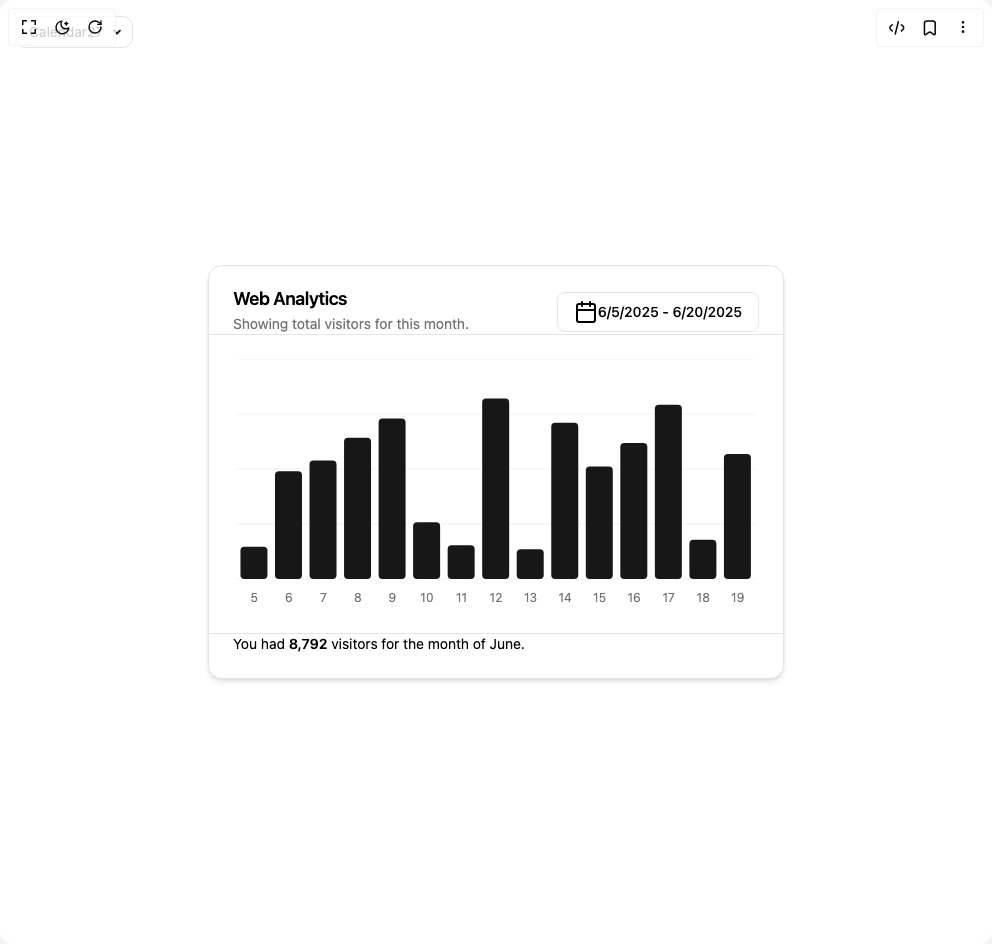

# Build Chart Filter in BuilderStudio

> Build this component in our Agentic IDE: [BuilderStudio](https://builderstudio.dev).
>
> Join the BuilderStudio community on [Discord](https://discord.gg/QdWeSGCqfe) and [Reddit](https://reddit.com/r/builderstudio).



## Component

- Author group: `shadcn`
- Component: `chart-filter`
- Variant: `default`
- Rendered HTML snapshot: [`rendered.html`](rendered.html)

## BuilderStudio prompt

You are implementing a React component based on a component reference.

## Component identity

- Author: shadcn
- Component slug: chart-filter
- Demo slug: default
- Title: chart-filter
- Description: 

## Goal

Recreate this component in a React + TypeScript + Tailwind CSS project. Preserve the visual layout, spacing, colors, border radius, shadows, interaction behavior, animation behavior, responsive behavior, and dark mode behavior shown in the rendered demo.

## Implementation requirements

- Use React and TypeScript.
- Use Tailwind CSS classes whenever possible.
- Keep the component self-contained unless the source files require helper components.
- If the source uses CSS variables, custom CSS, animations, or keyframes, include them.
- If the source uses external packages, list and use the required packages.
- Preserve accessibility attributes, button semantics, links, keyboard behavior, and ARIA attributes when visible in the source.
- Do not replace the component with a simplified placeholder.
- Return complete production-ready code.

## Dependencies

No reference metadata available.

## Rendered DOM snapshot

This is the rendered demo HTML extracted from the live preview. Use it to verify structure, class names, visible content, and layout.

```html
<div id="root"><div class="fixed top-4 left-4 z-10"><select class="appearance-none h-8 max-w-[200px] text-sm leading-tight rounded-lg pl-3 pr-7 py-0 border bg-background focus:outline-none focus:ring-0"><option value="named_Calendar27_Calendar27">Calendar27</option></select><div class="absolute top-1/2 transform -translate-y-1/2 right-2 pointer-events-none"><svg class="w-4 h-4 fill-current" viewBox="0 0 20 20"><path d="M5.516 7.548c.436-.446 1.043-.48 1.576 0L10 10.405l2.908-2.857c.533-.48 1.14-.446 1.576 0 .436.445.408 1.197 0 1.615l-3.734 3.705c-.533.534-1.39.534-1.923 0l-3.734-3.705c-.408-.418-.436-1.17 0-1.615z"></path></svg></div></div><div class="w-screen min-h-screen flex justify-center items-center"><div class="flex flex-col gap-6 rounded-xl border border-neutral-200 dark:border-neutral-800 bg-white dark:bg-black text-black dark:text-white shadow-md transition-colors duration-300 @container/card w-full max-w-xl"><div class="items-start gap-1.5 px-6 pt-6 has-[[data-slot=card-action]]:grid-cols-[1fr_auto] flex flex-col border-b @md/card:grid"><h3 class="text-lg font-semibold leading-none tracking-tight">Web Analytics</h3><p class="text-sm text-neutral-500 dark:text-neutral-400">Showing total visitors for this month.</p><div data-slot="card-action" class="col-start-2 row-span-2 row-start-1 self-center justify-self-end mt-2 @md/card:mt-0"><button class="inline-flex items-center justify-center whitespace-nowrap rounded-md text-sm font-medium ring-offset-background transition-colors focus-visible:outline-none focus-visible:ring-2 focus-visible:ring-ring focus-visible:ring-offset-2 disabled:pointer-events-none disabled:opacity-50 border border-input bg-background hover:bg-accent hover:text-accent-foreground h-10 px-4 py-2" type="button" aria-haspopup="dialog" aria-expanded="false" aria-controls="radix-«r0»" data-state="closed"><svg xmlns="http://www.w3.org/2000/svg" width="24" height="24" viewBox="0 0 24 24" fill="none" stroke="currentColor" stroke-width="2" stroke-linecap="round" stroke-linejoin="round" class="lucide lucide-calendar" aria-hidden="true"><path d="M8 2v4"></path><path d="M16 2v4"></path><rect width="18" height="18" x="3" y="4" rx="2"></rect><path d="M3 10h18"></path></svg>6/5/2025 - 6/20/2025</button></div></div><div class="px-4"><div data-chart="chart-«r1»" class="flex justify-center text-xs [&amp;_.recharts-cartesian-axis-tick_text]:fill-muted-foreground [&amp;_.recharts-cartesian-grid_line[stroke='#ccc']]:stroke-border/50 [&amp;_.recharts-curve.recharts-tooltip-cursor]:stroke-border [&amp;_.recharts-dot[stroke='#fff']]:stroke-transparent [&amp;_.recharts-layer]:outline-none [&amp;_.recharts-polar-grid_[stroke='#ccc']]:stroke-border [&amp;_.recharts-radial-bar-background-sector]:fill-muted [&amp;_.recharts-rectangle.recharts-tooltip-cursor]:fill-muted [&amp;_.recharts-reference-line_[stroke='#ccc']]:stroke-border [&amp;_.recharts-sector[stroke='#fff']]:stroke-transparent [&amp;_.recharts-sector]:outline-none [&amp;_.recharts-surface]:outline-none aspect-auto h-[250px] w-full"><style>
 [data-chart=chart-«r1»] {
  --color-visitors: var(--color-primary);
}


.dark [data-chart=chart-«r1»] {
  --color-visitors: var(--color-primary);
}
</style><div class="recharts-responsive-container" style="width: 100%; height: 100%; min-width: 0px;"><div class="recharts-wrapper" style="position: relative; cursor: default; width: 100%; height: 100%; max-height: 250px; max-width: 542px;"><svg tabindex="0" role="application" class="recharts-surface" width="542" height="250" viewBox="0 0 542 250" style="width: 100%; height: 100%;"><title></title><desc></desc><defs><clipPath id="recharts1-clip"><rect x="12" y="0" height="220" width="518"></rect></clipPath></defs><g class="recharts-cartesian-grid"><g class="recharts-cartesian-grid-horizontal"><line stroke="#ccc" fill="none" x="12" y="0" width="518" height="220" x1="12" y1="220" x2="530" y2="220"></line><line stroke="#ccc" fill="none" x="12" y="0" width="518" height="220" x1="12" y1="165" x2="530" y2="165"></line><line stroke="#ccc" fill="none" x="12" y="0" width="518" height="220" x1="12" y1="110" x2="530" y2="110"></line><line stroke="#ccc" fill="none" x="12" y="0" width="518" height="220" x1="12" y1="55" x2="530" y2="55"></line><line stroke="#ccc" fill="none" x="12" y="0" width="518" height="220" x1="12" y1="0" x2="530" y2="0"></line></g></g><g class="recharts-layer recharts-cartesian-axis recharts-xAxis xAxis"><g class="recharts-cartesian-axis-ticks"><g class="recharts-layer recharts-cartesian-axis-tick"><text orientation="bottom" width="518" height="30" stroke="none" x="29.266666666666666" y="234" class="recharts-text recharts-cartesian-axis-tick-value" text-anchor="middle" fill="#666"><tspan x="29.266666666666666" dy="0.71em">5</tspan></text></g><g class="recharts-layer recharts-cartesian-axis-tick"><text orientation="bottom" width="518" height="30" stroke="none" x="63.8" y="234" class="recharts-text recharts-cartesian-axis-tick-value" text-anchor="middle" fill="#666"><tspan x="63.8" dy="0.71em">6</tspan></text></g><g class="recharts-layer recharts-cartesian-axis-tick"><text orientation="bottom" width="518" height="30" stroke="none" x="98.33333333333333" y="234" class="recharts-text recharts-cartesian-axis-tick-value" text-anchor="middle" fill="#666"><tspan x="98.33333333333333" dy="0.71em">7</tspan></text></g><g class="recharts-layer recharts-cartesian-axis-tick"><text orientation="bottom" width="518" height="30" stroke="none" x="132.86666666666667" y="234" class="recharts-text recharts-cartesian-axis-tick-value" text-anchor="middle" fill="#666"><tspan x="132.86666666666667" dy="0.71em">8</tspan></text></g><g class="recharts-layer recharts-cartesian-axis-tick"><text orientation="bottom" width="518" height="30" stroke="none" x="167.39999999999998" y="234" class="recharts-text recharts-cartesian-axis-tick-value" text-anchor="middle" fill="#666"><tspan x="167.39999999999998" dy="0.71em">9</tspan></text></g><g class="recharts-layer recharts-cartesian-axis-tick"><text orientation="bottom" width="518" height="30" stroke="none" x="201.93333333333334" y="234" class="recharts-text recharts-cartesian-axis-tick-value" text-anchor="middle" fill="#666"><tspan x="201.93333333333334" dy="0.71em">10</tspan></text></g><g class="recharts-layer recharts-cartesian-axis-tick"><text orientation="bottom" width="518" height="30" stroke="none" x="236.46666666666664" y="234" class="recharts-text recharts-cartesian-axis-tick-value" text-anchor="middle" fill="#666"><tspan x="236.46666666666664" dy="0.71em">11</tspan></text></g><g class="recharts-layer recharts-cartesian-axis-tick"><text orientation="bottom" width="518" height="30" stroke="none" x="271" y="234" class="recharts-text recharts-cartesian-axis-tick-value" text-anchor="middle" fill="#666"><tspan x="271" dy="0.71em">12</tspan></text></g><g class="recharts-layer recharts-cartesian-axis-tick"><text orientation="bottom" width="518" height="30" stroke="none" x="305.5333333333333" y="234" class="recharts-text recharts-cartesian-axis-tick-value" text-anchor="middle" fill="#666"><tspan x="305.5333333333333" dy="0.71em">13</tspan></text></g><g class="recharts-layer recharts-cartesian-axis-tick"><text orientation="bottom" width="518" height="30" stroke="none" x="340.0666666666666" y="234" class="recharts-text recharts-cartesian-axis-tick-value" text-anchor="middle" fill="#666"><tspan x="340.0666666666666" dy="0.71em">14</tspan></text></g><g class="recharts-layer recharts-cartesian-axis-tick"><text orientation="bottom" width="518" height="30" stroke="none" x="374.59999999999997" y="234" class="recharts-text recharts-cartesian-axis-tick-value" text-anchor="middle" fill="#666"><tspan x="374.59999999999997" dy="0.71em">15</tspan></text></g><g class="recharts-layer recharts-cartesian-axis-tick"><text orientation="bottom" width="518" height="30" stroke="none" x="409.1333333333333" y="234" class="recharts-text recharts-cartesian-axis-tick-value" text-anchor="middle" fill="#666"><tspan x="409.1333333333333" dy="0.71em">16</tspan></text></g><g class="recharts-layer recharts-cartesian-axis-tick"><text orientation="bottom" width="518" height="30" stroke="none" x="443.66666666666663" y="234" class="recharts-text recharts-cartesian-axis-tick-value" text-anchor="middle" fill="#666"><tspan x="443.66666666666663" dy="0.71em">17</tspan></text></g><g class="recharts-layer recharts-cartesian-axis-tick"><text orientation="bottom" width="518" height="30" stroke="none" x="478.19999999999993" y="234" class="recharts-text recharts-cartesian-axis-tick-value" text-anchor="middle" fill="#666"><tspan x="478.19999999999993" dy="0.71em">18</tspan></text></g><g class="recharts-layer recharts-cartesian-axis-tick"><text orientation="bottom" width="518" height="30" stroke="none" x="512.7333333333333" y="234" class="recharts-text recharts-cartesian-axis-tick-value" text-anchor="middle" fill="#666"><tspan x="512.7333333333333" dy="0.71em">19</tspan></text></g></g></g><g class="recharts-layer recharts-bar"><g class="recharts-layer recharts-bar-rectangles"><g class="recharts-layer"><g class="recharts-layer recharts-bar-rectangle"><path x="15.453333333333333" y="187.73333333333332" width="27" height="32.26666666666668" radius="4" fill="var(--color-visitors)" class="recharts-rectangle" d="M 15.453333333333333,191.73333333333332
            A 4,4,0,0,1,19.453333333333333,187.73333333333332
            L 38.45333333333333,187.73333333333332
            A 4,4,0,0,1,42.45333333333333,191.73333333333332
            L 42.45333333333333,216
            A 4,4,0,0,1,38.45333333333333,220
            L 19.453333333333333,220
            A 4,4,0,0,1,15.453333333333333,216 Z"></path></g><g class="recharts-layer recharts-bar-rectangle"><path x="49.986666666666665" y="112.2" width="27" height="107.8" radius="4" fill="var(--color-visitors)" class="recharts-rectangle" d="M 49.986666666666665,116.2
            A 4,4,0,0,1,53.986666666666665,112.2
            L 72.98666666666666,112.2
            A 4,4,0,0,1,76.98666666666666,116.2
            L 76.98666666666666,216
            A 4,4,0,0,1,72.98666666666666,220
            L 53.986666666666665,220
            A 4,4,0,0,1,49.986666666666665,216 Z"></path></g><g class="recharts-layer recharts-bar-rectangle"><path x="84.52" y="101.56666666666666" width="27" height="118.43333333333334" radius="4" fill="var(--color-visitors)" class="recharts-rectangle" d="M 84.52,105.56666666666666
            A 4,4,0,0,1,88.52,101.56666666666666
            L 107.52,101.56666666666666
            A 4,4,0,0,1,111.52,105.56666666666666
            L 111.52,216
            A 4,4,0,0,1,107.52,220
            L 88.52,220
            A 4,4,0,0,1,84.52,216 Z"></path></g><g class="recharts-layer recharts-bar-rectangle"><path x="119.05333333333333" y="78.83333333333331" width="27" height="141.16666666666669" radius="4" fill="var(--color-visitors)" class="recharts-rectangle" d="M 119.05333333333333,82.83333333333331
            A 4,4,0,0,1,123.05333333333333,78.83333333333331
            L 142.05333333333334,78.83333333333331
            A 4,4,0,0,1,146.05333333333334,82.83333333333331
            L 146.05333333333334,216
            A 4,4,0,0,1,142.05333333333334,220
            L 123.05333333333333,220
            A 4,4,0,0,1,119.05333333333333,216 Z"></path></g><g class="recharts-layer recharts-bar-rectangle"><path x="153.58666666666664" y="59.400000000000006" width="27" height="160.6" radius="4" fill="var(--color-visitors)" class="recharts-rectangle" d="M 153.58666666666664,63.400000000000006
            A 4,4,0,0,1,157.58666666666664,59.400000000000006
            L 176.58666666666664,59.400000000000006
            A 4,4,0,0,1,180.58666666666664,63.400000000000006
            L 180.58666666666664,216
            A 4,4,0,0,1,176.58666666666664,220
            L 157.58666666666664,220
            A 4,4,0,0,1,153.58666666666664,216 Z"></path></g><g class="recharts-layer recharts-bar-rectangle"><path x="188.12" y="163.16666666666669" width="27" height="56.833333333333314" radius="4" fill="var(--color-visitors)" class="recharts-rectangle" d="M 188.12,167.16666666666669
            A 4,4,0,0,1,192.12,163.16666666666669
            L 211.12,163.16666666666669
            A 4,4,0,0,1,215.12,167.16666666666669
            L 215.12,216
            A 4,4,0,0,1,211.12,220
            L 192.12,220
            A 4,4,0,0,1,188.12,216 Z"></path></g><g class="recharts-layer recharts-bar-rectangle"><path x="222.6533333333333" y="186.26666666666668" width="27" height="33.73333333333332" radius="4" fill="var(--color-visitors)" class="recharts-rectangle" d="M 222.6533333333333,190.26666666666668
            A 4,4,0,0,1,226.6533333333333,186.26666666666668
            L 245.6533333333333,186.26666666666668
            A 4,4,0,0,1,249.6533333333333,190.26666666666668
            L 249.6533333333333,216
            A 4,4,0,0,1,245.6533333333333,220
            L 226.6533333333333,220
            A 4,4,0,0,1,222.6533333333333,216 Z"></path></g><g class="recharts-layer recharts-bar-rectangle"><path x="257.18666666666667" y="39.60000000000002" width="27" height="180.39999999999998" radius="4" fill="var(--color-visitors)" class="recharts-rectangle" d="M 257.18666666666667,43.60000000000002
            A 4,4,0,0,1,261.18666666666667,39.60000000000002
            L 280.18666666666667,39.60000000000002
            A 4,4,0,0,1,284.18666666666667,43.60000000000002
            L 284.18666666666667,216
            A 4,4,0,0,1,280.18666666666667,220
            L 261.18666666666667,220
            A 4,4,0,0,1,257.18666666666667,216 Z"></path></g><g class="recharts-layer recharts-bar-rectangle"><path x="291.71999999999997" y="190.3" width="27" height="29.69999999999999" radius="4" fill="var(--color-visitors)" class="recharts-rectangle" d="M 291.71999999999997,194.3
            A 4,4,0,0,1,295.71999999999997,190.3
            L 314.71999999999997,190.3
            A 4,4,0,0,1,318.71999999999997,194.3
            L 318.71999999999997,216
            A 4,4,0,0,1,314.71999999999997,220
            L 295.71999999999997,220
            A 4,4,0,0,1,291.71999999999997,216 Z"></path></g><g class="recharts-layer recharts-bar-rectangle"><path x="326.2533333333333" y="63.80000000000001" width="27" height="156.2" radius="4" fill="var(--color-visitors)" class="recharts-rectangle" d="M 326.2533333333333,67.80000000000001
            A 4,4,0,0,1,330.2533333333333,63.80000000000001
            L 349.2533333333333,63.80000000000001
            A 4,4,0,0,1,353.2533333333333,67.80000000000001
            L 353.2533333333333,216
            A 4,4,0,0,1,349.2533333333333,220
            L 330.2533333333333,220
            A 4,4,0,0,1,326.2533333333333,216 Z"></path></g><g class="recharts-layer recharts-bar-rectangle"><path x="360.78666666666663" y="107.43333333333332" width="27" height="112.56666666666668" radius="4" fill="var(--color-visitors)" class="recharts-rectangle" d="M 360.78666666666663,111.43333333333332
            A 4,4,0,0,1,364.78666666666663,107.43333333333332
            L 383.78666666666663,107.43333333333332
            A 4,4,0,0,1,387.78666666666663,111.43333333333332
            L 387.78666666666663,216
            A 4,4,0,0,1,383.78666666666663,220
            L 364.78666666666663,220
            A 4,4,0,0,1,360.78666666666663,216 Z"></path></g><g class="recharts-layer recharts-bar-rectangle"><path x="395.32" y="83.9666666666667" width="27" height="136.0333333333333" radius="4" fill="var(--color-visitors)" class="recharts-rectangle" d="M 395.32,87.9666666666667
            A 4,4,0,0,1,399.32,83.9666666666667
            L 418.32,83.9666666666667
            A 4,4,0,0,1,422.32,87.9666666666667
            L 422.32,216
            A 4,4,0,0,1,418.32,220
            L 399.32,220
            A 4,4,0,0,1,395.32,216 Z"></path></g><g class="recharts-layer recharts-bar-rectangle"><path x="429.8533333333333" y="45.83333333333334" width="27" height="174.16666666666666" radius="4" fill="var(--color-visitors)" class="recharts-rectangle" d="M 429.8533333333333,49.83333333333334
            A 4,4,0,0,1,433.8533333333333,45.83333333333334
            L 452.8533333333333,45.83333333333334
            A 4,4,0,0,1,456.8533333333333,49.83333333333334
            L 456.8533333333333,216
            A 4,4,0,0,1,452.8533333333333,220
            L 433.8533333333333,220
            A 4,4,0,0,1,429.8533333333333,216 Z"></path></g><g class="recharts-layer recharts-bar-rectangle"><path x="464.3866666666666" y="180.76666666666665" width="27" height="39.23333333333335" radius="4" fill="var(--color-visitors)" class="recharts-rectangle" d="M 464.3866666666666,184.76666666666665
            A 4,4,0,0,1,468.3866666666666,180.76666666666665
            L 487.3866666666666,180.76666666666665
            A 4,4,0,0,1,491.3866666666666,184.76666666666665
            L 491.3866666666666,216
            A 4,4,0,0,1,487.3866666666666,220
            L 468.3866666666666,220
            A 4,4,0,0,1,464.3866666666666,216 Z"></path></g><g class="recharts-layer recharts-bar-rectangle"><path x="498.91999999999996" y="94.96666666666667" width="27" height="125.03333333333333" radius="4" fill="var(--color-visitors)" class="recharts-rectangle" d="M 498.91999999999996,98.96666666666667
            A 4,4,0,0,1,502.91999999999996,94.96666666666667
            L 521.92,94.96666666666667
            A 4,4,0,0,1,525.92,98.96666666666667
            L 525.92,216
            A 4,4,0,0,1,521.92,220
            L 502.91999999999996,220
            A 4,4,0,0,1,498.91999999999996,216 Z"></path></g></g></g><g class="recharts-layer"></g></g></svg><div tabindex="-1" class="recharts-tooltip-wrapper" style="visibility: hidden; pointer-events: none; position: absolute; top: 0px; left: 0px;"></div></div></div></div></div><div class="flex items-center px-6 pb-6 border-t"><div class="text-sm">You had <span class="font-semibold">8,792</span> visitors for the month of June.</div></div></div></div></div>
```

## Reference source files

No reference source files were available.
