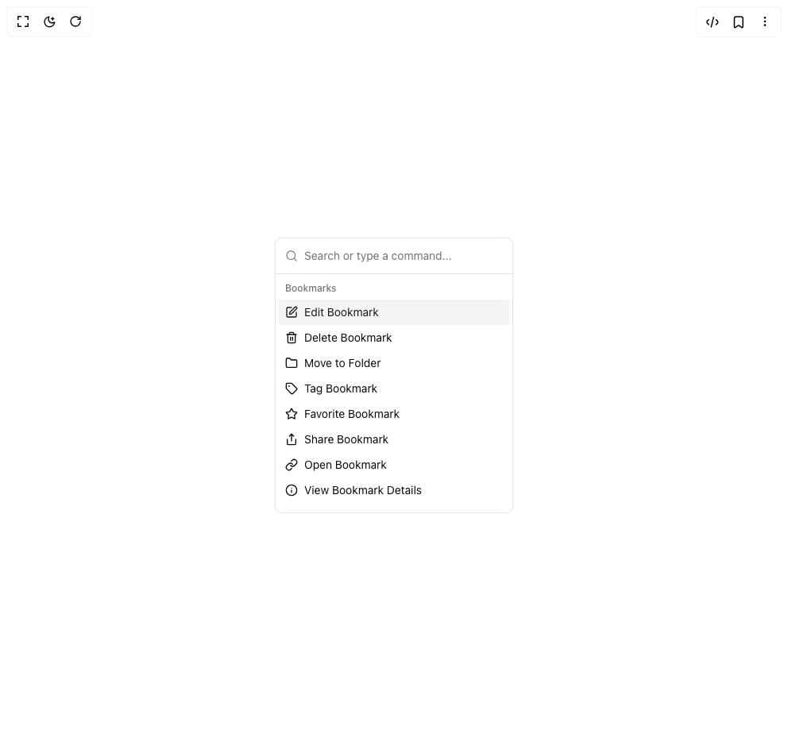

# Build Command in BuilderStudio

> Build this component in our Agentic IDE: [BuilderStudio](https://builderstudio.dev).
>
> Join the BuilderStudio community on [Discord](https://discord.gg/QdWeSGCqfe) and [Reddit](https://reddit.com/r/builderstudio).



## Component

- Author group: `shadcn`
- Component: `command`
- Variant: `dense`
- Rendered HTML snapshot: [`rendered.html`](rendered.html)

## BuilderStudio prompt

You are implementing a React component based on a component reference.

## Component identity

- Author: shadcn
- Component slug: command
- Demo slug: dense
- Title: command
- Description: 

## Goal

Recreate this component in a React + TypeScript + Tailwind CSS project. Preserve the visual layout, spacing, colors, border radius, shadows, interaction behavior, animation behavior, responsive behavior, and dark mode behavior shown in the rendered demo.

## Implementation requirements

- Use React and TypeScript.
- Use Tailwind CSS classes whenever possible.
- Keep the component self-contained unless the source files require helper components.
- If the source uses CSS variables, custom CSS, animations, or keyframes, include them.
- If the source uses external packages, list and use the required packages.
- Preserve accessibility attributes, button semantics, links, keyboard behavior, and ARIA attributes when visible in the source.
- Do not replace the component with a simplified placeholder.
- Return complete production-ready code.

## Dependencies

No reference metadata available.

## Rendered DOM snapshot

This is the rendered demo HTML extracted from the live preview. Use it to verify structure, class names, visible content, and layout.

```html
<div id="root"><div class="relative flex items-center justify-center h-screen w-full m-auto p-16 bg-background text-foreground"><div class="absolute lab-bg inset-0 size-full"><div class="absolute inset-0 bg-[radial-gradient(#00000021_1px,transparent_1px)] dark:bg-[radial-gradient(#ffffff22_1px,transparent_1px)]"></div></div><div class="flex w-full justify-center relative"><div tabindex="-1" class="flex h-full flex-col overflow-hidden text-popover-foreground w-[300px] rounded-lg border bg-background" cmdk-root=""><label cmdk-label="" for="radix-«r2»" id="radix-«r1»" style="position: absolute; width: 1px; height: 1px; padding: 0px; margin: -1px; overflow: hidden; clip: rect(0px, 0px, 0px, 0px); white-space: nowrap; border-width: 0px;"></label><div class="flex items-center border-b px-3" cmdk-input-wrapper=""><svg xmlns="http://www.w3.org/2000/svg" width="24" height="24" viewBox="0 0 24 24" fill="none" stroke="currentColor" stroke-width="2" stroke-linecap="round" stroke-linejoin="round" class="lucide lucide-search mr-2 h-4 w-4 shrink-0 opacity-50" aria-hidden="true"><path d="m21 21-4.34-4.34"></path><circle cx="11" cy="11" r="8"></circle></svg><input class="flex h-11 w-full rounded-md bg-transparent py-3 text-sm outline-none placeholder:text-muted-foreground disabled:cursor-not-allowed disabled:opacity-50" placeholder="Search or type a command..." cmdk-input="" autocomplete="off" autocorrect="off" spellcheck="false" aria-autocomplete="list" role="combobox" aria-expanded="true" aria-controls="radix-«r0»" aria-labelledby="radix-«r1»" id="radix-«r2»" type="text" value=""></div><div class="max-h-[300px] overflow-y-auto overflow-x-hidden" cmdk-list="" role="listbox" tabindex="-1" aria-label="Suggestions" id="radix-«r0»" style="--cmdk-list-height: 916.0px;"><div cmdk-list-sizer=""><div class="overflow-hidden p-1 text-foreground [&amp;_[cmdk-group-heading]]:px-2 [&amp;_[cmdk-group-heading]]:py-1.5 [&amp;_[cmdk-group-heading]]:text-xs [&amp;_[cmdk-group-heading]]:font-medium [&amp;_[cmdk-group-heading]]:text-muted-foreground" cmdk-group="" role="presentation" data-value="Bookmarks"><div cmdk-group-heading="" aria-hidden="true" id="radix-«r4»">Bookmarks</div><div cmdk-group-items="" role="group" aria-labelledby="radix-«r4»"><div class="relative flex cursor-default select-none items-center rounded-sm px-2 py-1.5 text-sm outline-none data-[disabled=true]:pointer-events-none data-[selected='true']:bg-accent data-[selected=true]:text-accent-foreground data-[disabled=true]:opacity-50" id="radix-«r5»" cmdk-item="" role="option" aria-disabled="false" aria-selected="true" data-disabled="false" data-selected="true" data-value="Edit Bookmark"><svg xmlns="http://www.w3.org/2000/svg" width="24" height="24" viewBox="0 0 24 24" fill="none" stroke="currentColor" stroke-width="2" stroke-linecap="round" stroke-linejoin="round" class="lucide lucide-square-pen mr-2 size-4" aria-hidden="true"><path d="M12 3H5a2 2 0 0 0-2 2v14a2 2 0 0 0 2 2h14a2 2 0 0 0 2-2v-7"></path><path d="M18.375 2.625a1 1 0 0 1 3 3l-9.013 9.014a2 2 0 0 1-.853.505l-2.873.84a.5.5 0 0 1-.62-.62l.84-2.873a2 2 0 0 1 .506-.852z"></path></svg><span>Edit Bookmark</span></div><div class="relative flex cursor-default select-none items-center rounded-sm px-2 py-1.5 text-sm outline-none data-[disabled=true]:pointer-events-none data-[selected='true']:bg-accent data-[selected=true]:text-accent-foreground data-[disabled=true]:opacity-50" id="radix-«r6»" cmdk-item="" role="option" aria-disabled="false" aria-selected="false" data-disabled="false" data-selected="false" data-value="Delete Bookmark"><svg xmlns="http://www.w3.org/2000/svg" width="24" height="24" viewBox="0 0 24 24" fill="none" stroke="currentColor" stroke-width="2" stroke-linecap="round" stroke-linejoin="round" class="lucide lucide-trash2 lucide-trash-2 mr-2 size-4" aria-hidden="true"><path d="M10 11v6"></path><path d="M14 11v6"></path><path d="M19 6v14a2 2 0 0 1-2 2H7a2 2 0 0 1-2-2V6"></path><path d="M3 6h18"></path><path d="M8 6V4a2 2 0 0 1 2-2h4a2 2 0 0 1 2 2v2"></path></svg><span>Delete Bookmark</span></div><div class="relative flex cursor-default select-none items-center rounded-sm px-2 py-1.5 text-sm outline-none data-[disabled=true]:pointer-events-none data-[selected='true']:bg-accent data-[selected=true]:text-accent-foreground data-[disabled=true]:opacity-50" id="radix-«r7»" cmdk-item="" role="option" aria-disabled="false" aria-selected="false" data-disabled="false" data-selected="false" data-value="Move to Folder"><svg xmlns="http://www.w3.org/2000/svg" width="24" height="24" viewBox="0 0 24 24" fill="none" stroke="currentColor" stroke-width="2" stroke-linecap="round" stroke-linejoin="round" class="lucide lucide-folder mr-2 size-4" aria-hidden="true"><path d="M20 20a2 2 0 0 0 2-2V8a2 2 0 0 0-2-2h-7.9a2 2 0 0 1-1.69-.9L9.6 3.9A2 2 0 0 0 7.93 3H4a2 2 0 0 0-2 2v13a2 2 0 0 0 2 2Z"></path></svg><span>Move to Folder</span></div><div class="relative flex cursor-default select-none items-center rounded-sm px-2 py-1.5 text-sm outline-none data-[disabled=true]:pointer-events-none data-[selected='true']:bg-accent data-[selected=true]:text-accent-foreground data-[disabled=true]:opacity-50" id="radix-«r8»" cmdk-item="" role="option" aria-disabled="false" aria-selected="false" data-disabled="false" data-selected="false" data-value="Tag Bookmark"><svg xmlns="http://www.w3.org/2000/svg" width="24" height="24" viewBox="0 0 24 24" fill="none" stroke="currentColor" stroke-width="2" stroke-linecap="round" stroke-linejoin="round" class="lucide lucide-tag mr-2 size-4" aria-hidden="true"><path d="M12.586 2.586A2 2 0 0 0 11.172 2H4a2 2 0 0 0-2 2v7.172a2 2 0 0 0 .586 1.414l8.704 8.704a2.426 2.426 0 0 0 3.42 0l6.58-6.58a2.426 2.426 0 0 0 0-3.42z"></path><circle cx="7.5" cy="7.5" r=".5" fill="currentColor"></circle></svg><span>Tag Bookmark</span></div><div class="relative flex cursor-default select-none items-center rounded-sm px-2 py-1.5 text-sm outline-none data-[disabled=true]:pointer-events-none data-[selected='true']:bg-accent data-[selected=true]:text-accent-foreground data-[disabled=true]:opacity-50" id="radix-«r9»" cmdk-item="" role="option" aria-disabled="false" aria-selected="false" data-disabled="false" data-selected="false" data-value="Favorite Bookmark"><svg xmlns="http://www.w3.org/2000/svg" width="24" height="24" viewBox="0 0 24 24" fill="none" stroke="currentColor" stroke-width="2" stroke-linecap="round" stroke-linejoin="round" class="lucide lucide-star mr-2 size-4" aria-hidden="true"><path d="M11.525 2.295a.53.53 0 0 1 .95 0l2.31 4.679a2.123 2.123 0 0 0 1.595 1.16l5.166.756a.53.53 0 0 1 .294.904l-3.736 3.638a2.123 2.123 0 0 0-.611 1.878l.882 5.14a.53.53 0 0 1-.771.56l-4.618-2.428a2.122 2.122 0 0 0-1.973 0L6.396 21.01a.53.53 0 0 1-.77-.56l.881-5.139a2.122 2.122 0 0 0-.611-1.879L2.16 9.795a.53.53 0 0 1 .294-.906l5.165-.755a2.122 2.122 0 0 0 1.597-1.16z"></path></svg><span>Favorite Bookmark</span></div><div class="relative flex cursor-default select-none items-center rounded-sm px-2 py-1.5 text-sm outline-none data-[disabled=true]:pointer-events-none data-[selected='true']:bg-accent data-[selected=true]:text-accent-foreground data-[disabled=true]:opacity-50" id="radix-«ra»" cmdk-item="" role="option" aria-disabled="false" aria-selected="false" data-disabled="false" data-selected="false" data-value="Share Bookmark"><svg xmlns="http://www.w3.org/2000/svg" width="24" height="24" viewBox="0 0 24 24" fill="none" stroke="currentColor" stroke-width="2" stroke-linecap="round" stroke-linejoin="round" class="lucide lucide-share mr-2 size-4" aria-hidden="true"><path d="M12 2v13"></path><path d="m16 6-4-4-4 4"></path><path d="M4 12v8a2 2 0 0 0 2 2h12a2 2 0 0 0 2-2v-8"></path></svg><span>Share Bookmark</span></div><div class="relative flex cursor-default select-none items-center rounded-sm px-2 py-1.5 text-sm outline-none data-[disabled=true]:pointer-events-none data-[selected='true']:bg-accent data-[selected=true]:text-accent-foreground data-[disabled=true]:opacity-50" id="radix-«rb»" cmdk-item="" role="option" aria-disabled="false" aria-selected="false" data-disabled="false" data-selected="false" data-value="Open Bookmark"><svg xmlns="http://www.w3.org/2000/svg" width="24" height="24" viewBox="0 0 24 24" fill="none" stroke="currentColor" stroke-width="2" stroke-linecap="round" stroke-linejoin="round" class="lucide lucide-link mr-2 size-4" aria-hidden="true"><path d="M10 13a5 5 0 0 0 7.54.54l3-3a5 5 0 0 0-7.07-7.07l-1.72 1.71"></path><path d="M14 11a5 5 0 0 0-7.54-.54l-3 3a5 5 0 0 0 7.07 7.07l1.71-1.71"></path></svg><span>Open Bookmark</span></div><div class="relative flex cursor-default select-none items-center rounded-sm px-2 py-1.5 text-sm outline-none data-[disabled=true]:pointer-events-none data-[selected='true']:bg-accent data-[selected=true]:text-accent-foreground data-[disabled=true]:opacity-50" id="radix-«rc»" cmdk-item="" role="option" aria-disabled="false" aria-selected="false" data-disabled="false" data-selected="false" data-value="View Bookmark Details"><svg xmlns="http://www.w3.org/2000/svg" width="24" height="24" viewBox="0 0 24 24" fill="none" stroke="currentColor" stroke-width="2" stroke-linecap="round" stroke-linejoin="round" class="lucide lucide-info mr-2 size-4" aria-hidden="true"><circle cx="12" cy="12" r="10"></circle><path d="M12 16v-4"></path><path d="M12 8h.01"></path></svg><span>View Bookmark Details</span></div></div></div><div class="overflow-hidden p-1 text-foreground [&amp;_[cmdk-group-heading]]:px-2 [&amp;_[cmdk-group-heading]]:py-1.5 [&amp;_[cmdk-group-heading]]:text-xs [&amp;_[cmdk-group-heading]]:font-medium [&amp;_[cmdk-group-heading]]:text-muted-foreground" cmdk-group="" role="presentation" data-value="Folders"><div cmdk-group-heading="" aria-hidden="true" id="radix-«re»">Folders</div><div cmdk-group-items="" role="group" aria-labelledby="radix-«re»"><div class="relative flex cursor-default select-none items-center rounded-sm px-2 py-1.5 text-sm outline-none data-[disabled=true]:pointer-events-none data-[selected='true']:bg-accent data-[selected=true]:text-accent-foreground data-[disabled=true]:opacity-50" id="radix-«rf»" cmdk-item="" role="option" aria-disabled="false" aria-selected="false" data-disabled="false" data-selected="false" data-value="Create Folder"><svg xmlns="http://www.w3.org/2000/svg" width="24" height="24" viewBox="0 0 24 24" fill="none" stroke="currentColor" stroke-width="2" stroke-linecap="round" stroke-linejoin="round" class="lucide lucide-folder-plus mr-2 size-4" aria-hidden="true"><path d="M12 10v6"></path><path d="M9 13h6"></path><path d="M20 20a2 2 0 0 0 2-2V8a2 2 0 0 0-2-2h-7.9a2 2 0 0 1-1.69-.9L9.6 3.9A2 2 0 0 0 7.93 3H4a2 2 0 0 0-2 2v13a2 2 0 0 0 2 2Z"></path></svg><span>Create Folder</span></div><div class="relative flex cursor-default select-none items-center rounded-sm px-2 py-1.5 text-sm outline-none data-[disabled=true]:pointer-events-none data-[selected='true']:bg-accent data-[selected=true]:text-accent-foreground data-[disabled=true]:opacity-50" id="radix-«rg»" cmdk-item="" role="option" aria-disabled="false" aria-selected="false" data-disabled="false" data-selected="false" data-value="Rename Folder"><svg xmlns="http://www.w3.org/2000/svg" width="24" height="24" viewBox="0 0 24 24" fill="none" stroke="currentColor" stroke-width="2" stroke-linecap="round" stroke-linejoin="round" class="lucide lucide-pencil mr-2 size-4" aria-hidden="true"><path d="M21.174 6.812a1 1 0 0 0-3.986-3.987L3.842 16.174a2 2 0 0 0-.5.83l-1.321 4.352a.5.5 0 0 0 .623.622l4.353-1.32a2 2 0 0 0 .83-.497z"></path><path d="m15 5 4 4"></path></svg><span>Rename Folder</span></div><div class="relative flex cursor-default select-none items-center rounded-sm px-2 py-1.5 text-sm outline-none data-[disabled=true]:pointer-events-none data-[selected='true']:bg-accent data-[selected=true]:text-accent-foreground data-[disabled=true]:opacity-50" id="radix-«rh»" cmdk-item="" role="option" aria-disabled="false" aria-selected="false" data-disabled="false" data-selected="false" data-value="Delete Folder"><svg xmlns="http://www.w3.org/2000/svg" width="24" height="24" viewBox="0 0 24 24" fill="none" stroke="currentColor" stroke-width="2" stroke-linecap="round" stroke-linejoin="round" class="lucide lucide-folder-minus mr-2 size-4" aria-hidden="true"><path d="M9 13h6"></path><path d="M20 20a2 2 0 0 0 2-2V8a2 2 0 0 0-2-2h-7.9a2 2 0 0 1-1.69-.9L9.6 3.9A2 2 0 0 0 7.93 3H4a2 2 0 0 0-2 2v13a2 2 0 0 0 2 2Z"></path></svg><span>Delete Folder</span></div><div class="relative flex cursor-default select-none items-center rounded-sm px-2 py-1.5 text-sm outline-none data-[disabled=true]:pointer-events-none data-[selected='true']:bg-accent data-[selected=true]:text-accent-foreground data-[disabled=true]:opacity-50" id="radix-«ri»" cmdk-item="" role="option" aria-disabled="false" aria-selected="false" data-disabled="false" data-selected="false" data-value="View Folder"><svg xmlns="http://www.w3.org/2000/svg" width="24" height="24" viewBox="0 0 24 24" fill="none" stroke="currentColor" stroke-width="2" stroke-linecap="round" stroke-linejoin="round" class="lucide lucide-heart mr-2 size-4" aria-hidden="true"><path d="M2 9.5a5.5 5.5 0 0 1 9.591-3.676.56.56 0 0 0 .818 0A5.49 5.49 0 0 1 22 9.5c0 2.29-1.5 4-3 5.5l-5.492 5.313a2 2 0 0 1-3 .019L5 15c-1.5-1.5-3-3.2-3-5.5"></path></svg><span>View Folder</span></div></div></div><div class="overflow-hidden p-1 text-foreground [&amp;_[cmdk-group-heading]]:px-2 [&amp;_[cmdk-group-heading]]:py-1.5 [&amp;_[cmdk-group-heading]]:text-xs [&amp;_[cmdk-group-heading]]:font-medium [&amp;_[cmdk-group-heading]]:text-muted-foreground" cmdk-group="" role="presentation" data-value="Tags"><div cmdk-group-heading="" aria-hidden="true" id="radix-«rk»">Tags</div><div cmdk-group-items="" role="group" aria-labelledby="radix-«rk»"><div class="relative flex cursor-default select-none items-center rounded-sm px-2 py-1.5 text-sm outline-none data-[disabled=true]:pointer-events-none data-[selected='true']:bg-accent data-[selected=true]:text-accent-foreground data-[disabled=true]:opacity-50" id="radix-«rl»" cmdk-item="" role="option" aria-disabled="false" aria-selected="false" data-disabled="false" data-selected="false" data-value="Manage Tags"><svg xmlns="http://www.w3.org/2000/svg" width="24" height="24" viewBox="0 0 24 24" fill="none" stroke="currentColor" stroke-width="2" stroke-linecap="round" stroke-linejoin="round" class="lucide lucide-bookmark mr-2 size-4" aria-hidden="true"><path d="m19 21-7-4-7 4V5a2 2 0 0 1 2-2h10a2 2 0 0 1 2 2v16z"></path></svg><span>Manage Tags</span></div><div class="relative flex cursor-default select-none items-center rounded-sm px-2 py-1.5 text-sm outline-none data-[disabled=true]:pointer-events-none data-[selected='true']:bg-accent data-[selected=true]:text-accent-foreground data-[disabled=true]:opacity-50" id="radix-«rm»" cmdk-item="" role="option" aria-disabled="false" aria-selected="false" data-disabled="false" data-selected="false" data-value="Search by Tag"><svg xmlns="http://www.w3.org/2000/svg" width="24" height="24" viewBox="0 0 24 24" fill="none" stroke="currentColor" stroke-width="2" stroke-linecap="round" stroke-linejoin="round" class="lucide lucide-search mr-2 size-4" aria-hidden="true"><path d="m21 21-4.34-4.34"></path><circle cx="11" cy="11" r="8"></circle></svg><span>Search by Tag</span></div></div></div><div class="overflow-hidden p-1 text-foreground [&amp;_[cmdk-group-heading]]:px-2 [&amp;_[cmdk-group-heading]]:py-1.5 [&amp;_[cmdk-group-heading]]:text-xs [&amp;_[cmdk-group-heading]]:font-medium [&amp;_[cmdk-group-heading]]:text-muted-foreground" cmdk-group="" role="presentation" data-value="Actions"><div cmdk-group-heading="" aria-hidden="true" id="radix-«ro»">Actions</div><div cmdk-group-items="" role="group" aria-labelledby="radix-«ro»"><div class="relative flex cursor-default select-none items-center rounded-sm px-2 py-1.5 text-sm outline-none data-[disabled=true]:pointer-events-none data-[selected='true']:bg-accent data-[selected=true]:text-accent-foreground data-[disabled=true]:opacity-50" id="radix-«rp»" cmdk-item="" role="option" aria-disabled="false" aria-selected="false" data-disabled="false" data-selected="false" data-value="Open Dashboard⌘D"><svg xmlns="http://www.w3.org/2000/svg" width="24" height="24" viewBox="0 0 24 24" fill="none" stroke="currentColor" stroke-width="2" stroke-linecap="round" stroke-linejoin="round" class="lucide lucide-layout-grid mr-2 size-4" aria-hidden="true"><rect width="7" height="7" x="3" y="3" rx="1"></rect><rect width="7" height="7" x="14" y="3" rx="1"></rect><rect width="7" height="7" x="14" y="14" rx="1"></rect><rect width="7" height="7" x="3" y="14" rx="1"></rect></svg><span>Open Dashboard</span><span class="ml-auto text-xs tracking-widest text-muted-foreground">⌘D</span></div><div class="relative flex cursor-default select-none items-center rounded-sm px-2 py-1.5 text-sm outline-none data-[disabled=true]:pointer-events-none data-[selected='true']:bg-accent data-[selected=true]:text-accent-foreground data-[disabled=true]:opacity-50" id="radix-«rq»" cmdk-item="" role="option" aria-disabled="false" aria-selected="false" data-disabled="false" data-selected="false" data-value="Search Bookmarks⌘B"><svg xmlns="http://www.w3.org/2000/svg" width="24" height="24" viewBox="0 0 24 24" fill="none" stroke="currentColor" stroke-width="2" stroke-linecap="round" stroke-linejoin="round" class="lucide lucide-search mr-2 size-4" aria-hidden="true"><path d="m21 21-4.34-4.34"></path><circle cx="11" cy="11" r="8"></circle></svg><span>Search Bookmarks</span><span class="ml-auto text-xs tracking-widest text-muted-foreground">⌘B</span></div><div class="relative flex cursor-default select-none items-center rounded-sm px-2 py-1.5 text-sm outline-none data-[disabled=true]:pointer-events-none data-[selected='true']:bg-accent data-[selected=true]:text-accent-foreground data-[disabled=true]:opacity-50" id="radix-«rr»" cmdk-item="" role="option" aria-disabled="false" aria-selected="false" data-disabled="false" data-selected="false" data-value="Create New Bookmark⌘N"><svg xmlns="http://www.w3.org/2000/svg" width="24" height="24" viewBox="0 0 24 24" fill="none" stroke="currentColor" stroke-width="2" stroke-linecap="round" stroke-linejoin="round" class="lucide lucide-circle-plus mr-2 size-4" aria-hidden="true"><circle cx="12" cy="12" r="10"></circle><path d="M8 12h8"></path><path d="M12 8v8"></path></svg><span>Create New Bookmark</span><span class="ml-auto text-xs tracking-widest text-muted-foreground">⌘N</span></div><div class="relative flex cursor-default select-none items-center rounded-sm px-2 py-1.5 text-sm outline-none data-[disabled=true]:pointer-events-none data-[selected='true']:bg-accent data-[selected=true]:text-accent-foreground data-[disabled=true]:opacity-50" id="radix-«rs»" cmdk-item="" role="option" aria-disabled="false" aria-selected="false" data-disabled="false" data-selected="false" data-value="Import Bookmarks⌘I"><svg xmlns="http://www.w3.org/2000/svg" width="24" height="24" viewBox="0 0 24 24" fill="none" stroke="currentColor" stroke-width="2" stroke-linecap="round" stroke-linejoin="round" class="lucide lucide-upload mr-2 size-4" aria-hidden="true"><path d="M12 3v12"></path><path d="m17 8-5-5-5 5"></path><path d="M21 15v4a2 2 0 0 1-2 2H5a2 2 0 0 1-2-2v-4"></path></svg><span>Import Bookmarks</span><span class="ml-auto text-xs tracking-widest text-muted-foreground">⌘I</span></div><div class="relative flex cursor-default select-none items-center rounded-sm px-2 py-1.5 text-sm outline-none data-[disabled=true]:pointer-events-none data-[selected='true']:bg-accent data-[selected=true]:text-accent-foreground data-[disabled=true]:opacity-50" id="radix-«rt»" cmdk-item="" role="option" aria-disabled="false" aria-selected="false" data-disabled="false" data-selected="false" data-value="Export Bookmarks⌘E"><svg xmlns="http://www.w3.org/2000/svg" width="24" height="24" viewBox="0 0 24 24" fill="none" stroke="currentColor" stroke-width="2" stroke-linecap="round" stroke-linejoin="round" class="lucide lucide-download mr-2 size-4" aria-hidden="true"><path d="M12 15V3"></path><path d="M21 15v4a2 2 0 0 1-2 2H5a2 2 0 0 1-2-2v-4"></path><path d="m7 10 5 5 5-5"></path></svg><span>Export Bookmarks</span><span class="ml-auto text-xs tracking-widest text-muted-foreground">⌘E</span></div><div class="relative flex cursor-default select-none items-center rounded-sm px-2 py-1.5 text-sm outline-none data-[disabled=true]:pointer-events-none data-[selected='true']:bg-accent data-[selected=true]:text-accent-foreground data-[disabled=true]:opacity-50" id="radix-«ru»" cmdk-item="" role="option" aria-disabled="false" aria-selected="false" data-disabled="false" data-selected="false" data-value="View All Bookmarks⌘V"><svg xmlns="http://www.w3.org/2000/svg" width="24" height="24" viewBox="0 0 24 24" fill="none" stroke="currentColor" stroke-width="2" stroke-linecap="round" stroke-linejoin="round" class="lucide lucide-list mr-2 size-4" aria-hidden="true"><path d="M3 5h.01"></path><path d="M3 12h.01"></path><path d="M3 19h.01"></path><path d="M8 5h13"></path><path d="M8 12h13"></path><path d="M8 19h13"></path></svg><span>View All Bookmarks</span><span class="ml-auto text-xs tracking-widest text-muted-foreground">⌘V</span></div></div></div><div class="overflow-hidden p-1 text-foreground [&amp;_[cmdk-group-heading]]:px-2 [&amp;_[cmdk-group-heading]]:py-1.5 [&amp;_[cmdk-group-heading]]:text-xs [&amp;_[cmdk-group-heading]]:font-medium [&amp;_[cmdk-group-heading]]:text-muted-foreground" cmdk-group="" role="presentation" data-value="Settings"><div cmdk-group-heading="" aria-hidden="true" id="radix-«r10»">Settings</div><div cmdk-group-items="" role="group" aria-labelledby="radix-«r10»"><div class="relative flex cursor-default select-none items-center rounded-sm px-2 py-1.5 text-sm outline-none data-[disabled=true]:pointer-events-none data-[selected='true']:bg-accent data-[selected=true]:text-accent-foreground data-[disabled=true]:opacity-50" id="radix-«r11»" cmdk-item="" role="option" aria-disabled="false" aria-selected="false" data-disabled="false" data-selected="false" data-value="Account Settings⌘P"><svg xmlns="http://www.w3.org/2000/svg" width="24" height="24" viewBox="0 0 24 24" fill="none" stroke="currentColor" stroke-width="2" stroke-linecap="round" stroke-linejoin="round" class="lucide lucide-user mr-2 size-4" aria-hidden="true"><path d="M19 21v-2a4 4 0 0 0-4-4H9a4 4 0 0 0-4 4v2"></path><circle cx="12" cy="7" r="4"></circle></svg><span>Account Settings</span><span class="ml-auto text-xs tracking-widest text-muted-foreground">⌘P</span></div><div class="relative flex cursor-default select-none items-center rounded-sm px-2 py-1.5 text-sm outline-none data-[disabled=true]:pointer-events-none data-[selected='true']:bg-accent data-[selected=true]:text-accent-foreground data-[disabled=true]:opacity-50" id="radix-«r12»" cmdk-item="" role="option" aria-disabled="false" aria-selected="false" data-disabled="false" data-selected="false" data-value="Logout⌘Q"><svg xmlns="http://www.w3.org/2000/svg" width="24" height="24" viewBox="0 0 24 24" fill="none" stroke="currentColor" stroke-width="2" stroke-linecap="round" stroke-linejoin="round" class="lucide lucide-log-out mr-2 size-4" aria-hidden="true"><path d="m16 17 5-5-5-5"></path><path d="M21 12H9"></path><path d="M9 21H5a2 2 0 0 1-2-2V5a2 2 0 0 1 2-2h4"></path></svg><span>Logout</span><span class="ml-auto text-xs tracking-widest text-muted-foreground">⌘Q</span></div><div class="relative flex cursor-default select-none items-center rounded-sm px-2 py-1.5 text-sm outline-none data-[disabled=true]:pointer-events-none data-[selected='true']:bg-accent data-[selected=true]:text-accent-foreground data-[disabled=true]:opacity-50" id="radix-«r13»" cmdk-item="" role="option" aria-disabled="false" aria-selected="false" data-disabled="false" data-selected="false" data-value="Theme Settings⌘T"><svg xmlns="http://www.w3.org/2000/svg" width="24" height="24" viewBox="0 0 24 24" fill="none" stroke="currentColor" stroke-width="2" stroke-linecap="round" stroke-linejoin="round" class="lucide lucide-moon mr-2 size-4" aria-hidden="true"><path d="M20.985 12.486a9 9 0 1 1-9.473-9.472c.405-.022.617.46.402.803a6 6 0 0 0 8.268 8.268c.344-.215.825-.004.803.401"></path></svg><span>Theme Settings</span><span class="ml-auto text-xs tracking-widest text-muted-foreground">⌘T</span></div></div></div></div></div></div></div></div></div>
```

## Reference source files

No reference source files were available.
