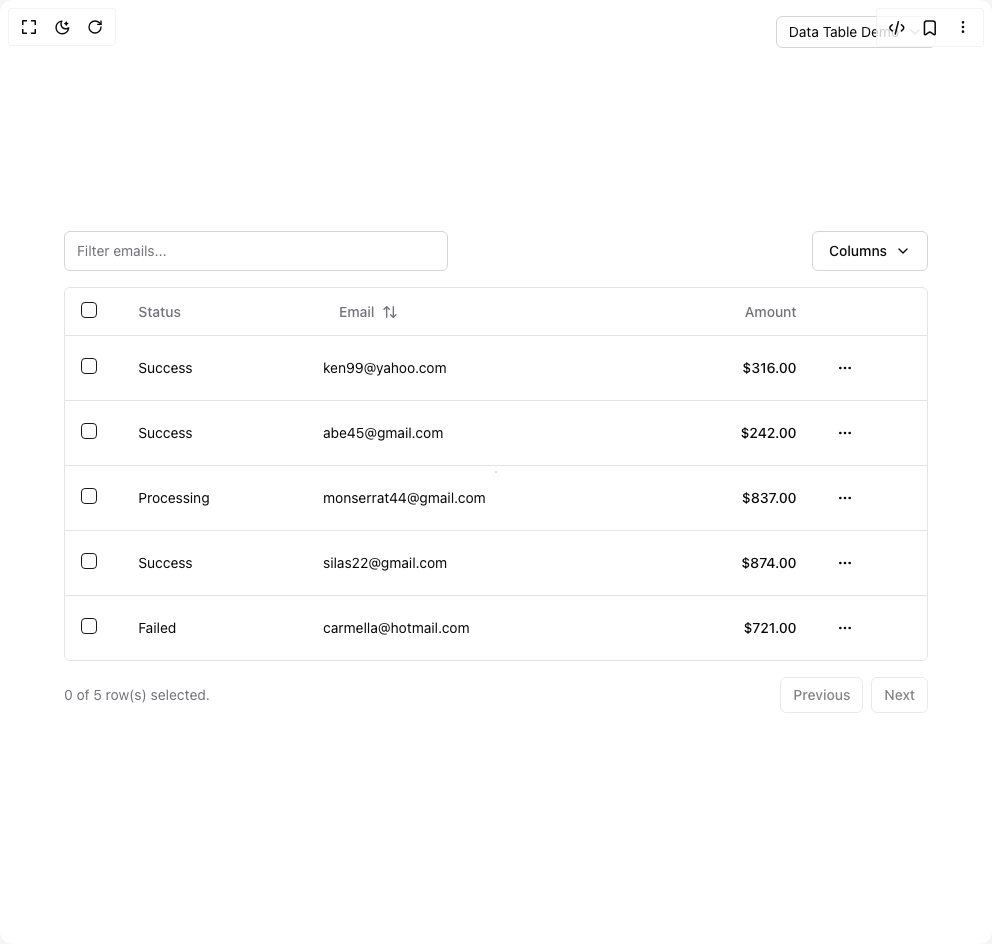

# Build Data Table in BuilderStudio

> Build this component in our Agentic IDE: [BuilderStudio](https://builderstudio.dev).
>
> Join the BuilderStudio community on [Discord](https://discord.gg/QdWeSGCqfe) and [Reddit](https://reddit.com/r/builderstudio).



## Component

- Author group: `shadcn`
- Component: `data-table`
- Variant: `default`
- Rendered HTML snapshot: [`rendered.html`](rendered.html)

## BuilderStudio prompt

You are implementing a React component based on a component reference.

## Component identity

- Author: shadcn
- Component slug: data-table
- Demo slug: default
- Title: data-table
- Description: 

## Goal

Recreate this component in a React + TypeScript + Tailwind CSS project. Preserve the visual layout, spacing, colors, border radius, shadows, interaction behavior, animation behavior, responsive behavior, and dark mode behavior shown in the rendered demo.

## Implementation requirements

- Use React and TypeScript.
- Use Tailwind CSS classes whenever possible.
- Keep the component self-contained unless the source files require helper components.
- If the source uses CSS variables, custom CSS, animations, or keyframes, include them.
- If the source uses external packages, list and use the required packages.
- Preserve accessibility attributes, button semantics, links, keyboard behavior, and ARIA attributes when visible in the source.
- Do not replace the component with a simplified placeholder.
- Return complete production-ready code.

## Dependencies

No reference metadata available.

## Rendered DOM snapshot

This is the rendered demo HTML extracted from the live preview. Use it to verify structure, class names, visible content, and layout.

```html
<div id="root"><div class="relative flex items-center justify-center h-screen w-full m-auto p-16 bg-background text-foreground"><div class="absolute lab-bg inset-0 size-full"><div class="absolute inset-0 bg-[radial-gradient(#00000021_1px,transparent_1px)] dark:bg-[radial-gradient(#ffffff22_1px,transparent_1px)]"></div></div><div class="absolute z-10 top-4 right-14 flex flex-col items-end gap-1"><button type="button" role="combobox" aria-controls="radix-«r0»" aria-expanded="false" aria-autocomplete="none" dir="ltr" data-state="closed" class="flex w-full items-center justify-between rounded-md border border-input bg-background px-3 py-2 text-sm ring-offset-background placeholder:text-muted-foreground focus:outline-none focus:ring-2 focus:ring-ring focus:ring-offset-2 disabled:cursor-not-allowed disabled:opacity-50 [&amp;&gt;span]:line-clamp-1 gap-2 h-8"><span style="pointer-events: none;">Data Table Demo</span><svg xmlns="http://www.w3.org/2000/svg" width="24" height="24" viewBox="0 0 24 24" fill="none" stroke="currentColor" stroke-width="2" stroke-linecap="round" stroke-linejoin="round" class="lucide lucide-chevron-down h-4 w-4 opacity-50" aria-hidden="true"><path d="m6 9 6 6 6-6"></path></svg></button></div><div class="flex w-full justify-center relative"><div class="w-full"><div class="flex items-center py-4"><input class="flex h-10 w-full rounded-md border border-input bg-background px-3 py-2 text-sm ring-offset-background file:border-0 file:bg-transparent file:text-sm file:font-medium file:text-foreground placeholder:text-muted-foreground focus-visible:outline-none focus-visible:ring-2 focus-visible:ring-ring focus-visible:ring-offset-2 disabled:cursor-not-allowed disabled:opacity-50 max-w-sm" placeholder="Filter emails..." value=""><button class="inline-flex items-center justify-center whitespace-nowrap rounded-md text-sm font-medium ring-offset-background transition-colors focus-visible:outline-none focus-visible:ring-2 focus-visible:ring-ring focus-visible:ring-offset-2 disabled:pointer-events-none disabled:opacity-50 border border-input bg-background hover:bg-accent hover:text-accent-foreground h-10 px-4 py-2 ml-auto" type="button" id="radix-«r1»" aria-haspopup="menu" aria-expanded="false" data-state="closed">Columns <svg xmlns="http://www.w3.org/2000/svg" width="24" height="24" viewBox="0 0 24 24" fill="none" stroke="currentColor" stroke-width="2" stroke-linecap="round" stroke-linejoin="round" class="lucide lucide-chevron-down ml-2 h-4 w-4" aria-hidden="true"><path d="m6 9 6 6 6-6"></path></svg></button></div><div class="rounded-md border"><div class="relative w-full overflow-auto"><table class="w-full caption-bottom text-sm"><thead class="[&amp;_tr]:border-b"><tr class="border-b transition-colors hover:bg-muted/50 data-[state=selected]:bg-muted"><th class="h-12 px-4 text-left align-middle font-medium text-muted-foreground [&amp;:has([role=checkbox])]:pr-0"><button type="button" role="checkbox" aria-checked="false" data-state="unchecked" value="on" class="peer h-4 w-4 shrink-0 rounded-sm border border-primary ring-offset-background focus-visible:outline-none focus-visible:ring-2 focus-visible:ring-ring focus-visible:ring-offset-2 disabled:cursor-not-allowed disabled:opacity-50 data-[state=checked]:bg-primary data-[state=checked]:text-primary-foreground" aria-label="Select all"></button></th><th class="h-12 px-4 text-left align-middle font-medium text-muted-foreground [&amp;:has([role=checkbox])]:pr-0">Status</th><th class="h-12 px-4 text-left align-middle font-medium text-muted-foreground [&amp;:has([role=checkbox])]:pr-0"><button class="inline-flex items-center justify-center whitespace-nowrap rounded-md text-sm font-medium ring-offset-background transition-colors focus-visible:outline-none focus-visible:ring-2 focus-visible:ring-ring focus-visible:ring-offset-2 disabled:pointer-events-none disabled:opacity-50 hover:bg-accent hover:text-accent-foreground h-10 px-4 py-2">Email<svg xmlns="http://www.w3.org/2000/svg" width="24" height="24" viewBox="0 0 24 24" fill="none" stroke="currentColor" stroke-width="2" stroke-linecap="round" stroke-linejoin="round" class="lucide lucide-arrow-up-down ml-2 h-4 w-4" aria-hidden="true"><path d="m21 16-4 4-4-4"></path><path d="M17 20V4"></path><path d="m3 8 4-4 4 4"></path><path d="M7 4v16"></path></svg></button></th><th class="h-12 px-4 text-left align-middle font-medium text-muted-foreground [&amp;:has([role=checkbox])]:pr-0"><div class="text-right">Amount</div></th><th class="h-12 px-4 text-left align-middle font-medium text-muted-foreground [&amp;:has([role=checkbox])]:pr-0"></th></tr></thead><tbody class="[&amp;_tr:last-child]:border-0"><tr class="border-b transition-colors hover:bg-muted/50 data-[state=selected]:bg-muted" data-state="false"><td class="p-4 align-middle [&amp;:has([role=checkbox])]:pr-0"><button type="button" role="checkbox" aria-checked="false" data-state="unchecked" value="on" class="peer h-4 w-4 shrink-0 rounded-sm border border-primary ring-offset-background focus-visible:outline-none focus-visible:ring-2 focus-visible:ring-ring focus-visible:ring-offset-2 disabled:cursor-not-allowed disabled:opacity-50 data-[state=checked]:bg-primary data-[state=checked]:text-primary-foreground" aria-label="Select row"></button></td><td class="p-4 align-middle [&amp;:has([role=checkbox])]:pr-0"><div class="capitalize">success</div></td><td class="p-4 align-middle [&amp;:has([role=checkbox])]:pr-0"><div class="lowercase">ken99@yahoo.com</div></td><td class="p-4 align-middle [&amp;:has([role=checkbox])]:pr-0"><div class="text-right font-medium">$316.00</div></td><td class="p-4 align-middle [&amp;:has([role=checkbox])]:pr-0"><button class="inline-flex items-center justify-center whitespace-nowrap rounded-md text-sm font-medium ring-offset-background transition-colors focus-visible:outline-none focus-visible:ring-2 focus-visible:ring-ring focus-visible:ring-offset-2 disabled:pointer-events-none disabled:opacity-50 hover:bg-accent hover:text-accent-foreground h-8 w-8 p-0" type="button" id="radix-«r3»" aria-haspopup="menu" aria-expanded="false" data-state="closed"><span class="sr-only">Open menu</span><svg xmlns="http://www.w3.org/2000/svg" width="24" height="24" viewBox="0 0 24 24" fill="none" stroke="currentColor" stroke-width="2" stroke-linecap="round" stroke-linejoin="round" class="lucide lucide-ellipsis h-4 w-4" aria-hidden="true"><circle cx="12" cy="12" r="1"></circle><circle cx="19" cy="12" r="1"></circle><circle cx="5" cy="12" r="1"></circle></svg></button></td></tr><tr class="border-b transition-colors hover:bg-muted/50 data-[state=selected]:bg-muted" data-state="false"><td class="p-4 align-middle [&amp;:has([role=checkbox])]:pr-0"><button type="button" role="checkbox" aria-checked="false" data-state="unchecked" value="on" class="peer h-4 w-4 shrink-0 rounded-sm border border-primary ring-offset-background focus-visible:outline-none focus-visible:ring-2 focus-visible:ring-ring focus-visible:ring-offset-2 disabled:cursor-not-allowed disabled:opacity-50 data-[state=checked]:bg-primary data-[state=checked]:text-primary-foreground" aria-label="Select row"></button></td><td class="p-4 align-middle [&amp;:has([role=checkbox])]:pr-0"><div class="capitalize">success</div></td><td class="p-4 align-middle [&amp;:has([role=checkbox])]:pr-0"><div class="lowercase">Abe45@gmail.com</div></td><td class="p-4 align-middle [&amp;:has([role=checkbox])]:pr-0"><div class="text-right font-medium">$242.00</div></td><td class="p-4 align-middle [&amp;:has([role=checkbox])]:pr-0"><button class="inline-flex items-center justify-center whitespace-nowrap rounded-md text-sm font-medium ring-offset-background transition-colors focus-visible:outline-none focus-visible:ring-2 focus-visible:ring-ring focus-visible:ring-offset-2 disabled:pointer-events-none disabled:opacity-50 hover:bg-accent hover:text-accent-foreground h-8 w-8 p-0" type="button" id="radix-«r5»" aria-haspopup="menu" aria-expanded="false" data-state="closed"><span class="sr-only">Open menu</span><svg xmlns="http://www.w3.org/2000/svg" width="24" height="24" viewBox="0 0 24 24" fill="none" stroke="currentColor" stroke-width="2" stroke-linecap="round" stroke-linejoin="round" class="lucide lucide-ellipsis h-4 w-4" aria-hidden="true"><circle cx="12" cy="12" r="1"></circle><circle cx="19" cy="12" r="1"></circle><circle cx="5" cy="12" r="1"></circle></svg></button></td></tr><tr class="border-b transition-colors hover:bg-muted/50 data-[state=selected]:bg-muted" data-state="false"><td class="p-4 align-middle [&amp;:has([role=checkbox])]:pr-0"><button type="button" role="checkbox" aria-checked="false" data-state="unchecked" value="on" class="peer h-4 w-4 shrink-0 rounded-sm border border-primary ring-offset-background focus-visible:outline-none focus-visible:ring-2 focus-visible:ring-ring focus-visible:ring-offset-2 disabled:cursor-not-allowed disabled:opacity-50 data-[state=checked]:bg-primary data-[state=checked]:text-primary-foreground" aria-label="Select row"></button></td><td class="p-4 align-middle [&amp;:has([role=checkbox])]:pr-0"><div class="capitalize">processing</div></td><td class="p-4 align-middle [&amp;:has([role=checkbox])]:pr-0"><div class="lowercase">Monserrat44@gmail.com</div></td><td class="p-4 align-middle [&amp;:has([role=checkbox])]:pr-0"><div class="text-right font-medium">$837.00</div></td><td class="p-4 align-middle [&amp;:has([role=checkbox])]:pr-0"><button class="inline-flex items-center justify-center whitespace-nowrap rounded-md text-sm font-medium ring-offset-background transition-colors focus-visible:outline-none focus-visible:ring-2 focus-visible:ring-ring focus-visible:ring-offset-2 disabled:pointer-events-none disabled:opacity-50 hover:bg-accent hover:text-accent-foreground h-8 w-8 p-0" type="button" id="radix-«r7»" aria-haspopup="menu" aria-expanded="false" data-state="closed"><span class="sr-only">Open menu</span><svg xmlns="http://www.w3.org/2000/svg" width="24" height="24" viewBox="0 0 24 24" fill="none" stroke="currentColor" stroke-width="2" stroke-linecap="round" stroke-linejoin="round" class="lucide lucide-ellipsis h-4 w-4" aria-hidden="true"><circle cx="12" cy="12" r="1"></circle><circle cx="19" cy="12" r="1"></circle><circle cx="5" cy="12" r="1"></circle></svg></button></td></tr><tr class="border-b transition-colors hover:bg-muted/50 data-[state=selected]:bg-muted" data-state="false"><td class="p-4 align-middle [&amp;:has([role=checkbox])]:pr-0"><button type="button" role="checkbox" aria-checked="false" data-state="unchecked" value="on" class="peer h-4 w-4 shrink-0 rounded-sm border border-primary ring-offset-background focus-visible:outline-none focus-visible:ring-2 focus-visible:ring-ring focus-visible:ring-offset-2 disabled:cursor-not-allowed disabled:opacity-50 data-[state=checked]:bg-primary data-[state=checked]:text-primary-foreground" aria-label="Select row"></button></td><td class="p-4 align-middle [&amp;:has([role=checkbox])]:pr-0"><div class="capitalize">success</div></td><td class="p-4 align-middle [&amp;:has([role=checkbox])]:pr-0"><div class="lowercase">Silas22@gmail.com</div></td><td class="p-4 align-middle [&amp;:has([role=checkbox])]:pr-0"><div class="text-right font-medium">$874.00</div></td><td class="p-4 align-middle [&amp;:has([role=checkbox])]:pr-0"><button class="inline-flex items-center justify-center whitespace-nowrap rounded-md text-sm font-medium ring-offset-background transition-colors focus-visible:outline-none focus-visible:ring-2 focus-visible:ring-ring focus-visible:ring-offset-2 disabled:pointer-events-none disabled:opacity-50 hover:bg-accent hover:text-accent-foreground h-8 w-8 p-0" type="button" id="radix-«r9»" aria-haspopup="menu" aria-expanded="false" data-state="closed"><span class="sr-only">Open menu</span><svg xmlns="http://www.w3.org/2000/svg" width="24" height="24" viewBox="0 0 24 24" fill="none" stroke="currentColor" stroke-width="2" stroke-linecap="round" stroke-linejoin="round" class="lucide lucide-ellipsis h-4 w-4" aria-hidden="true"><circle cx="12" cy="12" r="1"></circle><circle cx="19" cy="12" r="1"></circle><circle cx="5" cy="12" r="1"></circle></svg></button></td></tr><tr class="border-b transition-colors hover:bg-muted/50 data-[state=selected]:bg-muted" data-state="false"><td class="p-4 align-middle [&amp;:has([role=checkbox])]:pr-0"><button type="button" role="checkbox" aria-checked="false" data-state="unchecked" value="on" class="peer h-4 w-4 shrink-0 rounded-sm border border-primary ring-offset-background focus-visible:outline-none focus-visible:ring-2 focus-visible:ring-ring focus-visible:ring-offset-2 disabled:cursor-not-allowed disabled:opacity-50 data-[state=checked]:bg-primary data-[state=checked]:text-primary-foreground" aria-label="Select row"></button></td><td class="p-4 align-middle [&amp;:has([role=checkbox])]:pr-0"><div class="capitalize">failed</div></td><td class="p-4 align-middle [&amp;:has([role=checkbox])]:pr-0"><div class="lowercase">carmella@hotmail.com</div></td><td class="p-4 align-middle [&amp;:has([role=checkbox])]:pr-0"><div class="text-right font-medium">$721.00</div></td><td class="p-4 align-middle [&amp;:has([role=checkbox])]:pr-0"><button class="inline-flex items-center justify-center whitespace-nowrap rounded-md text-sm font-medium ring-offset-background transition-colors focus-visible:outline-none focus-visible:ring-2 focus-visible:ring-ring focus-visible:ring-offset-2 disabled:pointer-events-none disabled:opacity-50 hover:bg-accent hover:text-accent-foreground h-8 w-8 p-0" type="button" id="radix-«rb»" aria-haspopup="menu" aria-expanded="false" data-state="closed"><span class="sr-only">Open menu</span><svg xmlns="http://www.w3.org/2000/svg" width="24" height="24" viewBox="0 0 24 24" fill="none" stroke="currentColor" stroke-width="2" stroke-linecap="round" stroke-linejoin="round" class="lucide lucide-ellipsis h-4 w-4" aria-hidden="true"><circle cx="12" cy="12" r="1"></circle><circle cx="19" cy="12" r="1"></circle><circle cx="5" cy="12" r="1"></circle></svg></button></td></tr></tbody></table></div></div><div class="flex items-center justify-end space-x-2 py-4"><div class="flex-1 text-sm text-muted-foreground">0 of 5 row(s) selected.</div><div class="space-x-2"><button class="inline-flex items-center justify-center whitespace-nowrap text-sm font-medium ring-offset-background transition-colors focus-visible:outline-none focus-visible:ring-2 focus-visible:ring-ring focus-visible:ring-offset-2 disabled:pointer-events-none disabled:opacity-50 border border-input bg-background hover:bg-accent hover:text-accent-foreground h-9 rounded-md px-3" disabled="">Previous</button><button class="inline-flex items-center justify-center whitespace-nowrap text-sm font-medium ring-offset-background transition-colors focus-visible:outline-none focus-visible:ring-2 focus-visible:ring-ring focus-visible:ring-offset-2 disabled:pointer-events-none disabled:opacity-50 border border-input bg-background hover:bg-accent hover:text-accent-foreground h-9 rounded-md px-3" disabled="">Next</button></div></div></div></div></div></div>
```

## Reference source files

No reference source files were available.
