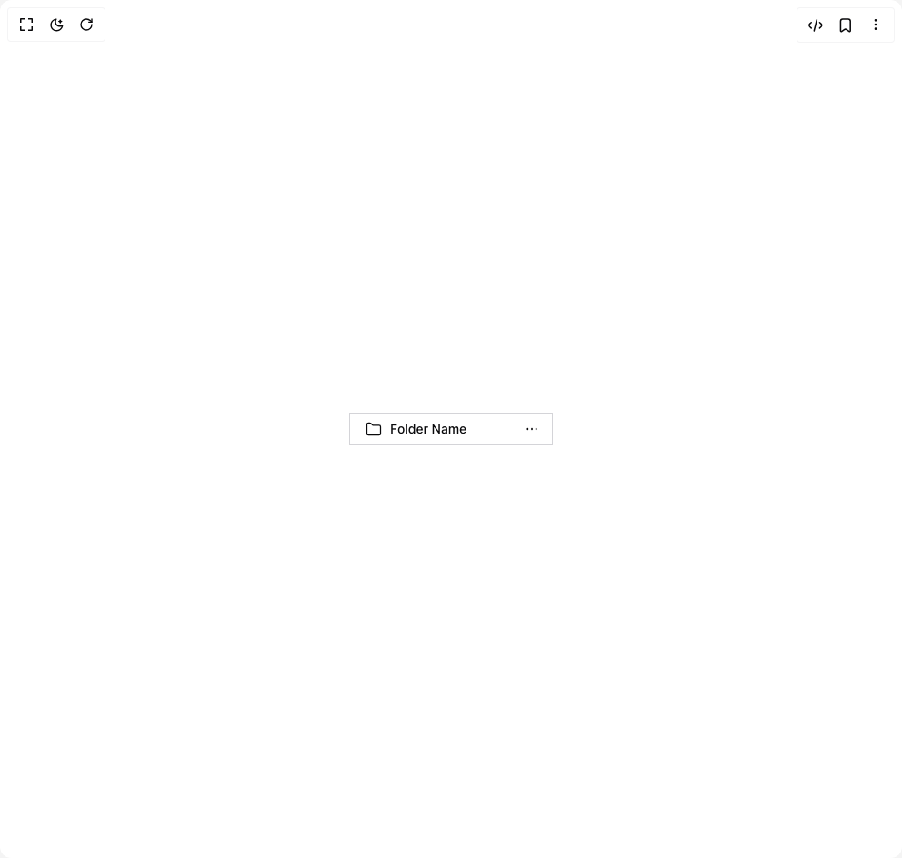

# Build Dropdown Menu in BuilderStudio

> Build this component in our Agentic IDE: [BuilderStudio](https://builderstudio.dev).
>
> Join the BuilderStudio community on [Discord](https://discord.gg/QdWeSGCqfe) and [Reddit](https://reddit.com/r/builderstudio).



## Component

- Author group: `shadcn`
- Component: `dropdown-menu`
- Variant: `folder`
- Rendered HTML snapshot: [`rendered.html`](rendered.html)

## BuilderStudio prompt

You are implementing a React component based on a component reference.

## Component identity

- Author: shadcn
- Component slug: dropdown-menu
- Demo slug: folder
- Title: dropdown-menu
- Description: 

## Goal

Recreate this component in a React + TypeScript + Tailwind CSS project. Preserve the visual layout, spacing, colors, border radius, shadows, interaction behavior, animation behavior, responsive behavior, and dark mode behavior shown in the rendered demo.

## Implementation requirements

- Use React and TypeScript.
- Use Tailwind CSS classes whenever possible.
- Keep the component self-contained unless the source files require helper components.
- If the source uses CSS variables, custom CSS, animations, or keyframes, include them.
- If the source uses external packages, list and use the required packages.
- Preserve accessibility attributes, button semantics, links, keyboard behavior, and ARIA attributes when visible in the source.
- Do not replace the component with a simplified placeholder.
- Return complete production-ready code.

## Dependencies

No reference metadata available.

## Rendered DOM snapshot

This is the rendered demo HTML extracted from the live preview. Use it to verify structure, class names, visible content, and layout.

```html
<div id="root"><div class="relative flex items-center justify-center h-screen w-full m-auto p-16 bg-background text-foreground"><div class="absolute lab-bg inset-0 size-full"><div class="absolute inset-0 bg-[radial-gradient(#00000021_1px,transparent_1px)] dark:bg-[radial-gradient(#ffffff22_1px,transparent_1px)]"></div></div><div class="flex w-full justify-center relative"><button class="inline-flex items-center whitespace-nowrap rounded-lg text-sm font-medium transition-colors outline-offset-2 focus-visible:outline-2 focus-visible:outline-ring/70 disabled:pointer-events-none disabled:opacity-50 [&amp;_svg]:pointer-events-none [&amp;_svg]:shrink-0 border border-input bg-background shadow-sm shadow-black/5 hover:bg-accent hover:text-accent-foreground h-9 px-4 py-2 w-56 justify-between" type="button" id="radix-«r0»" aria-haspopup="menu" aria-expanded="false" data-state="closed"><span class="flex items-center gap-2"><svg width="24" height="24" fill="none" stroke="currentColor" stroke-width="1.5" viewBox="0 0 24 24" stroke-linecap="round" stroke-linejoin="round" xmlns="http://www.w3.org/2000/svg" class="size-5"><path d="M3 6a2 2 0 0 1 2-2h1.745a2 2 0 0 1 1.322.5l2.272 2a2 2 0 0 0 1.322.5H19a2 2 0 0 1 2 2v9a2 2 0 0 1-2 2H5a2 2 0 0 1-2-2z"></path></svg>Folder Name</span><svg width="24" height="24" fill="none" stroke="currentColor" stroke-width="1.5" viewBox="0 0 24 24" stroke-linecap="round" stroke-linejoin="round" xmlns="http://www.w3.org/2000/svg" class="-mr-2 ml-2 size-7"><path d="M12 12.25v-.5m4 .5v-.5m-8 .5v-.5"></path></svg></button></div></div></div>
```

## Reference source files

No reference source files were available.
