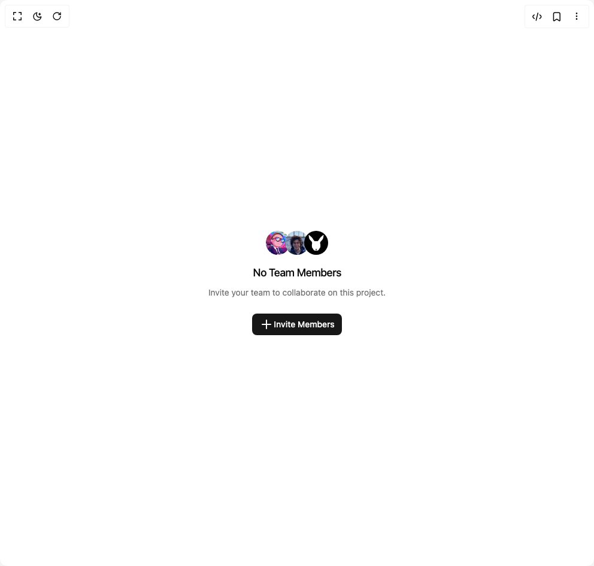

# Build Empty in BuilderStudio

> Build this component in our Agentic IDE: [BuilderStudio](https://builderstudio.dev).
>
> Join the BuilderStudio community on [Discord](https://discord.gg/QdWeSGCqfe) and [Reddit](https://reddit.com/r/builderstudio).



## Component

- Author group: `shadcn`
- Component: `empty`
- Variant: `avatar-group`
- Rendered HTML snapshot: [`rendered.html`](rendered.html)

## BuilderStudio prompt

You are implementing a React component based on a component reference.

## Component identity

- Author: shadcn
- Component slug: empty
- Demo slug: avatar-group
- Title: empty
- Description: 

## Goal

Recreate this component in a React + TypeScript + Tailwind CSS project. Preserve the visual layout, spacing, colors, border radius, shadows, interaction behavior, animation behavior, responsive behavior, and dark mode behavior shown in the rendered demo.

## Implementation requirements

- Use React and TypeScript.
- Use Tailwind CSS classes whenever possible.
- Keep the component self-contained unless the source files require helper components.
- If the source uses CSS variables, custom CSS, animations, or keyframes, include them.
- If the source uses external packages, list and use the required packages.
- Preserve accessibility attributes, button semantics, links, keyboard behavior, and ARIA attributes when visible in the source.
- Do not replace the component with a simplified placeholder.
- Return complete production-ready code.

## Dependencies

No reference metadata available.

## Rendered DOM snapshot

This is the rendered demo HTML extracted from the live preview. Use it to verify structure, class names, visible content, and layout.

```html
<div id="root"><div class="w-screen min-h-screen flex justify-center items-center"><div class="w-screen min-h-screen flex justify-center items-center"><div data-slot="empty" class="flex min-w-0 flex-1 flex-col items-center justify-center gap-6 rounded-lg border-dashed p-6 text-center text-balance md:p-12"><div data-slot="empty-header" class="flex max-w-sm flex-col items-center gap-2 text-center"><div data-slot="empty-icon" data-variant="default" class="flex shrink-0 items-center justify-center mb-2 [&amp;_svg]:pointer-events-none [&amp;_svg]:shrink-0 bg-transparent"><div class="*:data-[slot=avatar]:ring-background flex -space-x-2 *:data-[slot=avatar]:size-12 *:data-[slot=avatar]:ring-2 *:data-[slot=avatar]:grayscale"><span class="relative flex h-10 w-10 shrink-0 overflow-hidden rounded-full"></span><span class="relative flex h-10 w-10 shrink-0 overflow-hidden rounded-full"></span><span class="relative flex h-10 w-10 shrink-0 overflow-hidden rounded-full"></span></div></div><div data-slot="empty-title" class="text-lg font-medium tracking-tight">No Team Members</div><div data-slot="empty-description" class="text-muted-foreground [&amp;&gt;a:hover]:text-primary text-sm/relaxed [&amp;&gt;a]:underline [&amp;&gt;a]:underline-offset-4">Invite your team to collaborate on this project.</div></div><div data-slot="empty-content" class="flex w-full max-w-sm min-w-0 flex-col items-center gap-4 text-sm text-balance"><button class="inline-flex items-center justify-center whitespace-nowrap text-sm font-medium ring-offset-background transition-colors focus-visible:outline-none focus-visible:ring-2 focus-visible:ring-ring focus-visible:ring-offset-2 disabled:pointer-events-none disabled:opacity-50 bg-primary text-primary-foreground hover:bg-primary/90 h-9 rounded-md px-3"><svg xmlns="http://www.w3.org/2000/svg" width="24" height="24" viewBox="0 0 24 24" fill="none" stroke="currentColor" stroke-width="2" stroke-linecap="round" stroke-linejoin="round" class="lucide lucide-plus" aria-hidden="true"><path d="M5 12h14"></path><path d="M12 5v14"></path></svg>Invite Members</button></div></div></div></div></div>
```

## Reference source files

No reference source files were available.
