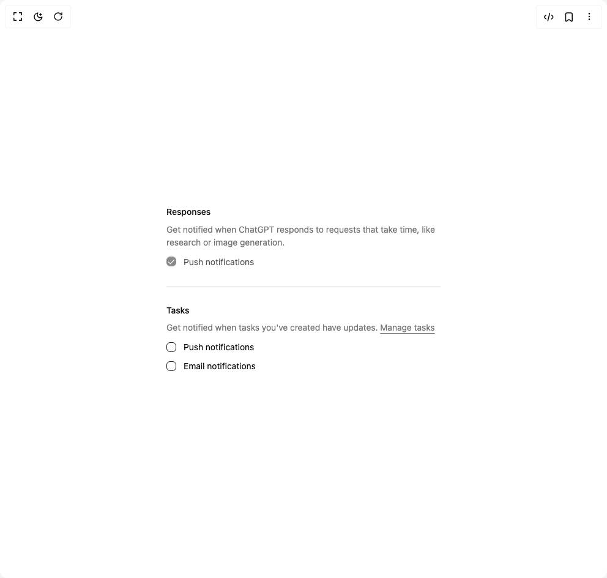

# Build Field 1 in BuilderStudio

> Build this component in our Agentic IDE: [BuilderStudio](https://builderstudio.dev).
>
> Join the BuilderStudio community on [Discord](https://discord.gg/QdWeSGCqfe) and [Reddit](https://reddit.com/r/builderstudio).



## Component

- Author group: `shadcn`
- Component: `field-1`
- Variant: `field-group`
- Rendered HTML snapshot: [`rendered.html`](rendered.html)

## BuilderStudio prompt

You are implementing a React component based on a component reference.

## Component identity

- Author: shadcn
- Component slug: field-1
- Demo slug: field-group
- Title: field-1
- Description: 

## Goal

Recreate this component in a React + TypeScript + Tailwind CSS project. Preserve the visual layout, spacing, colors, border radius, shadows, interaction behavior, animation behavior, responsive behavior, and dark mode behavior shown in the rendered demo.

## Implementation requirements

- Use React and TypeScript.
- Use Tailwind CSS classes whenever possible.
- Keep the component self-contained unless the source files require helper components.
- If the source uses CSS variables, custom CSS, animations, or keyframes, include them.
- If the source uses external packages, list and use the required packages.
- Preserve accessibility attributes, button semantics, links, keyboard behavior, and ARIA attributes when visible in the source.
- Do not replace the component with a simplified placeholder.
- Return complete production-ready code.

## Dependencies

No reference metadata available.

## Rendered DOM snapshot

This is the rendered demo HTML extracted from the live preview. Use it to verify structure, class names, visible content, and layout.

```html
<div id="root"><div class="w-screen min-h-screen flex justify-center items-center"><div class="w-screen min-h-screen flex justify-center items-center"><div class="w-full max-w-md"><div data-slot="field-group" class="group/field-group @container/field-group flex w-full flex-col gap-7 data-[slot=checkbox-group]:gap-3 [&amp;&gt;[data-slot=field-group]]:gap-4"><fieldset data-slot="field-set" class="flex flex-col gap-6 has-[&gt;[data-slot=checkbox-group]]:gap-3 has-[&gt;[data-slot=radio-group]]:gap-3"><label class="text-sm font-medium peer-disabled:cursor-not-allowed peer-disabled:opacity-70 group/field-label peer/field-label flex w-fit gap-2 leading-snug group-data-[disabled=true]/field:opacity-50 has-[&gt;[data-slot=field]]:w-full has-[&gt;[data-slot=field]]:flex-col has-[&gt;[data-slot=field]]:rounded-md has-[&gt;[data-slot=field]]:border [&amp;&gt;*]:data-[slot=field]:p-4 has-data-[state=checked]:bg-primary/5 has-data-[state=checked]:border-primary dark:has-data-[state=checked]:bg-primary/10" data-slot="field-label">Responses</label><p data-slot="field-description" class="text-muted-foreground text-sm leading-normal font-normal group-has-[[data-orientation=horizontal]]/field:text-balance last:mt-0 nth-last-2:-mt-1 [[data-variant=legend]+&amp;]:-mt-1.5 [&amp;&gt;a:hover]:text-primary [&amp;&gt;a]:underline [&amp;&gt;a]:underline-offset-4">Get notified when ChatGPT responds to requests that take time, like research or image generation.</p><div data-slot="checkbox-group" class="group/field-group @container/field-group flex w-full flex-col gap-7 data-[slot=checkbox-group]:gap-3 [&amp;&gt;[data-slot=field-group]]:gap-4"><div role="group" data-slot="field" data-orientation="horizontal" class="group/field flex w-full gap-3 data-[invalid=true]:text-destructive flex-row items-center [&amp;&gt;[data-slot=field-label]]:flex-auto has-[&gt;[data-slot=field-content]]:items-start has-[&gt;[data-slot=field-content]]:[&amp;&gt;[role=checkbox],[role=radio]]:mt-px"><button type="button" role="checkbox" aria-checked="true" data-state="checked" data-disabled="" disabled="" value="on" class="peer h-4 w-4 shrink-0 rounded-sm border border-primary ring-offset-background focus-visible:outline-none focus-visible:ring-2 focus-visible:ring-ring focus-visible:ring-offset-2 disabled:cursor-not-allowed disabled:opacity-50 data-[state=checked]:bg-primary data-[state=checked]:text-primary-foreground" id="push"><span data-state="checked" data-disabled="" class="flex items-center justify-center text-current" style="pointer-events: none;"><svg xmlns="http://www.w3.org/2000/svg" width="24" height="24" viewBox="0 0 24 24" fill="none" stroke="currentColor" stroke-width="2" stroke-linecap="round" stroke-linejoin="round" class="lucide lucide-check h-4 w-4" aria-hidden="true"><path d="M20 6 9 17l-5-5"></path></svg></span></button><label class="text-sm peer-disabled:cursor-not-allowed peer-disabled:opacity-70 group/field-label peer/field-label flex w-fit gap-2 leading-snug group-data-[disabled=true]/field:opacity-50 has-[&gt;[data-slot=field]]:w-full has-[&gt;[data-slot=field]]:flex-col has-[&gt;[data-slot=field]]:rounded-md has-[&gt;[data-slot=field]]:border [&amp;&gt;*]:data-[slot=field]:p-4 has-data-[state=checked]:bg-primary/5 has-data-[state=checked]:border-primary dark:has-data-[state=checked]:bg-primary/10 font-normal" data-slot="field-label" for="push">Push notifications</label></div></div></fieldset><div data-slot="field-separator" data-content="false" class="relative -my-2 h-5 text-sm group-data-[variant=outline]/field-group:-mb-2"><div data-orientation="horizontal" role="none" class="shrink-0 bg-border h-[1px] w-full absolute inset-0 top-1/2"></div></div><fieldset data-slot="field-set" class="flex flex-col gap-6 has-[&gt;[data-slot=checkbox-group]]:gap-3 has-[&gt;[data-slot=radio-group]]:gap-3"><label class="text-sm font-medium peer-disabled:cursor-not-allowed peer-disabled:opacity-70 group/field-label peer/field-label flex w-fit gap-2 leading-snug group-data-[disabled=true]/field:opacity-50 has-[&gt;[data-slot=field]]:w-full has-[&gt;[data-slot=field]]:flex-col has-[&gt;[data-slot=field]]:rounded-md has-[&gt;[data-slot=field]]:border [&amp;&gt;*]:data-[slot=field]:p-4 has-data-[state=checked]:bg-primary/5 has-data-[state=checked]:border-primary dark:has-data-[state=checked]:bg-primary/10" data-slot="field-label">Tasks</label><p data-slot="field-description" class="text-muted-foreground text-sm leading-normal font-normal group-has-[[data-orientation=horizontal]]/field:text-balance last:mt-0 nth-last-2:-mt-1 [[data-variant=legend]+&amp;]:-mt-1.5 [&amp;&gt;a:hover]:text-primary [&amp;&gt;a]:underline [&amp;&gt;a]:underline-offset-4">Get notified when tasks you've created have updates. <a href="#">Manage tasks</a></p><div data-slot="checkbox-group" class="group/field-group @container/field-group flex w-full flex-col gap-7 data-[slot=checkbox-group]:gap-3 [&amp;&gt;[data-slot=field-group]]:gap-4"><div role="group" data-slot="field" data-orientation="horizontal" class="group/field flex w-full gap-3 data-[invalid=true]:text-destructive flex-row items-center [&amp;&gt;[data-slot=field-label]]:flex-auto has-[&gt;[data-slot=field-content]]:items-start has-[&gt;[data-slot=field-content]]:[&amp;&gt;[role=checkbox],[role=radio]]:mt-px"><button type="button" role="checkbox" aria-checked="false" data-state="unchecked" value="on" class="peer h-4 w-4 shrink-0 rounded-sm border border-primary ring-offset-background focus-visible:outline-none focus-visible:ring-2 focus-visible:ring-ring focus-visible:ring-offset-2 disabled:cursor-not-allowed disabled:opacity-50 data-[state=checked]:bg-primary data-[state=checked]:text-primary-foreground" id="push-tasks"></button><label class="text-sm peer-disabled:cursor-not-allowed peer-disabled:opacity-70 group/field-label peer/field-label flex w-fit gap-2 leading-snug group-data-[disabled=true]/field:opacity-50 has-[&gt;[data-slot=field]]:w-full has-[&gt;[data-slot=field]]:flex-col has-[&gt;[data-slot=field]]:rounded-md has-[&gt;[data-slot=field]]:border [&amp;&gt;*]:data-[slot=field]:p-4 has-data-[state=checked]:bg-primary/5 has-data-[state=checked]:border-primary dark:has-data-[state=checked]:bg-primary/10 font-normal" data-slot="field-label" for="push-tasks">Push notifications</label></div><div role="group" data-slot="field" data-orientation="horizontal" class="group/field flex w-full gap-3 data-[invalid=true]:text-destructive flex-row items-center [&amp;&gt;[data-slot=field-label]]:flex-auto has-[&gt;[data-slot=field-content]]:items-start has-[&gt;[data-slot=field-content]]:[&amp;&gt;[role=checkbox],[role=radio]]:mt-px"><button type="button" role="checkbox" aria-checked="false" data-state="unchecked" value="on" class="peer h-4 w-4 shrink-0 rounded-sm border border-primary ring-offset-background focus-visible:outline-none focus-visible:ring-2 focus-visible:ring-ring focus-visible:ring-offset-2 disabled:cursor-not-allowed disabled:opacity-50 data-[state=checked]:bg-primary data-[state=checked]:text-primary-foreground" id="email-tasks"></button><label class="text-sm peer-disabled:cursor-not-allowed peer-disabled:opacity-70 group/field-label peer/field-label flex w-fit gap-2 leading-snug group-data-[disabled=true]/field:opacity-50 has-[&gt;[data-slot=field]]:w-full has-[&gt;[data-slot=field]]:flex-col has-[&gt;[data-slot=field]]:rounded-md has-[&gt;[data-slot=field]]:border [&amp;&gt;*]:data-[slot=field]:p-4 has-data-[state=checked]:bg-primary/5 has-data-[state=checked]:border-primary dark:has-data-[state=checked]:bg-primary/10 font-normal" data-slot="field-label" for="email-tasks">Email notifications</label></div></div></fieldset></div></div></div></div></div>
```

## Reference source files

No reference source files were available.
