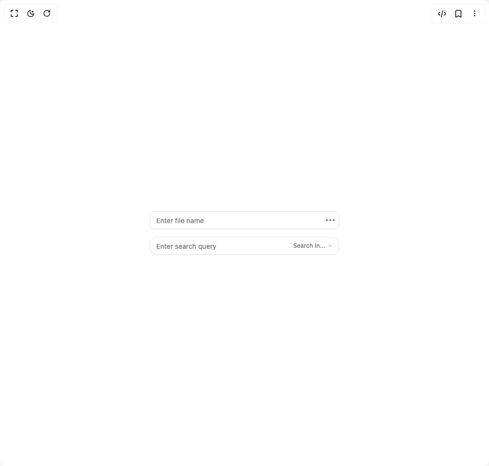

# Build Input Group in BuilderStudio

> Build this component in our Agentic IDE: [BuilderStudio](https://builderstudio.dev).
>
> Join the BuilderStudio community on [Discord](https://discord.gg/QdWeSGCqfe) and [Reddit](https://reddit.com/r/builderstudio).



## Component

- Author group: `shadcn`
- Component: `input-group`
- Variant: `dropdown`
- Rendered HTML snapshot: [`rendered.html`](rendered.html)

## BuilderStudio prompt

You are implementing a React component based on a component reference.

## Component identity

- Author: shadcn
- Component slug: input-group
- Demo slug: dropdown
- Title: input-group
- Description: 

## Goal

Recreate this component in a React + TypeScript + Tailwind CSS project. Preserve the visual layout, spacing, colors, border radius, shadows, interaction behavior, animation behavior, responsive behavior, and dark mode behavior shown in the rendered demo.

## Implementation requirements

- Use React and TypeScript.
- Use Tailwind CSS classes whenever possible.
- Keep the component self-contained unless the source files require helper components.
- If the source uses CSS variables, custom CSS, animations, or keyframes, include them.
- If the source uses external packages, list and use the required packages.
- Preserve accessibility attributes, button semantics, links, keyboard behavior, and ARIA attributes when visible in the source.
- Do not replace the component with a simplified placeholder.
- Return complete production-ready code.

## Dependencies

No reference metadata available.

## Rendered DOM snapshot

This is the rendered demo HTML extracted from the live preview. Use it to verify structure, class names, visible content, and layout.

```html
<div id="root"><div class="w-screen min-h-screen flex justify-center items-center"><div class="w-screen min-h-screen flex justify-center items-center"><div class="grid w-full max-w-sm gap-4"><div data-slot="input-group" role="group" class="group/input-group border-input dark:bg-input/30 relative flex w-full items-center rounded-md border shadow-xs transition-[color,box-shadow] outline-none h-9 min-w-0 has-[&gt;textarea]:h-auto has-[&gt;[data-align=inline-start]]:[&amp;&gt;input]:pl-2 has-[&gt;[data-align=inline-end]]:[&amp;&gt;input]:pr-2 has-[&gt;[data-align=block-start]]:h-auto has-[&gt;[data-align=block-start]]:flex-col has-[&gt;[data-align=block-start]]:[&amp;&gt;input]:pb-3 has-[&gt;[data-align=block-end]]:h-auto has-[&gt;[data-align=block-end]]:flex-col has-[&gt;[data-align=block-end]]:[&amp;&gt;input]:pt-3 has-[[data-slot=input-group-control]:focus-visible]:border-ring has-[[data-slot=input-group-control]:focus-visible]:ring-ring/50 has-[[data-slot=input-group-control]:focus-visible]:ring-[3px] has-[[data-slot][aria-invalid=true]]:ring-destructive/20 has-[[data-slot][aria-invalid=true]]:border-destructive dark:has-[[data-slot][aria-invalid=true]]:ring-destructive/40"><input class="flex h-10 w-full border-input px-3 py-2 text-sm ring-offset-background file:border-0 file:bg-transparent file:text-sm file:font-medium file:text-foreground placeholder:text-muted-foreground focus-visible:outline-none focus-visible:ring-ring focus-visible:ring-offset-2 disabled:cursor-not-allowed disabled:opacity-50 flex-1 rounded-none border-0 bg-transparent shadow-none focus-visible:ring-0 dark:bg-transparent" data-slot="input-group-control" placeholder="Enter file name"><div role="group" data-slot="input-group-addon" data-align="inline-end" class="text-muted-foreground flex h-auto cursor-text items-center justify-center gap-2 py-1.5 text-sm font-medium select-none [&amp;&gt;svg:not([class*='size-'])]:size-4 [&amp;&gt;kbd]:rounded-[calc(var(--radius)-5px)] group-data-[disabled=true]/input-group:opacity-50 order-last pr-3 has-[&gt;button]:mr-[-0.45rem] has-[&gt;kbd]:mr-[-0.35rem]"><button class="justify-center whitespace-nowrap font-medium ring-offset-background transition-colors focus-visible:outline-none focus-visible:ring-2 focus-visible:ring-ring focus-visible:ring-offset-2 disabled:pointer-events-none disabled:opacity-50 hover:bg-accent hover:text-accent-foreground text-sm shadow-none flex gap-2 items-center size-6 rounded-[calc(var(--radius)-5px)] p-0 has-[&gt;svg]:p-0" type="button" data-size="icon-xs" aria-label="More" id="radix-«r0»" aria-haspopup="menu" aria-expanded="false" data-state="closed"><svg xmlns="http://www.w3.org/2000/svg" width="24" height="24" viewBox="0 0 24 24" fill="none" stroke="currentColor" stroke-width="2" stroke-linecap="round" stroke-linejoin="round" class="lucide lucide-ellipsis" aria-hidden="true"><circle cx="12" cy="12" r="1"></circle><circle cx="19" cy="12" r="1"></circle><circle cx="5" cy="12" r="1"></circle></svg></button></div></div><div data-slot="input-group" role="group" class="group/input-group border-input dark:bg-input/30 relative flex w-full items-center rounded-md border shadow-xs transition-[color,box-shadow] outline-none h-9 min-w-0 has-[&gt;textarea]:h-auto has-[&gt;[data-align=inline-start]]:[&amp;&gt;input]:pl-2 has-[&gt;[data-align=inline-end]]:[&amp;&gt;input]:pr-2 has-[&gt;[data-align=block-start]]:h-auto has-[&gt;[data-align=block-start]]:flex-col has-[&gt;[data-align=block-start]]:[&amp;&gt;input]:pb-3 has-[&gt;[data-align=block-end]]:h-auto has-[&gt;[data-align=block-end]]:flex-col has-[&gt;[data-align=block-end]]:[&amp;&gt;input]:pt-3 has-[[data-slot=input-group-control]:focus-visible]:border-ring has-[[data-slot=input-group-control]:focus-visible]:ring-ring/50 has-[[data-slot=input-group-control]:focus-visible]:ring-[3px] has-[[data-slot][aria-invalid=true]]:ring-destructive/20 has-[[data-slot][aria-invalid=true]]:border-destructive dark:has-[[data-slot][aria-invalid=true]]:ring-destructive/40 [--radius:1rem]"><input class="flex h-10 w-full border-input px-3 py-2 text-sm ring-offset-background file:border-0 file:bg-transparent file:text-sm file:font-medium file:text-foreground placeholder:text-muted-foreground focus-visible:outline-none focus-visible:ring-ring focus-visible:ring-offset-2 disabled:cursor-not-allowed disabled:opacity-50 flex-1 rounded-none border-0 bg-transparent shadow-none focus-visible:ring-0 dark:bg-transparent" data-slot="input-group-control" placeholder="Enter search query"><div role="group" data-slot="input-group-addon" data-align="inline-end" class="text-muted-foreground flex h-auto cursor-text items-center justify-center gap-2 py-1.5 text-sm font-medium select-none [&amp;&gt;svg:not([class*='size-'])]:size-4 [&amp;&gt;kbd]:rounded-[calc(var(--radius)-5px)] group-data-[disabled=true]/input-group:opacity-50 order-last pr-3 has-[&gt;button]:mr-[-0.45rem] has-[&gt;kbd]:mr-[-0.35rem]"><button class="justify-center whitespace-nowrap font-medium ring-offset-background transition-colors focus-visible:outline-none focus-visible:ring-2 focus-visible:ring-ring focus-visible:ring-offset-2 disabled:pointer-events-none disabled:opacity-50 hover:bg-accent hover:text-accent-foreground py-2 shadow-none flex items-center h-6 gap-1 px-2 rounded-[calc(var(--radius)-5px)] [&amp;&gt;svg:not([class*='size-'])]:size-3.5 has-[&gt;svg]:px-2 !pr-1.5 text-xs" type="button" data-size="xs" id="radix-«r2»" aria-haspopup="menu" aria-expanded="false" data-state="closed">Search In... <svg xmlns="http://www.w3.org/2000/svg" width="24" height="24" viewBox="0 0 24 24" fill="none" stroke="currentColor" stroke-width="2" stroke-linecap="round" stroke-linejoin="round" class="lucide lucide-chevron-down size-3" aria-hidden="true"><path d="m6 9 6 6 6-6"></path></svg></button></div></div></div></div></div></div>
```

## Reference source files

No reference source files were available.
