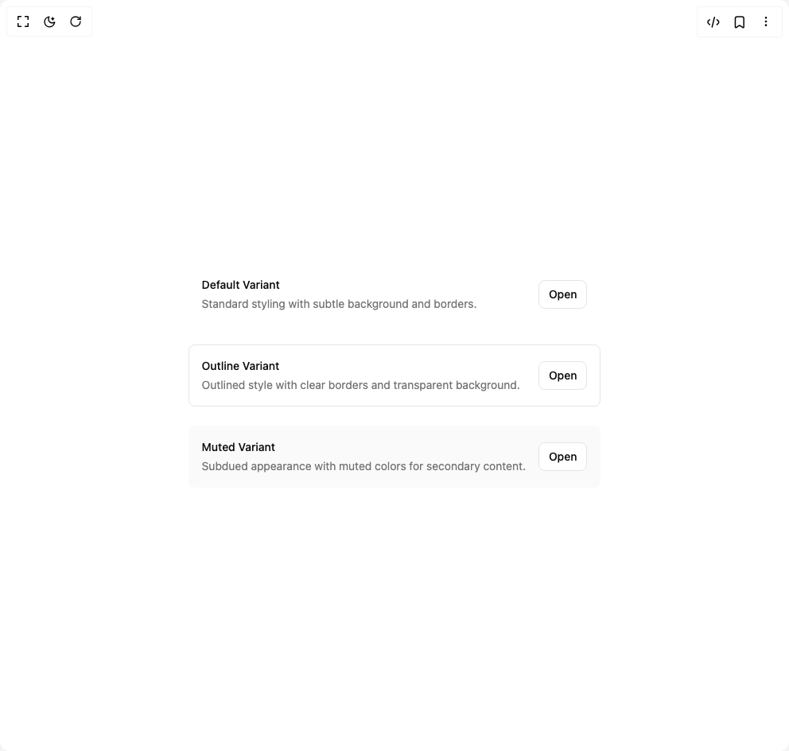

# Build Item in BuilderStudio

> Build this component in our Agentic IDE: [BuilderStudio](https://builderstudio.dev).
>
> Join the BuilderStudio community on [Discord](https://discord.gg/QdWeSGCqfe) and [Reddit](https://reddit.com/r/builderstudio).



## Component

- Author group: `shadcn`
- Component: `item`
- Variant: `variants`
- Rendered HTML snapshot: [`rendered.html`](rendered.html)

## BuilderStudio prompt

You are implementing a React component based on a component reference.

## Component identity

- Author: shadcn
- Component slug: item
- Demo slug: variants
- Title: item
- Description: 

## Goal

Recreate this component in a React + TypeScript + Tailwind CSS project. Preserve the visual layout, spacing, colors, border radius, shadows, interaction behavior, animation behavior, responsive behavior, and dark mode behavior shown in the rendered demo.

## Implementation requirements

- Use React and TypeScript.
- Use Tailwind CSS classes whenever possible.
- Keep the component self-contained unless the source files require helper components.
- If the source uses CSS variables, custom CSS, animations, or keyframes, include them.
- If the source uses external packages, list and use the required packages.
- Preserve accessibility attributes, button semantics, links, keyboard behavior, and ARIA attributes when visible in the source.
- Do not replace the component with a simplified placeholder.
- Return complete production-ready code.

## Dependencies

No reference metadata available.

## Rendered DOM snapshot

This is the rendered demo HTML extracted from the live preview. Use it to verify structure, class names, visible content, and layout.

```html
<div id="root"><div class="w-screen min-h-screen flex justify-center items-center"><div class="w-screen min-h-screen flex justify-center items-center"><div class="flex flex-col gap-6"><div data-slot="item" data-variant="default" data-size="default" class="group/item flex items-center border border-transparent text-sm rounded-md transition-colors [a]:hover:bg-accent/50 [a]:transition-colors duration-100 flex-wrap outline-none focus-visible:border-ring focus-visible:ring-ring/50 focus-visible:ring-[3px] bg-transparent p-4 gap-4"><div data-slot="item-content" class="flex flex-1 flex-col gap-1 [&amp;+[data-slot=item-content]]:flex-none"><div data-slot="item-title" class="flex w-fit items-center gap-2 text-sm leading-snug font-medium">Default Variant</div><p data-slot="item-description" class="text-muted-foreground line-clamp-2 text-sm leading-normal font-normal text-balance [&amp;&gt;a:hover]:text-primary [&amp;&gt;a]:underline [&amp;&gt;a]:underline-offset-4">Standard styling with subtle background and borders.</p></div><div data-slot="item-actions" class="flex items-center gap-2"><button class="inline-flex items-center justify-center whitespace-nowrap text-sm font-medium ring-offset-background transition-colors focus-visible:outline-none focus-visible:ring-2 focus-visible:ring-ring focus-visible:ring-offset-2 disabled:pointer-events-none disabled:opacity-50 border border-input bg-background hover:bg-accent hover:text-accent-foreground h-9 rounded-md px-3">Open</button></div></div><div data-slot="item" data-variant="outline" data-size="default" class="group/item flex items-center border text-sm rounded-md transition-colors [a]:hover:bg-accent/50 [a]:transition-colors duration-100 flex-wrap outline-none focus-visible:border-ring focus-visible:ring-ring/50 focus-visible:ring-[3px] border-border p-4 gap-4"><div data-slot="item-content" class="flex flex-1 flex-col gap-1 [&amp;+[data-slot=item-content]]:flex-none"><div data-slot="item-title" class="flex w-fit items-center gap-2 text-sm leading-snug font-medium">Outline Variant</div><p data-slot="item-description" class="text-muted-foreground line-clamp-2 text-sm leading-normal font-normal text-balance [&amp;&gt;a:hover]:text-primary [&amp;&gt;a]:underline [&amp;&gt;a]:underline-offset-4">Outlined style with clear borders and transparent background.</p></div><div data-slot="item-actions" class="flex items-center gap-2"><button class="inline-flex items-center justify-center whitespace-nowrap text-sm font-medium ring-offset-background transition-colors focus-visible:outline-none focus-visible:ring-2 focus-visible:ring-ring focus-visible:ring-offset-2 disabled:pointer-events-none disabled:opacity-50 border border-input bg-background hover:bg-accent hover:text-accent-foreground h-9 rounded-md px-3">Open</button></div></div><div data-slot="item" data-variant="muted" data-size="default" class="group/item flex items-center border border-transparent text-sm rounded-md transition-colors [a]:hover:bg-accent/50 [a]:transition-colors duration-100 flex-wrap outline-none focus-visible:border-ring focus-visible:ring-ring/50 focus-visible:ring-[3px] bg-muted/50 p-4 gap-4"><div data-slot="item-content" class="flex flex-1 flex-col gap-1 [&amp;+[data-slot=item-content]]:flex-none"><div data-slot="item-title" class="flex w-fit items-center gap-2 text-sm leading-snug font-medium">Muted Variant</div><p data-slot="item-description" class="text-muted-foreground line-clamp-2 text-sm leading-normal font-normal text-balance [&amp;&gt;a:hover]:text-primary [&amp;&gt;a]:underline [&amp;&gt;a]:underline-offset-4">Subdued appearance with muted colors for secondary content.</p></div><div data-slot="item-actions" class="flex items-center gap-2"><button class="inline-flex items-center justify-center whitespace-nowrap text-sm font-medium ring-offset-background transition-colors focus-visible:outline-none focus-visible:ring-2 focus-visible:ring-ring focus-visible:ring-offset-2 disabled:pointer-events-none disabled:opacity-50 border border-input bg-background hover:bg-accent hover:text-accent-foreground h-9 rounded-md px-3">Open</button></div></div></div></div></div></div>
```

## Reference source files

No reference source files were available.
