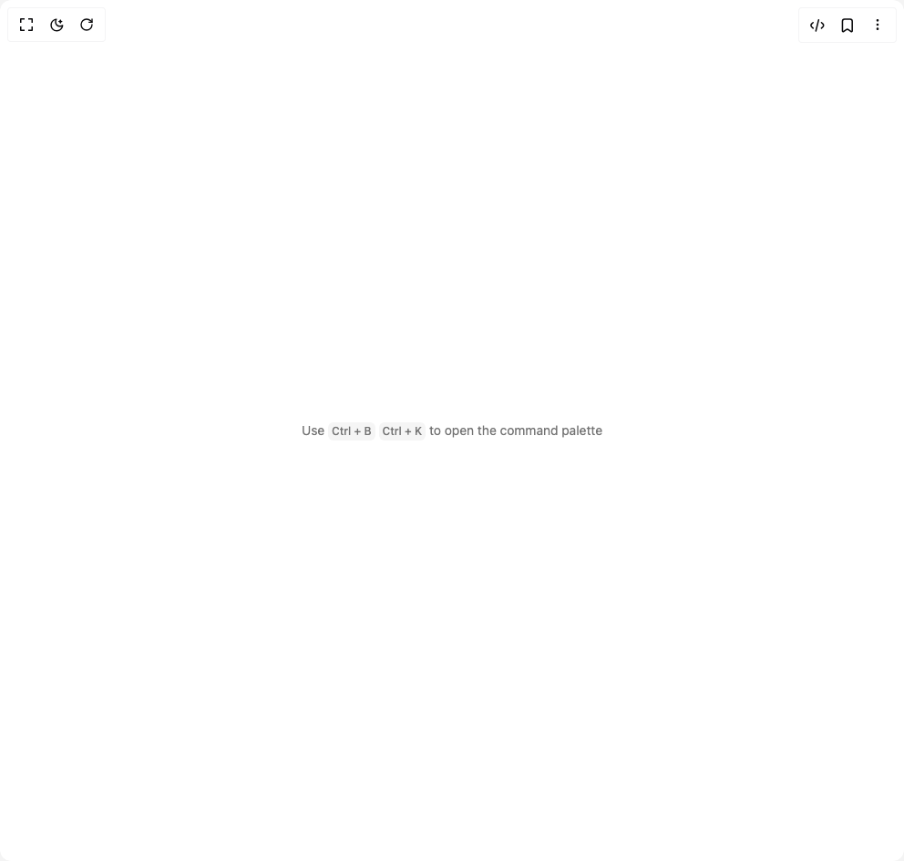

# Build Kbd in BuilderStudio

> Build this component in our Agentic IDE: [BuilderStudio](https://builderstudio.dev).
>
> Join the BuilderStudio community on [Discord](https://discord.gg/QdWeSGCqfe) and [Reddit](https://reddit.com/r/builderstudio).



## Component

- Author group: `shadcn`
- Component: `kbd`
- Variant: `kbd-group`
- Rendered HTML snapshot: [`rendered.html`](rendered.html)

## BuilderStudio prompt

You are implementing a React component based on a component reference.

## Component identity

- Author: shadcn
- Component slug: kbd
- Demo slug: kbd-group
- Title: kbd
- Description: 

## Goal

Recreate this component in a React + TypeScript + Tailwind CSS project. Preserve the visual layout, spacing, colors, border radius, shadows, interaction behavior, animation behavior, responsive behavior, and dark mode behavior shown in the rendered demo.

## Implementation requirements

- Use React and TypeScript.
- Use Tailwind CSS classes whenever possible.
- Keep the component self-contained unless the source files require helper components.
- If the source uses CSS variables, custom CSS, animations, or keyframes, include them.
- If the source uses external packages, list and use the required packages.
- Preserve accessibility attributes, button semantics, links, keyboard behavior, and ARIA attributes when visible in the source.
- Do not replace the component with a simplified placeholder.
- Return complete production-ready code.

## Dependencies

No reference metadata available.

## Rendered DOM snapshot

This is the rendered demo HTML extracted from the live preview. Use it to verify structure, class names, visible content, and layout.

```html
<div id="root"><div class="w-screen min-h-screen flex justify-center items-center"><div class="w-screen min-h-screen flex justify-center items-center"><div class="flex flex-col items-center gap-4"><p class="text-muted-foreground text-sm">Use <div data-slot="kbd-group" class="inline-flex items-center gap-1"><kbd data-slot="kbd" class="bg-muted text-muted-foreground pointer-events-none inline-flex h-5 w-fit min-w-5 items-center justify-center gap-1 rounded-sm px-1 font-sans text-xs font-medium select-none [&amp;_svg:not([class*='size-'])]:size-3 [[data-slot=tooltip-content]_&amp;]:bg-background/20 [[data-slot=tooltip-content]_&amp;]:text-background dark:[[data-slot=tooltip-content]_&amp;]:bg-background/10">Ctrl + B</kbd><kbd data-slot="kbd" class="bg-muted text-muted-foreground pointer-events-none inline-flex h-5 w-fit min-w-5 items-center justify-center gap-1 rounded-sm px-1 font-sans text-xs font-medium select-none [&amp;_svg:not([class*='size-'])]:size-3 [[data-slot=tooltip-content]_&amp;]:bg-background/20 [[data-slot=tooltip-content]_&amp;]:text-background dark:[[data-slot=tooltip-content]_&amp;]:bg-background/10">Ctrl + K</kbd></div> to open the command palette</p></div></div></div></div>
```

## Reference source files

No reference source files were available.
