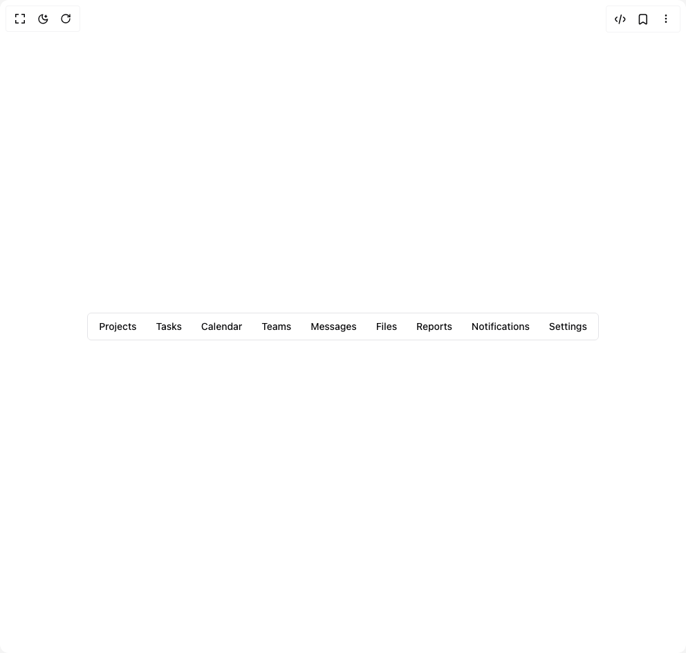

# Build Menubar in BuilderStudio

> Build this component in our Agentic IDE: [BuilderStudio](https://builderstudio.dev).
>
> Join the BuilderStudio community on [Discord](https://discord.gg/QdWeSGCqfe) and [Reddit](https://reddit.com/r/builderstudio).



## Component

- Author group: `shadcn`
- Component: `menubar`
- Variant: `dense`
- Rendered HTML snapshot: [`rendered.html`](rendered.html)

## BuilderStudio prompt

You are implementing a React component based on a component reference.

## Component identity

- Author: shadcn
- Component slug: menubar
- Demo slug: dense
- Title: menubar
- Description: 

## Goal

Recreate this component in a React + TypeScript + Tailwind CSS project. Preserve the visual layout, spacing, colors, border radius, shadows, interaction behavior, animation behavior, responsive behavior, and dark mode behavior shown in the rendered demo.

## Implementation requirements

- Use React and TypeScript.
- Use Tailwind CSS classes whenever possible.
- Keep the component self-contained unless the source files require helper components.
- If the source uses CSS variables, custom CSS, animations, or keyframes, include them.
- If the source uses external packages, list and use the required packages.
- Preserve accessibility attributes, button semantics, links, keyboard behavior, and ARIA attributes when visible in the source.
- Do not replace the component with a simplified placeholder.
- Return complete production-ready code.

## Dependencies

No reference metadata available.

## Rendered DOM snapshot

This is the rendered demo HTML extracted from the live preview. Use it to verify structure, class names, visible content, and layout.

```html
<div id="root"><div class="relative flex items-center justify-center h-screen w-full m-auto p-16 bg-background text-foreground"><div class="absolute lab-bg inset-0 size-full"><div class="absolute inset-0 bg-[radial-gradient(#00000021_1px,transparent_1px)] dark:bg-[radial-gradient(#ffffff22_1px,transparent_1px)]"></div></div><div class="flex w-full justify-center relative"><div role="menubar" class="flex h-10 items-center space-x-1 rounded-md border bg-background p-1" tabindex="0" data-orientation="horizontal" style="outline: none;"><button type="button" role="menuitem" id="radix-«r1»" aria-haspopup="menu" aria-expanded="false" data-state="closed" class="flex cursor-default select-none items-center rounded-sm px-3 py-1.5 text-sm font-medium outline-none focus:bg-accent focus:text-accent-foreground data-[state=open]:bg-accent data-[state=open]:text-accent-foreground" tabindex="-1" data-orientation="horizontal" data-radix-collection-item="">Projects</button><button type="button" role="menuitem" id="radix-«r5»" aria-haspopup="menu" aria-expanded="false" data-state="closed" class="flex cursor-default select-none items-center rounded-sm px-3 py-1.5 text-sm font-medium outline-none focus:bg-accent focus:text-accent-foreground data-[state=open]:bg-accent data-[state=open]:text-accent-foreground" tabindex="-1" data-orientation="horizontal" data-radix-collection-item="">Tasks</button><button type="button" role="menuitem" id="radix-«r9»" aria-haspopup="menu" aria-expanded="false" data-state="closed" class="flex cursor-default select-none items-center rounded-sm px-3 py-1.5 text-sm font-medium outline-none focus:bg-accent focus:text-accent-foreground data-[state=open]:bg-accent data-[state=open]:text-accent-foreground" tabindex="-1" data-orientation="horizontal" data-radix-collection-item="">Calendar</button><button type="button" role="menuitem" id="radix-«rd»" aria-haspopup="menu" aria-expanded="false" data-state="closed" class="flex cursor-default select-none items-center rounded-sm px-3 py-1.5 text-sm font-medium outline-none focus:bg-accent focus:text-accent-foreground data-[state=open]:bg-accent data-[state=open]:text-accent-foreground" tabindex="-1" data-orientation="horizontal" data-radix-collection-item="">Teams</button><button type="button" role="menuitem" id="radix-«rh»" aria-haspopup="menu" aria-expanded="false" data-state="closed" class="flex cursor-default select-none items-center rounded-sm px-3 py-1.5 text-sm font-medium outline-none focus:bg-accent focus:text-accent-foreground data-[state=open]:bg-accent data-[state=open]:text-accent-foreground" tabindex="-1" data-orientation="horizontal" data-radix-collection-item="">Messages</button><button type="button" role="menuitem" id="radix-«rl»" aria-haspopup="menu" aria-expanded="false" data-state="closed" class="flex cursor-default select-none items-center rounded-sm px-3 py-1.5 text-sm font-medium outline-none focus:bg-accent focus:text-accent-foreground data-[state=open]:bg-accent data-[state=open]:text-accent-foreground" tabindex="-1" data-orientation="horizontal" data-radix-collection-item="">Files</button><button type="button" role="menuitem" id="radix-«rp»" aria-haspopup="menu" aria-expanded="false" data-state="closed" class="flex cursor-default select-none items-center rounded-sm px-3 py-1.5 text-sm font-medium outline-none focus:bg-accent focus:text-accent-foreground data-[state=open]:bg-accent data-[state=open]:text-accent-foreground" tabindex="-1" data-orientation="horizontal" data-radix-collection-item="">Reports</button><button type="button" role="menuitem" id="radix-«rt»" aria-haspopup="menu" aria-expanded="false" data-state="closed" class="flex cursor-default select-none items-center rounded-sm px-3 py-1.5 text-sm font-medium outline-none focus:bg-accent focus:text-accent-foreground data-[state=open]:bg-accent data-[state=open]:text-accent-foreground" tabindex="-1" data-orientation="horizontal" data-radix-collection-item="">Notifications</button><button type="button" role="menuitem" id="radix-«r11»" aria-haspopup="menu" aria-expanded="false" data-state="closed" class="flex cursor-default select-none items-center rounded-sm px-3 py-1.5 text-sm font-medium outline-none focus:bg-accent focus:text-accent-foreground data-[state=open]:bg-accent data-[state=open]:text-accent-foreground" tabindex="-1" data-orientation="horizontal" data-radix-collection-item="">Settings</button></div></div></div></div>
```

## Reference source files

No reference source files were available.
