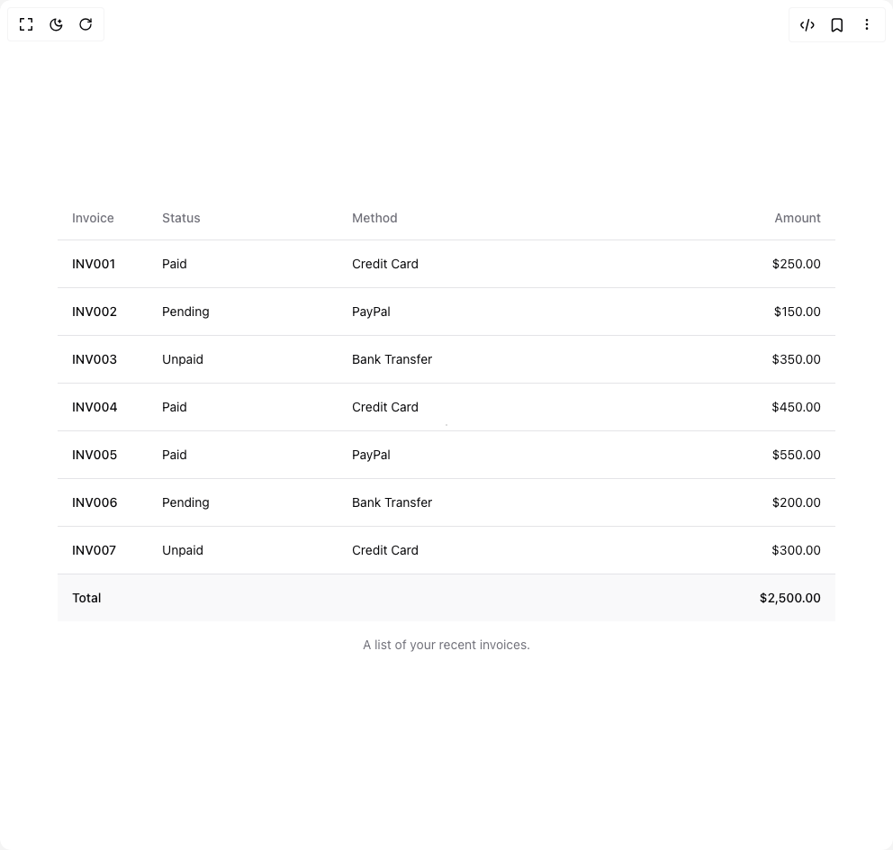

# Build Table in BuilderStudio

> Build this component in our Agentic IDE: [BuilderStudio](https://builderstudio.dev).
>
> Join the BuilderStudio community on [Discord](https://discord.gg/QdWeSGCqfe) and [Reddit](https://reddit.com/r/builderstudio).



## Component

- Author group: `shadcn`
- Component: `table`
- Variant: `default`
- Rendered HTML snapshot: [`rendered.html`](rendered.html)

## BuilderStudio prompt

You are implementing a React component based on a component reference.

## Component identity

- Author: shadcn
- Component slug: table
- Demo slug: default
- Title: table
- Description: 

## Goal

Recreate this component in a React + TypeScript + Tailwind CSS project. Preserve the visual layout, spacing, colors, border radius, shadows, interaction behavior, animation behavior, responsive behavior, and dark mode behavior shown in the rendered demo.

## Implementation requirements

- Use React and TypeScript.
- Use Tailwind CSS classes whenever possible.
- Keep the component self-contained unless the source files require helper components.
- If the source uses CSS variables, custom CSS, animations, or keyframes, include them.
- If the source uses external packages, list and use the required packages.
- Preserve accessibility attributes, button semantics, links, keyboard behavior, and ARIA attributes when visible in the source.
- Do not replace the component with a simplified placeholder.
- Return complete production-ready code.

## Dependencies

No reference metadata available.

## Rendered DOM snapshot

This is the rendered demo HTML extracted from the live preview. Use it to verify structure, class names, visible content, and layout.

```html
<div id="root"><div class="relative flex items-center justify-center h-screen w-full m-auto p-16 bg-background text-foreground"><div class="absolute lab-bg inset-0 size-full"><div class="absolute inset-0 bg-[radial-gradient(#00000021_1px,transparent_1px)] dark:bg-[radial-gradient(#ffffff22_1px,transparent_1px)]"></div></div><div class="flex w-full justify-center relative"><div class="relative w-full overflow-auto"><table class="w-full caption-bottom text-sm"><caption class="mt-4 text-sm text-muted-foreground">A list of your recent invoices.</caption><thead class="[&amp;_tr]:border-b"><tr class="border-b transition-colors hover:bg-muted/50 data-[state=selected]:bg-muted"><th class="h-12 px-4 text-left align-middle font-medium text-muted-foreground [&amp;:has([role=checkbox])]:pr-0 w-[100px]">Invoice</th><th class="h-12 px-4 text-left align-middle font-medium text-muted-foreground [&amp;:has([role=checkbox])]:pr-0">Status</th><th class="h-12 px-4 text-left align-middle font-medium text-muted-foreground [&amp;:has([role=checkbox])]:pr-0">Method</th><th class="h-12 px-4 align-middle font-medium text-muted-foreground [&amp;:has([role=checkbox])]:pr-0 text-right">Amount</th></tr></thead><tbody class="[&amp;_tr:last-child]:border-0"><tr class="border-b transition-colors hover:bg-muted/50 data-[state=selected]:bg-muted"><td class="p-4 align-middle [&amp;:has([role=checkbox])]:pr-0 font-medium">INV001</td><td class="p-4 align-middle [&amp;:has([role=checkbox])]:pr-0">Paid</td><td class="p-4 align-middle [&amp;:has([role=checkbox])]:pr-0">Credit Card</td><td class="p-4 align-middle [&amp;:has([role=checkbox])]:pr-0 text-right">$250.00</td></tr><tr class="border-b transition-colors hover:bg-muted/50 data-[state=selected]:bg-muted"><td class="p-4 align-middle [&amp;:has([role=checkbox])]:pr-0 font-medium">INV002</td><td class="p-4 align-middle [&amp;:has([role=checkbox])]:pr-0">Pending</td><td class="p-4 align-middle [&amp;:has([role=checkbox])]:pr-0">PayPal</td><td class="p-4 align-middle [&amp;:has([role=checkbox])]:pr-0 text-right">$150.00</td></tr><tr class="border-b transition-colors hover:bg-muted/50 data-[state=selected]:bg-muted"><td class="p-4 align-middle [&amp;:has([role=checkbox])]:pr-0 font-medium">INV003</td><td class="p-4 align-middle [&amp;:has([role=checkbox])]:pr-0">Unpaid</td><td class="p-4 align-middle [&amp;:has([role=checkbox])]:pr-0">Bank Transfer</td><td class="p-4 align-middle [&amp;:has([role=checkbox])]:pr-0 text-right">$350.00</td></tr><tr class="border-b transition-colors hover:bg-muted/50 data-[state=selected]:bg-muted"><td class="p-4 align-middle [&amp;:has([role=checkbox])]:pr-0 font-medium">INV004</td><td class="p-4 align-middle [&amp;:has([role=checkbox])]:pr-0">Paid</td><td class="p-4 align-middle [&amp;:has([role=checkbox])]:pr-0">Credit Card</td><td class="p-4 align-middle [&amp;:has([role=checkbox])]:pr-0 text-right">$450.00</td></tr><tr class="border-b transition-colors hover:bg-muted/50 data-[state=selected]:bg-muted"><td class="p-4 align-middle [&amp;:has([role=checkbox])]:pr-0 font-medium">INV005</td><td class="p-4 align-middle [&amp;:has([role=checkbox])]:pr-0">Paid</td><td class="p-4 align-middle [&amp;:has([role=checkbox])]:pr-0">PayPal</td><td class="p-4 align-middle [&amp;:has([role=checkbox])]:pr-0 text-right">$550.00</td></tr><tr class="border-b transition-colors hover:bg-muted/50 data-[state=selected]:bg-muted"><td class="p-4 align-middle [&amp;:has([role=checkbox])]:pr-0 font-medium">INV006</td><td class="p-4 align-middle [&amp;:has([role=checkbox])]:pr-0">Pending</td><td class="p-4 align-middle [&amp;:has([role=checkbox])]:pr-0">Bank Transfer</td><td class="p-4 align-middle [&amp;:has([role=checkbox])]:pr-0 text-right">$200.00</td></tr><tr class="border-b transition-colors hover:bg-muted/50 data-[state=selected]:bg-muted"><td class="p-4 align-middle [&amp;:has([role=checkbox])]:pr-0 font-medium">INV007</td><td class="p-4 align-middle [&amp;:has([role=checkbox])]:pr-0">Unpaid</td><td class="p-4 align-middle [&amp;:has([role=checkbox])]:pr-0">Credit Card</td><td class="p-4 align-middle [&amp;:has([role=checkbox])]:pr-0 text-right">$300.00</td></tr></tbody><tfoot class="border-t bg-muted/50 font-medium [&amp;&gt;tr]:last:border-b-0"><tr class="border-b transition-colors hover:bg-muted/50 data-[state=selected]:bg-muted"><td class="p-4 align-middle [&amp;:has([role=checkbox])]:pr-0" colspan="3">Total</td><td class="p-4 align-middle [&amp;:has([role=checkbox])]:pr-0 text-right">$2,500.00</td></tr></tfoot></table></div></div></div></div>
```

## Reference source files

No reference source files were available.
