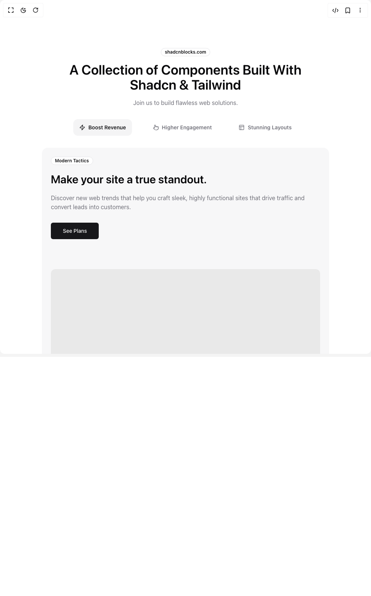

# Build Shadcnblocks Com Feature108 in BuilderStudio

> Build this component in our Agentic IDE: [BuilderStudio](https://builderstudio.dev).
>
> Join the BuilderStudio community on [Discord](https://discord.gg/QdWeSGCqfe) and [Reddit](https://reddit.com/r/builderstudio).



## Component

- Author group: `shadcnblockscom`
- Component: `shadcnblocks-com-feature108`
- Variant: `default`
- Rendered HTML snapshot: [`rendered.html`](rendered.html)

## BuilderStudio prompt

You are implementing a React component based on a component reference.

## Component identity

- Author: shadcnblockscom
- Component slug: shadcnblocks-com-feature108
- Demo slug: default
- Title: shadcnblocks-com-feature108
- Description: 

## Goal

Recreate this component in a React + TypeScript + Tailwind CSS project. Preserve the visual layout, spacing, colors, border radius, shadows, interaction behavior, animation behavior, responsive behavior, and dark mode behavior shown in the rendered demo.

## Implementation requirements

- Use React and TypeScript.
- Use Tailwind CSS classes whenever possible.
- Keep the component self-contained unless the source files require helper components.
- If the source uses CSS variables, custom CSS, animations, or keyframes, include them.
- If the source uses external packages, list and use the required packages.
- Preserve accessibility attributes, button semantics, links, keyboard behavior, and ARIA attributes when visible in the source.
- Do not replace the component with a simplified placeholder.
- Return complete production-ready code.

## Dependencies

No reference metadata available.

## Rendered DOM snapshot

This is the rendered demo HTML extracted from the live preview. Use it to verify structure, class names, visible content, and layout.

```html
<div id="root"><div class="bg-background text-foreground"><div class="w-full"><section class="py-32"><div class="container mx-auto"><div class="flex flex-col items-center gap-4 text-center"><div class="inline-flex items-center rounded-full border px-2.5 py-0.5 text-xs font-semibold transition-colors focus:outline-none focus:ring-2 focus:ring-ring focus:ring-offset-2 text-foreground">shadcnblocks.com</div><h1 class="max-w-2xl text-3xl font-semibold md:text-4xl">A Collection of Components Built With Shadcn &amp; Tailwind</h1><p class="text-muted-foreground">Join us to build flawless web solutions.</p></div><div dir="ltr" data-orientation="horizontal" class="mt-8"><div role="tablist" aria-orientation="horizontal" class="container flex flex-col items-center justify-center gap-4 sm:flex-row md:gap-10" tabindex="0" data-orientation="horizontal" style="outline: none;"><button type="button" role="tab" aria-selected="true" aria-controls="radix-«r0»-content-tab-1" data-state="active" id="radix-«r0»-trigger-tab-1" class="flex items-center gap-2 rounded-xl px-4 py-3 text-sm font-semibold text-muted-foreground data-[state=active]:bg-muted data-[state=active]:text-primary" tabindex="-1" data-orientation="horizontal" data-radix-collection-item=""><svg xmlns="http://www.w3.org/2000/svg" width="24" height="24" viewBox="0 0 24 24" fill="none" stroke="currentColor" stroke-width="2" stroke-linecap="round" stroke-linejoin="round" class="lucide lucide-zap h-auto w-4 shrink-0" aria-hidden="true"><path d="M4 14a1 1 0 0 1-.78-1.63l9.9-10.2a.5.5 0 0 1 .86.46l-1.92 6.02A1 1 0 0 0 13 10h7a1 1 0 0 1 .78 1.63l-9.9 10.2a.5.5 0 0 1-.86-.46l1.92-6.02A1 1 0 0 0 11 14z"></path></svg> Boost Revenue</button><button type="button" role="tab" aria-selected="false" aria-controls="radix-«r0»-content-tab-2" data-state="inactive" id="radix-«r0»-trigger-tab-2" class="flex items-center gap-2 rounded-xl px-4 py-3 text-sm font-semibold text-muted-foreground data-[state=active]:bg-muted data-[state=active]:text-primary" tabindex="-1" data-orientation="horizontal" data-radix-collection-item=""><svg xmlns="http://www.w3.org/2000/svg" width="24" height="24" viewBox="0 0 24 24" fill="none" stroke="currentColor" stroke-width="2" stroke-linecap="round" stroke-linejoin="round" class="lucide lucide-pointer h-auto w-4 shrink-0" aria-hidden="true"><path d="M22 14a8 8 0 0 1-8 8"></path><path d="M18 11v-1a2 2 0 0 0-2-2a2 2 0 0 0-2 2"></path><path d="M14 10V9a2 2 0 0 0-2-2a2 2 0 0 0-2 2v1"></path><path d="M10 9.5V4a2 2 0 0 0-2-2a2 2 0 0 0-2 2v10"></path><path d="M18 11a2 2 0 1 1 4 0v3a8 8 0 0 1-8 8h-2c-2.8 0-4.5-.86-5.99-2.34l-3.6-3.6a2 2 0 0 1 2.83-2.82L7 15"></path></svg> Higher Engagement</button><button type="button" role="tab" aria-selected="false" aria-controls="radix-«r0»-content-tab-3" data-state="inactive" id="radix-«r0»-trigger-tab-3" class="flex items-center gap-2 rounded-xl px-4 py-3 text-sm font-semibold text-muted-foreground data-[state=active]:bg-muted data-[state=active]:text-primary" tabindex="-1" data-orientation="horizontal" data-radix-collection-item=""><svg xmlns="http://www.w3.org/2000/svg" width="24" height="24" viewBox="0 0 24 24" fill="none" stroke="currentColor" stroke-width="2" stroke-linecap="round" stroke-linejoin="round" class="lucide lucide-panels-top-left h-auto w-4 shrink-0" aria-hidden="true"><rect width="18" height="18" x="3" y="3" rx="2"></rect><path d="M3 9h18"></path><path d="M9 21V9"></path></svg> Stunning Layouts</button></div><div class="mx-auto mt-8 max-w-screen-xl rounded-2xl bg-muted/70 p-6 lg:p-16"><div data-state="active" data-orientation="horizontal" role="tabpanel" aria-labelledby="radix-«r0»-trigger-tab-1" id="radix-«r0»-content-tab-1" tabindex="0" class="grid place-items-center gap-20 lg:grid-cols-2 lg:gap-10" style="animation-duration: 0s;"><div class="flex flex-col gap-5"><div class="inline-flex items-center rounded-full border px-2.5 py-0.5 text-xs font-semibold transition-colors focus:outline-none focus:ring-2 focus:ring-ring focus:ring-offset-2 text-foreground w-fit bg-background">Modern Tactics</div><h3 class="text-3xl font-semibold lg:text-5xl">Make your site a true standout.</h3><p class="text-muted-foreground lg:text-lg">Discover new web trends that help you craft sleek, highly functional sites that drive traffic and convert leads into customers.</p><button class="inline-flex items-center justify-center whitespace-nowrap text-sm font-medium ring-offset-background transition-colors focus-visible:outline-none focus-visible:ring-2 focus-visible:ring-ring focus-visible:ring-offset-2 disabled:pointer-events-none disabled:opacity-50 bg-primary text-primary-foreground hover:bg-primary/90 h-11 rounded-md px-8 mt-2.5 w-fit gap-2">See Plans</button></div></div><div data-state="inactive" data-orientation="horizontal" role="tabpanel" aria-labelledby="radix-«r0»-trigger-tab-2" hidden="" id="radix-«r0»-content-tab-2" tabindex="0" class="grid place-items-center gap-20 lg:grid-cols-2 lg:gap-10"></div><div data-state="inactive" data-orientation="horizontal" role="tabpanel" aria-labelledby="radix-«r0»-trigger-tab-3" hidden="" id="radix-«r0»-content-tab-3" tabindex="0" class="grid place-items-center gap-20 lg:grid-cols-2 lg:gap-10"></div></div></div></div></section></div></div></div>
```

## Reference source files

No reference source files were available.
