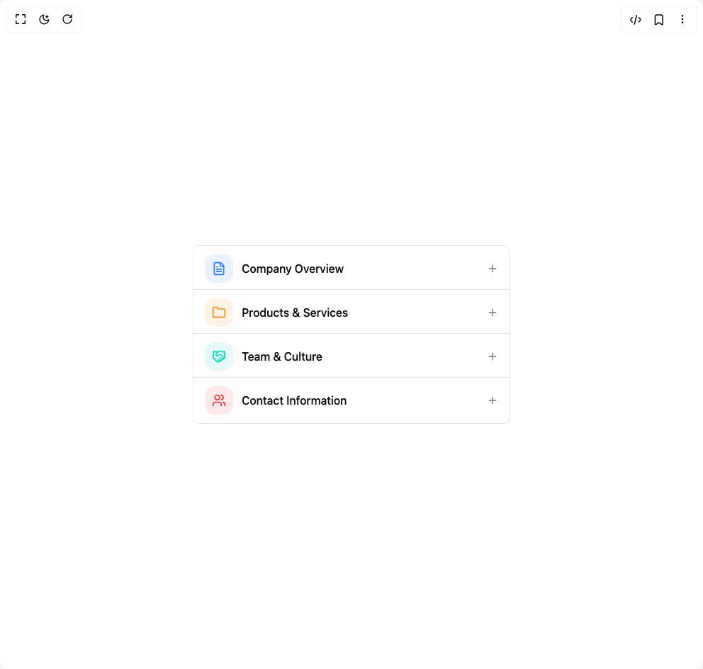

# Build Accordion Multi Level in BuilderStudio

> Build this component in our Agentic IDE: [BuilderStudio](https://builderstudio.dev).
>
> Join the BuilderStudio community on [Discord](https://discord.gg/QdWeSGCqfe) and [Reddit](https://reddit.com/r/builderstudio).



## Component

- Author group: `shadcnspace`
- Component: `accordion-multi-level`
- Variant: `default`
- Rendered HTML snapshot: [`rendered.html`](rendered.html)

## BuilderStudio prompt

You are implementing a React component based on a component reference.

## Component identity

- Author: shadcnspace
- Component slug: accordion-multi-level
- Demo slug: default
- Title: accordion-multi-level
- Description: 

## Goal

Recreate this component in a React + TypeScript + Tailwind CSS project. Preserve the visual layout, spacing, colors, border radius, shadows, interaction behavior, animation behavior, responsive behavior, and dark mode behavior shown in the rendered demo.

## Implementation requirements

- Use React and TypeScript.
- Use Tailwind CSS classes whenever possible.
- Keep the component self-contained unless the source files require helper components.
- If the source uses CSS variables, custom CSS, animations, or keyframes, include them.
- If the source uses external packages, list and use the required packages.
- Preserve accessibility attributes, button semantics, links, keyboard behavior, and ARIA attributes when visible in the source.
- Do not replace the component with a simplified placeholder.
- Return complete production-ready code.

## Dependencies

No reference metadata available.

## Rendered DOM snapshot

This is the rendered demo HTML extracted from the live preview. Use it to verify structure, class names, visible content, and layout.

```html
<div id="root"><div class="w-screen min-h-screen flex justify-center items-center"><div class="w-screen min-h-screen flex justify-center items-center"><div class="flex items-center justify-center max-w-md w-full"><div class="w-full -space-y-1" data-orientation="vertical"><div data-state="closed" data-orientation="vertical" class="overflow-hidden border bg-background first:rounded-t-lg last:rounded-b-lg last:border-b"><h3 data-orientation="vertical" data-state="closed" class="flex"><button type="button" aria-controls="radix-«r1»" aria-expanded="false" data-state="closed" data-orientation="vertical" id="radix-«r0»" class="flex flex-1 items-center justify-between font-medium transition-all [&amp;[data-state=open]&gt;svg]:rotate-180 group px-4 py-3 hover:no-underline last:[&amp;&gt;svg]:hidden" data-radix-collection-item=""><div class="flex w-full items-center justify-between gap-3"><div class="flex items-center gap-3"><div class="p-2.5 rounded-xl bg-blue-500/10 text-blue-500"><svg xmlns="http://www.w3.org/2000/svg" width="20" height="20" viewBox="0 0 24 24" fill="none" stroke="currentColor" stroke-width="2" stroke-linecap="round" stroke-linejoin="round" class="lucide lucide-file-text size-5" aria-hidden="true"><path d="M15 2H6a2 2 0 0 0-2 2v16a2 2 0 0 0 2 2h12a2 2 0 0 0 2-2V7Z"></path><path d="M14 2v4a2 2 0 0 0 2 2h4"></path><path d="M10 9H8"></path><path d="M16 13H8"></path><path d="M16 17H8"></path></svg></div><span class="flex-1 text-left">Company Overview</span></div><div class="relative size-4 shrink-0"><svg xmlns="http://www.w3.org/2000/svg" width="24" height="24" viewBox="0 0 24 24" fill="none" stroke="currentColor" stroke-width="2" stroke-linecap="round" stroke-linejoin="round" class="lucide lucide-plus absolute inset-0 size-4 text-muted-foreground transition-opacity duration-200 group-data-[panel-open]:opacity-0" aria-hidden="true"><path d="M5 12h14"></path><path d="M12 5v14"></path></svg><svg xmlns="http://www.w3.org/2000/svg" width="24" height="24" viewBox="0 0 24 24" fill="none" stroke="currentColor" stroke-width="2" stroke-linecap="round" stroke-linejoin="round" class="lucide lucide-minus absolute inset-0 size-4 text-muted-foreground opacity-0 transition-opacity duration-200 group-data-[panel-open]:opacity-100" aria-hidden="true"><path d="M5 12h14"></path></svg></div></div><svg xmlns="http://www.w3.org/2000/svg" width="24" height="24" viewBox="0 0 24 24" fill="none" stroke="currentColor" stroke-width="2" stroke-linecap="round" stroke-linejoin="round" class="lucide lucide-chevron-down h-4 w-4 shrink-0 transition-transform duration-200" aria-hidden="true"><path d="m6 9 6 6 6-6"></path></svg></button></h3><div data-state="closed" id="radix-«r1»" hidden="" role="region" aria-labelledby="radix-«r0»" data-orientation="vertical" class="overflow-hidden text-sm transition-all data-[state=closed]:animate-accordion-up data-[state=open]:animate-accordion-down" style="--radix-accordion-content-height: var(--radix-collapsible-content-height); --radix-accordion-content-width: var(--radix-collapsible-content-width);"></div></div><div data-state="closed" data-orientation="vertical" class="overflow-hidden border bg-background first:rounded-t-lg last:rounded-b-lg last:border-b"><h3 data-orientation="vertical" data-state="closed" class="flex"><button type="button" aria-controls="radix-«r3»" aria-expanded="false" data-state="closed" data-orientation="vertical" id="radix-«r2»" class="flex flex-1 items-center justify-between font-medium transition-all [&amp;[data-state=open]&gt;svg]:rotate-180 group px-4 py-3 hover:no-underline last:[&amp;&gt;svg]:hidden" data-radix-collection-item=""><div class="flex w-full items-center justify-between gap-3"><div class="flex items-center gap-3"><div class="p-2.5 rounded-xl bg-orange-400/10 text-orange-400"><svg xmlns="http://www.w3.org/2000/svg" width="20" height="20" viewBox="0 0 24 24" fill="none" stroke="currentColor" stroke-width="2" stroke-linecap="round" stroke-linejoin="round" class="lucide lucide-folder size-5" aria-hidden="true"><path d="M20 20a2 2 0 0 0 2-2V8a2 2 0 0 0-2-2h-7.9a2 2 0 0 1-1.69-.9L9.6 3.9A2 2 0 0 0 7.93 3H4a2 2 0 0 0-2 2v13a2 2 0 0 0 2 2Z"></path></svg></div><span class="flex-1 text-left">Products &amp; Services</span></div><div class="relative size-4 shrink-0"><svg xmlns="http://www.w3.org/2000/svg" width="24" height="24" viewBox="0 0 24 24" fill="none" stroke="currentColor" stroke-width="2" stroke-linecap="round" stroke-linejoin="round" class="lucide lucide-plus absolute inset-0 size-4 text-muted-foreground transition-opacity duration-200 group-data-[panel-open]:opacity-0" aria-hidden="true"><path d="M5 12h14"></path><path d="M12 5v14"></path></svg><svg xmlns="http://www.w3.org/2000/svg" width="24" height="24" viewBox="0 0 24 24" fill="none" stroke="currentColor" stroke-width="2" stroke-linecap="round" stroke-linejoin="round" class="lucide lucide-minus absolute inset-0 size-4 text-muted-foreground opacity-0 transition-opacity duration-200 group-data-[panel-open]:opacity-100" aria-hidden="true"><path d="M5 12h14"></path></svg></div></div><svg xmlns="http://www.w3.org/2000/svg" width="24" height="24" viewBox="0 0 24 24" fill="none" stroke="currentColor" stroke-width="2" stroke-linecap="round" stroke-linejoin="round" class="lucide lucide-chevron-down h-4 w-4 shrink-0 transition-transform duration-200" aria-hidden="true"><path d="m6 9 6 6 6-6"></path></svg></button></h3><div data-state="closed" id="radix-«r3»" hidden="" role="region" aria-labelledby="radix-«r2»" data-orientation="vertical" class="overflow-hidden text-sm transition-all data-[state=closed]:animate-accordion-up data-[state=open]:animate-accordion-down" style="--radix-accordion-content-height: var(--radix-collapsible-content-height); --radix-accordion-content-width: var(--radix-collapsible-content-width);"></div></div><div data-state="closed" data-orientation="vertical" class="overflow-hidden border bg-background first:rounded-t-lg last:rounded-b-lg last:border-b"><h3 data-orientation="vertical" data-state="closed" class="flex"><button type="button" aria-controls="radix-«r5»" aria-expanded="false" data-state="closed" data-orientation="vertical" id="radix-«r4»" class="flex flex-1 items-center justify-between font-medium transition-all [&amp;[data-state=open]&gt;svg]:rotate-180 group px-4 py-3 hover:no-underline last:[&amp;&gt;svg]:hidden" data-radix-collection-item=""><div class="flex w-full items-center justify-between gap-3"><div class="flex items-center gap-3"><div class="p-2.5 rounded-xl bg-teal-400/10 text-teal-400"><svg xmlns="http://www.w3.org/2000/svg" width="20" height="20" viewBox="0 0 24 24" fill="none" stroke="currentColor" stroke-width="2" stroke-linecap="round" stroke-linejoin="round" class="lucide lucide-handshake size-5" aria-hidden="true"><path d="m11 17 2 2a1 1 0 1 0 3-3"></path><path d="m14 14 2.5 2.5a1 1 0 1 0 3-3l-3.88-3.88a3 3 0 0 0-4.24 0l-.88.88a1 1 0 1 1-3-3l2.81-2.81a5.79 5.79 0 0 1 7.06-.87l.47.28a2 2 0 0 0 1.42.25L21 4"></path><path d="m21 3 1 11h-2"></path><path d="M3 3 2 14l6.5 6.5a1 1 0 1 0 3-3"></path><path d="M3 4h8"></path></svg></div><span class="flex-1 text-left">Team &amp; Culture</span></div><div class="relative size-4 shrink-0"><svg xmlns="http://www.w3.org/2000/svg" width="24" height="24" viewBox="0 0 24 24" fill="none" stroke="currentColor" stroke-width="2" stroke-linecap="round" stroke-linejoin="round" class="lucide lucide-plus absolute inset-0 size-4 text-muted-foreground transition-opacity duration-200 group-data-[panel-open]:opacity-0" aria-hidden="true"><path d="M5 12h14"></path><path d="M12 5v14"></path></svg><svg xmlns="http://www.w3.org/2000/svg" width="24" height="24" viewBox="0 0 24 24" fill="none" stroke="currentColor" stroke-width="2" stroke-linecap="round" stroke-linejoin="round" class="lucide lucide-minus absolute inset-0 size-4 text-muted-foreground opacity-0 transition-opacity duration-200 group-data-[panel-open]:opacity-100" aria-hidden="true"><path d="M5 12h14"></path></svg></div></div><svg xmlns="http://www.w3.org/2000/svg" width="24" height="24" viewBox="0 0 24 24" fill="none" stroke="currentColor" stroke-width="2" stroke-linecap="round" stroke-linejoin="round" class="lucide lucide-chevron-down h-4 w-4 shrink-0 transition-transform duration-200" aria-hidden="true"><path d="m6 9 6 6 6-6"></path></svg></button></h3><div data-state="closed" id="radix-«r5»" hidden="" role="region" aria-labelledby="radix-«r4»" data-orientation="vertical" class="overflow-hidden text-sm transition-all data-[state=closed]:animate-accordion-up data-[state=open]:animate-accordion-down" style="--radix-accordion-content-height: var(--radix-collapsible-content-height); --radix-accordion-content-width: var(--radix-collapsible-content-width);"></div></div><div data-state="closed" data-orientation="vertical" class="overflow-hidden border bg-background first:rounded-t-lg last:rounded-b-lg last:border-b"><h3 data-orientation="vertical" data-state="closed" class="flex"><button type="button" aria-controls="radix-«r7»" aria-expanded="false" data-state="closed" data-orientation="vertical" id="radix-«r6»" class="flex flex-1 items-center justify-between font-medium transition-all [&amp;[data-state=open]&gt;svg]:rotate-180 group px-4 py-3 hover:no-underline last:[&amp;&gt;svg]:hidden" data-radix-collection-item=""><div class="flex w-full items-center justify-between gap-3"><div class="flex items-center gap-3"><div class="p-2.5 rounded-xl bg-red-500/10 text-red-500"><svg xmlns="http://www.w3.org/2000/svg" width="20" height="20" viewBox="0 0 24 24" fill="none" stroke="currentColor" stroke-width="2" stroke-linecap="round" stroke-linejoin="round" class="lucide lucide-users size-5" aria-hidden="true"><path d="M16 21v-2a4 4 0 0 0-4-4H6a4 4 0 0 0-4 4v2"></path><circle cx="9" cy="7" r="4"></circle><path d="M22 21v-2a4 4 0 0 0-3-3.87"></path><path d="M16 3.13a4 4 0 0 1 0 7.75"></path></svg></div><span class="flex-1 text-left">Contact Information</span></div><div class="relative size-4 shrink-0"><svg xmlns="http://www.w3.org/2000/svg" width="24" height="24" viewBox="0 0 24 24" fill="none" stroke="currentColor" stroke-width="2" stroke-linecap="round" stroke-linejoin="round" class="lucide lucide-plus absolute inset-0 size-4 text-muted-foreground transition-opacity duration-200 group-data-[panel-open]:opacity-0" aria-hidden="true"><path d="M5 12h14"></path><path d="M12 5v14"></path></svg><svg xmlns="http://www.w3.org/2000/svg" width="24" height="24" viewBox="0 0 24 24" fill="none" stroke="currentColor" stroke-width="2" stroke-linecap="round" stroke-linejoin="round" class="lucide lucide-minus absolute inset-0 size-4 text-muted-foreground opacity-0 transition-opacity duration-200 group-data-[panel-open]:opacity-100" aria-hidden="true"><path d="M5 12h14"></path></svg></div></div><svg xmlns="http://www.w3.org/2000/svg" width="24" height="24" viewBox="0 0 24 24" fill="none" stroke="currentColor" stroke-width="2" stroke-linecap="round" stroke-linejoin="round" class="lucide lucide-chevron-down h-4 w-4 shrink-0 transition-transform duration-200" aria-hidden="true"><path d="m6 9 6 6 6-6"></path></svg></button></h3><div data-state="closed" id="radix-«r7»" hidden="" role="region" aria-labelledby="radix-«r6»" data-orientation="vertical" class="overflow-hidden text-sm transition-all data-[state=closed]:animate-accordion-up data-[state=open]:animate-accordion-down" style="--radix-accordion-content-height: var(--radix-collapsible-content-height); --radix-accordion-content-width: var(--radix-collapsible-content-width);"></div></div></div></div></div></div></div>
```

## Reference source files

No reference source files were available.
