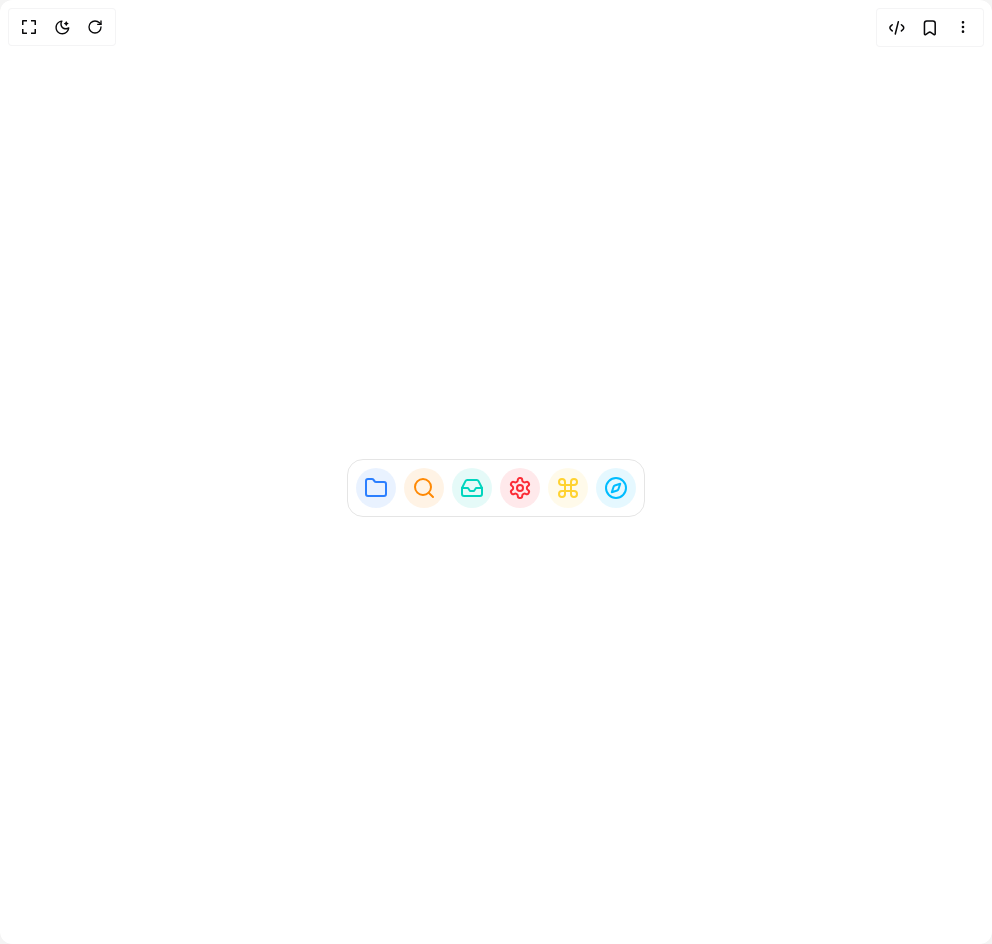

# Build Apple Dock in BuilderStudio

> Build this component in our Agentic IDE: [BuilderStudio](https://builderstudio.dev).
>
> Join the BuilderStudio community on [Discord](https://discord.gg/QdWeSGCqfe) and [Reddit](https://reddit.com/r/builderstudio).



## Component

- Author group: `shadcnspace`
- Component: `apple-dock`
- Variant: `default`
- Rendered HTML snapshot: [`rendered.html`](rendered.html)

## BuilderStudio prompt

You are implementing a React component based on a component reference.

## Component identity

- Author: shadcnspace
- Component slug: apple-dock
- Demo slug: default
- Title: apple-dock
- Description: 

## Goal

Recreate this component in a React + TypeScript + Tailwind CSS project. Preserve the visual layout, spacing, colors, border radius, shadows, interaction behavior, animation behavior, responsive behavior, and dark mode behavior shown in the rendered demo.

## Implementation requirements

- Use React and TypeScript.
- Use Tailwind CSS classes whenever possible.
- Keep the component self-contained unless the source files require helper components.
- If the source uses CSS variables, custom CSS, animations, or keyframes, include them.
- If the source uses external packages, list and use the required packages.
- Preserve accessibility attributes, button semantics, links, keyboard behavior, and ARIA attributes when visible in the source.
- Do not replace the component with a simplified placeholder.
- Return complete production-ready code.

## Dependencies

No reference metadata available.

## Rendered DOM snapshot

This is the rendered demo HTML extracted from the live preview. Use it to verify structure, class names, visible content, and layout.

```html
<div id="root"><div class="w-screen min-h-screen flex justify-center items-center"><div class="w-screen min-h-screen flex justify-center items-center"><div class="flex items-center justify-center bg-background"><div class="relative"><div class="supports-backdrop-blur:bg-white/10 supports-backdrop-blur:dark:bg-black/10 mx-auto mt-8 flex h-[58px] w-max justify-center gap-2 rounded-2xl border p-2 backdrop-blur-md items-center"><div class="flex aspect-square cursor-pointer items-center justify-center rounded-full bg-blue-500/10 text-blue-500" aria-label="Folder" style="padding: 8px; width: 40px; height: 40px;"><div><svg xmlns="http://www.w3.org/2000/svg" width="24" height="24" viewBox="0 0 24 24" fill="none" stroke="currentColor" stroke-width="2" stroke-linecap="round" stroke-linejoin="round" class="lucide lucide-folder w-6 h-6" aria-hidden="true"><path d="M20 20a2 2 0 0 0 2-2V8a2 2 0 0 0-2-2h-7.9a2 2 0 0 1-1.69-.9L9.6 3.9A2 2 0 0 0 7.93 3H4a2 2 0 0 0-2 2v13a2 2 0 0 0 2 2Z"></path></svg></div></div><div class="flex aspect-square cursor-pointer items-center justify-center rounded-full bg-orange-400/10 text-orange-400" aria-label="Search" style="padding: 8px; width: 40px; height: 40px;"><div><svg xmlns="http://www.w3.org/2000/svg" width="24" height="24" viewBox="0 0 24 24" fill="none" stroke="currentColor" stroke-width="2" stroke-linecap="round" stroke-linejoin="round" class="lucide lucide-search w-6 h-6" aria-hidden="true"><circle cx="11" cy="11" r="8"></circle><path d="m21 21-4.3-4.3"></path></svg></div></div><div class="flex aspect-square cursor-pointer items-center justify-center rounded-full bg-teal-400/10 text-teal-400" aria-label="Inbox" style="padding: 8px; width: 40px; height: 40px;"><div><svg xmlns="http://www.w3.org/2000/svg" width="24" height="24" viewBox="0 0 24 24" fill="none" stroke="currentColor" stroke-width="2" stroke-linecap="round" stroke-linejoin="round" class="lucide lucide-inbox w-6 h-6" aria-hidden="true"><polyline points="22 12 16 12 14 15 10 15 8 12 2 12"></polyline><path d="M5.45 5.11 2 12v6a2 2 0 0 0 2 2h16a2 2 0 0 0 2-2v-6l-3.45-6.89A2 2 0 0 0 16.76 4H7.24a2 2 0 0 0-1.79 1.11z"></path></svg></div></div><div class="flex aspect-square cursor-pointer items-center justify-center rounded-full bg-red-500/10 text-red-500" aria-label="Settings" style="padding: 8px; width: 40px; height: 40px;"><div><svg xmlns="http://www.w3.org/2000/svg" width="24" height="24" viewBox="0 0 24 24" fill="none" stroke="currentColor" stroke-width="2" stroke-linecap="round" stroke-linejoin="round" class="lucide lucide-settings w-6 h-6" aria-hidden="true"><path d="M12.22 2h-.44a2 2 0 0 0-2 2v.18a2 2 0 0 1-1 1.73l-.43.25a2 2 0 0 1-2 0l-.15-.08a2 2 0 0 0-2.73.73l-.22.38a2 2 0 0 0 .73 2.73l.15.1a2 2 0 0 1 1 1.72v.51a2 2 0 0 1-1 1.74l-.15.09a2 2 0 0 0-.73 2.73l.22.38a2 2 0 0 0 2.73.73l.15-.08a2 2 0 0 1 2 0l.43.25a2 2 0 0 1 1 1.73V20a2 2 0 0 0 2 2h.44a2 2 0 0 0 2-2v-.18a2 2 0 0 1 1-1.73l.43-.25a2 2 0 0 1 2 0l.15.08a2 2 0 0 0 2.73-.73l.22-.39a2 2 0 0 0-.73-2.73l-.15-.08a2 2 0 0 1-1-1.74v-.5a2 2 0 0 1 1-1.74l.15-.09a2 2 0 0 0 .73-2.73l-.22-.38a2 2 0 0 0-2.73-.73l-.15.08a2 2 0 0 1-2 0l-.43-.25a2 2 0 0 1-1-1.73V4a2 2 0 0 0-2-2z"></path><circle cx="12" cy="12" r="3"></circle></svg></div></div><div class="flex aspect-square cursor-pointer items-center justify-center rounded-full bg-amber-300/10 text-amber-300" aria-label="Command" style="padding: 8px; width: 40px; height: 40px;"><div><svg xmlns="http://www.w3.org/2000/svg" width="24" height="24" viewBox="0 0 24 24" fill="none" stroke="currentColor" stroke-width="2" stroke-linecap="round" stroke-linejoin="round" class="lucide lucide-command w-6 h-6" aria-hidden="true"><path d="M15 6v12a3 3 0 1 0 3-3H6a3 3 0 1 0 3 3V6a3 3 0 1 0-3 3h12a3 3 0 1 0-3-3"></path></svg></div></div><div class="flex aspect-square cursor-pointer items-center justify-center rounded-full bg-sky-400/10 text-sky-400" aria-label="Compass" style="padding: 8px; width: 40px; height: 40px;"><div><svg xmlns="http://www.w3.org/2000/svg" width="24" height="24" viewBox="0 0 24 24" fill="none" stroke="currentColor" stroke-width="2" stroke-linecap="round" stroke-linejoin="round" class="lucide lucide-compass w-6 h-6" aria-hidden="true"><path d="m16.24 7.76-1.804 5.411a2 2 0 0 1-1.265 1.265L7.76 16.24l1.804-5.411a2 2 0 0 1 1.265-1.265z"></path><circle cx="12" cy="12" r="10"></circle></svg></div></div></div></div></div></div></div></div>
```

## Reference source files

No reference source files were available.
