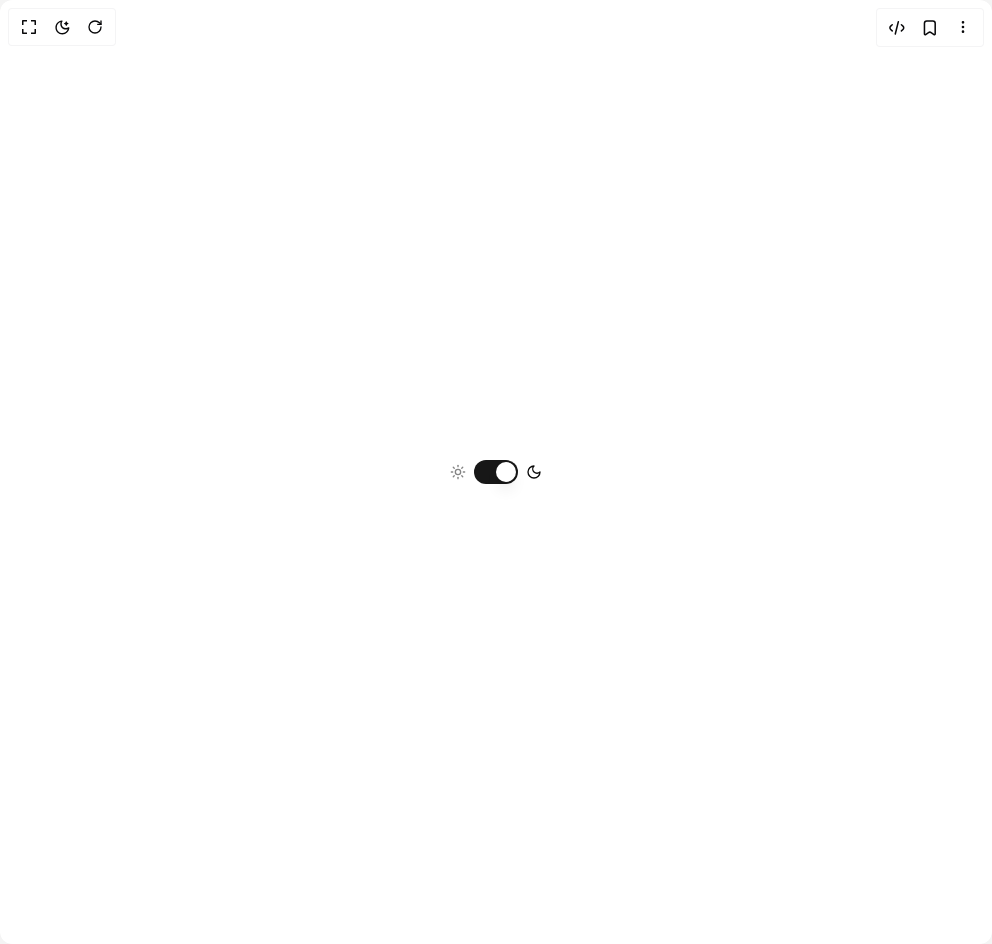

# Build Toggle Theme in BuilderStudio

> Build this component in our Agentic IDE: [BuilderStudio](https://builderstudio.dev).
>
> Join the BuilderStudio community on [Discord](https://discord.gg/QdWeSGCqfe) and [Reddit](https://reddit.com/r/builderstudio).



## Component

- Author group: `shadcnspace`
- Component: `toggle-theme`
- Variant: `default`
- Rendered HTML snapshot: [`rendered.html`](rendered.html)

## BuilderStudio prompt

You are implementing a React component based on a component reference.

## Component identity

- Author: shadcnspace
- Component slug: toggle-theme
- Demo slug: default
- Title: toggle-theme
- Description: 

## Goal

Recreate this component in a React + TypeScript + Tailwind CSS project. Preserve the visual layout, spacing, colors, border radius, shadows, interaction behavior, animation behavior, responsive behavior, and dark mode behavior shown in the rendered demo.

## Implementation requirements

- Use React and TypeScript.
- Use Tailwind CSS classes whenever possible.
- Keep the component self-contained unless the source files require helper components.
- If the source uses CSS variables, custom CSS, animations, or keyframes, include them.
- If the source uses external packages, list and use the required packages.
- Preserve accessibility attributes, button semantics, links, keyboard behavior, and ARIA attributes when visible in the source.
- Do not replace the component with a simplified placeholder.
- Return complete production-ready code.

## Dependencies

No reference metadata available.

## Rendered DOM snapshot

This is the rendered demo HTML extracted from the live preview. Use it to verify structure, class names, visible content, and layout.

```html
<div id="root"><div class="w-screen min-h-screen flex justify-center items-center"><div class="w-screen min-h-screen flex justify-center items-center"><div class="group inline-flex items-center gap-2"><span id="«r0»-light" class="cursor-pointer text-left text-sm font-medium text-foreground/50" aria-controls="«r0»"><svg xmlns="http://www.w3.org/2000/svg" width="24" height="24" viewBox="0 0 24 24" fill="none" stroke="currentColor" stroke-width="2" stroke-linecap="round" stroke-linejoin="round" class="lucide lucide-sun size-4" aria-hidden="true"><circle cx="12" cy="12" r="4"></circle><path d="M12 2v2"></path><path d="M12 20v2"></path><path d="m4.93 4.93 1.41 1.41"></path><path d="m17.66 17.66 1.41 1.41"></path><path d="M2 12h2"></path><path d="M20 12h2"></path><path d="m6.34 17.66-1.41 1.41"></path><path d="m19.07 4.93-1.41 1.41"></path></svg></span><button type="button" role="switch" aria-checked="true" data-state="checked" value="on" class="peer inline-flex h-6 w-11 shrink-0 cursor-pointer items-center rounded-full border-2 border-transparent transition-colors focus-visible:outline-none focus-visible:ring-2 focus-visible:ring-ring focus-visible:ring-offset-2 focus-visible:ring-offset-background disabled:cursor-not-allowed disabled:opacity-50 data-[state=checked]:bg-primary data-[state=unchecked]:bg-input" id="«r0»" aria-labelledby="«r0»-light «r0»-dark" aria-label="Toggle between dark and light mode"><span data-state="checked" class="pointer-events-none block h-5 w-5 rounded-full bg-background shadow-lg ring-0 transition-transform data-[state=checked]:translate-x-5 data-[state=unchecked]:translate-x-0"></span></button><span id="«r0»-dark" class="cursor-pointer text-right text-sm font-medium" aria-controls="«r0»"><svg xmlns="http://www.w3.org/2000/svg" width="24" height="24" viewBox="0 0 24 24" fill="none" stroke="currentColor" stroke-width="2" stroke-linecap="round" stroke-linejoin="round" class="lucide lucide-moon size-4" aria-hidden="true"><path d="M12 3a6 6 0 0 0 9 9 9 9 0 1 1-9-9Z"></path></svg></span></div></div></div></div>
```

## Reference source files

No reference source files were available.
