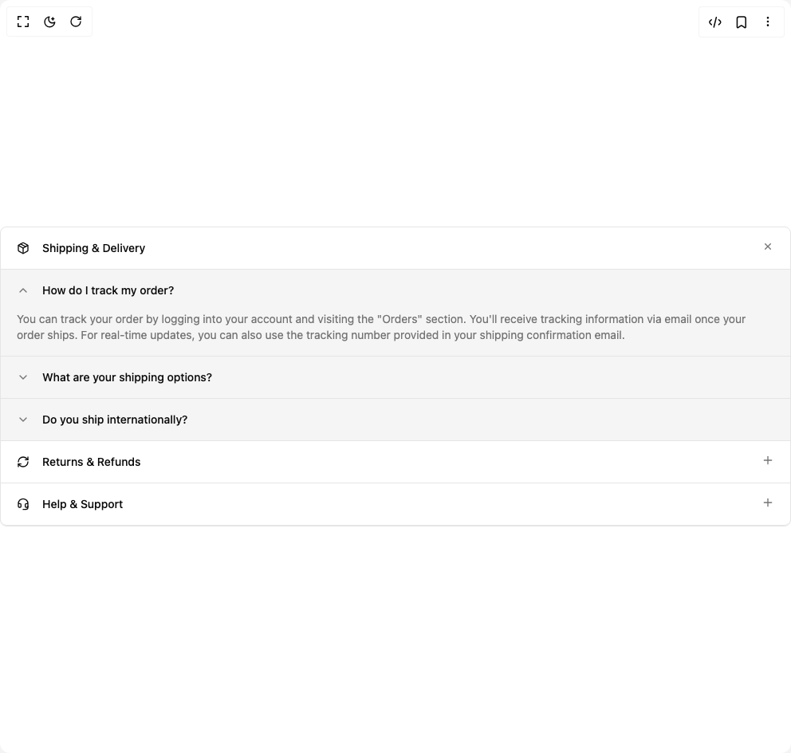

# Build Accordion 1 in BuilderStudio

> Build this component in our Agentic IDE: [BuilderStudio](https://builderstudio.dev).
>
> Join the BuilderStudio community on [Discord](https://discord.gg/QdWeSGCqfe) and [Reddit](https://reddit.com/r/builderstudio).



## Component

- Author group: `shadcnstudio`
- Component: `accordion-1`
- Variant: `accordion-fifteen`
- Rendered HTML snapshot: [`rendered.html`](rendered.html)

## BuilderStudio prompt

You are implementing a React component based on a component reference.

## Component identity

- Author: ShadcnStudio
- Component slug: accordion-1
- Demo slug: accordion-fifteen
- Title: accordion-1
- Description: 

## Goal

Recreate this component in a React + TypeScript + Tailwind CSS project. Preserve the visual layout, spacing, colors, border radius, shadows, interaction behavior, animation behavior, responsive behavior, and dark mode behavior shown in the rendered demo.

## Implementation requirements

- Use React and TypeScript.
- Use Tailwind CSS classes whenever possible.
- Keep the component self-contained unless the source files require helper components.
- If the source uses CSS variables, custom CSS, animations, or keyframes, include them.
- If the source uses external packages, list and use the required packages.
- Preserve accessibility attributes, button semantics, links, keyboard behavior, and ARIA attributes when visible in the source.
- Do not replace the component with a simplified placeholder.
- Return complete production-ready code.

## Dependencies

No reference metadata available.

## Rendered DOM snapshot

This is the rendered demo HTML extracted from the live preview. Use it to verify structure, class names, visible content, and layout.

```html
<div id="root"><div class="w-screen min-h-screen flex justify-center items-center"><div class="w-screen min-h-screen flex justify-center items-center"><div class="w-full rounded-md border" data-orientation="vertical"><div data-state="open" data-orientation="vertical" class="border-b has-focus-visible:border-ring has-focus-visible:ring-ring/50 outline-none first:rounded-t-md last:rounded-b-md has-focus-visible:z-10 has-focus-visible:ring-[3px]"><button type="button" aria-controls="radix-«r1»" aria-expanded="true" data-state="open" data-orientation="vertical" id="radix-«r0»" data-slot="accordion-trigger" class="flex w-full flex-1 items-start justify-between gap-4 rounded-md px-5 py-4 text-left text-sm font-medium transition-all outline-none hover:underline disabled:pointer-events-none disabled:opacity-50 [&amp;[data-state=open]&gt;svg]:rotate-135" data-radix-collection-item=""><span class="flex items-center gap-4"><svg xmlns="http://www.w3.org/2000/svg" width="24" height="24" viewBox="0 0 24 24" fill="none" stroke="currentColor" stroke-width="2" stroke-linecap="round" stroke-linejoin="round" class="lucide lucide-package size-4 shrink-0" aria-hidden="true"><path d="M11 21.73a2 2 0 0 0 2 0l7-4A2 2 0 0 0 21 16V8a2 2 0 0 0-1-1.73l-7-4a2 2 0 0 0-2 0l-7 4A2 2 0 0 0 3 8v8a2 2 0 0 0 1 1.73z"></path><path d="M12 22V12"></path><polyline points="3.29 7 12 12 20.71 7"></polyline><path d="m7.5 4.27 9 5.15"></path></svg><span>Shipping &amp; Delivery</span></span><svg xmlns="http://www.w3.org/2000/svg" width="24" height="24" viewBox="0 0 24 24" fill="none" stroke="currentColor" stroke-width="2" stroke-linecap="round" stroke-linejoin="round" class="lucide lucide-plus text-muted-foreground pointer-events-none size-4 shrink-0 transition-transform duration-200" aria-hidden="true"><path d="M5 12h14"></path><path d="M12 5v14"></path></svg></button><div data-state="open" id="radix-«r1»" role="region" aria-labelledby="radix-«r0»" data-orientation="vertical" class="overflow-hidden text-sm transition-all data-[state=closed]:animate-accordion-up data-[state=open]:animate-accordion-down" style="--radix-accordion-content-height: var(--radix-collapsible-content-height); --radix-accordion-content-width: var(--radix-collapsible-content-width); transition-duration: 0s; animation-name: none; --radix-collapsible-content-height: 215px; --radix-collapsible-content-width: 990px;"><div class="pt-0 pb-0"><div data-state="open" class="bg-accent border-t px-5"><button type="button" aria-controls="radix-«r2»" aria-expanded="true" data-state="open" class="focus-visible:ring-ring/50 flex w-full items-center gap-4 rounded-sm py-4 font-medium outline-none focus-visible:z-10 focus-visible:ring-[3px] [&amp;[data-state=open]&gt;svg]:rotate-180"><svg xmlns="http://www.w3.org/2000/svg" width="24" height="24" viewBox="0 0 24 24" fill="none" stroke="currentColor" stroke-width="2" stroke-linecap="round" stroke-linejoin="round" class="lucide lucide-chevron-down text-muted-foreground pointer-events-none size-4 shrink-0" aria-hidden="true"><path d="m6 9 6 6 6-6"></path></svg>How do I track my order?</button><div data-state="open" id="radix-«r2»" class="text-muted-foreground overflow-hidden pb-4" style="transition-duration: 0s; animation-name: none; --radix-collapsible-content-height: 56px; --radix-collapsible-content-width: 950px;">You can track your order by logging into your account and visiting the "Orders" section. You'll receive tracking information via email once your order ships. For real-time updates, you can also use the tracking number provided in your shipping confirmation email.</div></div><div data-state="closed" class="bg-accent border-t px-5"><button type="button" aria-controls="radix-«r3»" aria-expanded="false" data-state="closed" class="focus-visible:ring-ring/50 flex w-full items-center gap-4 rounded-sm py-4 font-medium outline-none focus-visible:z-10 focus-visible:ring-[3px] [&amp;[data-state=open]&gt;svg]:rotate-180"><svg xmlns="http://www.w3.org/2000/svg" width="24" height="24" viewBox="0 0 24 24" fill="none" stroke="currentColor" stroke-width="2" stroke-linecap="round" stroke-linejoin="round" class="lucide lucide-chevron-down text-muted-foreground pointer-events-none size-4 shrink-0" aria-hidden="true"><path d="m6 9 6 6 6-6"></path></svg>What are your shipping options?</button><div data-state="closed" id="radix-«r3»" hidden="" class="text-muted-foreground overflow-hidden pb-4" style=""></div></div><div data-state="closed" class="bg-accent border-t px-5"><button type="button" aria-controls="radix-«r4»" aria-expanded="false" data-state="closed" class="focus-visible:ring-ring/50 flex w-full items-center gap-4 rounded-sm py-4 font-medium outline-none focus-visible:z-10 focus-visible:ring-[3px] [&amp;[data-state=open]&gt;svg]:rotate-180"><svg xmlns="http://www.w3.org/2000/svg" width="24" height="24" viewBox="0 0 24 24" fill="none" stroke="currentColor" stroke-width="2" stroke-linecap="round" stroke-linejoin="round" class="lucide lucide-chevron-down text-muted-foreground pointer-events-none size-4 shrink-0" aria-hidden="true"><path d="m6 9 6 6 6-6"></path></svg>Do you ship internationally?</button><div data-state="closed" id="radix-«r4»" hidden="" class="text-muted-foreground overflow-hidden pb-4" style=""></div></div></div></div></div><div data-state="closed" data-orientation="vertical" class="border-b has-focus-visible:border-ring has-focus-visible:ring-ring/50 outline-none first:rounded-t-md last:rounded-b-md has-focus-visible:z-10 has-focus-visible:ring-[3px]"><button type="button" aria-controls="radix-«r6»" aria-expanded="false" data-state="closed" data-orientation="vertical" id="radix-«r5»" data-slot="accordion-trigger" class="flex w-full flex-1 items-start justify-between gap-4 rounded-md px-5 py-4 text-left text-sm font-medium transition-all outline-none hover:underline disabled:pointer-events-none disabled:opacity-50 [&amp;[data-state=open]&gt;svg]:rotate-135" data-radix-collection-item=""><span class="flex items-center gap-4"><svg xmlns="http://www.w3.org/2000/svg" width="24" height="24" viewBox="0 0 24 24" fill="none" stroke="currentColor" stroke-width="2" stroke-linecap="round" stroke-linejoin="round" class="lucide lucide-refresh-cw size-4 shrink-0" aria-hidden="true"><path d="M3 12a9 9 0 0 1 9-9 9.75 9.75 0 0 1 6.74 2.74L21 8"></path><path d="M21 3v5h-5"></path><path d="M21 12a9 9 0 0 1-9 9 9.75 9.75 0 0 1-6.74-2.74L3 16"></path><path d="M8 16H3v5"></path></svg><span>Returns &amp; Refunds</span></span><svg xmlns="http://www.w3.org/2000/svg" width="24" height="24" viewBox="0 0 24 24" fill="none" stroke="currentColor" stroke-width="2" stroke-linecap="round" stroke-linejoin="round" class="lucide lucide-plus text-muted-foreground pointer-events-none size-4 shrink-0 transition-transform duration-200" aria-hidden="true"><path d="M5 12h14"></path><path d="M12 5v14"></path></svg></button><div data-state="closed" id="radix-«r6»" hidden="" role="region" aria-labelledby="radix-«r5»" data-orientation="vertical" class="overflow-hidden text-sm transition-all data-[state=closed]:animate-accordion-up data-[state=open]:animate-accordion-down" style="--radix-accordion-content-height: var(--radix-collapsible-content-height); --radix-accordion-content-width: var(--radix-collapsible-content-width);"></div></div><div data-state="closed" data-orientation="vertical" class="border-b has-focus-visible:border-ring has-focus-visible:ring-ring/50 outline-none first:rounded-t-md last:rounded-b-md has-focus-visible:z-10 has-focus-visible:ring-[3px]"><button type="button" aria-controls="radix-«r8»" aria-expanded="false" data-state="closed" data-orientation="vertical" id="radix-«r7»" data-slot="accordion-trigger" class="flex w-full flex-1 items-start justify-between gap-4 rounded-md px-5 py-4 text-left text-sm font-medium transition-all outline-none hover:underline disabled:pointer-events-none disabled:opacity-50 [&amp;[data-state=open]&gt;svg]:rotate-135" data-radix-collection-item=""><span class="flex items-center gap-4"><svg xmlns="http://www.w3.org/2000/svg" width="24" height="24" viewBox="0 0 24 24" fill="none" stroke="currentColor" stroke-width="2" stroke-linecap="round" stroke-linejoin="round" class="lucide lucide-headset size-4 shrink-0" aria-hidden="true"><path d="M3 11h3a2 2 0 0 1 2 2v3a2 2 0 0 1-2 2H5a2 2 0 0 1-2-2v-5Zm0 0a9 9 0 1 1 18 0m0 0v5a2 2 0 0 1-2 2h-1a2 2 0 0 1-2-2v-3a2 2 0 0 1 2-2h3Z"></path><path d="M21 16v2a4 4 0 0 1-4 4h-5"></path></svg><span>Help &amp; Support</span></span><svg xmlns="http://www.w3.org/2000/svg" width="24" height="24" viewBox="0 0 24 24" fill="none" stroke="currentColor" stroke-width="2" stroke-linecap="round" stroke-linejoin="round" class="lucide lucide-plus text-muted-foreground pointer-events-none size-4 shrink-0 transition-transform duration-200" aria-hidden="true"><path d="M5 12h14"></path><path d="M12 5v14"></path></svg></button><div data-state="closed" id="radix-«r8»" hidden="" role="region" aria-labelledby="radix-«r7»" data-orientation="vertical" class="overflow-hidden text-sm transition-all data-[state=closed]:animate-accordion-up data-[state=open]:animate-accordion-down" style="--radix-accordion-content-height: var(--radix-collapsible-content-height); --radix-accordion-content-width: var(--radix-collapsible-content-width);"></div></div></div></div></div></div>
```

## Reference source files

No reference source files were available.
