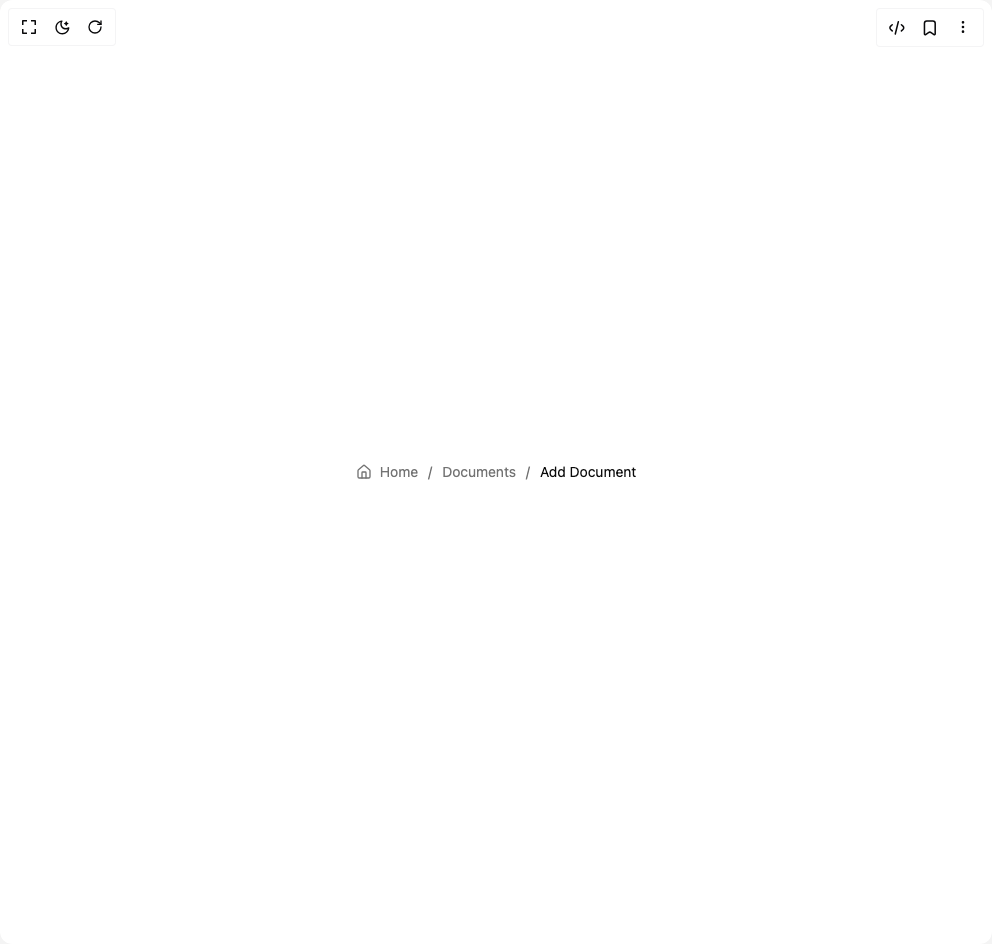

# Build Breadrcrumb in BuilderStudio

> Build this component in our Agentic IDE: [BuilderStudio](https://builderstudio.dev).
>
> Join the BuilderStudio community on [Discord](https://discord.gg/QdWeSGCqfe) and [Reddit](https://reddit.com/r/builderstudio).



## Component

- Author group: `shadcnstudio`
- Component: `breadrcrumb`
- Variant: `breadcrumb-one`
- Rendered HTML snapshot: [`rendered.html`](rendered.html)

## BuilderStudio prompt

You are implementing a React component based on a component reference.

## Component identity

- Author: ShadcnStudio
- Component slug: breadrcrumb
- Demo slug: breadcrumb-one
- Title: breadrcrumb
- Description: 

## Goal

Recreate this component in a React + TypeScript + Tailwind CSS project. Preserve the visual layout, spacing, colors, border radius, shadows, interaction behavior, animation behavior, responsive behavior, and dark mode behavior shown in the rendered demo.

## Implementation requirements

- Use React and TypeScript.
- Use Tailwind CSS classes whenever possible.
- Keep the component self-contained unless the source files require helper components.
- If the source uses CSS variables, custom CSS, animations, or keyframes, include them.
- If the source uses external packages, list and use the required packages.
- Preserve accessibility attributes, button semantics, links, keyboard behavior, and ARIA attributes when visible in the source.
- Do not replace the component with a simplified placeholder.
- Return complete production-ready code.

## Dependencies

No reference metadata available.

## Rendered DOM snapshot

This is the rendered demo HTML extracted from the live preview. Use it to verify structure, class names, visible content, and layout.

```html
<div id="root"><div class="w-screen min-h-screen flex justify-center items-center"><div class="w-screen min-h-screen flex justify-center items-center"><nav aria-label="breadcrumb"><ol class="flex flex-wrap items-center gap-1.5 break-words text-sm text-muted-foreground sm:gap-2.5"><li class="inline-flex items-center gap-1.5"><a class="transition-colors hover:text-foreground flex items-center gap-2" href="#"><svg xmlns="http://www.w3.org/2000/svg" width="24" height="24" viewBox="0 0 24 24" fill="none" stroke="currentColor" stroke-width="2" stroke-linecap="round" stroke-linejoin="round" class="lucide lucide-house size-4" aria-hidden="true"><path d="M15 21v-8a1 1 0 0 0-1-1h-4a1 1 0 0 0-1 1v8"></path><path d="M3 10a2 2 0 0 1 .709-1.528l7-5.999a2 2 0 0 1 2.582 0l7 5.999A2 2 0 0 1 21 10v9a2 2 0 0 1-2 2H5a2 2 0 0 1-2-2z"></path></svg>Home</a></li><li role="presentation" aria-hidden="true" class="[&amp;&gt;svg]:size-3.5"> / </li><li class="inline-flex items-center gap-1.5"><a class="transition-colors hover:text-foreground" href="#">Documents</a></li><li role="presentation" aria-hidden="true" class="[&amp;&gt;svg]:size-3.5"> / </li><li class="inline-flex items-center gap-1.5"><span role="link" aria-disabled="true" aria-current="page" class="font-normal text-foreground">Add Document</span></li></ol></nav></div></div></div>
```

## Reference source files

No reference source files were available.
