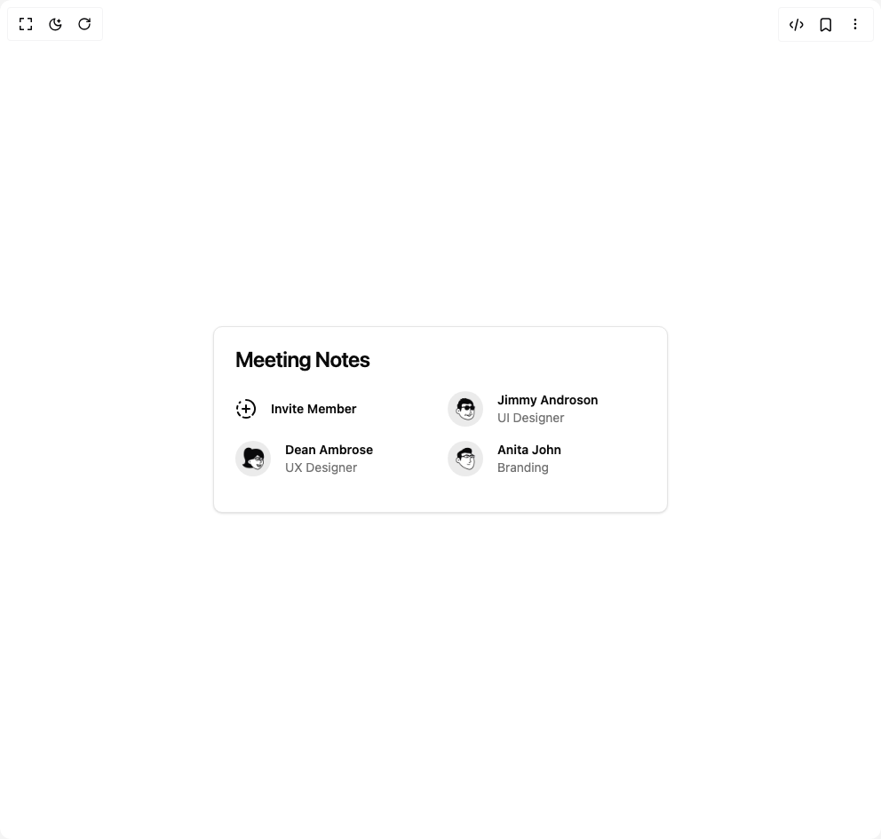

# Build Card Studio in BuilderStudio

> Build this component in our Agentic IDE: [BuilderStudio](https://builderstudio.dev).
>
> Join the BuilderStudio community on [Discord](https://discord.gg/QdWeSGCqfe) and [Reddit](https://reddit.com/r/builderstudio).



## Component

- Author group: `shadcnstudio`
- Component: `card-studio`
- Variant: `meeting-notes-one`
- Rendered HTML snapshot: [`rendered.html`](rendered.html)

## BuilderStudio prompt

You are implementing a React component based on a component reference.

## Component identity

- Author: ShadcnStudio
- Component slug: card-studio
- Demo slug: meeting-notes-one
- Title: card-studio
- Description: 

## Goal

Recreate this component in a React + TypeScript + Tailwind CSS project. Preserve the visual layout, spacing, colors, border radius, shadows, interaction behavior, animation behavior, responsive behavior, and dark mode behavior shown in the rendered demo.

## Implementation requirements

- Use React and TypeScript.
- Use Tailwind CSS classes whenever possible.
- Keep the component self-contained unless the source files require helper components.
- If the source uses CSS variables, custom CSS, animations, or keyframes, include them.
- If the source uses external packages, list and use the required packages.
- Preserve accessibility attributes, button semantics, links, keyboard behavior, and ARIA attributes when visible in the source.
- Do not replace the component with a simplified placeholder.
- Return complete production-ready code.

## Dependencies

No reference metadata available.

## Rendered DOM snapshot

This is the rendered demo HTML extracted from the live preview. Use it to verify structure, class names, visible content, and layout.

```html
<div id="root"><div class="w-screen min-h-screen flex justify-center items-center"><div class="w-screen min-h-screen flex justify-center items-center"><div class="rounded-lg border bg-card text-card-foreground shadow-sm w-full max-w-lg"><div class="flex flex-col space-y-1.5 p-6"><h3 class="text-2xl font-semibold leading-none tracking-tight">Meeting Notes</h3></div><div class="p-6 pt-0 grid gap-4 sm:grid-cols-2"><div class="flex items-center gap-4"><svg xmlns="http://www.w3.org/2000/svg" width="24" height="24" viewBox="0 0 24 24" fill="none" stroke="currentColor" stroke-width="2" stroke-linecap="round" stroke-linejoin="round" class="lucide lucide-circle-fading-plus" aria-hidden="true"><path d="M12 2a10 10 0 0 1 7.38 16.75"></path><path d="M12 8v8"></path><path d="M16 12H8"></path><path d="M2.5 8.875a10 10 0 0 0-.5 3"></path><path d="M2.83 16a10 10 0 0 0 2.43 3.4"></path><path d="M4.636 5.235a10 10 0 0 1 .891-.857"></path><path d="M8.644 21.42a10 10 0 0 0 7.631-.38"></path></svg><span class="text-sm font-semibold">Invite Member </span></div><div class="flex items-center gap-4"><span class="relative flex h-10 w-10 shrink-0 overflow-hidden rounded-full"></span><div class="flex flex-col"><span class="text-sm font-semibold">Jimmy Androson </span><span class="text-muted-foreground text-sm">UI Designer</span></div></div><div class="flex items-center gap-4"><span class="relative flex h-10 w-10 shrink-0 overflow-hidden rounded-full"></span><div class="flex flex-col"><span class="text-sm font-semibold">Dean Ambrose </span><span class="text-muted-foreground text-sm">UX Designer</span></div></div><div class="flex items-center gap-4"><span class="relative flex h-10 w-10 shrink-0 overflow-hidden rounded-full"></span><div class="flex flex-col"><span class="text-sm font-semibold">Anita John</span><span class="text-muted-foreground text-sm">Branding</span></div></div><div></div><div></div></div></div></div></div></div>
```

## Reference source files

No reference source files were available.
