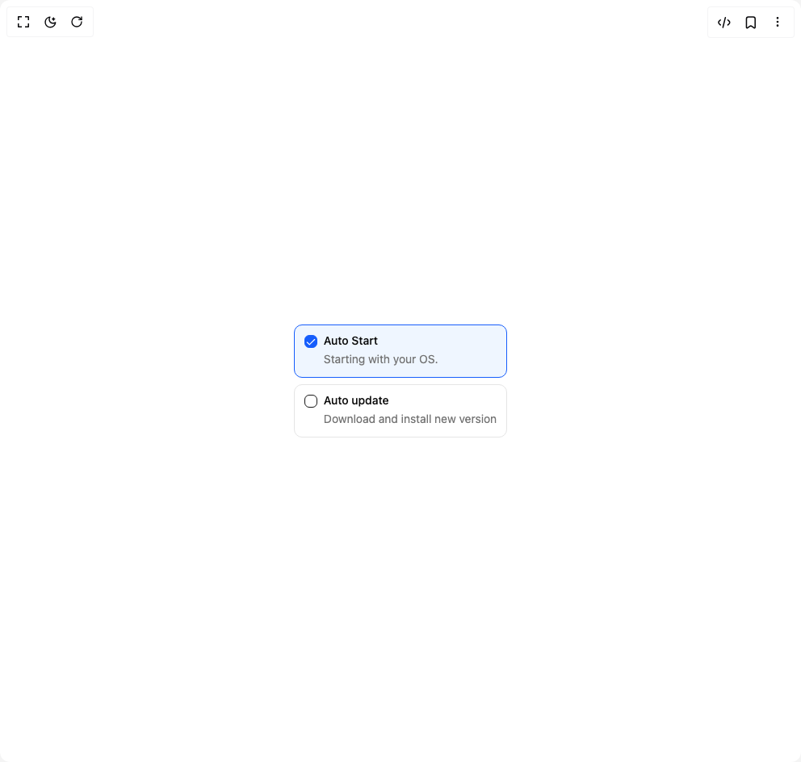

# Build Checkbox 1 in BuilderStudio

> Build this component in our Agentic IDE: [BuilderStudio](https://builderstudio.dev).
>
> Join the BuilderStudio community on [Discord](https://discord.gg/QdWeSGCqfe) and [Reddit](https://reddit.com/r/builderstudio).



## Component

- Author group: `shadcnstudio`
- Component: `checkbox-1`
- Variant: `checkbox-thirteen`
- Rendered HTML snapshot: [`rendered.html`](rendered.html)

## BuilderStudio prompt

You are implementing a React component based on a component reference.

## Component identity

- Author: ShadcnStudio
- Component slug: checkbox-1
- Demo slug: checkbox-thirteen
- Title: checkbox-1
- Description: 

## Goal

Recreate this component in a React + TypeScript + Tailwind CSS project. Preserve the visual layout, spacing, colors, border radius, shadows, interaction behavior, animation behavior, responsive behavior, and dark mode behavior shown in the rendered demo.

## Implementation requirements

- Use React and TypeScript.
- Use Tailwind CSS classes whenever possible.
- Keep the component self-contained unless the source files require helper components.
- If the source uses CSS variables, custom CSS, animations, or keyframes, include them.
- If the source uses external packages, list and use the required packages.
- Preserve accessibility attributes, button semantics, links, keyboard behavior, and ARIA attributes when visible in the source.
- Do not replace the component with a simplified placeholder.
- Return complete production-ready code.

## Dependencies

No reference metadata available.

## Rendered DOM snapshot

This is the rendered demo HTML extracted from the live preview. Use it to verify structure, class names, visible content, and layout.

```html
<div id="root"><div class="w-screen min-h-screen flex justify-center items-center"><div class="w-screen min-h-screen flex justify-center items-center"><div class="space-y-2"><label class="text-sm font-medium leading-none peer-disabled:cursor-not-allowed peer-disabled:opacity-70 hover:bg-accent/50 flex items-start gap-2 rounded-lg border p-3 has-[[aria-checked=true]]:border-blue-600 has-[[aria-checked=true]]:bg-blue-50 dark:has-[[aria-checked=true]]:border-blue-900 dark:has-[[aria-checked=true]]:bg-blue-950"><button type="button" role="checkbox" aria-checked="true" data-state="checked" value="on" class="peer h-4 w-4 shrink-0 rounded-sm border border-primary ring-offset-background focus-visible:outline-none focus-visible:ring-2 focus-visible:ring-ring focus-visible:ring-offset-2 disabled:cursor-not-allowed disabled:opacity-50 data-[state=checked]:border-blue-600 data-[state=checked]:bg-blue-600 data-[state=checked]:text-white dark:data-[state=checked]:border-blue-700 dark:data-[state=checked]:bg-blue-700"><span data-state="checked" class="flex items-center justify-center text-current" style="pointer-events: none;"><svg xmlns="http://www.w3.org/2000/svg" width="24" height="24" viewBox="0 0 24 24" fill="none" stroke="currentColor" stroke-width="2" stroke-linecap="round" stroke-linejoin="round" class="lucide lucide-check h-4 w-4" aria-hidden="true"><path d="M20 6 9 17l-5-5"></path></svg></span></button><div class="grid gap-1.5 font-normal"><p class="text-sm leading-none font-medium">Auto Start</p><p class="text-muted-foreground text-sm">Starting with your OS.</p></div></label><label class="text-sm font-medium leading-none peer-disabled:cursor-not-allowed peer-disabled:opacity-70 hover:bg-accent/50 flex items-start gap-2 rounded-lg border p-3 has-[[aria-checked=true]]:border-blue-600 has-[[aria-checked=true]]:bg-blue-50 dark:has-[[aria-checked=true]]:border-blue-900 dark:has-[[aria-checked=true]]:bg-blue-950"><button type="button" role="checkbox" aria-checked="false" data-state="unchecked" value="on" class="peer h-4 w-4 shrink-0 rounded-sm border border-primary ring-offset-background focus-visible:outline-none focus-visible:ring-2 focus-visible:ring-ring focus-visible:ring-offset-2 disabled:cursor-not-allowed disabled:opacity-50 data-[state=checked]:border-blue-600 data-[state=checked]:bg-blue-600 data-[state=checked]:text-white dark:data-[state=checked]:border-blue-700 dark:data-[state=checked]:bg-blue-700"></button><div class="grid gap-1.5 font-normal"><p class="text-sm leading-none font-medium">Auto update</p><p class="text-muted-foreground text-sm">Download and install new version</p></div></label></div></div></div></div>
```

## Reference source files

No reference source files were available.
