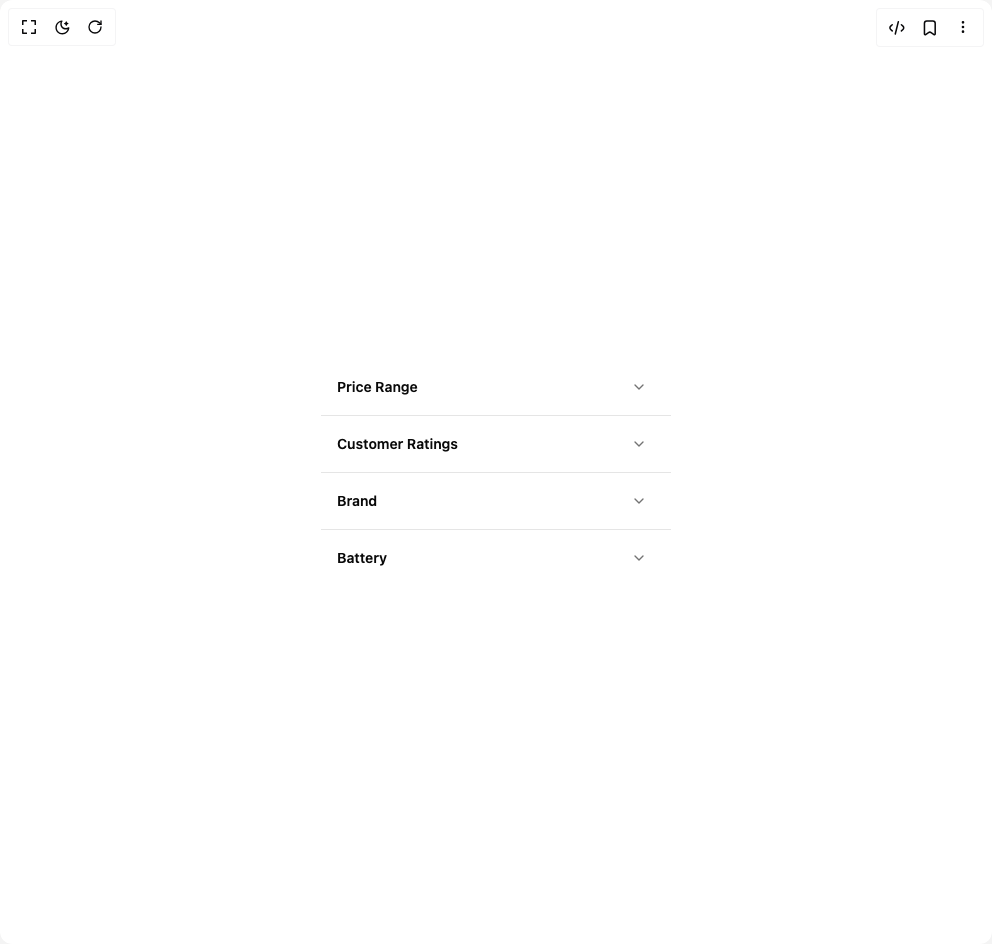

# Build Collapsible 1 in BuilderStudio

> Build this component in our Agentic IDE: [BuilderStudio](https://builderstudio.dev).
>
> Join the BuilderStudio community on [Discord](https://discord.gg/QdWeSGCqfe) and [Reddit](https://reddit.com/r/builderstudio).



## Component

- Author group: `shadcnstudio`
- Component: `collapsible-1`
- Variant: `collapsible-five`
- Rendered HTML snapshot: [`rendered.html`](rendered.html)

## BuilderStudio prompt

You are implementing a React component based on a component reference.

## Component identity

- Author: ShadcnStudio
- Component slug: collapsible-1
- Demo slug: collapsible-five
- Title: collapsible-1
- Description: 

## Goal

Recreate this component in a React + TypeScript + Tailwind CSS project. Preserve the visual layout, spacing, colors, border radius, shadows, interaction behavior, animation behavior, responsive behavior, and dark mode behavior shown in the rendered demo.

## Implementation requirements

- Use React and TypeScript.
- Use Tailwind CSS classes whenever possible.
- Keep the component self-contained unless the source files require helper components.
- If the source uses CSS variables, custom CSS, animations, or keyframes, include them.
- If the source uses external packages, list and use the required packages.
- Preserve accessibility attributes, button semantics, links, keyboard behavior, and ARIA attributes when visible in the source.
- Do not replace the component with a simplified placeholder.
- Return complete production-ready code.

## Dependencies

No reference metadata available.

## Rendered DOM snapshot

This is the rendered demo HTML extracted from the live preview. Use it to verify structure, class names, visible content, and layout.

```html
<div id="root"><div class="w-screen min-h-screen flex justify-center items-center"><div class="w-screen min-h-screen flex justify-center items-center"><div class="w-full max-w-[350px] space-y-3"><div data-state="closed" class="flex flex-col gap-2"><div class="flex items-center justify-between gap-4 px-4"><div class="text-sm font-semibold">Price Range</div><button class="inline-flex items-center justify-center whitespace-nowrap rounded-md text-sm font-medium ring-offset-background transition-colors focus-visible:outline-none focus-visible:ring-2 focus-visible:ring-ring focus-visible:ring-offset-2 disabled:pointer-events-none disabled:opacity-50 hover:bg-accent hover:text-accent-foreground group size-8" type="button" aria-controls="radix-«r0»" aria-expanded="false" data-state="closed"><svg xmlns="http://www.w3.org/2000/svg" width="24" height="24" viewBox="0 0 24 24" fill="none" stroke="currentColor" stroke-width="2" stroke-linecap="round" stroke-linejoin="round" class="lucide lucide-chevron-down text-muted-foreground size-4 transition-transform group-data-[state=open]:rotate-180" aria-hidden="true"><path d="m6 9 6 6 6-6"></path></svg><span class="sr-only">Toggle</span></button></div><div data-state="closed" id="radix-«r0»" hidden="" class="flex flex-col gap-2" style=""></div></div><div data-orientation="horizontal" role="none" class="shrink-0 bg-border h-[1px] w-full"></div><div data-state="closed" class="flex w-full max-w-[350px] flex-col gap-2"><div class="flex items-center justify-between gap-4 px-4"><div class="text-sm font-semibold">Customer Ratings</div><button class="inline-flex items-center justify-center whitespace-nowrap rounded-md text-sm font-medium ring-offset-background transition-colors focus-visible:outline-none focus-visible:ring-2 focus-visible:ring-ring focus-visible:ring-offset-2 disabled:pointer-events-none disabled:opacity-50 hover:bg-accent hover:text-accent-foreground group size-8" type="button" aria-controls="radix-«r1»" aria-expanded="false" data-state="closed"><svg xmlns="http://www.w3.org/2000/svg" width="24" height="24" viewBox="0 0 24 24" fill="none" stroke="currentColor" stroke-width="2" stroke-linecap="round" stroke-linejoin="round" class="lucide lucide-chevron-down text-muted-foreground size-4 transition-transform group-data-[state=open]:rotate-180" aria-hidden="true"><path d="m6 9 6 6 6-6"></path></svg><span class="sr-only">Toggle</span></button></div><div data-state="closed" id="radix-«r1»" hidden="" class="flex flex-col gap-2" style=""></div></div><div data-orientation="horizontal" role="none" class="shrink-0 bg-border h-[1px] w-full"></div><div data-state="closed" class="flex w-full max-w-[350px] flex-col gap-2"><div class="flex items-center justify-between gap-4 px-4"><div class="text-sm font-semibold">Brand</div><button class="inline-flex items-center justify-center whitespace-nowrap rounded-md text-sm font-medium ring-offset-background transition-colors focus-visible:outline-none focus-visible:ring-2 focus-visible:ring-ring focus-visible:ring-offset-2 disabled:pointer-events-none disabled:opacity-50 hover:bg-accent hover:text-accent-foreground group size-8" type="button" aria-controls="radix-«r2»" aria-expanded="false" data-state="closed"><svg xmlns="http://www.w3.org/2000/svg" width="24" height="24" viewBox="0 0 24 24" fill="none" stroke="currentColor" stroke-width="2" stroke-linecap="round" stroke-linejoin="round" class="lucide lucide-chevron-down text-muted-foreground size-4 transition-transform group-data-[state=open]:rotate-180" aria-hidden="true"><path d="m6 9 6 6 6-6"></path></svg><span class="sr-only">Toggle</span></button></div><div data-state="closed" id="radix-«r2»" hidden="" class="flex flex-col gap-2" style=""></div></div><div data-orientation="horizontal" role="none" class="shrink-0 bg-border h-[1px] w-full"></div><div data-state="closed" class="flex w-full max-w-[350px] flex-col gap-2"><div class="flex items-center justify-between gap-4 px-4"><div class="text-sm font-semibold">Battery</div><button class="inline-flex items-center justify-center whitespace-nowrap rounded-md text-sm font-medium ring-offset-background transition-colors focus-visible:outline-none focus-visible:ring-2 focus-visible:ring-ring focus-visible:ring-offset-2 disabled:pointer-events-none disabled:opacity-50 hover:bg-accent hover:text-accent-foreground group size-8" type="button" aria-controls="radix-«r3»" aria-expanded="false" data-state="closed"><svg xmlns="http://www.w3.org/2000/svg" width="24" height="24" viewBox="0 0 24 24" fill="none" stroke="currentColor" stroke-width="2" stroke-linecap="round" stroke-linejoin="round" class="lucide lucide-chevron-down text-muted-foreground size-4 transition-transform group-data-[state=open]:rotate-180" aria-hidden="true"><path d="m6 9 6 6 6-6"></path></svg><span class="sr-only">Toggle</span></button></div><div data-state="closed" id="radix-«r3»" hidden="" class="flex flex-col gap-2" style=""></div></div></div></div></div></div>
```

## Reference source files

No reference source files were available.
