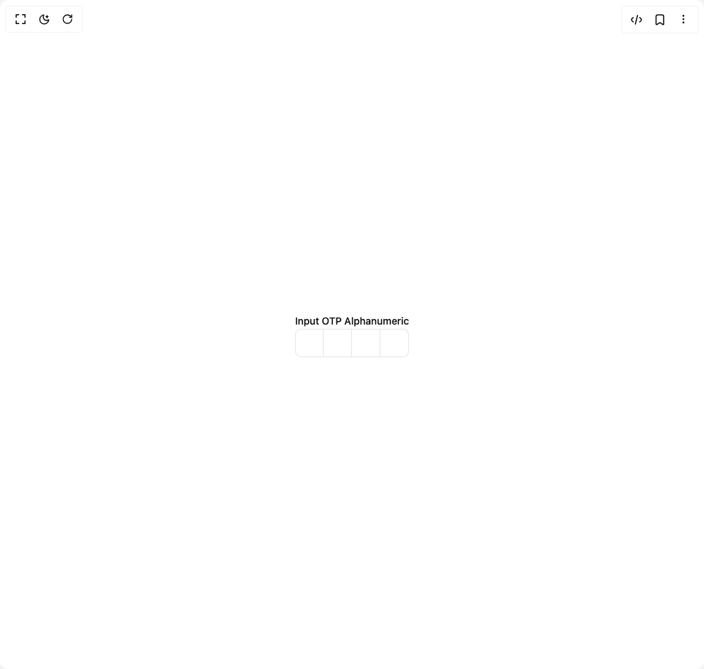

# Build Input Otps in BuilderStudio

> Build this component in our Agentic IDE: [BuilderStudio](https://builderstudio.dev).
>
> Join the BuilderStudio community on [Discord](https://discord.gg/QdWeSGCqfe) and [Reddit](https://reddit.com/r/builderstudio).



## Component

- Author group: `shadcnstudio`
- Component: `input-otps`
- Variant: `input-otp-alphanumeric`
- Rendered HTML snapshot: [`rendered.html`](rendered.html)

## BuilderStudio prompt

You are implementing a React component based on a component reference.

## Component identity

- Author: ShadcnStudio
- Component slug: input-otps
- Demo slug: input-otp-alphanumeric
- Title: input-otps
- Description: 

## Goal

Recreate this component in a React + TypeScript + Tailwind CSS project. Preserve the visual layout, spacing, colors, border radius, shadows, interaction behavior, animation behavior, responsive behavior, and dark mode behavior shown in the rendered demo.

## Implementation requirements

- Use React and TypeScript.
- Use Tailwind CSS classes whenever possible.
- Keep the component self-contained unless the source files require helper components.
- If the source uses CSS variables, custom CSS, animations, or keyframes, include them.
- If the source uses external packages, list and use the required packages.
- Preserve accessibility attributes, button semantics, links, keyboard behavior, and ARIA attributes when visible in the source.
- Do not replace the component with a simplified placeholder.
- Return complete production-ready code.

## Dependencies

No reference metadata available.

## Rendered DOM snapshot

This is the rendered demo HTML extracted from the live preview. Use it to verify structure, class names, visible content, and layout.

```html
<div id="root"><div class="w-screen min-h-screen flex justify-center items-center"><div class="w-screen min-h-screen flex justify-center items-center"><div class="space-y-3"><label class="text-sm font-medium leading-none peer-disabled:cursor-not-allowed peer-disabled:opacity-70" for="«r0»">Input OTP Alphanumeric</label><noscript></noscript><div data-input-otp-container="true" class="flex items-center gap-2 has-[:disabled]:opacity-50" style="position: relative; cursor: text; user-select: none; pointer-events: none; --root-height: 40px;"><div class="flex items-center"><div class="relative flex h-10 w-10 items-center justify-center border-y border-r border-input text-sm transition-all first:rounded-l-md first:border-l last:rounded-r-md"></div><div class="relative flex h-10 w-10 items-center justify-center border-y border-r border-input text-sm transition-all first:rounded-l-md first:border-l last:rounded-r-md"></div><div class="relative flex h-10 w-10 items-center justify-center border-y border-r border-input text-sm transition-all first:rounded-l-md first:border-l last:rounded-r-md"></div><div class="relative flex h-10 w-10 items-center justify-center border-y border-r border-input text-sm transition-all first:rounded-l-md first:border-l last:rounded-r-md"></div></div><div style="position: absolute; inset: 0px; pointer-events: none;"><input autocomplete="one-time-code" class="disabled:cursor-not-allowed" id="«r0»" data-input-otp="true" data-input-otp-placeholder-shown="true" inputmode="numeric" pattern="^[a-zA-Z0-9]+$" maxlength="4" value="" data-input-otp-mss="0" data-input-otp-mse="0" style="position: absolute; inset: 0px; width: 100%; height: 100%; display: flex; text-align: left; opacity: 1; color: transparent; pointer-events: all; background: transparent; caret-color: transparent; border: 0px solid transparent; outline: transparent solid 0px; box-shadow: none; line-height: 1; letter-spacing: -0.5em; font-size: var(--root-height); font-family: monospace; font-variant-numeric: tabular-nums;"></div></div></div></div></div></div>
```

## Reference source files

No reference source files were available.
