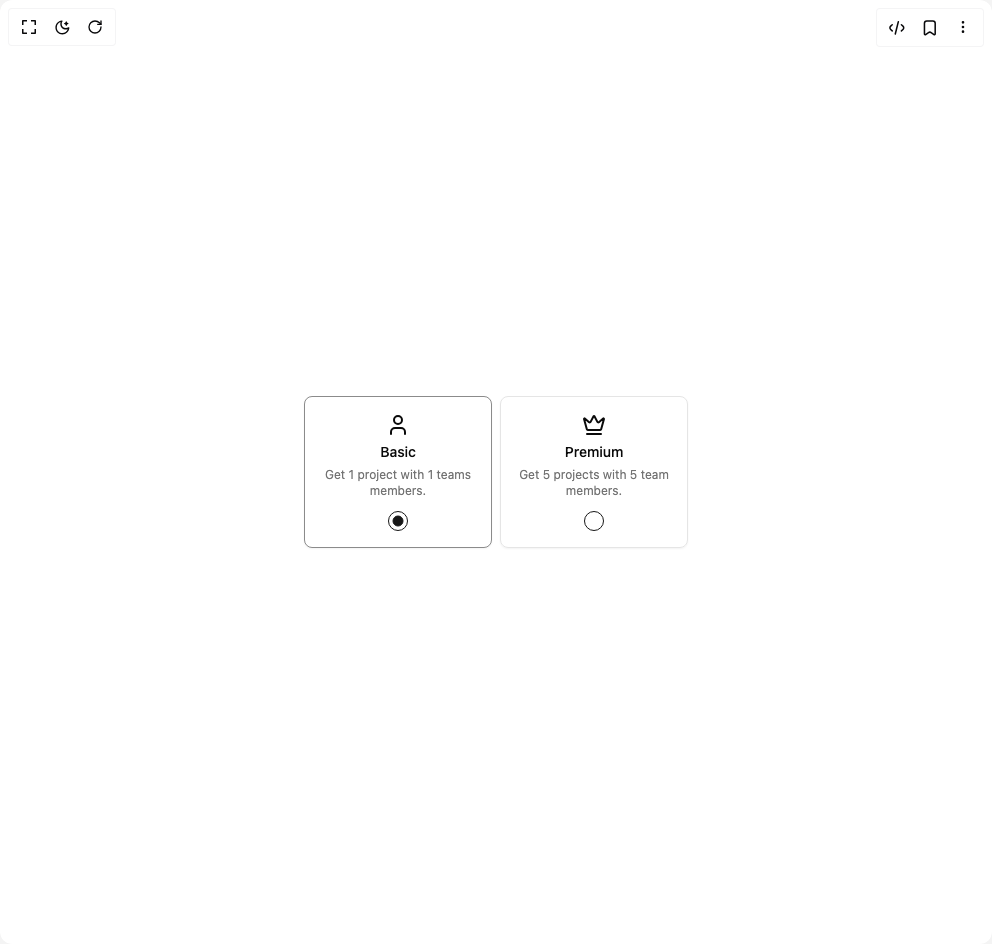

# Build Radio Group 1 in BuilderStudio

> Build this component in our Agentic IDE: [BuilderStudio](https://builderstudio.dev).
>
> Join the BuilderStudio community on [Discord](https://discord.gg/QdWeSGCqfe) and [Reddit](https://reddit.com/r/builderstudio).



## Component

- Author group: `shadcnstudio`
- Component: `radio-group-1`
- Variant: `radio-group-thirtheen`
- Rendered HTML snapshot: [`rendered.html`](rendered.html)

## BuilderStudio prompt

You are implementing a React component based on a component reference.

## Component identity

- Author: ShadcnStudio
- Component slug: radio-group-1
- Demo slug: radio-group-thirtheen
- Title: radio-group-1
- Description: 

## Goal

Recreate this component in a React + TypeScript + Tailwind CSS project. Preserve the visual layout, spacing, colors, border radius, shadows, interaction behavior, animation behavior, responsive behavior, and dark mode behavior shown in the rendered demo.

## Implementation requirements

- Use React and TypeScript.
- Use Tailwind CSS classes whenever possible.
- Keep the component self-contained unless the source files require helper components.
- If the source uses CSS variables, custom CSS, animations, or keyframes, include them.
- If the source uses external packages, list and use the required packages.
- Preserve accessibility attributes, button semantics, links, keyboard behavior, and ARIA attributes when visible in the source.
- Do not replace the component with a simplified placeholder.
- Return complete production-ready code.

## Dependencies

No reference metadata available.

## Rendered DOM snapshot

This is the rendered demo HTML extracted from the live preview. Use it to verify structure, class names, visible content, and layout.

```html
<div id="root"><div class="w-screen min-h-screen flex justify-center items-center"><div class="w-screen min-h-screen flex justify-center items-center"><div role="radiogroup" aria-required="false" dir="ltr" class="grid gap-2 w-full max-w-96 justify-items-center sm:grid-cols-2" tabindex="0" style="outline: none;"><div class="border-input has-data-[state=checked]:border-primary/50 relative flex w-full max-w-50 flex-col items-center gap-3 rounded-md border p-4 shadow-xs outline-none"><button type="button" role="radio" aria-checked="true" data-state="checked" value="1" class="aspect-square rounded-full border border-primary text-primary ring-offset-background focus:outline-none focus-visible:ring-2 focus-visible:ring-ring focus-visible:ring-offset-2 disabled:cursor-not-allowed disabled:opacity-50 order-1 size-5 after:absolute after:inset-0 [&amp;_svg]:size-3" id="«r0»-1" aria-describedby="«r0»-1-description" aria-label="plan-radio-basic" tabindex="-1" data-radix-collection-item=""><span data-state="checked" class="flex items-center justify-center"><svg xmlns="http://www.w3.org/2000/svg" width="24" height="24" viewBox="0 0 24 24" fill="none" stroke="currentColor" stroke-width="2" stroke-linecap="round" stroke-linejoin="round" class="lucide lucide-circle h-2.5 w-2.5 fill-current text-current" aria-hidden="true"><circle cx="12" cy="12" r="10"></circle></svg></span></button><div class="grid grow justify-items-center gap-2"><svg xmlns="http://www.w3.org/2000/svg" width="24" height="24" viewBox="0 0 24 24" fill="none" stroke="currentColor" stroke-width="2" stroke-linecap="round" stroke-linejoin="round" class="lucide lucide-user" aria-hidden="true"><path d="M19 21v-2a4 4 0 0 0-4-4H9a4 4 0 0 0-4 4v2"></path><circle cx="12" cy="7" r="4"></circle></svg><label class="text-sm font-medium leading-none peer-disabled:cursor-not-allowed peer-disabled:opacity-70 justify-center" for="«r0»-1">Basic</label><p id="«r0»-1-description" class="text-muted-foreground text-center text-xs">Get 1 project with 1 teams members.</p></div></div><div class="border-input has-data-[state=checked]:border-primary/50 relative flex w-full max-w-50 flex-col items-center gap-3 rounded-md border p-4 shadow-xs outline-none"><button type="button" role="radio" aria-checked="false" data-state="unchecked" value="2" class="aspect-square rounded-full border border-primary text-primary ring-offset-background focus:outline-none focus-visible:ring-2 focus-visible:ring-ring focus-visible:ring-offset-2 disabled:cursor-not-allowed disabled:opacity-50 order-1 size-5 after:absolute after:inset-0 [&amp;_svg]:size-3" id="«r0»-2" aria-describedby="«r0»-2-description" aria-label="plan-radio-premium" tabindex="-1" data-radix-collection-item=""></button><div class="grid grow justify-items-center gap-2"><svg xmlns="http://www.w3.org/2000/svg" width="24" height="24" viewBox="0 0 24 24" fill="none" stroke="currentColor" stroke-width="2" stroke-linecap="round" stroke-linejoin="round" class="lucide lucide-crown" aria-hidden="true"><path d="M11.562 3.266a.5.5 0 0 1 .876 0L15.39 8.87a1 1 0 0 0 1.516.294L21.183 5.5a.5.5 0 0 1 .798.519l-2.834 10.246a1 1 0 0 1-.956.734H5.81a1 1 0 0 1-.957-.734L2.02 6.02a.5.5 0 0 1 .798-.519l4.276 3.664a1 1 0 0 0 1.516-.294z"></path><path d="M5 21h14"></path></svg><label class="text-sm font-medium leading-none peer-disabled:cursor-not-allowed peer-disabled:opacity-70 justify-center" for="«r0»-2">Premium</label><p id="«r0»-2-description" class="text-muted-foreground text-center text-xs">Get 5 projects with 5 team members.</p></div></div></div></div></div></div>
```

## Reference source files

No reference source files were available.
