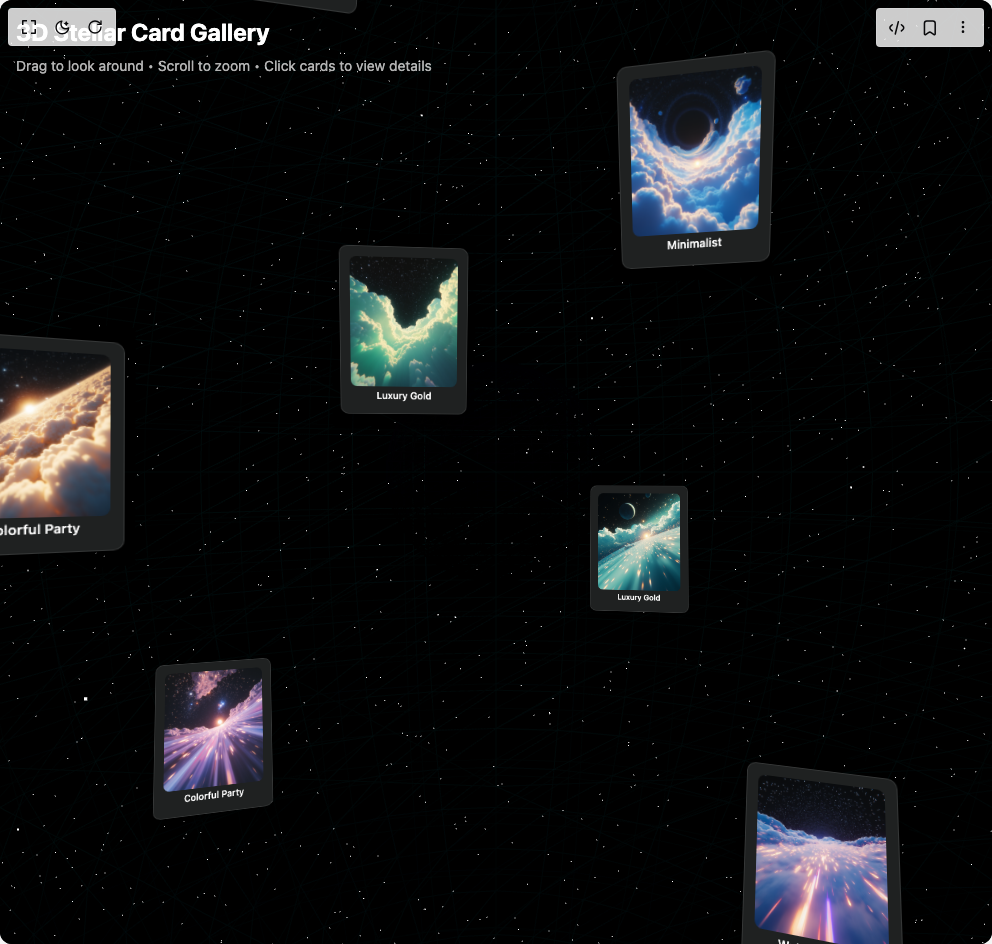

# Build 3d Image Gallery in BuilderStudio

> Build this component in our Agentic IDE: [BuilderStudio](https://builderstudio.dev).
>
> Join the BuilderStudio community on [Discord](https://discord.gg/QdWeSGCqfe) and [Reddit](https://reddit.com/r/builderstudio).



## Component

- Author group: `shadway`
- Component: `3d-image-gallery`
- Variant: `default`
- Rendered HTML snapshot: [`rendered.html`](rendered.html)

## BuilderStudio prompt

You are implementing a React component based on a component reference.

## Component identity

- Author: shadway
- Component slug: 3d-image-gallery
- Demo slug: default
- Title: 3d-image-gallery
- Description: 

## Goal

Recreate this component in a React + TypeScript + Tailwind CSS project. Preserve the visual layout, spacing, colors, border radius, shadows, interaction behavior, animation behavior, responsive behavior, and dark mode behavior shown in the rendered demo.

## Implementation requirements

- Use React and TypeScript.
- Use Tailwind CSS classes whenever possible.
- Keep the component self-contained unless the source files require helper components.
- If the source uses CSS variables, custom CSS, animations, or keyframes, include them.
- If the source uses external packages, list and use the required packages.
- Preserve accessibility attributes, button semantics, links, keyboard behavior, and ARIA attributes when visible in the source.
- Do not replace the component with a simplified placeholder.
- Return complete production-ready code.

## Dependencies

No reference metadata available.

## Rendered DOM snapshot

This is the rendered demo HTML extracted from the live preview. Use it to verify structure, class names, visible content, and layout.

```html
<div id="root"><div class="w-screen min-h-screen flex justify-center items-center"><div class="w-screen min-h-screen flex justify-center items-center"><div class="w-full h-screen relative overflow-hidden bg-black"><div class="fixed top-0 left-0 w-full h-full z-0 bg-black"><canvas data-engine="three.js r179" width="992" height="944" style="display: block; width: 992px; height: 944px;"></canvas></div><div class="absolute inset-0 z-10" style="position: relative; width: 100%; height: 100%; overflow: hidden; pointer-events: auto; touch-action: none;"><div style="width: 100%; height: 100%;"><canvas data-engine="three.js r179" width="992" height="944" style="display: block; width: 992px; height: 944px;"></canvas></div><div style="position: absolute; top: 0px; left: 0px; pointer-events: none; overflow: hidden; z-index: 16456804; width: 992px; height: 944px; perspective: 817.528px;"><div style="position: absolute; top: 0px; left: 0px; width: 992px; height: 944px; transform-style: preserve-3d; pointer-events: none; transform: translateZ(817.528px) matrix3d(1, 0, 0, 0, 0, -1, 0, 0, 0, 0, 1, 0, 0, 0, -15, 1) translate(496px, 472px);"><div style="position: absolute; pointer-events: auto; transform: translate(-50%, -50%) matrix3d(0.025, 0, 0, 0, 0, -0.0195217, -0.0156174, 0, 0, -0.0156174, 0.0195217, 0, 0, 11.9938, 0.00780869, 1);"><div style="transition: 0.3s; transform: scale(1); pointer-events: none;"><div class="w-40 h-52 rounded-lg overflow-hidden shadow-2xl bg-[#1F2121] p-3 select-none" style="box-shadow: rgba(0, 0, 0, 0.6) 0px 15px 30px; border: 1px solid rgba(255, 255, 255, 0.1);"><div class="mt-1 text-center"><p class="text-white text-xs font-medium truncate">Elegant Invitation</p></div></div></div></div></div></div><div style="position: absolute; top: 0px; left: 0px; pointer-events: none; overflow: hidden; z-index: 16359374; width: 992px; height: 944px; perspective: 817.528px;"><div style="position: absolute; top: 0px; left: 0px; width: 992px; height: 944px; transform-style: preserve-3d; pointer-events: none; transform: translateZ(817.528px) matrix3d(1, 0, 0, 0, 0, -1, 0, 0, 0, 0, 1, 0, 0, 0, -15, 1) translate(496px, 472px);"><div style="position: absolute; pointer-events: auto; transform: translate(-50%, -50%) matrix3d(0.0241614, 0, -0.00642079, 0, -0.00367439, -0.0205017, -0.0138267, 0, 0.00526549, -0.0143066, 0.019814, 0, -5.26676, 14.3101, -4.81879, 1);"><div style="transition: 0.3s; transform: scale(1); pointer-events: none;"><div class="w-40 h-52 rounded-lg overflow-hidden shadow-2xl bg-[#1F2121] p-3 select-none" style="box-shadow: rgba(0, 0, 0, 0.6) 0px 15px 30px; border: 1px solid rgba(255, 255, 255, 0.1);"><div class="mt-1 text-center"><p class="text-white text-xs font-medium truncate">Modern Design</p></div></div></div></div></div></div><div style="position: absolute; top: 0px; left: 0px; pointer-events: none; overflow: hidden; z-index: 16509534; width: 992px; height: 944px; perspective: 817.528px;"><div style="position: absolute; top: 0px; left: 0px; width: 992px; height: 944px; transform-style: preserve-3d; pointer-events: none; transform: translateZ(817.528px) matrix3d(1, 0, 0, 0, 0, -1, 0, 0, 0, 0, 1, 0, 0, 0, -15, 1) translate(496px, 472px);"><div style="position: absolute; pointer-events: auto; transform: translate(-50%, -50%) matrix3d(0.0233129, 0, 0.0090281, 0, 0.00887231, -0.00462425, -0.0229107, 0, -0.00166993, -0.0245686, 0.0043122, 0, 1.07254, 15.7796, 12.2304, 1);"><div style="transition: 0.3s; transform: scale(1); pointer-events: none;"><div class="w-40 h-52 rounded-lg overflow-hidden shadow-2xl bg-[#1F2121] p-3 select-none" style="box-shadow: rgba(0, 0, 0, 0.6) 0px 15px 30px; border: 1px solid rgba(255, 255, 255, 0.1);"><div class="mt-1 text-center"><p class="text-white text-xs font-medium truncate">Vintage Style</p></div></div></div></div></div></div><div style="position: absolute; top: 0px; left: 0px; pointer-events: none; overflow: hidden; z-index: 16375949; width: 992px; height: 944px; perspective: 817.528px;"><div style="position: absolute; top: 0px; left: 0px; width: 992px; height: 944px; transform-style: preserve-3d; pointer-events: none; transform: translateZ(817.528px) matrix3d(1, 0, 0, 0, 0, -1, 0, 0, 0, 0, 1, 0, 0, 0, -15, 1) translate(496px, 472px);"><div style="position: absolute; pointer-events: auto; transform: translate(-50%, -50%) matrix3d(0.0242951, 0, 0.00589488, 0, 0.0020143, -0.0234952, -0.00830172, 0, -0.00554006, -0.0085426, 0.0228327, 0, 5.32248, 8.20711, -6.936, 1);"><div style="transition: 0.3s; transform: scale(1); pointer-events: none;"><div class="w-40 h-52 rounded-lg overflow-hidden shadow-2xl bg-[#1F2121] p-3 select-none" style="box-shadow: rgba(0, 0, 0, 0.6) 0px 15px 30px; border: 1px solid rgba(255, 255, 255, 0.1);"><div class="mt-1 text-center"><p class="text-white text-xs font-medium truncate">Minimalist</p></div></div></div></div></div></div><div style="position: absolute; top: 0px; left: 0px; pointer-events: none; overflow: hidden; z-index: 16438199; width: 992px; height: 944px; perspective: 817.528px;"><div style="position: absolute; top: 0px; left: 0px; width: 992px; height: 944px; transform-style: preserve-3d; pointer-events: none; transform: translateZ(817.528px) matrix3d(1, 0, 0, 0, 0, -1, 0, 0, 0, 0, 1, 0, 0, 0, -15, 1) translate(496px, 472px);"><div style="position: absolute; pointer-events: auto; transform: translate(-50%, -50%) matrix3d(0.0175954, 0, -0.0177596, 0, -0.00809666, -0.0222507, -0.00802181, 0, 0.0158065, -0.0113976, 0.0156604, 0, -12.8401, 9.2586, 2.27861, 1);"><div style="transition: 0.3s; transform: scale(1); pointer-events: none;"><div class="w-40 h-52 rounded-lg overflow-hidden shadow-2xl bg-[#1F2121] p-3 select-none" style="box-shadow: rgba(0, 0, 0, 0.6) 0px 15px 30px; border: 1px solid rgba(255, 255, 255, 0.1);"><div class="mt-1 text-center"><p class="text-white text-xs font-medium truncate">Floral Design</p></div></div></div></div></div></div><div style="position: absolute; top: 0px; left: 0px; pointer-events: none; overflow: hidden; z-index: 16469099; width: 992px; height: 944px; perspective: 817.528px;"><div style="position: absolute; top: 0px; left: 0px; width: 992px; height: 944px; transform-style: preserve-3d; pointer-events: none; transform: translateZ(817.528px) matrix3d(1, 0, 0, 0, 0, -1, 0, 0, 0, 0, 1, 0, 0, 0, -15, 1) translate(496px, 472px);"><div style="position: absolute; pointer-events: auto; transform: translate(-50%, -50%) matrix3d(0.0087407, 0, 0.0234222, 0, 0.0120095, -0.0214636, -0.00448171, 0, -0.020109, -0.0128185, 0.00750427, 0, 14.8538, 9.46856, 9.45687, 1);"><div style="transition: 0.3s; transform: scale(1); pointer-events: none;"><div class="w-40 h-52 rounded-lg overflow-hidden shadow-2xl bg-[#1F2121] p-3 select-none" style="box-shadow: rgba(0, 0, 0, 0.6) 0px 15px 30px; border: 1px solid rgba(255, 255, 255, 0.1);"><div class="mt-1 text-center"><p class="text-white text-xs font-medium truncate">Geometric</p></div></div></div></div></div></div><div style="position: absolute; top: 0px; left: 0px; pointer-events: none; overflow: hidden; z-index: 16337667; width: 992px; height: 944px; perspective: 817.528px;"><div style="position: absolute; top: 0px; left: 0px; width: 992px; height: 944px; transform-style: preserve-3d; pointer-events: none; transform: translateZ(817.528px) matrix3d(1, 0, 0, 0, 0, -1, 0, 0, 0, 0, 1, 0, 0, 0, -15, 1) translate(496px, 472px);"><div style="position: absolute; pointer-events: auto; transform: translate(-50%, -50%) matrix3d(0.0248436, 0, -0.00279164, 0, -0.000469104, -0.0246445, -0.00417469, 0, 0.00275195, -0.00420096, 0.0244904, 0, -2.89502, 4.41937, -10.7636, 1);"><div style="transition: 0.3s; transform: scale(1); pointer-events: none;"><div class="w-40 h-52 rounded-lg overflow-hidden shadow-2xl bg-[#1F2121] p-3 select-none" style="box-shadow: rgba(0, 0, 0, 0.6) 0px 15px 30px; border: 1px solid rgba(255, 255, 255, 0.1);"><div class="mt-1 text-center"><p class="text-white text-xs font-medium truncate">Luxury Gold</p></div></div></div></div></div></div><div style="position: absolute; top: 0px; left: 0px; pointer-events: none; overflow: hidden; z-index: 16638695; width: 992px; height: 944px; perspective: 817.528px;"><div style="position: absolute; top: 0px; left: 0px; width: 992px; height: 944px; transform-style: preserve-3d; pointer-events: none; transform: translateZ(817.528px) matrix3d(1, 0, 0, 0, 0, -1, 0, 0, 0, 0, 1, 0, 0, 0, -15, 1) translate(496px, 472px);"><div style="position: absolute; pointer-events: auto; transform: translate(-50%, -50%) matrix3d(0.00449805, 0, -0.024592, 0, -0.0123726, -0.0216055, -0.00226303, 0, 0.0212529, -0.0125778, 0.00388731, 0, -7.10608, 4.2055, 13.7002, 1);"><div style="transition: 0.3s; transform: scale(1); pointer-events: none;"><div class="w-40 h-52 rounded-lg overflow-hidden shadow-2xl bg-[#1F2121] p-3 select-none" style="box-shadow: rgba(0, 0, 0, 0.6) 0px 15px 30px; border: 1px solid rgba(255, 255, 255, 0.1);"><div class="mt-1 text-center"><p class="text-white text-xs font-medium truncate">Rustic Style</p></div></div></div></div></div></div><div style="position: absolute; top: 0px; left: 0px; pointer-events: none; overflow: hidden; z-index: 16296232; width: 992px; height: 944px; perspective: 817.528px;"><div style="position: absolute; top: 0px; left: 0px; width: 992px; height: 944px; transform-style: preserve-3d; pointer-events: none; transform: translateZ(817.528px) matrix3d(1, 0, 0, 0, 0, -1, 0, 0, 0, 0, 1, 0, 0, 0, -15, 1) translate(496px, 472px);"><div style="position: absolute; pointer-events: auto; transform: translate(-50%, -50%) matrix3d(0.0190302, 0, 0.0162126, 0, 0.00177899, -0.024849, -0.00208816, 0, -0.0161147, -0.00274321, 0.0189153, 0, 18.5443, 3.1568, -6.76714, 1);"><div style="transition: 0.3s; transform: scale(1); pointer-events: none;"><div class="w-40 h-52 rounded-lg overflow-hidden shadow-2xl bg-[#1F2121] p-3 select-none" style="box-shadow: rgba(0, 0, 0, 0.6) 0px 15px 30px; border: 1px solid rgba(255, 255, 255, 0.1);"><div class="mt-1 text-center"><p class="text-white text-xs font-medium truncate">Dark Modern</p></div></div></div></div></div></div><div style="position: absolute; top: 0px; left: 0px; pointer-events: none; overflow: hidden; z-index: 16401620; width: 992px; height: 944px; perspective: 817.528px;"><div style="position: absolute; top: 0px; left: 0px; width: 992px; height: 944px; transform-style: preserve-3d; pointer-events: none; transform: translateZ(817.528px) matrix3d(1, 0, 0, 0, 0, -1, 0, 0, 0, 0, 1, 0, 0, 0, -15, 1) translate(496px, 472px);"><div style="position: absolute; pointer-events: auto; transform: translate(-50%, -50%) matrix3d(0.0217573, 0, -0.0123134, 0, -0.000345665, -0.0249901, -0.00061078, 0, 0.0123085, -0.00070181, 0.0217488, 0, -11.0718, 0.631298, -4.56363, 1);"><div style="transition: 0.3s; transform: scale(1); pointer-events: none;"><div class="w-40 h-52 rounded-lg overflow-hidden shadow-2xl bg-[#1F2121] p-3 select-none" style="box-shadow: rgba(0, 0, 0, 0.6) 0px 15px 30px; border: 1px solid rgba(255, 255, 255, 0.1);"><div class="mt-1 text-center"><p class="text-white text-xs font-medium truncate">Colorful Party</p></div></div></div></div></div></div><div style="position: absolute; top: 0px; left: 0px; pointer-events: none; overflow: hidden; z-index: 16664270; width: 992px; height: 944px; perspective: 817.528px;"><div style="position: absolute; top: 0px; left: 0px; width: 992px; height: 944px; transform-style: preserve-3d; pointer-events: none; transform: translateZ(817.528px) matrix3d(1, 0, 0, 0, 0, -1, 0, 0, 0, 0, 1, 0, 0, 0, -15, 1) translate(496px, 472px);"><div style="position: absolute; pointer-events: auto; transform: translate(-50%, -50%) matrix3d(0.0019445, 0, 0.0249243, 0, -0.00306643, -0.0248101, 0.000239232, 0, -0.0247349, 0.00307575, 0.00192973, 0, 6.76224, -0.840875, 14.4724, 1);"><div style="transition: 0.3s; transform: scale(1); pointer-events: none;"><div class="w-40 h-52 rounded-lg overflow-hidden shadow-2xl bg-[#1F2121] p-3 select-none" style="box-shadow: rgba(0, 0, 0, 0.6) 0px 15px 30px; border: 1px solid rgba(255, 255, 255, 0.1);"><div class="mt-1 text-center"><p class="text-white text-xs font-medium truncate">Geometric</p></div></div></div></div></div></div><div style="position: absolute; top: 0px; left: 0px; pointer-events: none; overflow: hidden; z-index: 16200227; width: 992px; height: 944px; perspective: 817.528px;"><div style="position: absolute; top: 0px; left: 0px; width: 992px; height: 944px; transform-style: preserve-3d; pointer-events: none; transform: translateZ(817.528px) matrix3d(1, 0, 0, 0, 0, -1, 0, 0, 0, 0, 1, 0, 0, 0, -15, 1) translate(496px, 472px);"><div style="position: absolute; pointer-events: auto; transform: translate(-50%, -50%) matrix3d(0.0246273, 0, 0.00430097, 0, -0.000393671, -0.0248951, 0.00225415, 0, -0.00428292, 0.00228827, 0.0245239, 0, 5.90888, -3.15698, -18.8341, 1);"><div style="transition: 0.3s; transform: scale(1); pointer-events: none;"><div class="w-40 h-52 rounded-lg overflow-hidden shadow-2xl bg-[#1F2121] p-3 select-none" style="box-shadow: rgba(0, 0, 0, 0.6) 0px 15px 30px; border: 1px solid rgba(255, 255, 255, 0.1);"><div class="mt-1 text-center"><p class="text-white text-xs font-medium truncate">Luxury Gold</p></div></div></div></div></div></div><div style="position: absolute; top: 0px; left: 0px; pointer-events: none; overflow: hidden; z-index: 16544898; width: 992px; height: 944px; perspective: 817.528px;"><div style="position: absolute; top: 0px; left: 0px; width: 992px; height: 944px; transform-style: preserve-3d; pointer-events: none; transform: translateZ(817.528px) matrix3d(1, 0, 0, 0, 0, -1, 0, 0, 0, 0, 1, 0, 0, 0, -15, 1) translate(496px, 472px);"><div style="position: absolute; pointer-events: auto; transform: translate(-50%, -50%) matrix3d(0.0169064, 0, -0.0184166, 0, 0.00416631, -0.0243519, 0.00382466, 0, 0.0179392, 0.00565563, 0.0164681, 0, -10.0094, -3.15563, 5.8114, 1);"><div style="transition: 0.3s; transform: scale(1); pointer-events: none;"><div class="w-40 h-52 rounded-lg overflow-hidden shadow-2xl bg-[#1F2121] p-3 select-none" style="box-shadow: rgba(0, 0, 0, 0.6) 0px 15px 30px; border: 1px solid rgba(255, 255, 255, 0.1);"><div class="mt-1 text-center"><p class="text-white text-xs font-medium truncate">Rustic Style</p></div></div></div></div></div></div><div style="position: absolute; top: 0px; left: 0px; pointer-events: none; overflow: hidden; z-index: 16449811; width: 992px; height: 944px; perspective: 817.528px;"><div style="position: absolute; top: 0px; left: 0px; width: 992px; height: 944px; transform-style: preserve-3d; pointer-events: none; transform: translateZ(817.528px) matrix3d(1, 0, 0, 0, 0, -1, 0, 0, 0, 0, 1, 0, 0, 0, -15, 1) translate(496px, 472px);"><div style="position: absolute; pointer-events: auto; transform: translate(-50%, -50%) matrix3d(0.0157668, 0, 0.0194012, 0, -0.00582719, -0.0238457, 0.00473558, 0, -0.0185055, 0.00750879, 0.0150388, 0, 14.5202, -5.89173, 3.19987, 1);"><div style="transition: 0.3s; transform: scale(1); pointer-events: none;"><div class="w-40 h-52 rounded-lg overflow-hidden shadow-2xl bg-[#1F2121] p-3 select-none" style="box-shadow: rgba(0, 0, 0, 0.6) 0px 15px 30px; border: 1px solid rgba(255, 255, 255, 0.1);"><div class="mt-1 text-center"><p class="text-white text-xs font-medium truncate">Dark Modern</p></div></div></div></div></div></div><div style="position: absolute; top: 0px; left: 0px; pointer-events: none; overflow: hidden; z-index: 16233536; width: 992px; height: 944px; perspective: 817.528px;"><div style="position: absolute; top: 0px; left: 0px; width: 992px; height: 944px; transform-style: preserve-3d; pointer-events: none; transform: translateZ(817.528px) matrix3d(1, 0, 0, 0, 0, -1, 0, 0, 0, 0, 1, 0, 0, 0, -15, 1) translate(496px, 472px);"><div style="position: absolute; pointer-events: auto; transform: translate(-50%, -50%) matrix3d(0.023637, 0, -0.00814197, 0, 0.00237221, -0.0239154, 0.00688679, 0, 0.00778873, 0.00728391, 0.0226115, 0, -10.1272, -9.47077, -14.4002, 1);"><div style="transition: 0.3s; transform: scale(1); pointer-events: none;"><div class="w-40 h-52 rounded-lg overflow-hidden shadow-2xl bg-[#1F2121] p-3 select-none" style="box-shadow: rgba(0, 0, 0, 0.6) 0px 15px 30px; border: 1px solid rgba(255, 255, 255, 0.1);"><div class="mt-1 text-center"><p class="text-white text-xs font-medium truncate">Colorful Party</p></div></div></div></div></div></div><div style="position: absolute; top: 0px; left: 0px; pointer-events: none; overflow: hidden; z-index: 16631022; width: 992px; height: 944px; perspective: 817.528px;"><div style="position: absolute; top: 0px; left: 0px; width: 992px; height: 944px; transform-style: preserve-3d; pointer-events: none; transform: translateZ(817.528px) matrix3d(1, 0, 0, 0, 0, -1, 0, 0, 0, 0, 1, 0, 0, 0, -15, 1) translate(496px, 472px);"><div style="position: absolute; pointer-events: auto; transform: translate(-50%, -50%) matrix3d(0.024324, 0, -0.00577428, 0, 0.00454509, -0.0154198, 0.0191461, 0, 0.00356153, 0.0196782, 0.0150029, 0, -1.25597, -6.9395, 9.70925, 1);"><div style="transition: 0.3s; transform: scale(1); pointer-events: none;"><div class="w-40 h-52 rounded-lg overflow-hidden shadow-2xl bg-[#1F2121] p-3 select-none" style="box-shadow: rgba(0, 0, 0, 0.6) 0px 15px 30px; border: 1px solid rgba(255, 255, 255, 0.1);"><div class="mt-1 text-center"><p class="text-white text-xs font-medium truncate">Elegant Script</p></div></div></div></div></div></div><div style="position: absolute; top: 0px; left: 0px; pointer-events: none; overflow: hidden; z-index: 16333102; width: 992px; height: 944px; perspective: 817.528px;"><div style="position: absolute; top: 0px; left: 0px; width: 992px; height: 944px; transform-style: preserve-3d; pointer-events: none; transform: translateZ(817.528px) matrix3d(1, 0, 0, 0, 0, -1, 0, 0, 0, 0, 1, 0, 0, 0, -15, 1) translate(496px, 472px);"><div style="position: absolute; pointer-events: auto; transform: translate(-50%, -50%) matrix3d(0.0232422, 0, 0.00920859, 0, -0.00379244, -0.0227814, 0.00957201, 0, -0.0083914, 0.0102959, 0.0211797, 0, 8.91899, -10.9433, -7.51129, 1);"><div style="transition: 0.3s; transform: scale(1); pointer-events: none;"><div class="w-40 h-52 rounded-lg overflow-hidden shadow-2xl bg-[#1F2121] p-3 select-none" style="box-shadow: rgba(0, 0, 0, 0.6) 0px 15px 30px; border: 1px solid rgba(255, 255, 255, 0.1);"><div class="mt-1 text-center"><p class="text-white text-xs font-medium truncate">Watercolor Art</p></div></div></div></div></div></div><div style="position: absolute; top: 0px; left: 0px; pointer-events: none; overflow: hidden; z-index: 16354567; width: 992px; height: 944px; perspective: 817.528px;"><div style="position: absolute; top: 0px; left: 0px; width: 992px; height: 944px; transform-style: preserve-3d; pointer-events: none; transform: translateZ(817.528px) matrix3d(1, 0, 0, 0, 0, -1, 0, 0, 0, 0, 1, 0, 0, 0, -15, 1) translate(496px, 472px);"><div style="position: absolute; pointer-events: auto; transform: translate(-50%, -50%) matrix3d(0.0196081, 0, -0.0155088, 0, 0.00967791, -0.019535, 0.012236, 0, 0.0121186, 0.0156007, 0.0153218, 0, -12.2604, -15.7832, -0.501076, 1);"><div style="transition: 0.3s; transform: scale(1); pointer-events: none;"><div class="w-40 h-52 rounded-lg overflow-hidden shadow-2xl bg-[#1F2121] p-3 select-none" style="box-shadow: rgba(0, 0, 0, 0.6) 0px 15px 30px; border: 1px solid rgba(255, 255, 255, 0.1);"><div class="mt-1 text-center"><p class="text-white text-xs font-medium truncate">Botanical</p></div></div></div></div></div></div><div style="position: absolute; top: 0px; left: 0px; pointer-events: none; overflow: hidden; z-index: 16510867; width: 992px; height: 944px; perspective: 817.528px;"><div style="position: absolute; top: 0px; left: 0px; width: 992px; height: 944px; transform-style: preserve-3d; pointer-events: none; transform: translateZ(817.528px) matrix3d(1, 0, 0, 0, 0, -1, 0, 0, 0, 0, 1, 0, 0, 0, -15, 1) translate(496px, 472px);"><div style="position: absolute; pointer-events: auto; transform: translate(-50%, -50%) matrix3d(0.0236796, 0, 0.00801725, 0, -0.00538428, -0.0185232, 0.0159029, 0, -0.0059402, 0.0167897, 0.0175448, 0, 3.79633, -10.7301, 3.78724, 1);"><div style="transition: 0.3s; transform: scale(1); pointer-events: none;"><div class="w-40 h-52 rounded-lg overflow-hidden shadow-2xl bg-[#1F2121] p-3 select-none" style="box-shadow: rgba(0, 0, 0, 0.6) 0px 15px 30px; border: 1px solid rgba(255, 255, 255, 0.1);"><div class="mt-1 text-center"><p class="text-white text-xs font-medium truncate">Art Deco</p></div></div></div></div></div></div><div style="position: absolute; top: 0px; left: 0px; pointer-events: none; overflow: hidden; z-index: 16411126; width: 992px; height: 944px; perspective: 817.528px;"><div style="position: absolute; top: 0px; left: 0px; width: 992px; height: 944px; transform-style: preserve-3d; pointer-events: none; transform: translateZ(817.528px) matrix3d(1, 0, 0, 0, 0, -1, 0, 0, 0, 0, 1, 0, 0, 0, -15, 1) translate(496px, 472px);"><div style="position: absolute; pointer-events: auto; transform: translate(-50%, -50%) matrix3d(0.025, 0, 0, 0, 0, -0.0170985, 0.0182384, 0, 0, 0.0182384, 0.0170985, 0, 0, -15.9927, 0.00683941, 1);"><div style="transition: 0.3s; transform: scale(1); pointer-events: none;"><div class="w-40 h-52 rounded-lg overflow-hidden shadow-2xl bg-[#1F2121] p-3 select-none" style="box-shadow: rgba(0, 0, 0, 0.6) 0px 15px 30px; border: 1px solid rgba(255, 255, 255, 0.1);"><div class="mt-1 text-center"><p class="text-white text-xs font-medium truncate">Marble Luxury</p></div></div></div></div></div></div></div><div class="absolute top-4 left-4 z-20 text-white pointer-events-none"><h1 class="text-2xl font-bold mb-2">3D Stellar Card Gallery</h1><p class="text-sm opacity-70">Drag to look around • Scroll to zoom • Click cards to view details</p></div></div></div></div></div>
```

## Reference source files

No reference source files were available.
