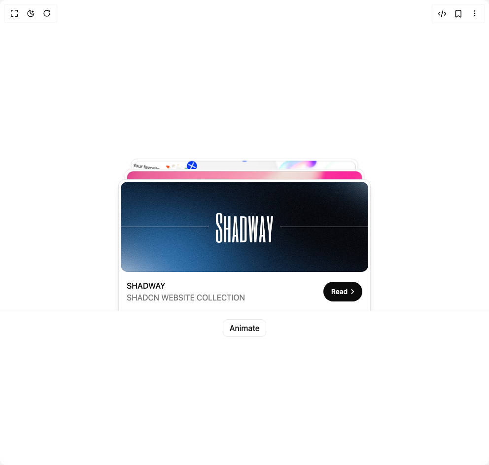

# Build Animate Card Animation in BuilderStudio

> Build this component in our Agentic IDE: [BuilderStudio](https://builderstudio.dev).
>
> Join the BuilderStudio community on [Discord](https://discord.gg/QdWeSGCqfe) and [Reddit](https://reddit.com/r/builderstudio).



## Component

- Author group: `shadway`
- Component: `animate-card-animation`
- Variant: `default`
- Rendered HTML snapshot: [`rendered.html`](rendered.html)

## BuilderStudio prompt

You are implementing a React component based on a component reference.

## Component identity

- Author: shadway
- Component slug: animate-card-animation
- Demo slug: default
- Title: animate-card-animation
- Description: 

## Goal

Recreate this component in a React + TypeScript + Tailwind CSS project. Preserve the visual layout, spacing, colors, border radius, shadows, interaction behavior, animation behavior, responsive behavior, and dark mode behavior shown in the rendered demo.

## Implementation requirements

- Use React and TypeScript.
- Use Tailwind CSS classes whenever possible.
- Keep the component self-contained unless the source files require helper components.
- If the source uses CSS variables, custom CSS, animations, or keyframes, include them.
- If the source uses external packages, list and use the required packages.
- Preserve accessibility attributes, button semantics, links, keyboard behavior, and ARIA attributes when visible in the source.
- Do not replace the component with a simplified placeholder.
- Return complete production-ready code.

## Dependencies

No reference metadata available.

## Rendered DOM snapshot

This is the rendered demo HTML extracted from the live preview. Use it to verify structure, class names, visible content, and layout.

```html
<div id="root"><div class="w-screen min-h-screen flex justify-center items-center"><div class="w-screen min-h-screen flex justify-center items-center"><div class="flex w-full flex-col items-center justify-center pt-2"><div class="relative h-[380px] w-full overflow-hidden sm:w-[644px]"><div class="absolute flex h-[280px] w-[324px] items-center justify-center overflow-hidden rounded-t-xl border-x border-t border-border bg-card p-1 shadow-lg will-change-transform sm:w-[512px]" style="z-index: 3; left: 50%; bottom: 0px; transform: translateX(-50%) translateY(12px);"><div class="flex h-full w-full flex-col gap-4"><div class="-outline-offset-1 flex h-[200px] w-full items-center justify-center overflow-hidden rounded-xl outline outline-black/10 dark:outline-white/10"></div><div class="flex w-full items-center justify-between gap-2 px-3 pb-6"><div class="flex min-w-0 flex-1 flex-col"><span class="truncate font-medium text-foreground">SHADWAY</span><span class="text-muted-foreground">SHADCN WEBSITE COLLECTION</span></div><button class="flex h-10 shrink-0 cursor-pointer select-none items-center gap-0.5 rounded-full bg-foreground pl-4 pr-3 text-sm font-medium text-background">Read<svg width="16" height="16" viewBox="0 0 24 24" fill="none" stroke="currentColor" stroke-width="2.5" stroke-linecap="square"><path d="M9.5 18L15.5 12L9.5 6"></path></svg></button></div></div></div><div class="absolute flex h-[280px] w-[324px] items-center justify-center overflow-hidden rounded-t-xl border-x border-t border-border bg-card p-1 shadow-lg will-change-transform sm:w-[512px]" style="z-index: 2; left: 50%; bottom: 0px; transform: translateX(-50%) translateY(-16px) scale(0.95);"><div class="flex h-full w-full flex-col gap-4"><div class="-outline-offset-1 flex h-[200px] w-full items-center justify-center overflow-hidden rounded-xl outline outline-black/10 dark:outline-white/10"></div><div class="flex w-full items-center justify-between gap-2 px-3 pb-6"><div class="flex min-w-0 flex-1 flex-col"><span class="truncate font-medium text-foreground">Rizz Ai</span><span class="text-muted-foreground">Dating Ai wingmen</span></div><button class="flex h-10 shrink-0 cursor-pointer select-none items-center gap-0.5 rounded-full bg-foreground pl-4 pr-3 text-sm font-medium text-background">Read<svg width="16" height="16" viewBox="0 0 24 24" fill="none" stroke="currentColor" stroke-width="2.5" stroke-linecap="square"><path d="M9.5 18L15.5 12L9.5 6"></path></svg></button></div></div></div><div class="absolute flex h-[280px] w-[324px] items-center justify-center overflow-hidden rounded-t-xl border-x border-t border-border bg-card p-1 shadow-lg will-change-transform sm:w-[512px]" style="z-index: 1; left: 50%; bottom: 0px; transform: translateX(-50%) translateY(-44px) scale(0.9);"><div class="flex h-full w-full flex-col gap-4"><div class="-outline-offset-1 flex h-[200px] w-full items-center justify-center overflow-hidden rounded-xl outline outline-black/10 dark:outline-white/10"></div><div class="flex w-full items-center justify-between gap-2 px-3 pb-6"><div class="flex min-w-0 flex-1 flex-col"><span class="truncate font-medium text-foreground">BuilderStudio</span><span class="text-muted-foreground">Vibe Crafting Platform</span></div><button class="flex h-10 shrink-0 cursor-pointer select-none items-center gap-0.5 rounded-full bg-foreground pl-4 pr-3 text-sm font-medium text-background">Read<svg width="16" height="16" viewBox="0 0 24 24" fill="none" stroke="currentColor" stroke-width="2.5" stroke-linecap="square"><path d="M9.5 18L15.5 12L9.5 6"></path></svg></button></div></div></div></div><div class="relative z-10 -mt-px flex w-full items-center justify-center border-t border-border py-4"><button class="flex h-9 cursor-pointer select-none items-center justify-center gap-1 overflow-hidden rounded-lg border border-border bg-background px-3 font-medium text-secondary-foreground transition-all hover:bg-secondary/80 active:scale-[0.98]">Animate</button></div></div></div></div></div>
```

## Reference source files

No reference source files were available.
