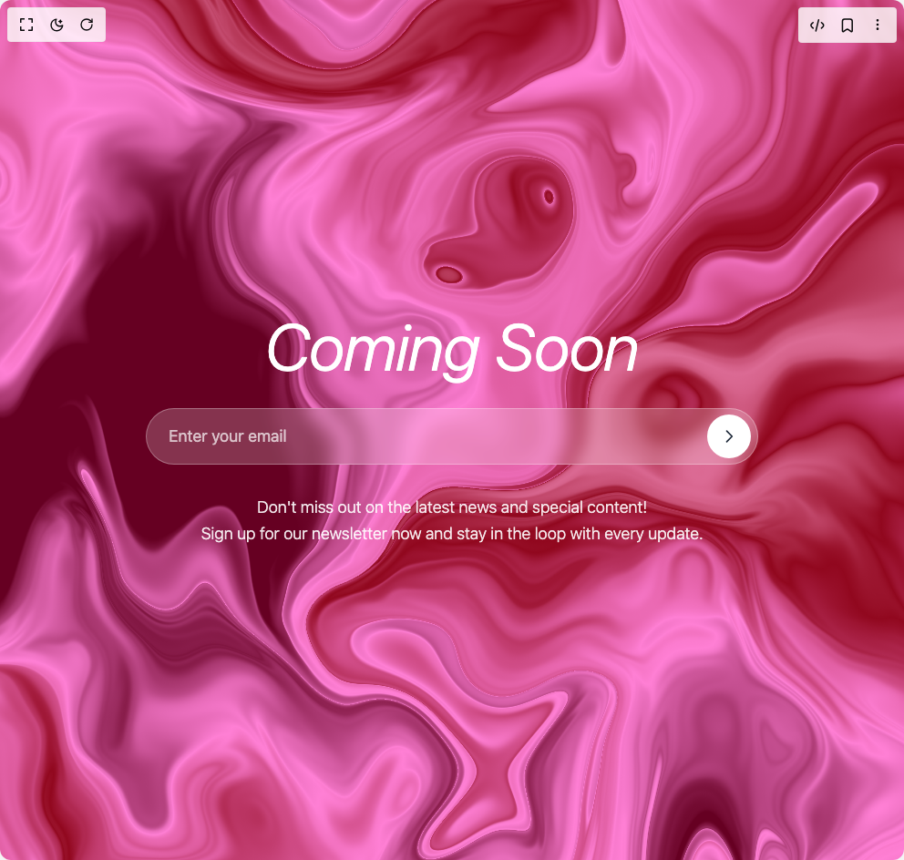

# Build Pinky News Letter in BuilderStudio

> Build this component in our Agentic IDE: [BuilderStudio](https://builderstudio.dev).
>
> Join the BuilderStudio community on [Discord](https://discord.gg/QdWeSGCqfe) and [Reddit](https://reddit.com/r/builderstudio).



## Component

- Author group: `shadway`
- Component: `pinky-news-letter`
- Variant: `default`
- Rendered HTML snapshot: [`rendered.html`](rendered.html)

## BuilderStudio prompt

You are implementing a React component based on a component reference.

## Component identity

- Author: shadway
- Component slug: pinky-news-letter
- Demo slug: default
- Title: pinky-news-letter
- Description: 

## Goal

Recreate this component in a React + TypeScript + Tailwind CSS project. Preserve the visual layout, spacing, colors, border radius, shadows, interaction behavior, animation behavior, responsive behavior, and dark mode behavior shown in the rendered demo.

## Implementation requirements

- Use React and TypeScript.
- Use Tailwind CSS classes whenever possible.
- Keep the component self-contained unless the source files require helper components.
- If the source uses CSS variables, custom CSS, animations, or keyframes, include them.
- If the source uses external packages, list and use the required packages.
- Preserve accessibility attributes, button semantics, links, keyboard behavior, and ARIA attributes when visible in the source.
- Do not replace the component with a simplified placeholder.
- Return complete production-ready code.

## Dependencies

No reference metadata available.

## Rendered DOM snapshot

This is the rendered demo HTML extracted from the live preview. Use it to verify structure, class names, visible content, and layout.

```html
<div id="root"><div class="w-screen min-h-screen flex justify-center items-center"><div class="w-screen min-h-screen flex justify-center items-center"><div class="min-h-screen w-full h-full"><main class="relative min-h-screen overflow-hidden"><div class="absolute inset-0"><div data-paper-shader="" style="height: 100%; width: 100%;"><canvas width="2880" height="2741"></canvas></div></div><div class="relative z-10 min-h-screen flex items-center justify-center px-8"><div class="max-w-2xl w-full text-center space-y-8"><h1 class="text-white text-6xl md:text-7xl font-sans font-light italic">Coming Soon</h1><div class="relative"><input placeholder="Enter your email" class="w-full px-6 py-4 pr-20 text-lg bg-white/20 backdrop-blur-sm border border-white/30 rounded-full text-white placeholder-white/70 focus:outline-none focus:ring-2 focus:ring-white/50 focus:border-white/50 transition-all duration-300" type="email"><button class="absolute right-2 top-1/2 -translate-y-1/2 w-12 h-12 bg-white rounded-full flex items-center justify-center hover:scale-110 transition-transform duration-300 group"><svg class="w-5 h-5 text-gray-800 group-hover:translate-x-0.5 transition-transform duration-300" fill="none" stroke="currentColor" viewBox="0 0 24 24"><path stroke-linecap="round" stroke-linejoin="round" stroke-width="2" d="M9 5l7 7-7 7"></path></svg></button></div><p class="text-white/90 text-lg font-sans font-light leading-relaxed">Don't miss out on the latest news and special content!<br>Sign up for our newsletter now and stay in the loop with every update.</p></div></div></main></div></div></div></div>
```

## Reference source files

No reference source files were available.
