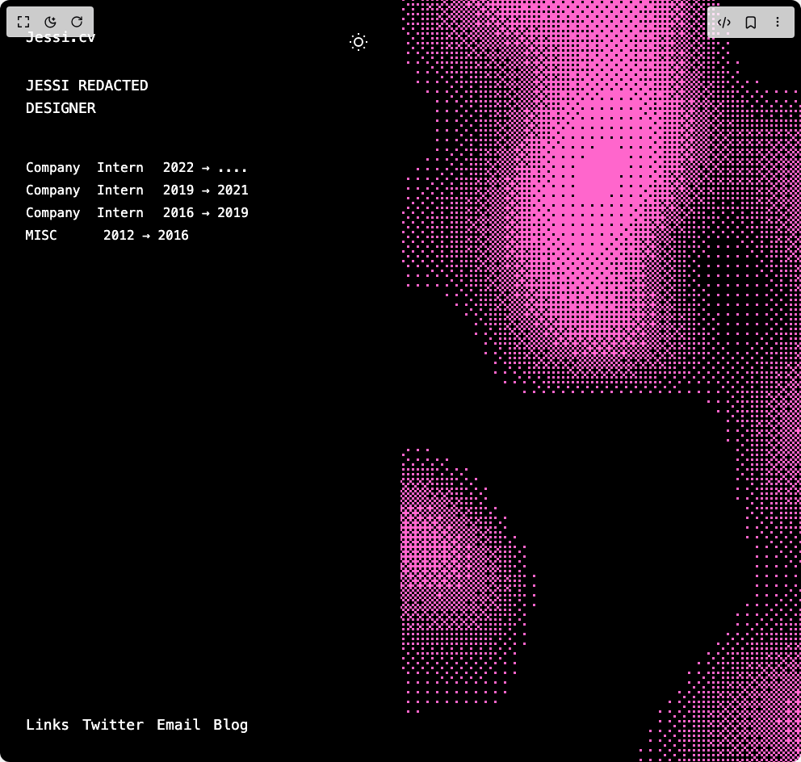

# Build Portfolio Hero With Paper Shaders in BuilderStudio

> Build this component in our Agentic IDE: [BuilderStudio](https://builderstudio.dev).
>
> Join the BuilderStudio community on [Discord](https://discord.gg/QdWeSGCqfe) and [Reddit](https://reddit.com/r/builderstudio).



## Component

- Author group: `shadway`
- Component: `portfolio-hero-with-paper-shaders`
- Variant: `default`
- Rendered HTML snapshot: [`rendered.html`](rendered.html)

## BuilderStudio prompt

You are implementing a React component based on a component reference.

## Component identity

- Author: shadway
- Component slug: portfolio-hero-with-paper-shaders
- Demo slug: default
- Title: portfolio-hero-with-paper-shaders
- Description: 

## Goal

Recreate this component in a React + TypeScript + Tailwind CSS project. Preserve the visual layout, spacing, colors, border radius, shadows, interaction behavior, animation behavior, responsive behavior, and dark mode behavior shown in the rendered demo.

## Implementation requirements

- Use React and TypeScript.
- Use Tailwind CSS classes whenever possible.
- Keep the component self-contained unless the source files require helper components.
- If the source uses CSS variables, custom CSS, animations, or keyframes, include them.
- If the source uses external packages, list and use the required packages.
- Preserve accessibility attributes, button semantics, links, keyboard behavior, and ARIA attributes when visible in the source.
- Do not replace the component with a simplified placeholder.
- Return complete production-ready code.

## Dependencies

No reference metadata available.

## Rendered DOM snapshot

This is the rendered demo HTML extracted from the live preview. Use it to verify structure, class names, visible content, and layout.

```html
<div id="root"><div class="w-screen min-h-screen flex justify-center items-center"><div class="w-screen min-h-screen flex justify-center items-center"><div class="min-h-screen h-full w-full"><div class="relative min-h-screen overflow-hidden flex"><div class="w-1/2 p-8 font-mono relative z-10 bg-black text-white"><button class="absolute top-8 right-8 p-2 rounded-full transition-colors hover:bg-white/10" aria-label="Toggle theme"><svg width="24" height="24" viewBox="0 0 24 24" fill="none" stroke="currentColor" stroke-width="2"><circle cx="12" cy="12" r="5"></circle><path d="M12 1v2M12 21v2M4.22 4.22l1.42 1.42M18.36 18.36l1.42 1.42M1 12h2M21 12h2M4.22 19.78l1.42-1.42M18.36 5.64l1.42-1.42"></path></svg></button><div class="mb-12"><h1 class="text-lg font-normal mb-8">Jessi.cv</h1><div class="mb-8"><h2 class="text-lg font-normal">JESSI REDACTED</h2><h3 class="text-lg font-normal">DESIGNER</h3></div></div><div class="mb-12 space-y-1"><div class="flex"><span class="w-20">Company</span><span class="mx-2">Intern</span><span class="mx-4">2022 → ....</span></div><div class="flex"><span class="w-20">Company</span><span class="mx-2">Intern</span><span class="mx-4">2019 → 2021</span></div><div class="flex"><span class="w-20">Company</span><span class="mx-2">Intern</span><span class="mx-4">2016 → 2019</span></div><div class="flex"><span class="w-20">MISC</span><span class="mx-4">2012 → 2016</span></div></div><div class="absolute bottom-8 left-8"><div class="flex space-x-4 text-lg font-mono"><span>Links</span><span>Twitter</span><span>Email</span><span>Blog</span></div></div></div><div class="w-1/2 relative"><div data-paper-shader="" style="height: 100%; width: 100%;"><canvas width="1440" height="2741"></canvas></div></div></div></div></div></div></div>
```

## Reference source files

No reference source files were available.
