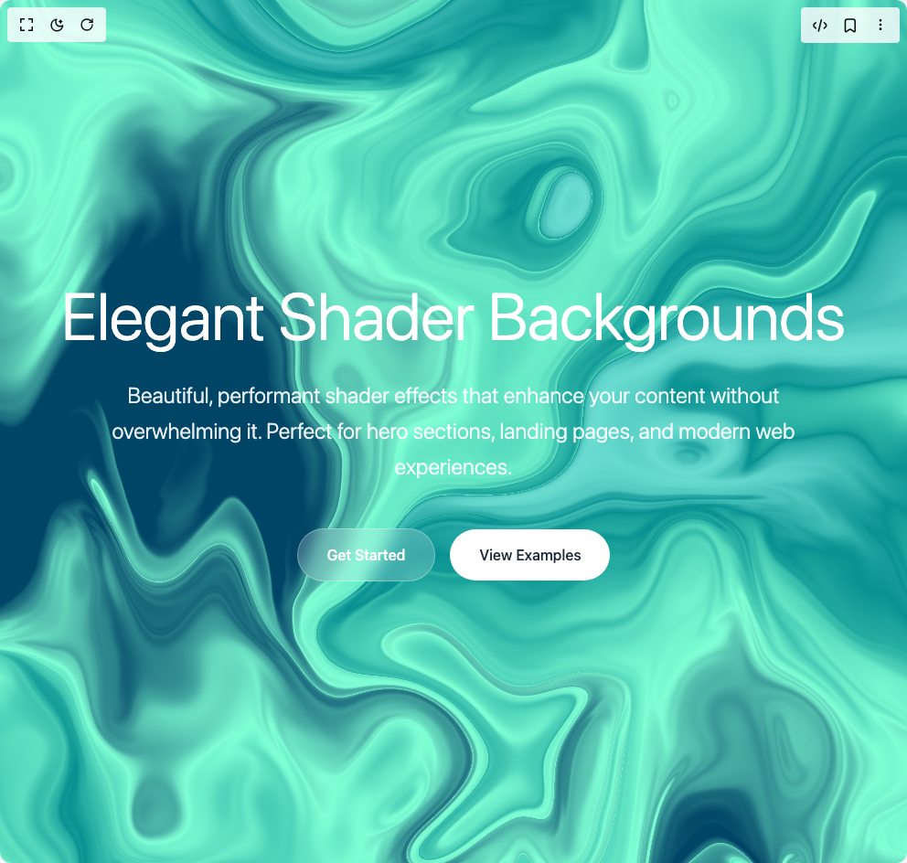

# Build Wrap Shader in BuilderStudio

> Build this component in our Agentic IDE: [BuilderStudio](https://builderstudio.dev).
>
> Join the BuilderStudio community on [Discord](https://discord.gg/QdWeSGCqfe) and [Reddit](https://reddit.com/r/builderstudio).



## Component

- Author group: `shadway`
- Component: `wrap-shader`
- Variant: `default`
- Rendered HTML snapshot: [`rendered.html`](rendered.html)

## BuilderStudio prompt

You are implementing a React component based on a component reference.

## Component identity

- Author: shadway
- Component slug: wrap-shader
- Demo slug: default
- Title: wrap-shader
- Description: 

## Goal

Recreate this component in a React + TypeScript + Tailwind CSS project. Preserve the visual layout, spacing, colors, border radius, shadows, interaction behavior, animation behavior, responsive behavior, and dark mode behavior shown in the rendered demo.

## Implementation requirements

- Use React and TypeScript.
- Use Tailwind CSS classes whenever possible.
- Keep the component self-contained unless the source files require helper components.
- If the source uses CSS variables, custom CSS, animations, or keyframes, include them.
- If the source uses external packages, list and use the required packages.
- Preserve accessibility attributes, button semantics, links, keyboard behavior, and ARIA attributes when visible in the source.
- Do not replace the component with a simplified placeholder.
- Return complete production-ready code.

## Dependencies

No reference metadata available.

## Rendered DOM snapshot

This is the rendered demo HTML extracted from the live preview. Use it to verify structure, class names, visible content, and layout.

```html
<div id="root"><div class="w-screen min-h-screen flex justify-center items-center"><div class="w-screen min-h-screen flex justify-center items-center"><div class="min-h-screen h-full w-full"><main class="relative min-h-screen overflow-hidden"><div class="absolute inset-0"><div data-paper-shader="" style="height: 100%; width: 100%;"><canvas width="2880" height="2741"></canvas></div></div><div class="relative z-10 min-h-screen flex items-center justify-center px-8"><div class="max-w-4xl w-full text-center space-y-8"><h1 class="text-white text-5xl md:text-7xl font-sans font-light text-balance">Elegant Shader Backgrounds</h1><p class="text-white/90 text-xl md:text-2xl font-sans font-light leading-relaxed max-w-3xl mx-auto">Beautiful, performant shader effects that enhance your content without overwhelming it. Perfect for hero sections, landing pages, and modern web experiences.</p><div class="flex flex-col sm:flex-row gap-4 justify-center items-center pt-4"><button class="px-8 py-4 bg-white/20 backdrop-blur-sm border border-white/30 rounded-full text-white font-medium hover:bg-white/30 transition-all duration-300 hover:scale-105">Get Started</button><button class="px-8 py-4 bg-white rounded-full text-gray-800 font-medium hover:scale-105 transition-transform duration-300">View Examples</button></div></div></div></main></div></div></div></div>
```

## Reference source files

No reference source files were available.
