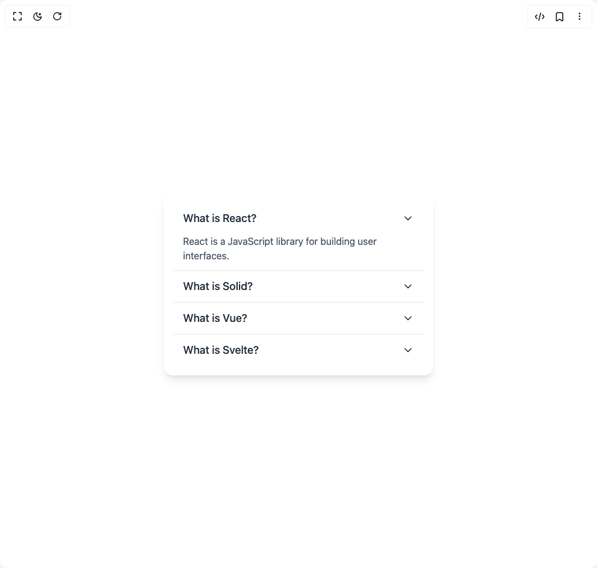

# Build Accordion in BuilderStudio

> Build this component in our Agentic IDE: [BuilderStudio](https://builderstudio.dev).
>
> Join the BuilderStudio community on [Discord](https://discord.gg/QdWeSGCqfe) and [Reddit](https://reddit.com/r/builderstudio).



## Component

- Author group: `shailendrakumar19999`
- Component: `accordion`
- Variant: `default`
- Rendered HTML snapshot: [`rendered.html`](rendered.html)

## BuilderStudio prompt

You are implementing a React component based on a component reference.

## Component identity

- Author: shailendrakumar19999
- Component slug: accordion
- Demo slug: default
- Title: accordion
- Description: 

## Goal

Recreate this component in a React + TypeScript + Tailwind CSS project. Preserve the visual layout, spacing, colors, border radius, shadows, interaction behavior, animation behavior, responsive behavior, and dark mode behavior shown in the rendered demo.

## Implementation requirements

- Use React and TypeScript.
- Use Tailwind CSS classes whenever possible.
- Keep the component self-contained unless the source files require helper components.
- If the source uses CSS variables, custom CSS, animations, or keyframes, include them.
- If the source uses external packages, list and use the required packages.
- Preserve accessibility attributes, button semantics, links, keyboard behavior, and ARIA attributes when visible in the source.
- Do not replace the component with a simplified placeholder.
- Return complete production-ready code.

## Dependencies

No reference metadata available.

## Rendered DOM snapshot

This is the rendered demo HTML extracted from the live preview. Use it to verify structure, class names, visible content, and layout.

```html
<div id="root"><div class="w-screen min-h-screen flex justify-center items-center"><div class="w-screen min-h-screen flex justify-center items-center"><div data-scope="accordion" data-part="root" dir="ltr" id="accordion:«r0»" data-orientation="vertical" class="w-full max-w-md mx-auto bg-white shadow-lg rounded-2xl p-4"><div data-scope="accordion" data-part="item" data-state="open" dir="ltr" id="collapsible:accordion:«r0»:item:React" data-orientation="vertical" class="border-b last:border-none border-gray-200"><button data-scope="accordion" data-part="item-trigger" type="button" dir="ltr" id="accordion:«r0»:trigger:React" aria-controls="accordion:«r0»:content:React" aria-expanded="true" data-orientation="vertical" aria-disabled="false" data-state="open" data-ownedby="accordion:«r0»" class="flex items-center justify-between w-full py-3 px-4 text-lg font-medium text-gray-800 hover:bg-gray-100 rounded-xl transition-all"><span>What is React?</span><div data-scope="accordion" data-part="item-indicator" dir="ltr" aria-hidden="true" data-state="open" data-orientation="vertical"><svg xmlns="http://www.w3.org/2000/svg" width="24" height="24" viewBox="0 0 24 24" fill="none" stroke="currentColor" stroke-width="2" stroke-linecap="round" stroke-linejoin="round" class="lucide lucide-chevron-down h-5 w-5 transition-transform data-[state=open]:rotate-180" aria-hidden="true"><path d="m6 9 6 6 6-6"></path></svg></div></button><div data-scope="accordion" data-part="item-content" data-collapsible="" id="accordion:«r0»:content:React" dir="ltr" role="region" aria-labelledby="accordion:«r0»:trigger:React" data-orientation="vertical" style="--height: 0px; --width: 0px;"><div class="overflow-hidden px-4 pb-3 text-gray-600" style="height: auto; opacity: 1;">React is a JavaScript library for building user interfaces.</div></div></div><div data-scope="accordion" data-part="item" data-state="closed" dir="ltr" id="collapsible:accordion:«r0»:item:Solid" data-orientation="vertical" class="border-b last:border-none border-gray-200"><button data-scope="accordion" data-part="item-trigger" type="button" dir="ltr" id="accordion:«r0»:trigger:Solid" aria-controls="accordion:«r0»:content:Solid" aria-expanded="false" data-orientation="vertical" aria-disabled="false" data-state="closed" data-ownedby="accordion:«r0»" class="flex items-center justify-between w-full py-3 px-4 text-lg font-medium text-gray-800 hover:bg-gray-100 rounded-xl transition-all"><span>What is Solid?</span><div data-scope="accordion" data-part="item-indicator" dir="ltr" aria-hidden="true" data-state="closed" data-orientation="vertical"><svg xmlns="http://www.w3.org/2000/svg" width="24" height="24" viewBox="0 0 24 24" fill="none" stroke="currentColor" stroke-width="2" stroke-linecap="round" stroke-linejoin="round" class="lucide lucide-chevron-down h-5 w-5 transition-transform data-[state=open]:rotate-180" aria-hidden="true"><path d="m6 9 6 6 6-6"></path></svg></div></button><div data-scope="accordion" data-part="item-content" data-collapsible="" data-state="closed" id="accordion:«r0»:content:Solid" hidden="" dir="ltr" role="region" aria-labelledby="accordion:«r0»:trigger:Solid" data-orientation="vertical" style="--height: 0px; --width: 0px;"><div class="overflow-hidden px-4 pb-3 text-gray-600" style="height: auto; opacity: 1;">Solid is a JavaScript library for building user interfaces.</div></div></div><div data-scope="accordion" data-part="item" data-state="closed" dir="ltr" id="collapsible:accordion:«r0»:item:Vue" data-orientation="vertical" class="border-b last:border-none border-gray-200"><button data-scope="accordion" data-part="item-trigger" type="button" dir="ltr" id="accordion:«r0»:trigger:Vue" aria-controls="accordion:«r0»:content:Vue" aria-expanded="false" data-orientation="vertical" aria-disabled="false" data-state="closed" data-ownedby="accordion:«r0»" class="flex items-center justify-between w-full py-3 px-4 text-lg font-medium text-gray-800 hover:bg-gray-100 rounded-xl transition-all"><span>What is Vue?</span><div data-scope="accordion" data-part="item-indicator" dir="ltr" aria-hidden="true" data-state="closed" data-orientation="vertical"><svg xmlns="http://www.w3.org/2000/svg" width="24" height="24" viewBox="0 0 24 24" fill="none" stroke="currentColor" stroke-width="2" stroke-linecap="round" stroke-linejoin="round" class="lucide lucide-chevron-down h-5 w-5 transition-transform data-[state=open]:rotate-180" aria-hidden="true"><path d="m6 9 6 6 6-6"></path></svg></div></button><div data-scope="accordion" data-part="item-content" data-collapsible="" data-state="closed" id="accordion:«r0»:content:Vue" hidden="" dir="ltr" role="region" aria-labelledby="accordion:«r0»:trigger:Vue" data-orientation="vertical" style="--height: 0px; --width: 0px;"><div class="overflow-hidden px-4 pb-3 text-gray-600" style="height: auto; opacity: 1;">Vue is a JavaScript library for building user interfaces.</div></div></div><div data-scope="accordion" data-part="item" data-state="closed" dir="ltr" id="collapsible:accordion:«r0»:item:Svelte" data-orientation="vertical" class="border-b last:border-none border-gray-200"><button data-scope="accordion" data-part="item-trigger" type="button" dir="ltr" id="accordion:«r0»:trigger:Svelte" aria-controls="accordion:«r0»:content:Svelte" aria-expanded="false" data-orientation="vertical" aria-disabled="false" data-state="closed" data-ownedby="accordion:«r0»" class="flex items-center justify-between w-full py-3 px-4 text-lg font-medium text-gray-800 hover:bg-gray-100 rounded-xl transition-all"><span>What is Svelte?</span><div data-scope="accordion" data-part="item-indicator" dir="ltr" aria-hidden="true" data-state="closed" data-orientation="vertical"><svg xmlns="http://www.w3.org/2000/svg" width="24" height="24" viewBox="0 0 24 24" fill="none" stroke="currentColor" stroke-width="2" stroke-linecap="round" stroke-linejoin="round" class="lucide lucide-chevron-down h-5 w-5 transition-transform data-[state=open]:rotate-180" aria-hidden="true"><path d="m6 9 6 6 6-6"></path></svg></div></button><div data-scope="accordion" data-part="item-content" data-collapsible="" data-state="closed" id="accordion:«r0»:content:Svelte" hidden="" dir="ltr" role="region" aria-labelledby="accordion:«r0»:trigger:Svelte" data-orientation="vertical" style="--height: 0px; --width: 0px;"><div class="overflow-hidden px-4 pb-3 text-gray-600" style="height: auto; opacity: 1;">Svelte is a JavaScript library for building user interfaces.</div></div></div></div></div></div></div>
```

## Reference source files

No reference source files were available.
