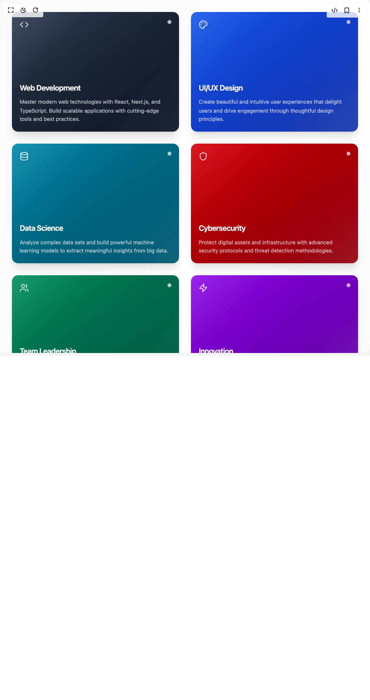

# Build Animated 3d Card in BuilderStudio

> Build this component in our Agentic IDE: [BuilderStudio](https://builderstudio.dev).
>
> Join the BuilderStudio community on [Discord](https://discord.gg/QdWeSGCqfe) and [Reddit](https://reddit.com/r/builderstudio).



## Component

- Author group: `shailendrakumar19999`
- Component: `animated-3d-card`
- Variant: `default`
- Rendered HTML snapshot: [`rendered.html`](rendered.html)

## BuilderStudio prompt

You are implementing a React component based on a component reference.

## Component identity

- Author: shailendrakumar19999
- Component slug: animated-3d-card
- Demo slug: default
- Title: animated-3d-card
- Description: 

## Goal

Recreate this component in a React + TypeScript + Tailwind CSS project. Preserve the visual layout, spacing, colors, border radius, shadows, interaction behavior, animation behavior, responsive behavior, and dark mode behavior shown in the rendered demo.

## Implementation requirements

- Use React and TypeScript.
- Use Tailwind CSS classes whenever possible.
- Keep the component self-contained unless the source files require helper components.
- If the source uses CSS variables, custom CSS, animations, or keyframes, include them.
- If the source uses external packages, list and use the required packages.
- Preserve accessibility attributes, button semantics, links, keyboard behavior, and ARIA attributes when visible in the source.
- Do not replace the component with a simplified placeholder.
- Return complete production-ready code.

## Dependencies

No reference metadata available.

## Rendered DOM snapshot

This is the rendered demo HTML extracted from the live preview. Use it to verify structure, class names, visible content, and layout.

```html
<div id="root"><div class="w-screen min-h-screen flex justify-center items-center"><div class="w-screen min-h-screen flex justify-center items-center"><div class="min-h-screen relative overflow-hidden"><div class="absolute inset-0 bg-gradient-to-br from-slate-50 via-white to-slate-100 dark:from-slate-950 dark:via-slate-900 dark:to-slate-800"><div class="absolute top-20 left-20 w-96 h-96 opacity-[0.03]" style="transform: scale(1.02371) rotate(42.669deg);"><svg viewBox="0 0 400 400" class="w-full h-full text-slate-600 dark:text-slate-400"><defs><radialGradient id="grad1" cx="50%" cy="50%" r="50%"><stop offset="0%" stop-color="currentColor" stop-opacity="0.1"></stop><stop offset="100%" stop-color="currentColor" stop-opacity="0"></stop></radialGradient></defs><circle cx="200" cy="200" r="150" fill="url(#grad1)"></circle><circle cx="200" cy="200" r="100" fill="none" stroke="currentColor" stroke-width="1" stroke-opacity="0.1"></circle><circle cx="200" cy="200" r="50" fill="none" stroke="currentColor" stroke-width="0.5" stroke-opacity="0.15"></circle></svg></div><div class="absolute bottom-20 right-20 w-80 h-80 opacity-[0.02]" style="transform: translateY(-13.914px) rotate(346.814deg);"><svg viewBox="0 0 320 320" class="w-full h-full text-slate-600 dark:text-slate-400"><rect x="60" y="60" width="200" height="200" fill="none" stroke="currentColor" stroke-width="1" stroke-opacity="0.1" rx="20"></rect><rect x="90" y="90" width="140" height="140" fill="none" stroke="currentColor" stroke-width="0.5" stroke-opacity="0.1" rx="10"></rect><rect x="120" y="120" width="80" height="80" fill="none" stroke="currentColor" stroke-width="0.5" stroke-opacity="0.15" rx="5"></rect></svg></div><div class="absolute inset-0 opacity-[0.01]"><svg width="100%" height="100%" class="text-slate-900 dark:text-slate-100"><defs><pattern id="mainGrid" width="50" height="50" patternUnits="userSpaceOnUse"><path d="M 50 0 L 0 0 0 50" fill="none" stroke="currentColor" stroke-width="0.5"></path></pattern></defs><rect width="100%" height="100%" fill="url(#mainGrid)"></rect></svg></div></div><div class="relative z-10 p-8"><div class="max-w-7xl mx-auto"><div style="opacity: 1; transform: none;"><div class="relative"><div class="absolute inset-0 overflow-hidden pointer-events-none"><div class="absolute inset-0 opacity-[0.015]"><svg width="100%" height="100%" class="text-slate-900 dark:text-white"><defs><pattern id="grid" width="32" height="32" patternUnits="userSpaceOnUse"><path d="M 32 0 L 0 0 0 32" fill="none" stroke="currentColor" stroke-width="0.5"></path></pattern></defs><rect width="100%" height="100%" fill="url(#grid)"></rect></svg></div><div class="absolute top-10 right-10 w-64 h-64 opacity-[0.03]" style="transform: scale(1.0158) rotate(56.892deg);"><svg viewBox="0 0 200 200" class="w-full h-full text-slate-600 dark:text-slate-400"><circle cx="100" cy="100" r="80" fill="none" stroke="currentColor" stroke-width="1"></circle><circle cx="100" cy="100" r="60" fill="none" stroke="currentColor" stroke-width="0.5"></circle><circle cx="100" cy="100" r="40" fill="none" stroke="currentColor" stroke-width="0.5"></circle></svg></div><div class="absolute bottom-10 left-10 w-48 h-48 opacity-[0.02]" style="transform: translateY(-4.01966px) rotate(333.601deg);"><svg viewBox="0 0 150 150" class="w-full h-full text-slate-600 dark:text-slate-400"><rect x="25" y="25" width="100" height="100" fill="none" stroke="currentColor" stroke-width="1" rx="8"></rect><rect x="40" y="40" width="70" height="70" fill="none" stroke="currentColor" stroke-width="0.5" rx="4"></rect><rect x="55" y="55" width="40" height="40" fill="none" stroke="currentColor" stroke-width="0.5" rx="2"></rect></svg></div></div><div class="relative grid w-full grid-cols-1 md:grid-cols-2 lg:grid-cols-3 gap-8 mb-20" style="perspective: 1500px; transform-style: preserve-3d; opacity: 1; transform: none;"><div style="transform-style: preserve-3d; opacity: 1; transform: none;"><div class="group relative w-full overflow-hidden rounded-2xl transform-gpu transition-all duration-500 ease-out h-80 shadow-xl hover:shadow-2xl ring-1 ring-white/20" role="article" tabindex="-1" style="transform-style: preserve-3d; perspective: 1200px; transform: none;"><div class="absolute inset-0 rounded-2xl bg-gradient-to-br from-slate-700 via-slate-800 to-slate-900" style="transform: none;"></div><div class="absolute inset-0 overflow-hidden rounded-2xl opacity-20"><svg class="absolute -top-4 -right-4 w-32 h-32 text-white/30" viewBox="0 0 100 100"><defs><pattern id="pattern-primary-web-development" x="0" y="0" width="20" height="20" patternUnits="userSpaceOnUse"><circle cx="10" cy="10" r="1" fill="currentColor" opacity="0.3"></circle></pattern></defs><rect width="100" height="100" fill="url(#pattern-primary-web-development)"></rect></svg><div class="absolute -bottom-4 -left-4 w-24 h-24 opacity-30" style="transform: none;"><svg viewBox="0 0 100 100" class="w-full h-full text-white/40"><rect x="20" y="20" width="60" height="60" fill="none" stroke="currentColor" stroke-width="1" rx="8"></rect><rect x="35" y="35" width="30" height="30" fill="none" stroke="currentColor" stroke-width="0.5" rx="4"></rect></svg></div></div><div class="absolute inset-0 rounded-2xl" style="background: linear-gradient(135deg, rgba(0, 0, 0, 0.1) 0%, rgba(0, 0, 0, 0.2) 50%, rgba(0, 0, 0, 0.1) 100%); transform: translateZ(5px); opacity: 0.7;"></div><div class="absolute inset-0 rounded-2xl overflow-hidden pointer-events-none" style="transform: translateZ(15px);"><div class="absolute -inset-full" style="background: transparent;"></div></div><div class="relative z-20 flex h-full flex-col justify-between p-6 text-white" style="transform: translateZ(20px);"><div class="flex justify-between items-start"><div class="relative"><div class="text-3xl opacity-90 filter drop-shadow-lg" style="transform: none;"><svg xmlns="http://www.w3.org/2000/svg" width="24" height="24" viewBox="0 0 24 24" fill="none" stroke="currentColor" stroke-width="2" stroke-linecap="round" stroke-linejoin="round" class="lucide lucide-code" aria-hidden="true"><polyline points="16 18 22 12 16 6"></polyline><polyline points="8 6 2 12 8 18"></polyline></svg></div></div><div class="relative" style="transform: none;"><div class="h-2.5 w-2.5 rounded-full bg-white/40 backdrop-blur-sm"></div><div class="absolute inset-0 h-2.5 w-2.5 rounded-full bg-white/70" style="opacity: 0.7; transform: none;"></div></div></div><div class="space-y-3" style="transform: none;"><h3 class="text-xl font-semibold tracking-tight drop-shadow-md" style="transform: none;">Web Development</h3><p class="text-sm text-white/85 leading-relaxed drop-shadow-sm line-clamp-3" style="opacity: 0.85;">Master modern web technologies with React, Next.js, and TypeScript. Build scalable applications with cutting-edge tools and best practices.</p></div></div><div class="absolute inset-0 rounded-2xl pointer-events-none" style="background: linear-gradient(135deg, rgba(255, 255, 255, 0.15) 0%, transparent 30%, transparent 70%, rgba(255, 255, 255, 0.1) 100%); transform: translateZ(25px); opacity: 0.7;"></div><div class="absolute -inset-0.5 rounded-2xl opacity-0 pointer-events-none" style="filter: blur(15px); transform: translateZ(-5px); opacity: 0;"></div></div></div><div style="transform-style: preserve-3d; opacity: 1; transform: none;"><div class="group relative w-full overflow-hidden rounded-2xl transform-gpu transition-all duration-500 ease-out h-80 shadow-xl hover:shadow-2xl ring-1 ring-white/20" role="article" tabindex="-1" style="transform-style: preserve-3d; perspective: 1200px; transform: none;"><div class="absolute inset-0 rounded-2xl bg-gradient-to-br from-blue-600 via-blue-700 to-blue-800" style="transform: none;"></div><div class="absolute inset-0 overflow-hidden rounded-2xl opacity-20"><svg class="absolute -top-4 -right-4 w-32 h-32 text-white/30" viewBox="0 0 100 100"><defs><pattern id="pattern-secondary-ui/ux-design" x="0" y="0" width="20" height="20" patternUnits="userSpaceOnUse"><circle cx="10" cy="10" r="1" fill="currentColor" opacity="0.3"></circle></pattern></defs><rect width="100" height="100" fill="url(#pattern-secondary-ui/ux-design)"></rect></svg><div class="absolute -bottom-4 -left-4 w-24 h-24 opacity-30" style="transform: none;"><svg viewBox="0 0 100 100" class="w-full h-full text-white/40"><rect x="20" y="20" width="60" height="60" fill="none" stroke="currentColor" stroke-width="1" rx="8"></rect><rect x="35" y="35" width="30" height="30" fill="none" stroke="currentColor" stroke-width="0.5" rx="4"></rect></svg></div></div><div class="absolute inset-0 rounded-2xl" style="background: linear-gradient(135deg, rgba(0, 0, 0, 0.1) 0%, rgba(0, 0, 0, 0.2) 50%, rgba(0, 0, 0, 0.1) 100%); transform: translateZ(5px); opacity: 0.7;"></div><div class="absolute inset-0 rounded-2xl overflow-hidden pointer-events-none" style="transform: translateZ(15px);"><div class="absolute -inset-full" style="background: transparent;"></div></div><div class="relative z-20 flex h-full flex-col justify-between p-6 text-white" style="transform: translateZ(20px);"><div class="flex justify-between items-start"><div class="relative"><div class="text-3xl opacity-90 filter drop-shadow-lg" style="transform: none;"><svg xmlns="http://www.w3.org/2000/svg" width="24" height="24" viewBox="0 0 24 24" fill="none" stroke="currentColor" stroke-width="2" stroke-linecap="round" stroke-linejoin="round" class="lucide lucide-palette" aria-hidden="true"><path d="M12 22a1 1 0 0 1 0-20 10 9 0 0 1 10 9 5 5 0 0 1-5 5h-2.25a1.75 1.75 0 0 0-1.4 2.8l.3.4a1.75 1.75 0 0 1-1.4 2.8z"></path><circle cx="13.5" cy="6.5" r=".5" fill="currentColor"></circle><circle cx="17.5" cy="10.5" r=".5" fill="currentColor"></circle><circle cx="6.5" cy="12.5" r=".5" fill="currentColor"></circle><circle cx="8.5" cy="7.5" r=".5" fill="currentColor"></circle></svg></div></div><div class="relative" style="transform: none;"><div class="h-2.5 w-2.5 rounded-full bg-white/40 backdrop-blur-sm"></div><div class="absolute inset-0 h-2.5 w-2.5 rounded-full bg-white/70" style="opacity: 0.7; transform: none;"></div></div></div><div class="space-y-3" style="transform: none;"><h3 class="text-xl font-semibold tracking-tight drop-shadow-md" style="transform: none;">UI/UX Design</h3><p class="text-sm text-white/85 leading-relaxed drop-shadow-sm line-clamp-3" style="opacity: 0.85;">Create beautiful and intuitive user experiences that delight users and drive engagement through thoughtful design principles.</p></div></div><div class="absolute inset-0 rounded-2xl pointer-events-none" style="background: linear-gradient(135deg, rgba(255, 255, 255, 0.15) 0%, transparent 30%, transparent 70%, rgba(255, 255, 255, 0.1) 100%); transform: translateZ(25px); opacity: 0.7;"></div><div class="absolute -inset-0.5 rounded-2xl opacity-0 pointer-events-none" style="filter: blur(15px); transform: translateZ(-5px); opacity: 0;"></div></div></div><div style="transform-style: preserve-3d; opacity: 1; transform: none;"><div class="group relative w-full overflow-hidden rounded-2xl transform-gpu transition-all duration-500 ease-out h-80 shadow-xl hover:shadow-2xl ring-1 ring-white/20" role="article" tabindex="-1" style="transform-style: preserve-3d; perspective: 1200px; transform: none;"><div class="absolute inset-0 rounded-2xl bg-gradient-to-br from-cyan-600 via-cyan-700 to-cyan-800" style="transform: none;"></div><div class="absolute inset-0 overflow-hidden rounded-2xl opacity-20"><svg class="absolute -top-4 -right-4 w-32 h-32 text-white/30" viewBox="0 0 100 100"><defs><pattern id="pattern-info-data-science" x="0" y="0" width="20" height="20" patternUnits="userSpaceOnUse"><circle cx="10" cy="10" r="1" fill="currentColor" opacity="0.3"></circle></pattern></defs><rect width="100" height="100" fill="url(#pattern-info-data-science)"></rect></svg><div class="absolute -bottom-4 -left-4 w-24 h-24 opacity-30" style="transform: none;"><svg viewBox="0 0 100 100" class="w-full h-full text-white/40"><rect x="20" y="20" width="60" height="60" fill="none" stroke="currentColor" stroke-width="1" rx="8"></rect><rect x="35" y="35" width="30" height="30" fill="none" stroke="currentColor" stroke-width="0.5" rx="4"></rect></svg></div></div><div class="absolute inset-0 rounded-2xl" style="background: linear-gradient(135deg, rgba(0, 0, 0, 0.1) 0%, rgba(0, 0, 0, 0.2) 50%, rgba(0, 0, 0, 0.1) 100%); transform: translateZ(5px); opacity: 0.7;"></div><div class="absolute inset-0 rounded-2xl overflow-hidden pointer-events-none" style="transform: translateZ(15px);"><div class="absolute -inset-full" style="background: transparent;"></div></div><div class="relative z-20 flex h-full flex-col justify-between p-6 text-white" style="transform: translateZ(20px);"><div class="flex justify-between items-start"><div class="relative"><div class="text-3xl opacity-90 filter drop-shadow-lg" style="transform: none;"><svg xmlns="http://www.w3.org/2000/svg" width="24" height="24" viewBox="0 0 24 24" fill="none" stroke="currentColor" stroke-width="2" stroke-linecap="round" stroke-linejoin="round" class="lucide lucide-database" aria-hidden="true"><ellipse cx="12" cy="5" rx="9" ry="3"></ellipse><path d="M3 5V19A9 3 0 0 0 21 19V5"></path><path d="M3 12A9 3 0 0 0 21 12"></path></svg></div></div><div class="relative" style="transform: none;"><div class="h-2.5 w-2.5 rounded-full bg-white/40 backdrop-blur-sm"></div><div class="absolute inset-0 h-2.5 w-2.5 rounded-full bg-white/70" style="opacity: 0.7; transform: none;"></div></div></div><div class="space-y-3" style="transform: none;"><h3 class="text-xl font-semibold tracking-tight drop-shadow-md" style="transform: none;">Data Science</h3><p class="text-sm text-white/85 leading-relaxed drop-shadow-sm line-clamp-3" style="opacity: 0.85;">Analyze complex data sets and build powerful machine learning models to extract meaningful insights from big data.</p></div></div><div class="absolute inset-0 rounded-2xl pointer-events-none" style="background: linear-gradient(135deg, rgba(255, 255, 255, 0.15) 0%, transparent 30%, transparent 70%, rgba(255, 255, 255, 0.1) 100%); transform: translateZ(25px); opacity: 0.7;"></div><div class="absolute -inset-0.5 rounded-2xl opacity-0 pointer-events-none" style="filter: blur(15px); transform: translateZ(-5px); opacity: 0;"></div></div></div><div style="transform-style: preserve-3d; opacity: 1; transform: none;"><div class="group relative w-full overflow-hidden rounded-2xl transform-gpu transition-all duration-500 ease-out h-80 shadow-xl hover:shadow-2xl ring-1 ring-white/20" role="article" tabindex="-1" style="transform-style: preserve-3d; perspective: 1200px; transform: none;"><div class="absolute inset-0 rounded-2xl bg-gradient-to-br from-red-600 via-red-700 to-red-800" style="transform: none;"></div><div class="absolute inset-0 overflow-hidden rounded-2xl opacity-20"><svg class="absolute -top-4 -right-4 w-32 h-32 text-white/30" viewBox="0 0 100 100"><defs><pattern id="pattern-danger-cybersecurity" x="0" y="0" width="20" height="20" patternUnits="userSpaceOnUse"><circle cx="10" cy="10" r="1" fill="currentColor" opacity="0.3"></circle></pattern></defs><rect width="100" height="100" fill="url(#pattern-danger-cybersecurity)"></rect></svg><div class="absolute -bottom-4 -left-4 w-24 h-24 opacity-30" style="transform: none;"><svg viewBox="0 0 100 100" class="w-full h-full text-white/40"><rect x="20" y="20" width="60" height="60" fill="none" stroke="currentColor" stroke-width="1" rx="8"></rect><rect x="35" y="35" width="30" height="30" fill="none" stroke="currentColor" stroke-width="0.5" rx="4"></rect></svg></div></div><div class="absolute inset-0 rounded-2xl" style="background: linear-gradient(135deg, rgba(0, 0, 0, 0.1) 0%, rgba(0, 0, 0, 0.2) 50%, rgba(0, 0, 0, 0.1) 100%); transform: translateZ(5px); opacity: 0.7;"></div><div class="absolute inset-0 rounded-2xl overflow-hidden pointer-events-none" style="transform: translateZ(15px);"><div class="absolute -inset-full" style="background: transparent;"></div></div><div class="relative z-20 flex h-full flex-col justify-between p-6 text-white" style="transform: translateZ(20px);"><div class="flex justify-between items-start"><div class="relative"><div class="text-3xl opacity-90 filter drop-shadow-lg" style="transform: none;"><svg xmlns="http://www.w3.org/2000/svg" width="24" height="24" viewBox="0 0 24 24" fill="none" stroke="currentColor" stroke-width="2" stroke-linecap="round" stroke-linejoin="round" class="lucide lucide-shield" aria-hidden="true"><path d="M20 13c0 5-3.5 7.5-7.66 8.95a1 1 0 0 1-.67-.01C7.5 20.5 4 18 4 13V6a1 1 0 0 1 1-1c2 0 4.5-1.2 6.24-2.72a1.17 1.17 0 0 1 1.52 0C14.51 3.81 17 5 19 5a1 1 0 0 1 1 1z"></path></svg></div></div><div class="relative" style="transform: none;"><div class="h-2.5 w-2.5 rounded-full bg-white/40 backdrop-blur-sm"></div><div class="absolute inset-0 h-2.5 w-2.5 rounded-full bg-white/70" style="opacity: 0.7; transform: none;"></div></div></div><div class="space-y-3" style="transform: none;"><h3 class="text-xl font-semibold tracking-tight drop-shadow-md" style="transform: none;">Cybersecurity</h3><p class="text-sm text-white/85 leading-relaxed drop-shadow-sm line-clamp-3" style="opacity: 0.85;">Protect digital assets and infrastructure with advanced security protocols and threat detection methodologies.</p></div></div><div class="absolute inset-0 rounded-2xl pointer-events-none" style="background: linear-gradient(135deg, rgba(255, 255, 255, 0.15) 0%, transparent 30%, transparent 70%, rgba(255, 255, 255, 0.1) 100%); transform: translateZ(25px); opacity: 0.7;"></div><div class="absolute -inset-0.5 rounded-2xl opacity-0 pointer-events-none" style="filter: blur(15px); transform: translateZ(-5px); opacity: 0;"></div></div></div><div style="transform-style: preserve-3d; opacity: 1; transform: none;"><div class="group relative w-full overflow-hidden rounded-2xl transform-gpu transition-all duration-500 ease-out h-80 shadow-xl hover:shadow-2xl ring-1 ring-white/20" role="article" tabindex="-1" style="transform-style: preserve-3d; perspective: 1200px; transform: none;"><div class="absolute inset-0 rounded-2xl bg-gradient-to-br from-emerald-600 via-emerald-700 to-emerald-800" style="transform: none;"></div><div class="absolute inset-0 overflow-hidden rounded-2xl opacity-20"><svg class="absolute -top-4 -right-4 w-32 h-32 text-white/30" viewBox="0 0 100 100"><defs><pattern id="pattern-success-team-leadership" x="0" y="0" width="20" height="20" patternUnits="userSpaceOnUse"><circle cx="10" cy="10" r="1" fill="currentColor" opacity="0.3"></circle></pattern></defs><rect width="100" height="100" fill="url(#pattern-success-team-leadership)"></rect></svg><div class="absolute -bottom-4 -left-4 w-24 h-24 opacity-30" style="transform: none;"><svg viewBox="0 0 100 100" class="w-full h-full text-white/40"><rect x="20" y="20" width="60" height="60" fill="none" stroke="currentColor" stroke-width="1" rx="8"></rect><rect x="35" y="35" width="30" height="30" fill="none" stroke="currentColor" stroke-width="0.5" rx="4"></rect></svg></div></div><div class="absolute inset-0 rounded-2xl" style="background: linear-gradient(135deg, rgba(0, 0, 0, 0.1) 0%, rgba(0, 0, 0, 0.2) 50%, rgba(0, 0, 0, 0.1) 100%); transform: translateZ(5px); opacity: 0.7;"></div><div class="absolute inset-0 rounded-2xl overflow-hidden pointer-events-none" style="transform: translateZ(15px);"><div class="absolute -inset-full" style="background: transparent;"></div></div><div class="relative z-20 flex h-full flex-col justify-between p-6 text-white" style="transform: translateZ(20px);"><div class="flex justify-between items-start"><div class="relative"><div class="text-3xl opacity-90 filter drop-shadow-lg" style="transform: none;"><svg xmlns="http://www.w3.org/2000/svg" width="24" height="24" viewBox="0 0 24 24" fill="none" stroke="currentColor" stroke-width="2" stroke-linecap="round" stroke-linejoin="round" class="lucide lucide-users" aria-hidden="true"><path d="M16 21v-2a4 4 0 0 0-4-4H6a4 4 0 0 0-4 4v2"></path><circle cx="9" cy="7" r="4"></circle><path d="M22 21v-2a4 4 0 0 0-3-3.87"></path><path d="M16 3.13a4 4 0 0 1 0 7.75"></path></svg></div></div><div class="relative" style="transform: none;"><div class="h-2.5 w-2.5 rounded-full bg-white/40 backdrop-blur-sm"></div><div class="absolute inset-0 h-2.5 w-2.5 rounded-full bg-white/70" style="opacity: 0.7; transform: none;"></div></div></div><div class="space-y-3" style="transform: none;"><h3 class="text-xl font-semibold tracking-tight drop-shadow-md" style="transform: none;">Team Leadership</h3><p class="text-sm text-white/85 leading-relaxed drop-shadow-sm line-clamp-3" style="opacity: 0.85;">Build and manage high-performing teams that collaborate effectively and achieve exceptional results through strategic guidance.</p></div></div><div class="absolute inset-0 rounded-2xl pointer-events-none" style="background: linear-gradient(135deg, rgba(255, 255, 255, 0.15) 0%, transparent 30%, transparent 70%, rgba(255, 255, 255, 0.1) 100%); transform: translateZ(25px); opacity: 0.7;"></div><div class="absolute -inset-0.5 rounded-2xl opacity-0 pointer-events-none" style="filter: blur(15px); transform: translateZ(-5px); opacity: 0;"></div></div></div><div style="transform-style: preserve-3d; opacity: 1; transform: none;"><div class="group relative w-full overflow-hidden rounded-2xl transform-gpu transition-all duration-500 ease-out h-80 shadow-xl hover:shadow-2xl ring-1 ring-white/20" role="article" tabindex="-1" style="transform-style: preserve-3d; perspective: 1200px; transform: none;"><div class="absolute inset-0 rounded-2xl bg-gradient-to-br from-purple-600 via-purple-700 to-purple-800" style="transform: none;"></div><div class="absolute inset-0 overflow-hidden rounded-2xl opacity-20"><svg class="absolute -top-4 -right-4 w-32 h-32 text-white/30" viewBox="0 0 100 100"><defs><pattern id="pattern-accent-innovation" x="0" y="0" width="20" height="20" patternUnits="userSpaceOnUse"><circle cx="10" cy="10" r="1" fill="currentColor" opacity="0.3"></circle></pattern></defs><rect width="100" height="100" fill="url(#pattern-accent-innovation)"></rect></svg><div class="absolute -bottom-4 -left-4 w-24 h-24 opacity-30" style="transform: none;"><svg viewBox="0 0 100 100" class="w-full h-full text-white/40"><rect x="20" y="20" width="60" height="60" fill="none" stroke="currentColor" stroke-width="1" rx="8"></rect><rect x="35" y="35" width="30" height="30" fill="none" stroke="currentColor" stroke-width="0.5" rx="4"></rect></svg></div></div><div class="absolute inset-0 rounded-2xl" style="background: linear-gradient(135deg, rgba(0, 0, 0, 0.1) 0%, rgba(0, 0, 0, 0.2) 50%, rgba(0, 0, 0, 0.1) 100%); transform: translateZ(5px); opacity: 0.7;"></div><div class="absolute inset-0 rounded-2xl overflow-hidden pointer-events-none" style="transform: translateZ(15px);"><div class="absolute -inset-full" style="background: transparent;"></div></div><div class="relative z-20 flex h-full flex-col justify-between p-6 text-white" style="transform: translateZ(20px);"><div class="flex justify-between items-start"><div class="relative"><div class="text-3xl opacity-90 filter drop-shadow-lg" style="transform: none;"><svg xmlns="http://www.w3.org/2000/svg" width="24" height="24" viewBox="0 0 24 24" fill="none" stroke="currentColor" stroke-width="2" stroke-linecap="round" stroke-linejoin="round" class="lucide lucide-zap" aria-hidden="true"><path d="M4 14a1 1 0 0 1-.78-1.63l9.9-10.2a.5.5 0 0 1 .86.46l-1.92 6.02A1 1 0 0 0 13 10h7a1 1 0 0 1 .78 1.63l-9.9 10.2a.5.5 0 0 1-.86-.46l1.92-6.02A1 1 0 0 0 11 14z"></path></svg></div></div><div class="relative" style="transform: none;"><div class="h-2.5 w-2.5 rounded-full bg-white/40 backdrop-blur-sm"></div><div class="absolute inset-0 h-2.5 w-2.5 rounded-full bg-white/70" style="opacity: 0.7; transform: none;"></div></div></div><div class="space-y-3" style="transform: none;"><h3 class="text-xl font-semibold tracking-tight drop-shadow-md" style="transform: none;">Innovation</h3><p class="text-sm text-white/85 leading-relaxed drop-shadow-sm line-clamp-3" style="opacity: 0.85;">Drive innovation in your organization by fostering creativity and implementing breakthrough solutions for complex challenges.</p></div></div><div class="absolute inset-0 rounded-2xl pointer-events-none" style="background: linear-gradient(135deg, rgba(255, 255, 255, 0.15) 0%, transparent 30%, transparent 70%, rgba(255, 255, 255, 0.1) 100%); transform: translateZ(25px); opacity: 0.7;"></div><div class="absolute -inset-0.5 rounded-2xl opacity-0 pointer-events-none" style="filter: blur(15px); transform: translateZ(-5px); opacity: 0;"></div></div></div><div style="transform-style: preserve-3d; opacity: 0; transform: translateY(40px) scale(0.95) rotateX(-15deg);"><div class="group relative w-full overflow-hidden rounded-2xl transform-gpu transition-all duration-500 ease-out h-80 shadow-xl hover:shadow-2xl ring-1 ring-white/20" role="article" tabindex="-1" style="transform-style: preserve-3d; perspective: 1200px; transform: none;"><div class="absolute inset-0 rounded-2xl bg-gradient-to-br from-gray-600 via-gray-700 to-gray-800" style="transform: none;"></div><div class="absolute inset-0 overflow-hidden rounded-2xl opacity-20"><svg class="absolute -top-4 -right-4 w-32 h-32 text-white/30" viewBox="0 0 100 100"><defs><pattern id="pattern-neutral-global-impact" x="0" y="0" width="20" height="20" patternUnits="userSpaceOnUse"><circle cx="10" cy="10" r="1" fill="currentColor" opacity="0.3"></circle></pattern></defs><rect width="100" height="100" fill="url(#pattern-neutral-global-impact)"></rect></svg><div class="absolute -bottom-4 -left-4 w-24 h-24 opacity-30" style="transform: none;"><svg viewBox="0 0 100 100" class="w-full h-full text-white/40"><rect x="20" y="20" width="60" height="60" fill="none" stroke="currentColor" stroke-width="1" rx="8"></rect><rect x="35" y="35" width="30" height="30" fill="none" stroke="currentColor" stroke-width="0.5" rx="4"></rect></svg></div></div><div class="absolute inset-0 rounded-2xl" style="background: linear-gradient(135deg, rgba(0, 0, 0, 0.1) 0%, rgba(0, 0, 0, 0.2) 50%, rgba(0, 0, 0, 0.1) 100%); transform: translateZ(5px); opacity: 0.7;"></div><div class="absolute inset-0 rounded-2xl overflow-hidden pointer-events-none" style="transform: translateZ(15px);"><div class="absolute -inset-full" style="background: transparent;"></div></div><div class="relative z-20 flex h-full flex-col justify-between p-6 text-white" style="transform: translateZ(20px);"><div class="flex justify-between items-start"><div class="relative"><div class="text-3xl opacity-90 filter drop-shadow-lg" style="transform: none;"><svg xmlns="http://www.w3.org/2000/svg" width="24" height="24" viewBox="0 0 24 24" fill="none" stroke="currentColor" stroke-width="2" stroke-linecap="round" stroke-linejoin="round" class="lucide lucide-globe" aria-hidden="true"><circle cx="12" cy="12" r="10"></circle><path d="M12 2a14.5 14.5 0 0 0 0 20 14.5 14.5 0 0 0 0-20"></path><path d="M2 12h20"></path></svg></div></div><div class="relative" style="transform: none;"><div class="h-2.5 w-2.5 rounded-full bg-white/40 backdrop-blur-sm"></div><div class="absolute inset-0 h-2.5 w-2.5 rounded-full bg-white/70" style="opacity: 0.7; transform: none;"></div></div></div><div class="space-y-3" style="transform: none;"><h3 class="text-xl font-semibold tracking-tight drop-shadow-md" style="transform: none;">Global Impact</h3><p class="text-sm text-white/85 leading-relaxed drop-shadow-sm line-clamp-3" style="opacity: 0.85;">Create solutions that make a meaningful difference worldwide and contribute to positive social change at scale.</p></div></div><div class="absolute inset-0 rounded-2xl pointer-events-none" style="background: linear-gradient(135deg, rgba(255, 255, 255, 0.15) 0%, transparent 30%, transparent 70%, rgba(255, 255, 255, 0.1) 100%); transform: translateZ(25px); opacity: 0.7;"></div><div class="absolute -inset-0.5 rounded-2xl opacity-0 pointer-events-none" style="filter: blur(15px); transform: translateZ(-5px); opacity: 0;"></div></div></div><div style="transform-style: preserve-3d; opacity: 0; transform: translateY(40px) scale(0.95) rotateX(-15deg);"><div class="group relative w-full overflow-hidden rounded-2xl transform-gpu transition-all duration-500 ease-out h-80 shadow-xl hover:shadow-2xl ring-1 ring-white/20" role="article" tabindex="-1" style="transform-style: preserve-3d; perspective: 1200px; transform: none;"><div class="absolute inset-0 rounded-2xl bg-gradient-to-br from-amber-600 via-amber-700 to-amber-800" style="transform: none;"></div><div class="absolute inset-0 overflow-hidden rounded-2xl opacity-20"><svg class="absolute -top-4 -right-4 w-32 h-32 text-white/30" viewBox="0 0 100 100"><defs><pattern id="pattern-warning-community" x="0" y="0" width="20" height="20" patternUnits="userSpaceOnUse"><circle cx="10" cy="10" r="1" fill="currentColor" opacity="0.3"></circle></pattern></defs><rect width="100" height="100" fill="url(#pattern-warning-community)"></rect></svg><div class="absolute -bottom-4 -left-4 w-24 h-24 opacity-30" style="transform: none;"><svg viewBox="0 0 100 100" class="w-full h-full text-white/40"><rect x="20" y="20" width="60" height="60" fill="none" stroke="currentColor" stroke-width="1" rx="8"></rect><rect x="35" y="35" width="30" height="30" fill="none" stroke="currentColor" stroke-width="0.5" rx="4"></rect></svg></div></div><div class="absolute inset-0 rounded-2xl" style="background: linear-gradient(135deg, rgba(0, 0, 0, 0.1) 0%, rgba(0, 0, 0, 0.2) 50%, rgba(0, 0, 0, 0.1) 100%); transform: translateZ(5px); opacity: 0.7;"></div><div class="absolute inset-0 rounded-2xl overflow-hidden pointer-events-none" style="transform: translateZ(15px);"><div class="absolute -inset-full" style="background: transparent;"></div></div><div class="relative z-20 flex h-full flex-col justify-between p-6 text-white" style="transform: translateZ(20px);"><div class="flex justify-between items-start"><div class="relative"><div class="text-3xl opacity-90 filter drop-shadow-lg" style="transform: none;"><svg xmlns="http://www.w3.org/2000/svg" width="24" height="24" viewBox="0 0 24 24" fill="none" stroke="currentColor" stroke-width="2" stroke-linecap="round" stroke-linejoin="round" class="lucide lucide-heart" aria-hidden="true"><path d="M19 14c1.49-1.46 3-3.21 3-5.5A5.5 5.5 0 0 0 16.5 3c-1.76 0-3 .5-4.5 2-1.5-1.5-2.74-2-4.5-2A5.5 5.5 0 0 0 2 8.5c0 2.3 1.5 4.05 3 5.5l7 7Z"></path></svg></div></div><div class="relative" style="transform: none;"><div class="h-2.5 w-2.5 rounded-full bg-white/40 backdrop-blur-sm"></div><div class="absolute inset-0 h-2.5 w-2.5 rounded-full bg-white/70" style="opacity: 0.7; transform: none;"></div></div></div><div class="space-y-3" style="transform: none;"><h3 class="text-xl font-semibold tracking-tight drop-shadow-md" style="transform: none;">Community</h3><p class="text-sm text-white/85 leading-relaxed drop-shadow-sm line-clamp-3" style="opacity: 0.85;">Connect with like-minded professionals, share knowledge, and build lasting relationships in your industry network.</p></div></div><div class="absolute inset-0 rounded-2xl pointer-events-none" style="background: linear-gradient(135deg, rgba(255, 255, 255, 0.15) 0%, transparent 30%, transparent 70%, rgba(255, 255, 255, 0.1) 100%); transform: translateZ(25px); opacity: 0.7;"></div><div class="absolute -inset-0.5 rounded-2xl opacity-0 pointer-events-none" style="filter: blur(15px); transform: translateZ(-5px); opacity: 0;"></div></div></div><div style="transform-style: preserve-3d; opacity: 0; transform: translateY(40px) scale(0.95) rotateX(-15deg);"><div class="group relative w-full overflow-hidden rounded-2xl transform-gpu transition-all duration-500 ease-out h-80 shadow-xl hover:shadow-2xl ring-1 ring-white/20" role="article" tabindex="-1" style="transform-style: preserve-3d; perspective: 1200px; transform: none;"><div class="absolute inset-0 rounded-2xl bg-gradient-to-br from-blue-600 via-blue-700 to-blue-800" style="transform: none;"></div><div class="absolute inset-0 overflow-hidden rounded-2xl opacity-20"><svg class="absolute -top-4 -right-4 w-32 h-32 text-white/30" viewBox="0 0 100 100"><defs><pattern id="pattern-secondary-excellence" x="0" y="0" width="20" height="20" patternUnits="userSpaceOnUse"><circle cx="10" cy="10" r="1" fill="currentColor" opacity="0.3"></circle></pattern></defs><rect width="100" height="100" fill="url(#pattern-secondary-excellence)"></rect></svg><div class="absolute -bottom-4 -left-4 w-24 h-24 opacity-30" style="transform: none;"><svg viewBox="0 0 100 100" class="w-full h-full text-white/40"><rect x="20" y="20" width="60" height="60" fill="none" stroke="currentColor" stroke-width="1" rx="8"></rect><rect x="35" y="35" width="30" height="30" fill="none" stroke="currentColor" stroke-width="0.5" rx="4"></rect></svg></div></div><div class="absolute inset-0 rounded-2xl" style="background: linear-gradient(135deg, rgba(0, 0, 0, 0.1) 0%, rgba(0, 0, 0, 0.2) 50%, rgba(0, 0, 0, 0.1) 100%); transform: translateZ(5px); opacity: 0.7;"></div><div class="absolute inset-0 rounded-2xl overflow-hidden pointer-events-none" style="transform: translateZ(15px);"><div class="absolute -inset-full" style="background: transparent;"></div></div><div class="relative z-20 flex h-full flex-col justify-between p-6 text-white" style="transform: translateZ(20px);"><div class="flex justify-between items-start"><div class="relative"><div class="text-3xl opacity-90 filter drop-shadow-lg" style="transform: none;"><svg xmlns="http://www.w3.org/2000/svg" width="24" height="24" viewBox="0 0 24 24" fill="none" stroke="currentColor" stroke-width="2" stroke-linecap="round" stroke-linejoin="round" class="lucide lucide-star" aria-hidden="true"><path d="M11.525 2.295a.53.53 0 0 1 .95 0l2.31 4.679a2.123 2.123 0 0 0 1.595 1.16l5.166.756a.53.53 0 0 1 .294.904l-3.736 3.638a2.123 2.123 0 0 0-.611 1.878l.882 5.14a.53.53 0 0 1-.771.56l-4.618-2.428a2.122 2.122 0 0 0-1.973 0L6.396 21.01a.53.53 0 0 1-.77-.56l.881-5.139a2.122 2.122 0 0 0-.611-1.879L2.16 9.795a.53.53 0 0 1 .294-.906l5.165-.755a2.122 2.122 0 0 0 1.597-1.16z"></path></svg></div></div><div class="relative" style="transform: none;"><div class="h-2.5 w-2.5 rounded-full bg-white/40 backdrop-blur-sm"></div><div class="absolute inset-0 h-2.5 w-2.5 rounded-full bg-white/70" style="opacity: 0.7; transform: none;"></div></div></div><div class="space-y-3" style="transform: none;"><h3 class="text-xl font-semibold tracking-tight drop-shadow-md" style="transform: none;">Excellence</h3><p class="text-sm text-white/85 leading-relaxed drop-shadow-sm line-clamp-3" style="opacity: 0.85;">Strive for excellence in everything you do and continuously improve your skills, capabilities, and professional expertise.</p></div></div><div class="absolute inset-0 rounded-2xl pointer-events-none" style="background: linear-gradient(135deg, rgba(255, 255, 255, 0.15) 0%, transparent 30%, transparent 70%, rgba(255, 255, 255, 0.1) 100%); transform: translateZ(25px); opacity: 0.7;"></div><div class="absolute -inset-0.5 rounded-2xl opacity-0 pointer-events-none" style="filter: blur(15px); transform: translateZ(-5px); opacity: 0;"></div></div></div></div><div class="absolute bottom-0 left-0 right-0 h-16 bg-gradient-to-t from-white/20 to-transparent dark:from-black/20 pointer-events-none"></div></div></div></div></div></div></div></div></div>
```

## Reference source files

No reference source files were available.
