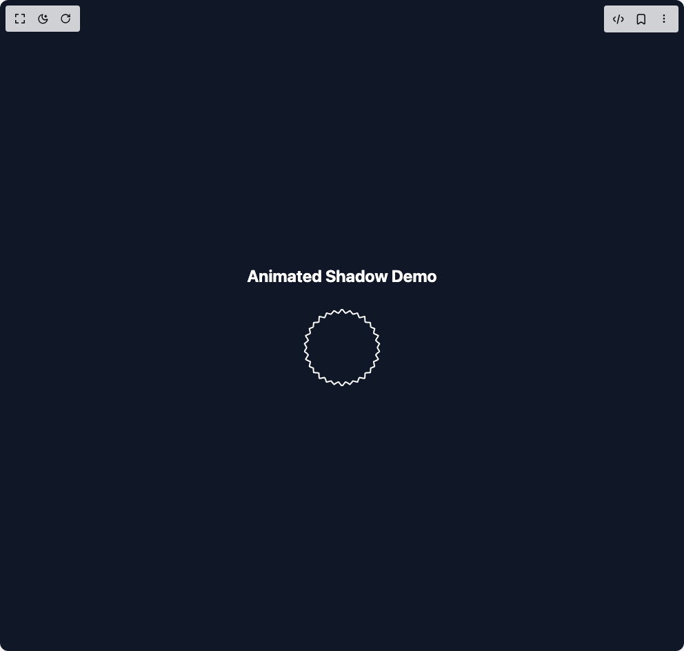

# Build Animated Shape in BuilderStudio

> Build this component in our Agentic IDE: [BuilderStudio](https://builderstudio.dev).
>
> Join the BuilderStudio community on [Discord](https://discord.gg/QdWeSGCqfe) and [Reddit](https://reddit.com/r/builderstudio).



## Component

- Author group: `shailendrakumar19999`
- Component: `animated-shape`
- Variant: `default`
- Rendered HTML snapshot: [`rendered.html`](rendered.html)

## BuilderStudio prompt

You are implementing a React component based on a component reference.

## Component identity

- Author: shailendrakumar19999
- Component slug: animated-shape
- Demo slug: default
- Title: animated-shape
- Description: 

## Goal

Recreate this component in a React + TypeScript + Tailwind CSS project. Preserve the visual layout, spacing, colors, border radius, shadows, interaction behavior, animation behavior, responsive behavior, and dark mode behavior shown in the rendered demo.

## Implementation requirements

- Use React and TypeScript.
- Use Tailwind CSS classes whenever possible.
- Keep the component self-contained unless the source files require helper components.
- If the source uses CSS variables, custom CSS, animations, or keyframes, include them.
- If the source uses external packages, list and use the required packages.
- Preserve accessibility attributes, button semantics, links, keyboard behavior, and ARIA attributes when visible in the source.
- Do not replace the component with a simplified placeholder.
- Return complete production-ready code.

## Dependencies

No reference metadata available.

## Rendered DOM snapshot

This is the rendered demo HTML extracted from the live preview. Use it to verify structure, class names, visible content, and layout.

```html
<div id="root"><div class="w-screen min-h-screen flex justify-center items-center"><div class="w-screen min-h-screen flex justify-center items-center"><div class="flex w-full items-center justify-center min-h-screen bg-gray-900"><div class="text-white"><h1 class="text-2xl font-bold mb-8 text-center">Animated Shadow Demo</h1><svg viewBox="0 0 304 112" class="w-80 h-28"><g stroke-width="2" stroke="currentColor" stroke-linejoin="round" fill="none" fill-rule="evenodd"><polygon id="path-1" points="152,0 152.9102,0.7706 153.8197,1.5413 154.7299,2.3119 155.6395,3.0825 156.5497,3.8531 157.486,4.3998 158.501,4.2666 159.5169,4.1336 160.5714,3.8168 161.6409,3.3928 162.7106,2.9601 163.7032,2.8534 164.5574,3.3372 165.4106,3.821 166.2639,4.3047 167.1171,4.7885 167.9696,5.3097 168.8714,5.7251 169.8942,5.797 170.9168,5.8688 171.9395,5.941 172.9622,6.0129 173.985,6.0847 174.7771,6.6356 175.39,7.5588 176.0039,8.4806 176.6506,9.3362 177.3392,10.1068 178.027,10.8775 179.1136,11.0243 180.2928,11.0249 181.4726,11.0256 182.6524,11.0264 183.8316,11.0272 184.9694,11.0871 185.342,12.1544 185.6441,13.292 185.9461,14.4299 186.2482,15.5675 186.5502,16.7052 186.9737,17.7154 187.9023,18.1933 188.8311,18.6716 189.8843,19.0392 191.0121,19.319 192.1385,19.599 193.051,20.0627 193.4642,20.9524 193.8773,21.8421 194.2906,22.7318 194.7037,23.6215 195.0277,24.6101 195.5697,25.4304 196.3308,26.0852 197.0925,26.7401 197.8536,27.3949 198.6155,28.0497 199.2852,28.7598 199.2432,29.901 199.2165,31.0359 199.2737,32.1293 199.3839,33.195 199.494,34.261 200.0365,35.1327 200.9726,35.8278 201.9068,36.5234 202.8429,37.2186 203.7773,37.9141 204.7033,38.6153 204.6204,39.6271 204.2057,40.7295 203.7909,41.8319 203.3759,42.9342 202.9611,44.0366 202.6834,45.109 203.1643,46.0159 203.6451,46.9228 204.1426,47.8284 204.7917,48.7153 205.5725,49.5677 206.1766,50.4404 206.0205,51.4006 205.8636,52.3608 205.7075,53.3209 205.5506,54.2811 205.3945,55.2412 205.3312,56.2361 205.4881,57.1963 205.6442,58.1564 205.8012,59.1166 205.9581,60.0767 206.1142,61.0369 205.9786,61.9635 205.1977,62.816 204.4318,63.6739 203.8855,64.5697 203.4046,65.4766 202.9239,66.3835 202.7537,67.3582 203.1685,68.4606 203.5834,69.563 203.9982,70.6654 204.4131,71.7677 204.7295,72.8588 204.2634,73.7094 203.3283,74.4049 202.393,75.1001 201.4578,75.7953 200.5225,76.4909 199.5873,77.186 199.4575,78.243 199.3472,79.3089 199.2522,80.3837 199.2337,81.4971 199.2765,82.6384 199.0078,83.5916 198.2467,84.2465 197.4857,84.9013 196.7239,85.5561 195.9629,86.211 195.1951,86.8635 194.9532,87.9031 194.5399,88.7928 194.1268,89.6825 193.7137,90.5722 193.3004,91.4619 192.7448,92.2306 191.6186,92.5106 190.4906,92.7903 189.3636,93.07 188.4003,93.5202 187.4717,93.9985 186.735,94.6787 186.4329,95.8163 186.1309,96.9542 185.8286,98.0919 185.5266,99.2295 185.2245,100.3671 184.447,100.9291 183.2815,100.9582 182.1025,100.959 180.9225,100.9598 179.7427,100.9604 178.5637,100.9612 177.7227,101.4929 177.0348,102.2635 176.3612,103.0694 175.7298,103.9587 175.1168,104.8821 174.5037,105.8052 173.5068,105.9304 172.4841,106.0022 171.4613,106.0741 170.4386,106.1463 169.416,106.2182 168.3932,106.3086 167.5728,106.9696 166.7195,107.4534 165.8662,107.9371 165.0121,108.4209 164.1589,108.9047 163.2744,109.2562 162.2047,108.8235 161.1352,108.3908 160.0689,107.9936 159.0321,107.7912 158.0171,107.6582 157.028,107.753 156.1176,108.5235 155.2082,109.2941 154.2979,110.0647 153.3885,110.8353 152.4783,111.606 151.5217,111.6059 150.6115,110.8353 149.7021,110.0647 148.7918,109.294 147.8824,108.5234 146.972,107.7529 145.9829,107.6581 144.9679,107.7911 143.9302,107.9935 142.8648,108.3908 141.7953,108.8235 140.7256,109.2563 139.8411,108.9047 138.987,108.4209 138.1338,107.9371 137.2805,107.4534 136.4272,106.9696 135.6068,106.3085 134.584,106.2181 133.5614,106.1462 132.5387,106.0744 131.5159,106.0022 130.4932,105.9303 129.4963,105.8052 128.8832,104.882 128.2702,103.9586 127.6388,103.0694 126.9652,102.2635 126.2773,101.4928 125.4363,100.9611 124.2564,100.9603 123.0775,100.9598 121.8975,100.959 120.7177,100.9582 119.553,100.929 118.7755,100.367 118.4734,99.2294 118.1714,98.0917 117.8691,96.9541 117.5671,95.8162 117.265,94.6786 116.5283,93.9984 115.5997,93.5201 114.6364,93.0699 113.5086,92.7902 112.3814,92.5105 111.2544,92.2305 110.6996,91.4618 110.2863,90.5721 109.8732,89.6824 109.4601,88.7927 109.0468,87.903 108.8049,86.8633 108.0371,86.2109 107.2761,85.556 106.5143,84.9012 105.7533,84.2464 104.9922,83.5915 104.7235,82.6383 104.7663,81.497 104.7478,80.3836 104.6528,79.3088 104.5425,78.2428 104.4127,77.1859 103.4775,76.4908 102.5422,75.7952 101.607,75.1 100.6717,74.4048 99.7366,73.7093 99.2705,72.8586 99.5869,71.7676 100.0018,70.6652 100.4166,69.5629 100.8315,68.4605 101.2463,67.3581 101.0761,66.3834 100.5954,65.4765 100.1145,64.5696 99.5682,63.6738 98.8023,62.8159 98.0214,61.9634 97.8858,61.0368 98.0419,60.0767 98.1988,59.1165 98.3549,58.1564 98.5119,57.1962 98.6688,56.2361 98.6055,55.2412 98.4494,54.281 98.2925,53.3209 98.1364,52.3608 97.9795,51.4006 97.8234,50.4405 98.4275,49.5677 99.2083,48.7153 99.8572,47.8285 100.3549,46.9228 100.8357,46.016 101.3166,45.109 101.0389,44.0366 100.6241,42.9342 100.2091,41.8319 99.7943,40.7295 99.3796,39.6271 99.2967,38.6153 100.2227,37.9141 101.1571,37.2186 102.0932,36.5234 103.0274,35.8278 103.9635,35.1326 104.506,34.261 104.6161,33.195 104.7263,32.1293 104.7835,31.0359 104.7568,29.901 104.7148,28.7598 105.3845,28.0497 106.1464,27.3949 106.9075,26.7401 107.6692,26.0853 108.4303,25.4305 108.9723,24.6101 109.2963,23.6215 109.7094,22.7318 110.1227,21.8421 110.5358,20.9524 110.949,20.0627 111.8615,19.599 112.9879,19.319 114.1157,19.0393 115.1689,18.6716 116.0977,18.1934 117.0263,17.7154 117.4498,16.7053 117.7518,15.5676 118.0539,14.4299 118.3559,13.2923 118.658,12.1546 119.0306,11.0871 120.1684,11.0272 121.3476,11.0264 122.5274,11.0256 123.7072,11.0251 124.8864,11.0243 125.973,10.8775 126.6608,10.1068 127.3494,9.3362 127.9961,8.4806 128.61,7.5589 129.2229,6.6356 130.015,6.0848 131.0378,6.0129 132.0605,5.941 133.0832,5.8688 134.1058,5.797 135.1286,5.7251 136.0304,5.3097 136.882,4.7885 137.7361,4.3047 138.5894,3.821 139.4426,3.3372 140.2959,2.8534 141.2894,2.9601 142.3591,3.3928 143.4286,3.8168 144.4831,4.1336 145.499,4.2666 146.514,4.3998 147.4503,3.8531 148.3607,3.0825 149.2701,2.3119 150.1803,1.5413 151.0898,0.7706 152,0 "></polygon><polygon id="path-2" points="152,0 156,17 164,1 164,19 175,5 171,22 185,11 178,27 194,19 184,33 200,28 188,40 205,39 190,48 208,50 191,56 208,62 190,64 205,73 188,72 200,84 184,79 194,93 178,85 185,101 171,90 175,107 164,93 164,111 156,95 152,112 148,95 140,111 140,93 129,107 133,90 119,101 126,85 110,93 120,79 104,84 116,72 99,73 114,64 96,62 113,56 96,50 114,48 99,39 116,40 104,28 120,33 110,19 126,27 119,11 133,22 129,5 140,19 140,1 148,17 " style="opacity: 0;"></polygon></g></svg></div></div></div></div></div>
```

## Reference source files

No reference source files were available.
