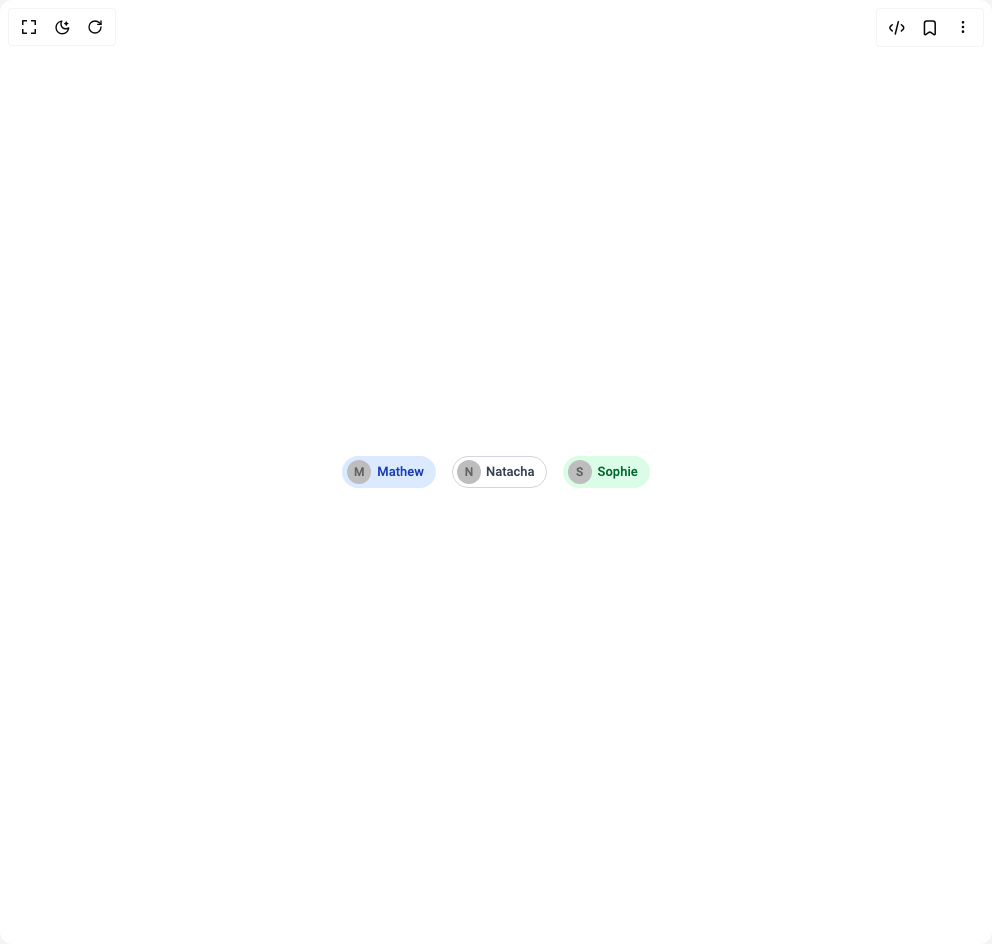

# Build Avatar Chips in BuilderStudio

> Build this component in our Agentic IDE: [BuilderStudio](https://builderstudio.dev).
>
> Join the BuilderStudio community on [Discord](https://discord.gg/QdWeSGCqfe) and [Reddit](https://reddit.com/r/builderstudio).



## Component

- Author group: `shailendrakumar19999`
- Component: `avatar-chips`
- Variant: `default`
- Rendered HTML snapshot: [`rendered.html`](rendered.html)

## BuilderStudio prompt

You are implementing a React component based on a component reference.

## Component identity

- Author: shailendrakumar19999
- Component slug: avatar-chips
- Demo slug: default
- Title: avatar-chips
- Description: 

## Goal

Recreate this component in a React + TypeScript + Tailwind CSS project. Preserve the visual layout, spacing, colors, border radius, shadows, interaction behavior, animation behavior, responsive behavior, and dark mode behavior shown in the rendered demo.

## Implementation requirements

- Use React and TypeScript.
- Use Tailwind CSS classes whenever possible.
- Keep the component self-contained unless the source files require helper components.
- If the source uses CSS variables, custom CSS, animations, or keyframes, include them.
- If the source uses external packages, list and use the required packages.
- Preserve accessibility attributes, button semantics, links, keyboard behavior, and ARIA attributes when visible in the source.
- Do not replace the component with a simplified placeholder.
- Return complete production-ready code.

## Dependencies

No reference metadata available.

## Rendered DOM snapshot

This is the rendered demo HTML extracted from the live preview. Use it to verify structure, class names, visible content, and layout.

```html
<div id="root"><div class="w-screen min-h-screen flex justify-center items-center"><div class="w-screen min-h-screen flex justify-center items-center"><div><div class="flex w-full mx-auto items-center justify-between p-4 bg-white dark:bg-gray-900"><div class="MuiStack-root css-jj2ztu"><div class="MuiButtonBase-root MuiChip-root MuiChip-filled MuiChip-sizeMedium MuiChip-colorDefault MuiChip-clickable MuiChip-clickableColorDefault MuiChip-filledDefault rounded-full px-3 py-1 text-sm font-medium transition-colors cursor-pointer !bg-blue-100 !text-blue-800 dark:!bg-blue-900 dark:!text-blue-100 css-9z8zab" tabindex="0" role="button"><div class="MuiAvatar-root MuiAvatar-circular MuiAvatar-colorDefault MuiChip-avatar MuiChip-avatarMedium MuiChip-avatarColorDefault css-9lpcve">M</div><span class="MuiChip-label MuiChip-labelMedium css-14vsv3w">Mathew</span></div><div class="MuiButtonBase-root MuiChip-root MuiChip-outlined MuiChip-sizeMedium MuiChip-colorDefault MuiChip-clickable MuiChip-clickableColorDefault MuiChip-outlinedDefault rounded-full px-3 py-1 text-sm font-medium transition-colors cursor-pointer !border !border-gray-300 !text-gray-700 dark:!border-gray-600 dark:!text-gray-200 css-14qpy53" tabindex="0" role="button"><div class="MuiAvatar-root MuiAvatar-circular MuiAvatar-colorDefault MuiChip-avatar MuiChip-avatarMedium MuiChip-avatarColorDefault css-9lpcve">N</div><span class="MuiChip-label MuiChip-labelMedium css-qbwvub">Natacha</span></div><div class="MuiButtonBase-root MuiChip-root MuiChip-filled MuiChip-sizeMedium MuiChip-colorDefault MuiChip-clickable MuiChip-clickableColorDefault MuiChip-filledDefault rounded-full px-3 py-1 text-sm font-medium transition-colors cursor-pointer !bg-green-100 !text-green-800 dark:!bg-green-900 dark:!text-green-100 css-9z8zab" tabindex="0" role="button"><div class="MuiAvatar-root MuiAvatar-circular MuiAvatar-colorDefault MuiChip-avatar MuiChip-avatarMedium MuiChip-avatarColorDefault css-9lpcve">S</div><span class="MuiChip-label MuiChip-labelMedium css-14vsv3w">Sophie</span></div></div></div></div></div></div></div>
```

## Reference source files

No reference source files were available.
