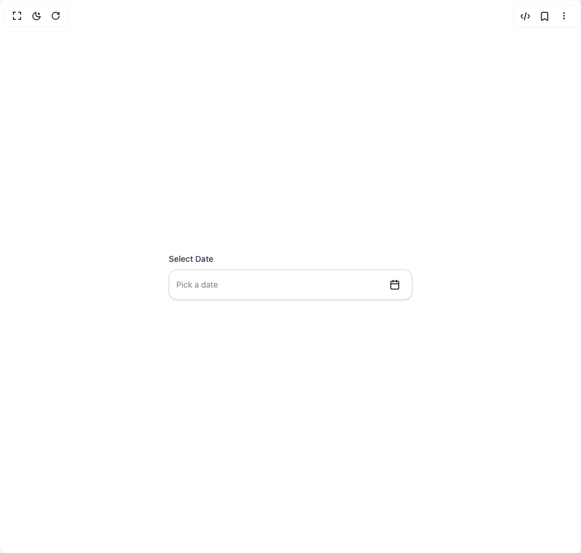

# Build Date Picker in BuilderStudio

> Build this component in our Agentic IDE: [BuilderStudio](https://builderstudio.dev).
>
> Join the BuilderStudio community on [Discord](https://discord.gg/QdWeSGCqfe) and [Reddit](https://reddit.com/r/builderstudio).



## Component

- Author group: `shailendrakumar19999`
- Component: `date-picker`
- Variant: `default`
- Rendered HTML snapshot: [`rendered.html`](rendered.html)

## BuilderStudio prompt

You are implementing a React component based on a component reference.

## Component identity

- Author: shailendrakumar19999
- Component slug: date-picker
- Demo slug: default
- Title: date-picker
- Description: 

## Goal

Recreate this component in a React + TypeScript + Tailwind CSS project. Preserve the visual layout, spacing, colors, border radius, shadows, interaction behavior, animation behavior, responsive behavior, and dark mode behavior shown in the rendered demo.

## Implementation requirements

- Use React and TypeScript.
- Use Tailwind CSS classes whenever possible.
- Keep the component self-contained unless the source files require helper components.
- If the source uses CSS variables, custom CSS, animations, or keyframes, include them.
- If the source uses external packages, list and use the required packages.
- Preserve accessibility attributes, button semantics, links, keyboard behavior, and ARIA attributes when visible in the source.
- Do not replace the component with a simplified placeholder.
- Return complete production-ready code.

## Dependencies

No reference metadata available.

## Rendered DOM snapshot

This is the rendered demo HTML extracted from the live preview. Use it to verify structure, class names, visible content, and layout.

```html
<div id="root"><div class="w-screen min-h-screen flex justify-center items-center"><div class="w-screen min-h-screen flex justify-center items-center"><div class="w-full max-w-md mx-auto p-4"><div data-scope="date-picker" data-part="root" dir="ltr" id="datepicker:«r0»" data-state="closed"><label data-scope="date-picker" data-part="label" id="datepicker:«r0»:label:0" dir="ltr" for="datepicker:«r0»:input:0" data-state="closed" data-index="0" class="block mb-2 text-sm font-medium text-gray-700 dark:text-gray-300">Select Date</label><div data-scope="date-picker" data-part="control" dir="ltr" id="datepicker:«r0»:control" class="flex items-center gap-2 rounded-xl border border-gray-300 dark:border-gray-600 bg-white dark:bg-gray-800 px-3 py-2 shadow-sm focus-within:ring-2 focus-within:ring-blue-500"><input data-scope="date-picker" data-part="input" id="datepicker:«r0»:input:0" autocomplete="off" autocorrect="off" spellcheck="false" dir="ltr" data-index="0" data-state="closed" placeholder="Pick a date" class="flex-1 bg-transparent outline-none text-sm text-gray-900 dark:text-gray-100"><button data-scope="date-picker" data-part="trigger" id="datepicker:«r0»:trigger" dir="ltr" type="button" aria-label="Open calendar" aria-controls="datepicker:«r0»:content" data-state="closed" aria-haspopup="grid" class="p-2 rounded-lg hover:bg-gray-100 dark:hover:bg-gray-700"><svg xmlns="http://www.w3.org/2000/svg" width="18" height="18" viewBox="0 0 24 24" fill="none" stroke="currentColor" stroke-width="2" stroke-linecap="round" stroke-linejoin="round" class="lucide lucide-calendar" aria-hidden="true"><path d="M8 2v4"></path><path d="M16 2v4"></path><rect width="18" height="18" x="3" y="4" rx="2"></rect><path d="M3 10h18"></path></svg></button><button data-scope="date-picker" data-part="clear-trigger" id="datepicker:«r0»:clear" dir="ltr" type="button" aria-label="Clear selected dates" hidden="" class="p-2 rounded-lg text-red-500 hover:bg-red-100 dark:hover:bg-red-900/40"><svg xmlns="http://www.w3.org/2000/svg" width="16" height="16" viewBox="0 0 24 24" fill="none" stroke="currentColor" stroke-width="2" stroke-linecap="round" stroke-linejoin="round" class="lucide lucide-x" aria-hidden="true"><path d="M18 6 6 18"></path><path d="m6 6 12 12"></path></svg></button></div></div></div></div></div></div>
```

## Reference source files

No reference source files were available.
