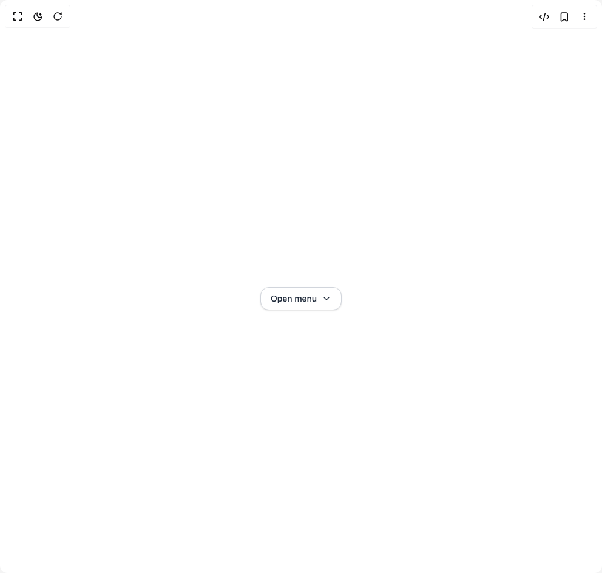

# Build Menu in BuilderStudio

> Build this component in our Agentic IDE: [BuilderStudio](https://builderstudio.dev).
>
> Join the BuilderStudio community on [Discord](https://discord.gg/QdWeSGCqfe) and [Reddit](https://reddit.com/r/builderstudio).



## Component

- Author group: `shailendrakumar19999`
- Component: `menu`
- Variant: `default`
- Rendered HTML snapshot: [`rendered.html`](rendered.html)

## BuilderStudio prompt

You are implementing a React component based on a component reference.

## Component identity

- Author: shailendrakumar19999
- Component slug: menu
- Demo slug: default
- Title: menu
- Description: 

## Goal

Recreate this component in a React + TypeScript + Tailwind CSS project. Preserve the visual layout, spacing, colors, border radius, shadows, interaction behavior, animation behavior, responsive behavior, and dark mode behavior shown in the rendered demo.

## Implementation requirements

- Use React and TypeScript.
- Use Tailwind CSS classes whenever possible.
- Keep the component self-contained unless the source files require helper components.
- If the source uses CSS variables, custom CSS, animations, or keyframes, include them.
- If the source uses external packages, list and use the required packages.
- Preserve accessibility attributes, button semantics, links, keyboard behavior, and ARIA attributes when visible in the source.
- Do not replace the component with a simplified placeholder.
- Return complete production-ready code.

## Dependencies

No reference metadata available.

## Rendered DOM snapshot

This is the rendered demo HTML extracted from the live preview. Use it to verify structure, class names, visible content, and layout.

```html
<div id="root"><div class="w-screen min-h-screen flex justify-center items-center"><div class="w-screen min-h-screen flex justify-center items-center"><div class="flex justify-center mt-10"><button data-scope="menu" data-part="trigger" type="button" dir="ltr" id="menu:«r0»:trigger" data-uid="«r0»" aria-haspopup="menu" aria-controls="menu:«r0»:content" data-state="closed" class="flex items-center gap-2 rounded-xl border border-gray-300 dark:border-gray-700 bg-white dark:bg-gray-800 px-4 py-2 text-sm font-medium shadow-sm hover:bg-gray-100 dark:hover:bg-gray-700 transition text-gray-800 dark:text-gray-200">Open menu <svg xmlns="http://www.w3.org/2000/svg" width="16" height="16" viewBox="0 0 24 24" fill="none" stroke="currentColor" stroke-width="2" stroke-linecap="round" stroke-linejoin="round" class="lucide lucide-chevron-down" aria-hidden="true"><path d="m6 9 6 6 6-6"></path></svg></button><div data-scope="menu" data-part="positioner" dir="ltr" id="menu:«r0»:popper" style="position: absolute; isolation: isolate; min-width: max-content; pointer-events: none; top: 0px; left: 0px; transform: translate3d(0px, -100vh, 0px); z-index: var(--z-index);"><div data-scope="menu" data-part="content" id="menu:«r0»:content" hidden="" data-state="closed" role="menu" tabindex="0" dir="ltr" aria-labelledby="menu:«r0»:trigger" class="mt-2 w-52 rounded-xl border border-gray-200 dark:border-gray-700 bg-white dark:bg-gray-900 shadow-lg p-2 text-sm text-gray-800 dark:text-gray-200"><div><div id="menu:«r0»:group:«r1»" data-scope="menu" data-part="item-group" dir="ltr" aria-labelledby="menu:«r0»:group-label:«r1»" role="group"><div data-scope="menu" data-part="item-group-label" id="menu:«r0»:group-label:«r1»" dir="ltr" class="px-2 py-1 text-xs font-semibold text-gray-500 dark:text-gray-400 uppercase">JS Frameworks</div><div data-scope="menu" data-part="item" id="«r0»/react" role="menuitem" data-ownedby="menu:«r0»:content" data-value="react" class="rounded-lg px-3 py-2 hover:bg-indigo-100 dark:hover:bg-indigo-600/40 hover:text-indigo-600 dark:hover:text-indigo-300 cursor-pointer">React</div><div data-scope="menu" data-part="item" id="«r0»/solid" role="menuitem" data-ownedby="menu:«r0»:content" data-value="solid" class="rounded-lg px-3 py-2 hover:bg-indigo-100 dark:hover:bg-indigo-600/40 hover:text-indigo-600 dark:hover:text-indigo-300 cursor-pointer">Solid</div><div data-scope="menu" data-part="item" id="«r0»/vue" role="menuitem" data-ownedby="menu:«r0»:content" data-value="vue" class="rounded-lg px-3 py-2 hover:bg-indigo-100 dark:hover:bg-indigo-600/40 hover:text-indigo-600 dark:hover:text-indigo-300 cursor-pointer">Vue</div><div data-scope="menu" data-part="item" id="«r0»/svelte" role="menuitem" data-ownedby="menu:«r0»:content" data-value="svelte" class="rounded-lg px-3 py-2 hover:bg-indigo-100 dark:hover:bg-indigo-600/40 hover:text-indigo-600 dark:hover:text-indigo-300 cursor-pointer">Svelte</div></div><div class="my-1 h-px bg-gray-200 dark:bg-gray-700"></div></div><div><div id="menu:«r0»:group:«r2»" data-scope="menu" data-part="item-group" dir="ltr" aria-labelledby="menu:«r0»:group-label:«r2»" role="group"><div data-scope="menu" data-part="item-group-label" id="menu:«r0»:group-label:«r2»" dir="ltr" class="px-2 py-1 text-xs font-semibold text-gray-500 dark:text-gray-400 uppercase">CSS Frameworks</div><div data-scope="menu" data-part="item" id="«r0»/panda" role="menuitem" data-ownedby="menu:«r0»:content" data-value="panda" class="rounded-lg px-3 py-2 hover:bg-indigo-100 dark:hover:bg-indigo-600/40 hover:text-indigo-600 dark:hover:text-indigo-300 cursor-pointer">Panda</div><div data-scope="menu" data-part="item" id="«r0»/tailwind" role="menuitem" data-ownedby="menu:«r0»:content" data-value="tailwind" class="rounded-lg px-3 py-2 hover:bg-indigo-100 dark:hover:bg-indigo-600/40 hover:text-indigo-600 dark:hover:text-indigo-300 cursor-pointer">Tailwind</div></div></div></div></div></div></div></div></div>
```

## Reference source files

No reference source files were available.
