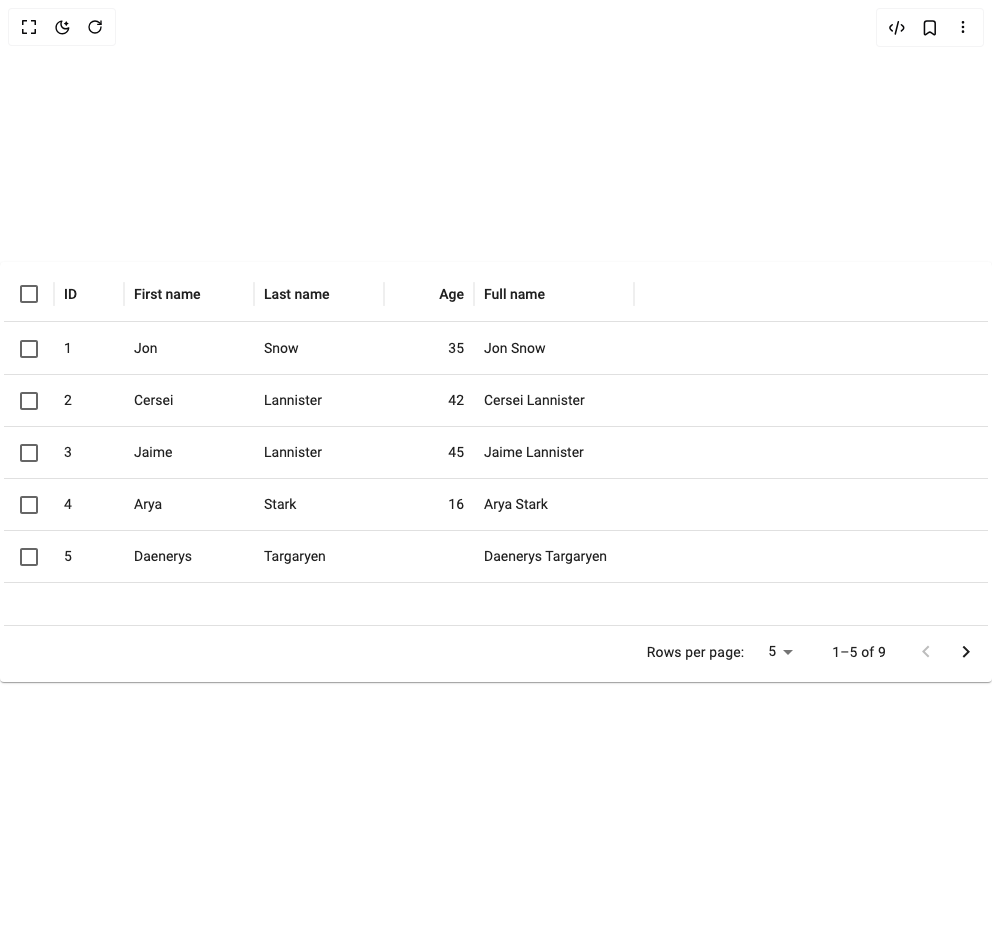

# Build Table in BuilderStudio

> Build this component in our Agentic IDE: [BuilderStudio](https://builderstudio.dev).
>
> Join the BuilderStudio community on [Discord](https://discord.gg/QdWeSGCqfe) and [Reddit](https://reddit.com/r/builderstudio).



## Component

- Author group: `shailendrakumar19999`
- Component: `table`
- Variant: `default`
- Rendered HTML snapshot: [`rendered.html`](rendered.html)

## BuilderStudio prompt

You are implementing a React component based on a component reference.

## Component identity

- Author: shailendrakumar19999
- Component slug: table
- Demo slug: default
- Title: table
- Description: 

## Goal

Recreate this component in a React + TypeScript + Tailwind CSS project. Preserve the visual layout, spacing, colors, border radius, shadows, interaction behavior, animation behavior, responsive behavior, and dark mode behavior shown in the rendered demo.

## Implementation requirements

- Use React and TypeScript.
- Use Tailwind CSS classes whenever possible.
- Keep the component self-contained unless the source files require helper components.
- If the source uses CSS variables, custom CSS, animations, or keyframes, include them.
- If the source uses external packages, list and use the required packages.
- Preserve accessibility attributes, button semantics, links, keyboard behavior, and ARIA attributes when visible in the source.
- Do not replace the component with a simplified placeholder.
- Return complete production-ready code.

## Dependencies

No reference metadata available.

## Rendered DOM snapshot

This is the rendered demo HTML extracted from the live preview. Use it to verify structure, class names, visible content, and layout.

```html
<div id="root"><div class="w-screen min-h-screen flex justify-center items-center"><div class="w-screen min-h-screen flex justify-center items-center"><div class="MuiPaper-root MuiPaper-elevation MuiPaper-rounded MuiPaper-elevation1 
 bg-white dark:bg-gray-900
 text-gray-900 dark:text-gray-100
 rounded-xl shadow-md p-1
 css-1o5dpk5" style="--Paper-shadow: 0px 2px 1px -1px rgba(0,0,0,0.2),0px 1px 1px 0px rgba(0,0,0,0.14),0px 1px 3px 0px rgba(0,0,0,0.12);"><div class="MuiDataGrid-root MuiDataGrid-root--densityStandard MuiDataGrid-withBorderColor MuiDataGridVariables-2552862236 css-l1s0ju" style="--DataGrid-hasScrollX: 0; --DataGrid-hasScrollY: 0; --DataGrid-scrollbarSize: 0px; --DataGrid-rowWidth: 984px; --DataGrid-columnsTotalWidth: 630px; --DataGrid-leftPinnedWidth: 0px; --DataGrid-rightPinnedWidth: 0px; --DataGrid-headerHeight: 56px; --DataGrid-headersTotalHeight: 56px; --DataGrid-topContainerHeight: 56px; --DataGrid-bottomContainerHeight: 0px; --height: 52px;"><div class="MuiDataGrid-mainContent" role="presentation"><div class="MuiDataGrid-main css-1f0pawm" tabindex="-1" role="grid" aria-colcount="6" aria-rowcount="10" aria-multiselectable="true"><div role="presentation" data-id="gridPanelAnchor" class="css-18l11qw"></div><div class="MuiDataGrid-virtualScroller css-2d5ulg" role="presentation" style="overflow-x: hidden;"><div class="MuiDataGrid-topContainer MuiDataGrid-container--top css-b1wygl" role="presentation"><div class="MuiDataGrid-columnHeaders css-1t374vw" role="presentation"><div role="row" aria-rowindex="1" class="MuiDataGrid-row--borderBottom css-gvoll6" style="height: 56px;"><div role="presentation" style="width: 0px;"></div><div class="MuiDataGrid-columnHeader MuiDataGrid-columnHeader--alignCenter MuiDataGrid-withBorderColor MuiDataGrid-columnHeaderCheckbox" role="columnheader" tabindex="0" aria-colindex="1" aria-sort="none" data-field="__check__" style="width: 50px;"><div class="MuiDataGrid-columnHeaderDraggableContainer" draggable="false" role="presentation"><div class="MuiDataGrid-columnHeaderTitleContainer" role="presentation"><div class="MuiDataGrid-columnHeaderTitleContainerContent"><span class="MuiButtonBase-root MuiCheckbox-root MuiCheckbox-colorPrimary MuiCheckbox-sizeMedium PrivateSwitchBase-root MuiCheckbox-root MuiCheckbox-colorPrimary MuiCheckbox-sizeMedium MuiCheckbox-root MuiCheckbox-colorPrimary MuiCheckbox-sizeMedium MuiDataGrid-checkboxInput css-a8ssvu"><input tabindex="-1" data-indeterminate="false" aria-label="Select all rows" class="PrivateSwitchBase-input css-j8yymo" type="checkbox" name="select_all_rows"><svg class="MuiSvgIcon-root MuiSvgIcon-fontSizeMedium css-q7mezt" focusable="false" aria-hidden="true" viewBox="0 0 24 24"><path d="M19 5v14H5V5h14m0-2H5c-1.1 0-2 .9-2 2v14c0 1.1.9 2 2 2h14c1.1 0 2-.9 2-2V5c0-1.1-.9-2-2-2z"></path></svg></span></div></div></div><div class="MuiDataGrid-columnSeparator MuiDataGrid-columnSeparator--sideRight" style="min-height: 56px;"><svg class="MuiSvgIcon-root MuiSvgIcon-fontSizeMedium MuiDataGrid-iconSeparator css-q7mezt" focusable="false" aria-hidden="true" viewBox="0 0 24 24"><rect width="1" height="24" x="11.5" rx="0.5"></rect></svg></div></div><div class="MuiDataGrid-columnHeader MuiDataGrid-columnHeader--sortable MuiDataGrid-withBorderColor" role="columnheader" tabindex="-1" aria-colindex="2" aria-sort="none" data-field="id" style="width: 70px;"><div class="MuiDataGrid-columnHeaderDraggableContainer" draggable="false" role="presentation"><div class="MuiDataGrid-columnHeaderTitleContainer" role="presentation"><div class="MuiDataGrid-columnHeaderTitleContainerContent"><div class="MuiDataGrid-columnHeaderTitle css-1rxsvxt">ID</div></div><div class="MuiDataGrid-iconButtonContainer css-cp5hn7"><button class="MuiButtonBase-root MuiIconButton-root MuiIconButton-sizeSmall MuiDataGrid-sortButton css-1szya3h" tabindex="-1" type="button" aria-label="Sort" title="Sort" field="id"><svg class="MuiSvgIcon-root MuiSvgIcon-fontSizeSmall MuiDataGrid-sortIcon css-vh810p" focusable="false" aria-hidden="true" viewBox="0 0 24 24"><path d="M4 12l1.41 1.41L11 7.83V20h2V7.83l5.58 5.59L20 12l-8-8-8 8z"></path></svg></button></div></div><div class="MuiDataGrid-menuIcon"><button class="MuiButtonBase-root MuiIconButton-root MuiIconButton-sizeSmall MuiDataGrid-menuIconButton css-xz9haa" tabindex="-1" type="button" id="«r9»" aria-label="ID column menu" aria-haspopup="menu" aria-expanded="false"><svg class="MuiSvgIcon-root MuiSvgIcon-fontSizeInherit css-1l6e05h" focusable="false" aria-hidden="true" viewBox="0 0 24 24"><path d="M12 8c1.1 0 2-.9 2-2s-.9-2-2-2-2 .9-2 2 .9 2 2 2zm0 2c-1.1 0-2 .9-2 2s.9 2 2 2 2-.9 2-2-.9-2-2-2zm0 6c-1.1 0-2 .9-2 2s.9 2 2 2 2-.9 2-2-.9-2-2-2z"></path></svg></button></div></div><div class="MuiDataGrid-columnSeparator MuiDataGrid-columnSeparator--resizable MuiDataGrid-columnSeparator--sideRight" style="min-height: 56px;"><svg class="MuiSvgIcon-root MuiSvgIcon-fontSizeMedium MuiDataGrid-iconSeparator css-q7mezt" focusable="false" aria-hidden="true" viewBox="0 0 24 24"><rect width="1" height="24" x="11.5" rx="0.5"></rect></svg></div></div><div class="MuiDataGrid-columnHeader MuiDataGrid-columnHeader--sortable MuiDataGrid-withBorderColor" role="columnheader" tabindex="-1" aria-colindex="3" aria-sort="none" data-field="firstName" style="width: 130px;"><div class="MuiDataGrid-columnHeaderDraggableContainer" draggable="false" role="presentation"><div class="MuiDataGrid-columnHeaderTitleContainer" role="presentation"><div class="MuiDataGrid-columnHeaderTitleContainerContent"><div class="MuiDataGrid-columnHeaderTitle css-1rxsvxt">First name</div></div><div class="MuiDataGrid-iconButtonContainer css-cp5hn7"><button class="MuiButtonBase-root MuiIconButton-root MuiIconButton-sizeSmall MuiDataGrid-sortButton css-1szya3h" tabindex="-1" type="button" aria-label="Sort" title="Sort" field="firstName"><svg class="MuiSvgIcon-root MuiSvgIcon-fontSizeSmall MuiDataGrid-sortIcon css-vh810p" focusable="false" aria-hidden="true" viewBox="0 0 24 24"><path d="M4 12l1.41 1.41L11 7.83V20h2V7.83l5.58 5.59L20 12l-8-8-8 8z"></path></svg></button></div></div><div class="MuiDataGrid-menuIcon"><button class="MuiButtonBase-root MuiIconButton-root MuiIconButton-sizeSmall MuiDataGrid-menuIconButton css-xz9haa" tabindex="-1" type="button" id="«rf»" aria-label="First name column menu" aria-haspopup="menu" aria-expanded="false"><svg class="MuiSvgIcon-root MuiSvgIcon-fontSizeInherit css-1l6e05h" focusable="false" aria-hidden="true" viewBox="0 0 24 24"><path d="M12 8c1.1 0 2-.9 2-2s-.9-2-2-2-2 .9-2 2 .9 2 2 2zm0 2c-1.1 0-2 .9-2 2s.9 2 2 2 2-.9 2-2-.9-2-2-2zm0 6c-1.1 0-2 .9-2 2s.9 2 2 2 2-.9 2-2-.9-2-2-2z"></path></svg></button></div></div><div class="MuiDataGrid-columnSeparator MuiDataGrid-columnSeparator--resizable MuiDataGrid-columnSeparator--sideRight" style="min-height: 56px;"><svg class="MuiSvgIcon-root MuiSvgIcon-fontSizeMedium MuiDataGrid-iconSeparator css-q7mezt" focusable="false" aria-hidden="true" viewBox="0 0 24 24"><rect width="1" height="24" x="11.5" rx="0.5"></rect></svg></div></div><div class="MuiDataGrid-columnHeader MuiDataGrid-columnHeader--sortable MuiDataGrid-withBorderColor" role="columnheader" tabindex="-1" aria-colindex="4" aria-sort="none" data-field="lastName" style="width: 130px;"><div class="MuiDataGrid-columnHeaderDraggableContainer" draggable="false" role="presentation"><div class="MuiDataGrid-columnHeaderTitleContainer" role="presentation"><div class="MuiDataGrid-columnHeaderTitleContainerContent"><div class="MuiDataGrid-columnHeaderTitle css-1rxsvxt">Last name</div></div><div class="MuiDataGrid-iconButtonContainer css-cp5hn7"><button class="MuiButtonBase-root MuiIconButton-root MuiIconButton-sizeSmall MuiDataGrid-sortButton css-1szya3h" tabindex="-1" type="button" aria-label="Sort" title="Sort" field="lastName"><svg class="MuiSvgIcon-root MuiSvgIcon-fontSizeSmall MuiDataGrid-sortIcon css-vh810p" focusable="false" aria-hidden="true" viewBox="0 0 24 24"><path d="M4 12l1.41 1.41L11 7.83V20h2V7.83l5.58 5.59L20 12l-8-8-8 8z"></path></svg></button></div></div><div class="MuiDataGrid-menuIcon"><button class="MuiButtonBase-root MuiIconButton-root MuiIconButton-sizeSmall MuiDataGrid-menuIconButton css-xz9haa" tabindex="-1" type="button" id="«rl»" aria-label="Last name column menu" aria-haspopup="menu" aria-expanded="false"><svg class="MuiSvgIcon-root MuiSvgIcon-fontSizeInherit css-1l6e05h" focusable="false" aria-hidden="true" viewBox="0 0 24 24"><path d="M12 8c1.1 0 2-.9 2-2s-.9-2-2-2-2 .9-2 2 .9 2 2 2zm0 2c-1.1 0-2 .9-2 2s.9 2 2 2 2-.9 2-2-.9-2-2-2zm0 6c-1.1 0-2 .9-2 2s.9 2 2 2 2-.9 2-2-.9-2-2-2z"></path></svg></button></div></div><div class="MuiDataGrid-columnSeparator MuiDataGrid-columnSeparator--resizable MuiDataGrid-columnSeparator--sideRight" style="min-height: 56px;"><svg class="MuiSvgIcon-root MuiSvgIcon-fontSizeMedium MuiDataGrid-iconSeparator css-q7mezt" focusable="false" aria-hidden="true" viewBox="0 0 24 24"><rect width="1" height="24" x="11.5" rx="0.5"></rect></svg></div></div><div class="MuiDataGrid-columnHeader MuiDataGrid-columnHeader--alignRight MuiDataGrid-columnHeader--sortable MuiDataGrid-columnHeader--numeric MuiDataGrid-withBorderColor" role="columnheader" tabindex="-1" aria-colindex="5" aria-sort="none" data-field="age" style="width: 90px;"><div class="MuiDataGrid-columnHeaderDraggableContainer" draggable="false" role="presentation"><div class="MuiDataGrid-columnHeaderTitleContainer" role="presentation"><div class="MuiDataGrid-columnHeaderTitleContainerContent"><div class="MuiDataGrid-columnHeaderTitle css-1rxsvxt">Age</div></div><div class="MuiDataGrid-iconButtonContainer css-cp5hn7"><button class="MuiButtonBase-root MuiIconButton-root MuiIconButton-sizeSmall MuiDataGrid-sortButton css-1szya3h" tabindex="-1" type="button" aria-label="Sort" title="Sort" field="age"><svg class="MuiSvgIcon-root MuiSvgIcon-fontSizeSmall MuiDataGrid-sortIcon css-vh810p" focusable="false" aria-hidden="true" viewBox="0 0 24 24"><path d="M4 12l1.41 1.41L11 7.83V20h2V7.83l5.58 5.59L20 12l-8-8-8 8z"></path></svg></button></div></div><div class="MuiDataGrid-menuIcon"><button class="MuiButtonBase-root MuiIconButton-root MuiIconButton-sizeSmall MuiDataGrid-menuIconButton css-xz9haa" tabindex="-1" type="button" id="«rr»" aria-label="Age column menu" aria-haspopup="menu" aria-expanded="false"><svg class="MuiSvgIcon-root MuiSvgIcon-fontSizeInherit css-1l6e05h" focusable="false" aria-hidden="true" viewBox="0 0 24 24"><path d="M12 8c1.1 0 2-.9 2-2s-.9-2-2-2-2 .9-2 2 .9 2 2 2zm0 2c-1.1 0-2 .9-2 2s.9 2 2 2 2-.9 2-2-.9-2-2-2zm0 6c-1.1 0-2 .9-2 2s.9 2 2 2 2-.9 2-2-.9-2-2-2z"></path></svg></button></div></div><div class="MuiDataGrid-columnSeparator MuiDataGrid-columnSeparator--resizable MuiDataGrid-columnSeparator--sideRight" style="min-height: 56px;"><svg class="MuiSvgIcon-root MuiSvgIcon-fontSizeMedium MuiDataGrid-iconSeparator css-q7mezt" focusable="false" aria-hidden="true" viewBox="0 0 24 24"><rect width="1" height="24" x="11.5" rx="0.5"></rect></svg></div></div><div class="MuiDataGrid-columnHeader MuiDataGrid-withBorderColor MuiDataGrid-columnHeader--lastUnpinned MuiDataGrid-columnHeader--last" role="columnheader" tabindex="-1" aria-colindex="6" aria-sort="none" data-field="fullName" style="width: 160px;"><div class="MuiDataGrid-columnHeaderDraggableContainer" draggable="false" role="presentation"><div class="MuiDataGrid-columnHeaderTitleContainer" role="presentation"><div class="MuiDataGrid-columnHeaderTitleContainerContent"><div class="MuiDataGrid-columnHeaderTitle css-1rxsvxt">Full name</div></div></div><div class="MuiDataGrid-menuIcon"><button class="MuiButtonBase-root MuiIconButton-root MuiIconButton-sizeSmall MuiDataGrid-menuIconButton css-xz9haa" tabindex="-1" type="button" id="«r11»" aria-label="Full name column menu" aria-haspopup="menu" aria-expanded="false"><svg class="MuiSvgIcon-root MuiSvgIcon-fontSizeInherit css-1l6e05h" focusable="false" aria-hidden="true" viewBox="0 0 24 24"><path d="M12 8c1.1 0 2-.9 2-2s-.9-2-2-2-2 .9-2 2 .9 2 2 2zm0 2c-1.1 0-2 .9-2 2s.9 2 2 2 2-.9 2-2-.9-2-2-2zm0 6c-1.1 0-2 .9-2 2s.9 2 2 2 2-.9 2-2-.9-2-2-2z"></path></svg></button></div></div><div class="MuiDataGrid-columnSeparator MuiDataGrid-columnSeparator--resizable MuiDataGrid-columnSeparator--sideRight" style="min-height: 56px;"><svg class="MuiSvgIcon-root MuiSvgIcon-fontSizeMedium MuiDataGrid-iconSeparator css-q7mezt" focusable="false" aria-hidden="true" viewBox="0 0 24 24"><rect width="1" height="24" x="11.5" rx="0.5"></rect></svg></div></div><div role="presentation" class="MuiDataGrid-filler"></div><div role="presentation" class="MuiDataGrid-scrollbarFiller MuiDataGrid-scrollbarFiller--header"></div></div></div></div><div role="presentation" class="MuiDataGrid-virtualScrollerContent css-1xdhyk6" style="width: auto; flex-basis: 260px; flex-shrink: 0;"><div class="MuiDataGrid-virtualScrollerRenderZone css-1vouojk" role="rowgroup" style="transform: translate3d(0px, 0px, 0px);"><div data-id="1" data-rowindex="0" role="row" class="MuiDataGrid-row MuiDataGrid-row--firstVisible" aria-rowindex="2" aria-selected="false" style="max-height: 52px; min-height: 52px; --height: 52px;"><div role="presentation" class="MuiDataGrid-cellOffsetLeft" style="width: 0px;"></div><div class="MuiDataGrid-cell MuiDataGrid-cell--textCenter MuiDataGrid-cellCheckbox MuiDataGrid-cell--flex" role="gridcell" data-field="__check__" data-colindex="0" aria-colindex="1" aria-colspan="1" aria-rowspan="1" tabindex="-1" style="--width: 50px;"><span class="MuiButtonBase-root MuiCheckbox-root MuiCheckbox-colorPrimary MuiCheckbox-sizeMedium PrivateSwitchBase-root MuiCheckbox-root MuiCheckbox-colorPrimary MuiCheckbox-sizeMedium MuiCheckbox-root MuiCheckbox-colorPrimary MuiCheckbox-sizeMedium MuiDataGrid-checkboxInput css-a8ssvu"><input tabindex="-1" data-indeterminate="false" aria-label="Select row" class="PrivateSwitchBase-input css-j8yymo" type="checkbox" value="false" name="select_row"><svg class="MuiSvgIcon-root MuiSvgIcon-fontSizeMedium css-q7mezt" focusable="false" aria-hidden="true" viewBox="0 0 24 24"><path d="M19 5v14H5V5h14m0-2H5c-1.1 0-2 .9-2 2v14c0 1.1.9 2 2 2h14c1.1 0 2-.9 2-2V5c0-1.1-.9-2-2-2z"></path></svg></span></div><div class="MuiDataGrid-cell MuiDataGrid-cell--textLeft" role="gridcell" data-field="id" data-colindex="1" aria-colindex="2" aria-colspan="1" aria-rowspan="1" title="1" tabindex="-1" style="--width: 70px;">1</div><div class="MuiDataGrid-cell MuiDataGrid-cell--textLeft" role="gridcell" data-field="firstName" data-colindex="2" aria-colindex="3" aria-colspan="1" aria-rowspan="1" title="Jon" tabindex="-1" style="--width: 130px;">Jon</div><div class="MuiDataGrid-cell MuiDataGrid-cell--textLeft" role="gridcell" data-field="lastName" data-colindex="3" aria-colindex="4" aria-colspan="1" aria-rowspan="1" title="Snow" tabindex="-1" style="--width: 130px;">Snow</div><div class="MuiDataGrid-cell MuiDataGrid-cell--textRight" role="gridcell" data-field="age" data-colindex="4" aria-colindex="5" aria-colspan="1" aria-rowspan="1" title="35" tabindex="-1" style="--width: 90px;">35</div><div class="MuiDataGrid-cell MuiDataGrid-cell--textLeft" role="gridcell" data-field="fullName" data-colindex="5" aria-colindex="6" aria-colspan="1" aria-rowspan="1" title="Jon Snow" tabindex="-1" style="--width: 160px;">Jon Snow</div><div role="presentation" class="MuiDataGrid-cell MuiDataGrid-cellEmpty"></div></div><div data-id="2" data-rowindex="1" role="row" class="MuiDataGrid-row" aria-rowindex="3" aria-selected="false" style="max-height: 52px; min-height: 52px; --height: 52px;"><div role="presentation" class="MuiDataGrid-cellOffsetLeft" style="width: 0px;"></div><div class="MuiDataGrid-cell MuiDataGrid-cell--textCenter MuiDataGrid-cellCheckbox MuiDataGrid-cell--flex" role="gridcell" data-field="__check__" data-colindex="0" aria-colindex="1" aria-colspan="1" aria-rowspan="1" tabindex="-1" style="--width: 50px;"><span class="MuiButtonBase-root MuiCheckbox-root MuiCheckbox-colorPrimary MuiCheckbox-sizeMedium PrivateSwitchBase-root MuiCheckbox-root MuiCheckbox-colorPrimary MuiCheckbox-sizeMedium MuiCheckbox-root MuiCheckbox-colorPrimary MuiCheckbox-sizeMedium MuiDataGrid-checkboxInput css-a8ssvu"><input tabindex="-1" data-indeterminate="false" aria-label="Select row" class="PrivateSwitchBase-input css-j8yymo" type="checkbox" value="false" name="select_row"><svg class="MuiSvgIcon-root MuiSvgIcon-fontSizeMedium css-q7mezt" focusable="false" aria-hidden="true" viewBox="0 0 24 24"><path d="M19 5v14H5V5h14m0-2H5c-1.1 0-2 .9-2 2v14c0 1.1.9 2 2 2h14c1.1 0 2-.9 2-2V5c0-1.1-.9-2-2-2z"></path></svg></span></div><div class="MuiDataGrid-cell MuiDataGrid-cell--textLeft" role="gridcell" data-field="id" data-colindex="1" aria-colindex="2" aria-colspan="1" aria-rowspan="1" title="2" tabindex="-1" style="--width: 70px;">2</div><div class="MuiDataGrid-cell MuiDataGrid-cell--textLeft" role="gridcell" data-field="firstName" data-colindex="2" aria-colindex="3" aria-colspan="1" aria-rowspan="1" title="Cersei" tabindex="-1" style="--width: 130px;">Cersei</div><div class="MuiDataGrid-cell MuiDataGrid-cell--textLeft" role="gridcell" data-field="lastName" data-colindex="3" aria-colindex="4" aria-colspan="1" aria-rowspan="1" title="Lannister" tabindex="-1" style="--width: 130px;">Lannister</div><div class="MuiDataGrid-cell MuiDataGrid-cell--textRight" role="gridcell" data-field="age" data-colindex="4" aria-colindex="5" aria-colspan="1" aria-rowspan="1" title="42" tabindex="-1" style="--width: 90px;">42</div><div class="MuiDataGrid-cell MuiDataGrid-cell--textLeft" role="gridcell" data-field="fullName" data-colindex="5" aria-colindex="6" aria-colspan="1" aria-rowspan="1" title="Cersei Lannister" tabindex="-1" style="--width: 160px;">Cersei Lannister</div><div role="presentation" class="MuiDataGrid-cell MuiDataGrid-cellEmpty"></div></div><div data-id="3" data-rowindex="2" role="row" class="MuiDataGrid-row" aria-rowindex="4" aria-selected="false" style="max-height: 52px; min-height: 52px; --height: 52px;"><div role="presentation" class="MuiDataGrid-cellOffsetLeft" style="width: 0px;"></div><div class="MuiDataGrid-cell MuiDataGrid-cell--textCenter MuiDataGrid-cellCheckbox MuiDataGrid-cell--flex" role="gridcell" data-field="__check__" data-colindex="0" aria-colindex="1" aria-colspan="1" aria-rowspan="1" tabindex="-1" style="--width: 50px;"><span class="MuiButtonBase-root MuiCheckbox-root MuiCheckbox-colorPrimary MuiCheckbox-sizeMedium PrivateSwitchBase-root MuiCheckbox-root MuiCheckbox-colorPrimary MuiCheckbox-sizeMedium MuiCheckbox-root MuiCheckbox-colorPrimary MuiCheckbox-sizeMedium MuiDataGrid-checkboxInput css-a8ssvu"><input tabindex="-1" data-indeterminate="false" aria-label="Select row" class="PrivateSwitchBase-input css-j8yymo" type="checkbox" value="false" name="select_row"><svg class="MuiSvgIcon-root MuiSvgIcon-fontSizeMedium css-q7mezt" focusable="false" aria-hidden="true" viewBox="0 0 24 24"><path d="M19 5v14H5V5h14m0-2H5c-1.1 0-2 .9-2 2v14c0 1.1.9 2 2 2h14c1.1 0 2-.9 2-2V5c0-1.1-.9-2-2-2z"></path></svg></span></div><div class="MuiDataGrid-cell MuiDataGrid-cell--textLeft" role="gridcell" data-field="id" data-colindex="1" aria-colindex="2" aria-colspan="1" aria-rowspan="1" title="3" tabindex="-1" style="--width: 70px;">3</div><div class="MuiDataGrid-cell MuiDataGrid-cell--textLeft" role="gridcell" data-field="firstName" data-colindex="2" aria-colindex="3" aria-colspan="1" aria-rowspan="1" title="Jaime" tabindex="-1" style="--width: 130px;">Jaime</div><div class="MuiDataGrid-cell MuiDataGrid-cell--textLeft" role="gridcell" data-field="lastName" data-colindex="3" aria-colindex="4" aria-colspan="1" aria-rowspan="1" title="Lannister" tabindex="-1" style="--width: 130px;">Lannister</div><div class="MuiDataGrid-cell MuiDataGrid-cell--textRight" role="gridcell" data-field="age" data-colindex="4" aria-colindex="5" aria-colspan="1" aria-rowspan="1" title="45" tabindex="-1" style="--width: 90px;">45</div><div class="MuiDataGrid-cell MuiDataGrid-cell--textLeft" role="gridcell" data-field="fullName" data-colindex="5" aria-colindex="6" aria-colspan="1" aria-rowspan="1" title="Jaime Lannister" tabindex="-1" style="--width: 160px;">Jaime Lannister</div><div role="presentation" class="MuiDataGrid-cell MuiDataGrid-cellEmpty"></div></div><div data-id="4" data-rowindex="3" role="row" class="MuiDataGrid-row" aria-rowindex="5" aria-selected="false" style="max-height: 52px; min-height: 52px; --height: 52px;"><div role="presentation" class="MuiDataGrid-cellOffsetLeft" style="width: 0px;"></div><div class="MuiDataGrid-cell MuiDataGrid-cell--textCenter MuiDataGrid-cellCheckbox MuiDataGrid-cell--flex" role="gridcell" data-field="__check__" data-colindex="0" aria-colindex="1" aria-colspan="1" aria-rowspan="1" tabindex="-1" style="--width: 50px;"><span class="MuiButtonBase-root MuiCheckbox-root MuiCheckbox-colorPrimary MuiCheckbox-sizeMedium PrivateSwitchBase-root MuiCheckbox-root MuiCheckbox-colorPrimary MuiCheckbox-sizeMedium MuiCheckbox-root MuiCheckbox-colorPrimary MuiCheckbox-sizeMedium MuiDataGrid-checkboxInput css-a8ssvu"><input tabindex="-1" data-indeterminate="false" aria-label="Select row" class="PrivateSwitchBase-input css-j8yymo" type="checkbox" value="false" name="select_row"><svg class="MuiSvgIcon-root MuiSvgIcon-fontSizeMedium css-q7mezt" focusable="false" aria-hidden="true" viewBox="0 0 24 24"><path d="M19 5v14H5V5h14m0-2H5c-1.1 0-2 .9-2 2v14c0 1.1.9 2 2 2h14c1.1 0 2-.9 2-2V5c0-1.1-.9-2-2-2z"></path></svg></span></div><div class="MuiDataGrid-cell MuiDataGrid-cell--textLeft" role="gridcell" data-field="id" data-colindex="1" aria-colindex="2" aria-colspan="1" aria-rowspan="1" title="4" tabindex="-1" style="--width: 70px;">4</div><div class="MuiDataGrid-cell MuiDataGrid-cell--textLeft" role="gridcell" data-field="firstName" data-colindex="2" aria-colindex="3" aria-colspan="1" aria-rowspan="1" title="Arya" tabindex="-1" style="--width: 130px;">Arya</div><div class="MuiDataGrid-cell MuiDataGrid-cell--textLeft" role="gridcell" data-field="lastName" data-colindex="3" aria-colindex="4" aria-colspan="1" aria-rowspan="1" title="Stark" tabindex="-1" style="--width: 130px;">Stark</div><div class="MuiDataGrid-cell MuiDataGrid-cell--textRight" role="gridcell" data-field="age" data-colindex="4" aria-colindex="5" aria-colspan="1" aria-rowspan="1" title="16" tabindex="-1" style="--width: 90px;">16</div><div class="MuiDataGrid-cell MuiDataGrid-cell--textLeft" role="gridcell" data-field="fullName" data-colindex="5" aria-colindex="6" aria-colspan="1" aria-rowspan="1" title="Arya Stark" tabindex="-1" style="--width: 160px;">Arya Stark</div><div role="presentation" class="MuiDataGrid-cell MuiDataGrid-cellEmpty"></div></div><div data-id="5" data-rowindex="4" role="row" class="MuiDataGrid-row MuiDataGrid-row--lastVisible" aria-rowindex="6" aria-selected="false" style="max-height: 52px; min-height: 52px; --height: 52px;"><div role="presentation" class="MuiDataGrid-cellOffsetLeft" style="width: 0px;"></div><div class="MuiDataGrid-cell MuiDataGrid-cell--textCenter MuiDataGrid-cellCheckbox MuiDataGrid-cell--flex" role="gridcell" data-field="__check__" data-colindex="0" aria-colindex="1" aria-colspan="1" aria-rowspan="1" tabindex="-1" style="--width: 50px;"><span class="MuiButtonBase-root MuiCheckbox-root MuiCheckbox-colorPrimary MuiCheckbox-sizeMedium PrivateSwitchBase-root MuiCheckbox-root MuiCheckbox-colorPrimary MuiCheckbox-sizeMedium MuiCheckbox-root MuiCheckbox-colorPrimary MuiCheckbox-sizeMedium MuiDataGrid-checkboxInput css-a8ssvu"><input tabindex="-1" data-indeterminate="false" aria-label="Select row" class="PrivateSwitchBase-input css-j8yymo" type="checkbox" value="false" name="select_row"><svg class="MuiSvgIcon-root MuiSvgIcon-fontSizeMedium css-q7mezt" focusable="false" aria-hidden="true" viewBox="0 0 24 24"><path d="M19 5v14H5V5h14m0-2H5c-1.1 0-2 .9-2 2v14c0 1.1.9 2 2 2h14c1.1 0 2-.9 2-2V5c0-1.1-.9-2-2-2z"></path></svg></span></div><div class="MuiDataGrid-cell MuiDataGrid-cell--textLeft" role="gridcell" data-field="id" data-colindex="1" aria-colindex="2" aria-colspan="1" aria-rowspan="1" title="5" tabindex="-1" style="--width: 70px;">5</div><div class="MuiDataGrid-cell MuiDataGrid-cell--textLeft" role="gridcell" data-field="firstName" data-colindex="2" aria-colindex="3" aria-colspan="1" aria-rowspan="1" title="Daenerys" tabindex="-1" style="--width: 130px;">Daenerys</div><div class="MuiDataGrid-cell MuiDataGrid-cell--textLeft" role="gridcell" data-field="lastName" data-colindex="3" aria-colindex="4" aria-colspan="1" aria-rowspan="1" title="Targaryen" tabindex="-1" style="--width: 130px;">Targaryen</div><div class="MuiDataGrid-cell MuiDataGrid-cell--textRight" role="gridcell" data-field="age" data-colindex="4" aria-colindex="5" aria-colspan="1" aria-rowspan="1" title="" tabindex="-1" style="--width: 90px;"></div><div class="MuiDataGrid-cell MuiDataGrid-cell--textLeft" role="gridcell" data-field="fullName" data-colindex="5" aria-colindex="6" aria-colspan="1" aria-rowspan="1" title="Daenerys Targaryen" tabindex="-1" style="--width: 160px;">Daenerys Targaryen</div><div role="presentation" class="MuiDataGrid-cell MuiDataGrid-cellEmpty"></div></div></div></div><div class="MuiDataGrid-filler css-xv98vr" role="presentation" style="height: 0px; --rowBorderColor: var(--DataGrid-rowBorderColor);"><div class="css-1tdeh38"></div></div><div class="MuiDataGrid-bottomContainer MuiDataGrid-container--bottom css-gzxaox" role="presentation"></div></div></div><div class="MuiDataGrid-footerContainer MuiDataGrid-withBorderColor css-5n0k77"><div></div><div class="MuiTablePagination-root css-4c7ypy"><div class="MuiToolbar-root MuiToolbar-gutters MuiToolbar-regular MuiTablePagination-toolbar css-l45izh"><div class="MuiTablePagination-spacer css-1f63zk"></div><p id="«r2»" class="MuiTablePagination-selectLabel css-wqp0ve">Rows per page:</p><div class="MuiInputBase-root MuiInputBase-colorPrimary MuiTablePagination-select MuiSelect-root MuiTablePagination-input css-qe2pfu"><div tabindex="0" role="combobox" aria-expanded="false" aria-haspopup="listbox" aria-labelledby="«r2» «r1»" id="«r1»" class="MuiSelect-select MuiTablePagination-select MuiSelect-standard MuiInputBase-input css-1yxt9mb">5</div><input aria-invalid="false" aria-hidden="true" tabindex="-1" class="MuiSelect-nativeInput css-147e5lo" value="5"><svg class="MuiSvgIcon-root MuiSvgIcon-fontSizeMedium MuiSelect-icon MuiTablePagination-selectIcon MuiSelect-iconStandard css-86oyf8" focusable="false" aria-hidden="true" viewBox="0 0 24 24"><path d="M7 10l5 5 5-5z"></path></svg></div><p class="MuiTablePagination-displayedRows css-wqp0ve">1–5 of 9</p><div class="MuiTablePaginationActions-root MuiTablePagination-actions css-1xdhyk6"><button class="MuiButtonBase-root Mui-disabled MuiIconButton-root Mui-disabled MuiIconButton-colorInherit MuiIconButton-sizeMedium css-n67hdv" tabindex="-1" type="button" disabled="" aria-label="Go to previous page" title="Go to previous page"><svg class="MuiSvgIcon-root MuiSvgIcon-fontSizeMedium css-q7mezt" focusable="false" aria-hidden="true" viewBox="0 0 24 24"><path d="M15.41 16.09l-4.58-4.59 4.58-4.59L14 5.5l-6 6 6 6z"></path></svg></button><button class="MuiButtonBase-root MuiIconButton-root MuiIconButton-colorInherit MuiIconButton-sizeMedium css-n67hdv" tabindex="0" type="button" aria-label="Go to next page" title="Go to next page"><svg class="MuiSvgIcon-root MuiSvgIcon-fontSizeMedium css-q7mezt" focusable="false" aria-hidden="true" viewBox="0 0 24 24"><path d="M8.59 16.34l4.58-4.59-4.58-4.59L10 5.75l6 6-6 6z"></path></svg></button></div></div></div></div></div><style href="/MuiDataGridVariables-2552862236">.MuiDataGridVariables-2552862236{--DataGrid-t-spacing-unit:8px;--DataGrid-t-color-border-base:rgba(224, 224, 224, 1);--DataGrid-t-color-background-base:#fff;--DataGrid-t-color-background-overlay:#fff;--DataGrid-t-color-background-backdrop:rgba(255, 255, 255, 0.38);--DataGrid-t-color-foreground-base:rgba(0, 0, 0, 0.87);--DataGrid-t-color-foreground-muted:rgba(0, 0, 0, 0.6);--DataGrid-t-color-foreground-accent:#1565c0;--DataGrid-t-color-foreground-disabled:rgba(0, 0, 0, 0.38);--DataGrid-t-color-foreground-error:#c62828;--DataGrid-t-color-interactive-hover:rgba(0, 0, 0, 0.04);--DataGrid-t-color-interactive-hover-opacity:0.04;--DataGrid-t-color-interactive-focus:rgba(from #1976d2 r g b / 1);--DataGrid-t-color-interactive-focus-opacity:0.12;--DataGrid-t-color-interactive-disabled:rgba(from rgba(0, 0, 0, 0.26) r g b / 1);--DataGrid-t-color-interactive-disabled-opacity:0.38;--DataGrid-t-color-interactive-selected:#1976d2;--DataGrid-t-color-interactive-selected-opacity:0.08;--DataGrid-t-header-background-base:#fff;--DataGrid-t-cell-background-pinned:#fff;--DataGrid-t-radius-base:4px;--DataGrid-t-typography-font-family-base:"Roboto", "Helvetica", "Arial", sans-serif;--DataGrid-t-typography-font-weight-light:300;--DataGrid-t-typography-font-weight-regular:400;--DataGrid-t-typography-font-weight-medium:500;--DataGrid-t-typography-font-weight-bold:700;--DataGrid-t-typography-font-body:400 0.875rem / 1.43 "Roboto", "Helvetica", "Arial", sans-serif;--DataGrid-t-typography-font-small:400 0.75rem / 1.66 "Roboto", "Helvetica", "Arial", sans-serif;--DataGrid-t-typography-font-large:400 1rem / 1.5 "Roboto", "Helvetica", "Arial", sans-serif;--DataGrid-t-transition-easing-ease-in:cubic-bezier(0.4, 0, 1, 1);--DataGrid-t-transition-easing-ease-out:cubic-bezier(0.0, 0, 0.2, 1);--DataGrid-t-transition-easing-ease-in-out:cubic-bezier(0.4, 0, 0.2, 1);--DataGrid-t-transition-duration-short:200ms;--DataGrid-t-transition-duration-base:250ms;--DataGrid-t-transition-duration-long:300ms;--DataGrid-t-shadow-base:0px 3px 1px -2px rgba(0,0,0,0.2),0px 2px 2px 0px rgba(0,0,0,0.14),0px 1px 5px 0px rgba(0,0,0,0.12);--DataGrid-t-shadow-overlay:0px 5px 5px -3px rgba(0,0,0,0.2),0px 8px 10px 1px rgba(0,0,0,0.14),0px 3px 14px 2px rgba(0,0,0,0.12);--DataGrid-t-z-index-panel:1300;--DataGrid-t-z-index-menu:1300;}</style></div></div></div></div></div>
```

## Reference source files

No reference source files were available.
