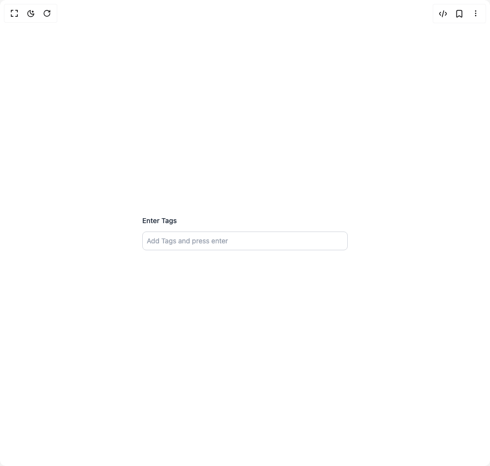

# Build Tags Input in BuilderStudio

> Build this component in our Agentic IDE: [BuilderStudio](https://builderstudio.dev).
>
> Join the BuilderStudio community on [Discord](https://discord.gg/QdWeSGCqfe) and [Reddit](https://reddit.com/r/builderstudio).



## Component

- Author group: `shailendrakumar19999`
- Component: `tags-input`
- Variant: `default`
- Rendered HTML snapshot: [`rendered.html`](rendered.html)

## BuilderStudio prompt

You are implementing a React component based on a component reference.

## Component identity

- Author: shailendrakumar19999
- Component slug: tags-input
- Demo slug: default
- Title: tags-input
- Description: 

## Goal

Recreate this component in a React + TypeScript + Tailwind CSS project. Preserve the visual layout, spacing, colors, border radius, shadows, interaction behavior, animation behavior, responsive behavior, and dark mode behavior shown in the rendered demo.

## Implementation requirements

- Use React and TypeScript.
- Use Tailwind CSS classes whenever possible.
- Keep the component self-contained unless the source files require helper components.
- If the source uses CSS variables, custom CSS, animations, or keyframes, include them.
- If the source uses external packages, list and use the required packages.
- Preserve accessibility attributes, button semantics, links, keyboard behavior, and ARIA attributes when visible in the source.
- Do not replace the component with a simplified placeholder.
- Return complete production-ready code.

## Dependencies

No reference metadata available.

## Rendered DOM snapshot

This is the rendered demo HTML extracted from the live preview. Use it to verify structure, class names, visible content, and layout.

```html
<div id="root"><div class="w-screen min-h-screen flex justify-center items-center"><div class="w-screen min-h-screen flex justify-center items-center"><div class="w-full max-w-md mx-auto p-4"><div dir="ltr" data-scope="tags-input" data-part="root" data-empty="" id="tags-input:«r0»" class="flex flex-col gap-3"><label data-scope="tags-input" data-part="label" id="tags-input:«r0»:label" dir="ltr" for="tags-input:«r0»:input" class="text-sm font-medium text-gray-800 dark:text-gray-200">Enter Tags</label><div id="tags-input:«r0»:control" data-scope="tags-input" data-part="control" dir="ltr" class="flex flex-wrap gap-2 rounded-md border border-gray-300 dark:border-gray-700 bg-white dark:bg-gray-900 p-2 focus-within:ring-2 focus-within:ring-blue-500 transition"><input data-scope="tags-input" data-part="input" dir="ltr" id="tags-input:«r0»:input" autocomplete="off" autocorrect="off" autocapitalize="none" placeholder="Add Tags and press enter" class="flex-1 min-w-[100px] bg-transparent outline-none text-sm text-gray-700 dark:text-gray-200 placeholder-gray-400 dark:placeholder-gray-500" value=""></div><button data-scope="tags-input" data-part="clear-trigger" dir="ltr" id="tags-input:«r0»:clear-btn" type="button" aria-label="Clear all tags" hidden="" class="self-start mt-2 text-sm text-red-600 dark:text-red-400 hover:underline cursor-pointer">Clear all</button><input hidden="" id="tags-input:«r0»:hidden-input" type="text" value=""></div></div></div></div></div>
```

## Reference source files

No reference source files were available.
