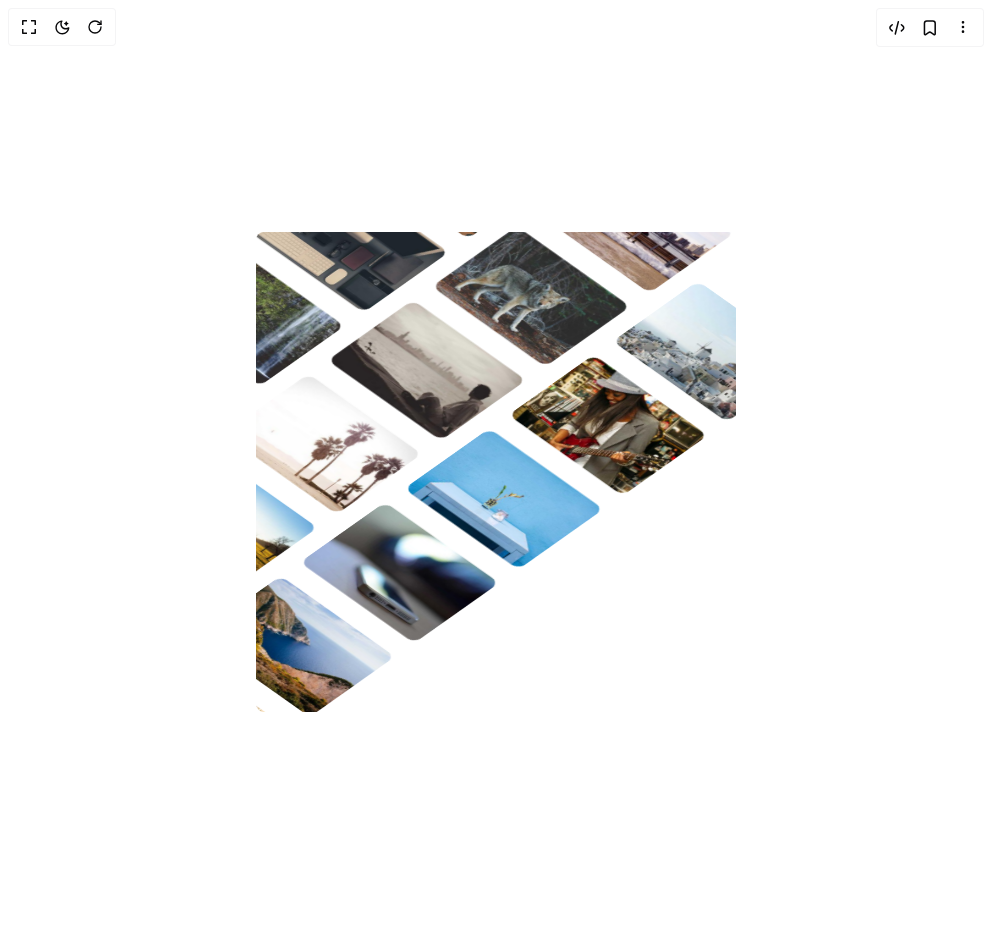

# Build 3d Marquee in BuilderStudio

> Build this component in our Agentic IDE: [BuilderStudio](https://builderstudio.dev).
>
> Join the BuilderStudio community on [Discord](https://discord.gg/QdWeSGCqfe) and [Reddit](https://reddit.com/r/builderstudio).



## Component

- Author group: `shatlyk1011`
- Component: `3d-marquee`
- Variant: `default`
- Rendered HTML snapshot: [`rendered.html`](rendered.html)

## BuilderStudio prompt

You are implementing a React component based on a component reference.

## Component identity

- Author: Shatlyk1011
- Component slug: 3d-marquee
- Demo slug: default
- Title: 3d-marquee
- Description: 

## Goal

Recreate this component in a React + TypeScript + Tailwind CSS project. Preserve the visual layout, spacing, colors, border radius, shadows, interaction behavior, animation behavior, responsive behavior, and dark mode behavior shown in the rendered demo.

## Implementation requirements

- Use React and TypeScript.
- Use Tailwind CSS classes whenever possible.
- Keep the component self-contained unless the source files require helper components.
- If the source uses CSS variables, custom CSS, animations, or keyframes, include them.
- If the source uses external packages, list and use the required packages.
- Preserve accessibility attributes, button semantics, links, keyboard behavior, and ARIA attributes when visible in the source.
- Do not replace the component with a simplified placeholder.
- Return complete production-ready code.

## Dependencies

No reference metadata available.

## Rendered DOM snapshot

This is the rendered demo HTML extracted from the live preview. Use it to verify structure, class names, visible content, and layout.

```html
<div id="root"><div class="w-screen min-h-screen flex justify-center items-center"><div class="w-screen min-h-screen flex justify-center items-center"><div class="min-h-screen bg-background flex items-center justify-center"><div class="mx-auto block h-140 w-full overflow-hidden rounded-md max-xl:h-120 max-sm:h-100"><div class="flex size-full items-center justify-center"><div class="aspect-square size-180 shrink-0 scale-135 max-xl:size-full max-xl:scale-110 max-sm:scale-130"><div class="relative top-0 right-[-55%] grid size-full origin-top-left grid-cols-3 gap-5 transform-3d max-xl:-top-30 max-xl:right-[-45%] max-sm:top-0 max-sm:gap-2" style="transform: rotateX(45deg) rotateY(0deg) rotateZ(45deg);"><figure class="flex flex-col items-start gap-6 max-sm:gap-3" style="transform: translateY(39.2464px);"><div class="relative"></div><div class="relative"></div><div class="relative"></div><div class="relative"></div><div class="relative"></div><div class="relative"></div><div class="relative"></div><div class="relative"></div></figure><figure class="flex flex-col items-start gap-6 max-sm:gap-3" style="transform: translateY(-27.8702px);"><div class="relative"></div><div class="relative"></div><div class="relative"></div><div class="relative"></div><div class="relative"></div><div class="relative"></div><div class="relative"></div><div class="relative"></div></figure><figure class="flex flex-col items-start gap-6 max-sm:gap-3" style="transform: translateY(39.2464px);"><div class="relative"></div><div class="relative"></div><div class="relative"></div><div class="relative"></div><div class="relative"></div><div class="relative"></div><div class="relative"></div><div class="relative"></div></figure></div></div></div></div></div></div></div></div>
```

## Reference source files

No reference source files were available.
