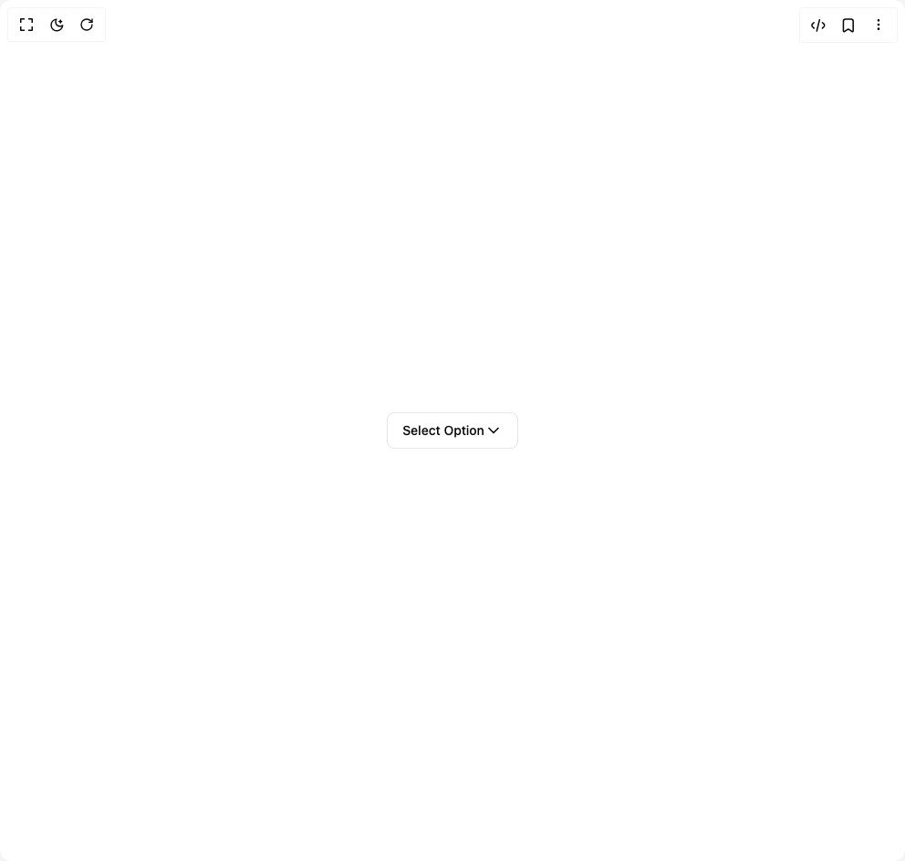
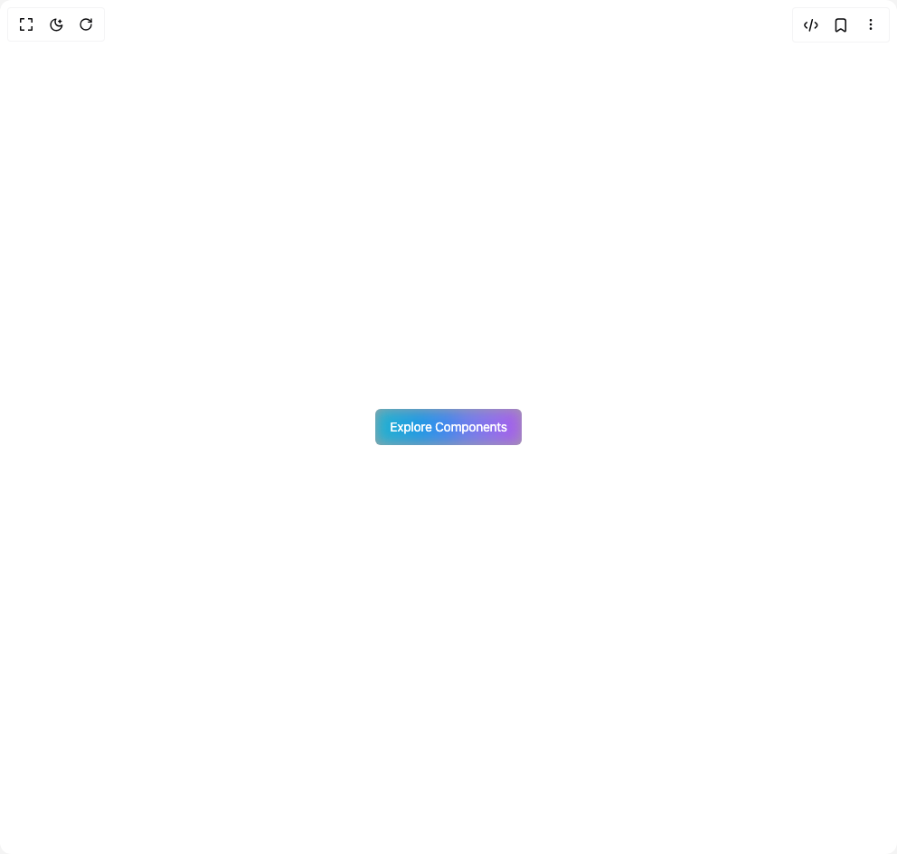
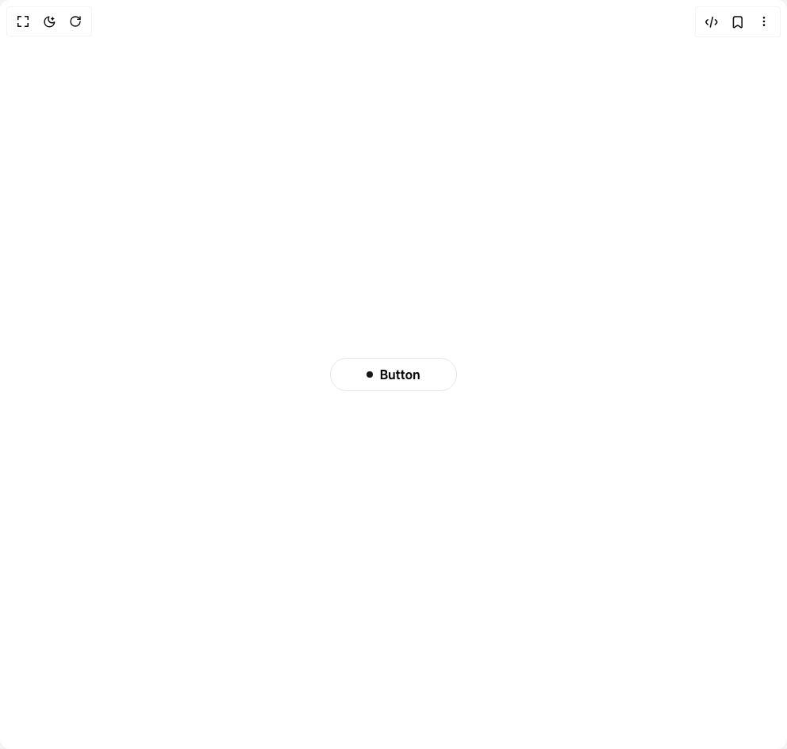
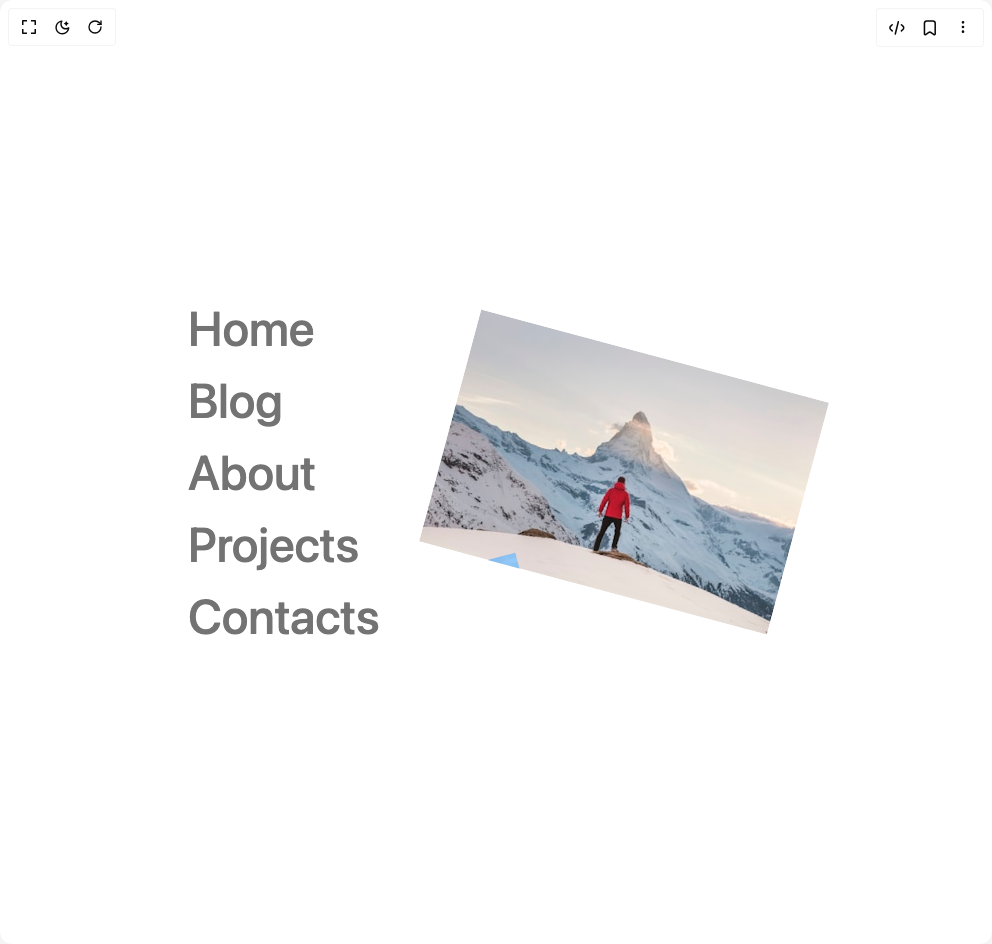
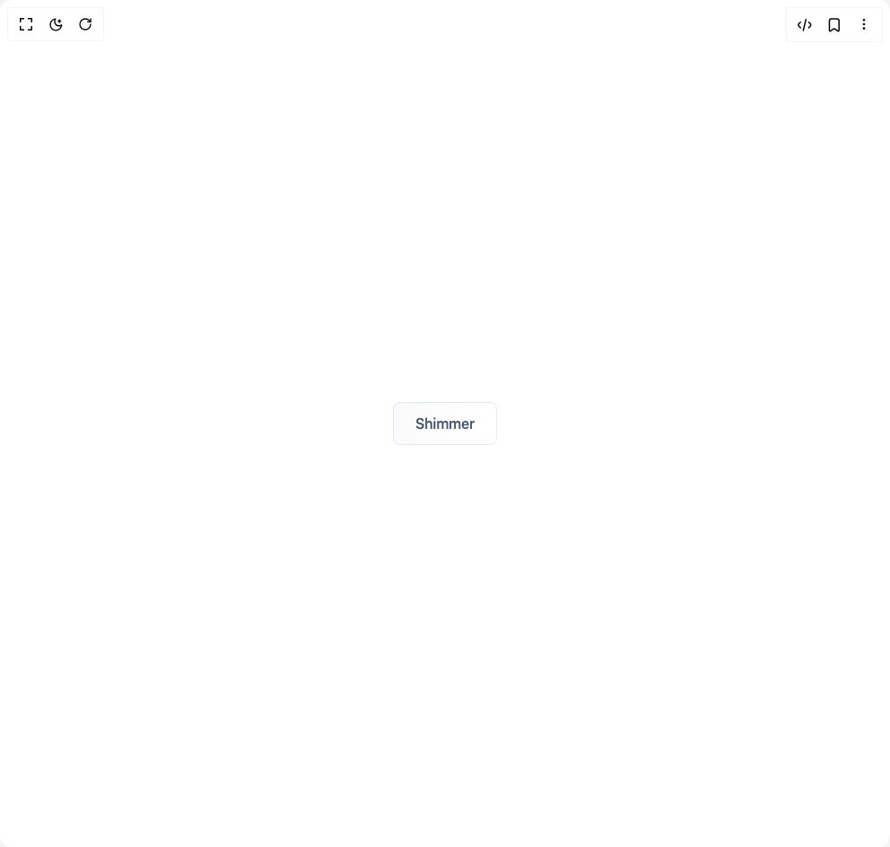
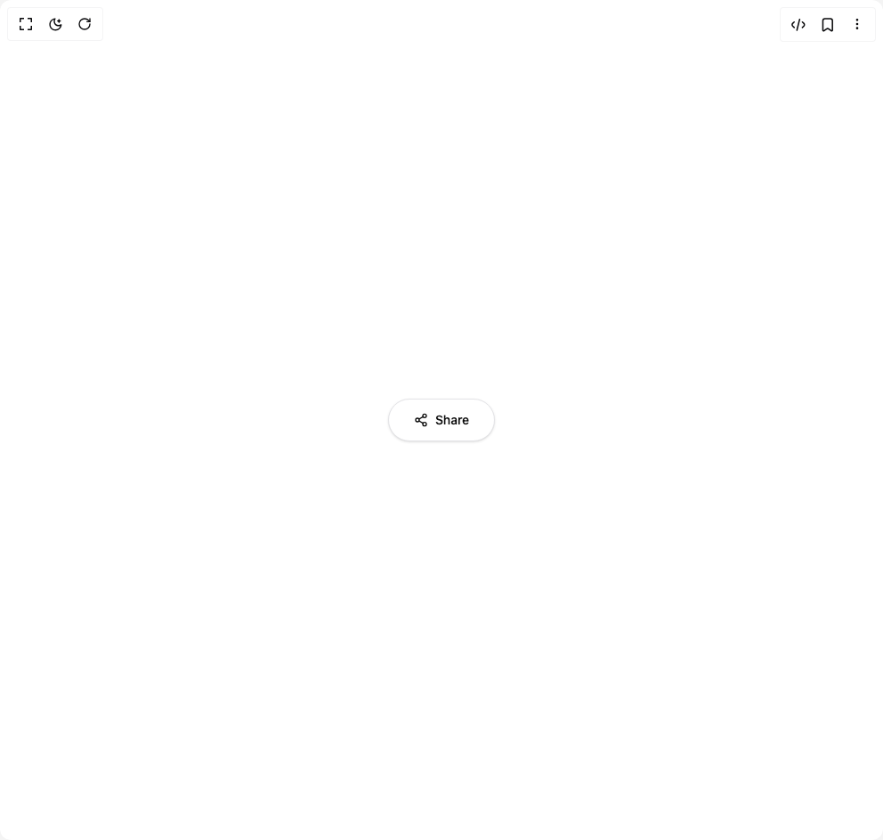
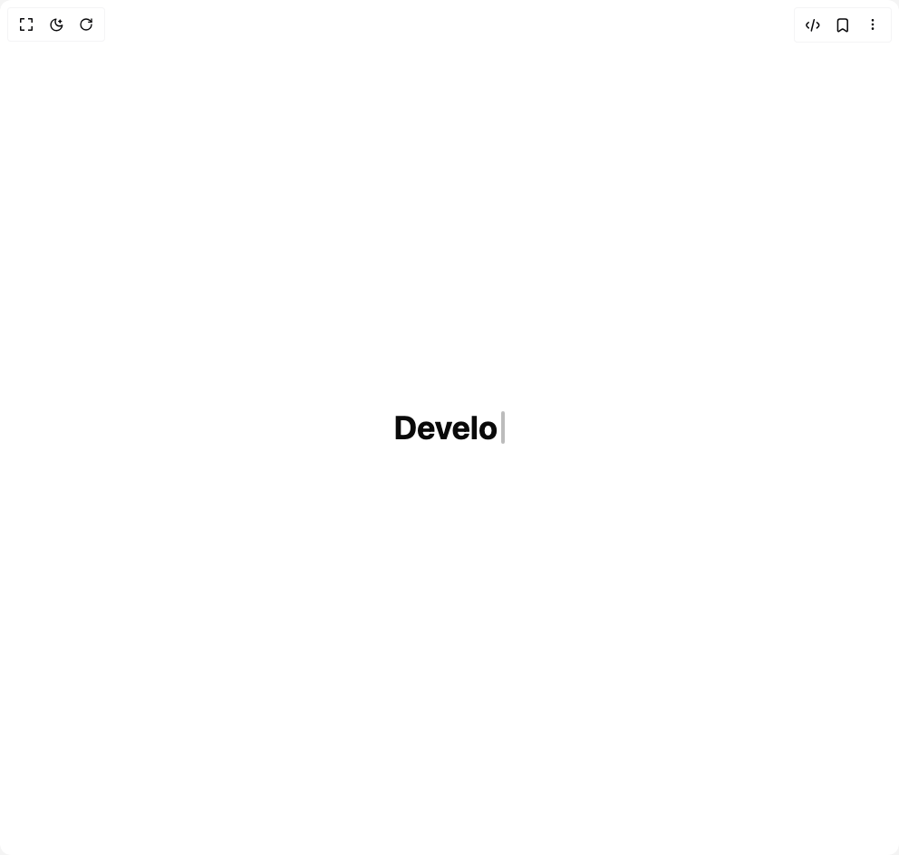

# Shatlyk1011 Components

14 components are available in this author group.

> Build any component in [BuilderStudio](https://builderstudio.dev), then share improvements with the community on [Discord](https://discord.gg/QdWeSGCqfe) or [Reddit](https://reddit.com/r/builderstudio).

| Preview | Component | Variant |
| --- | --- | --- |
|  | [3d Marquee](3d-marquee/default/README.md) | `default` |
|  | [Animated Dropdown](animated-dropdown/default/README.md) | `default` |
|  | [Button Colorful](button-colorful/default/README.md) | `default` |
|  | [Fancy Text Hover](fancy-text-hover/default/README.md) | `default` |
|  | [Gradient Borders Button](gradient-borders-button/default/README.md) | `default` |
|  | [Hover Border Gradient](hover-border-gradient/default/README.md) | `default` |
|  | [Interactive Hover Button](interactive-hover-button/default/README.md) | `default` |
|  | [Link Hover](link-hover/default/README.md) | `default` |
|  | [Motion Button](motion-button/default/README.md) | `default` |
|  | [Shimmer Button](shimmer-button/default/README.md) | `default` |
|  | [Shiny Button](shiny-button/default/README.md) | `default` |
|  | [Social Button](social-button/default/README.md) | `default` |
|  | [Team Member Card](team-member-card/default/README.md) | `default` |
|  | [Typing Effect](typing-effect/default/README.md) | `default` |
