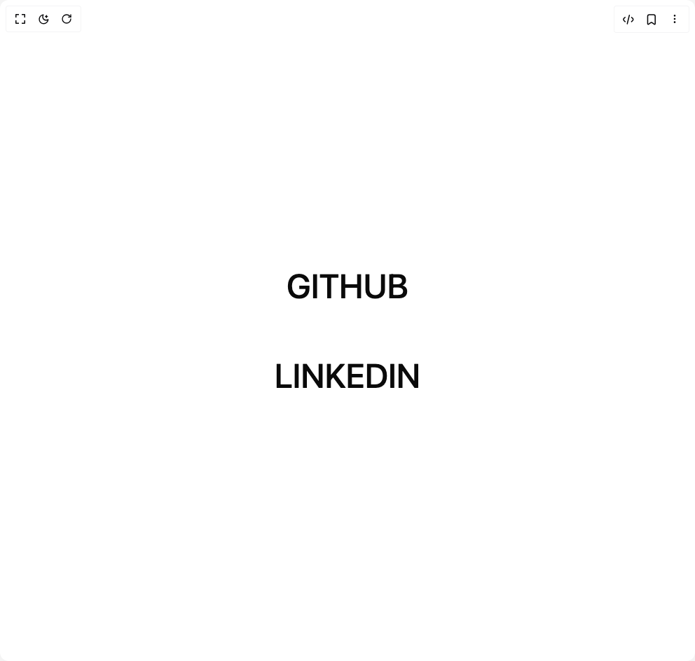

# Build Fancy Text Hover in BuilderStudio

> Build this component in our Agentic IDE: [BuilderStudio](https://builderstudio.dev).
>
> Join the BuilderStudio community on [Discord](https://discord.gg/QdWeSGCqfe) and [Reddit](https://reddit.com/r/builderstudio).



## Component

- Author group: `shatlyk1011`
- Component: `fancy-text-hover`
- Variant: `default`
- Rendered HTML snapshot: [`rendered.html`](rendered.html)

## BuilderStudio prompt

You are implementing a React component based on a component reference.

## Component identity

- Author: Shatlyk1011
- Component slug: fancy-text-hover
- Demo slug: default
- Title: fancy-text-hover
- Description: 

## Goal

Recreate this component in a React + TypeScript + Tailwind CSS project. Preserve the visual layout, spacing, colors, border radius, shadows, interaction behavior, animation behavior, responsive behavior, and dark mode behavior shown in the rendered demo.

## Implementation requirements

- Use React and TypeScript.
- Use Tailwind CSS classes whenever possible.
- Keep the component self-contained unless the source files require helper components.
- If the source uses CSS variables, custom CSS, animations, or keyframes, include them.
- If the source uses external packages, list and use the required packages.
- Preserve accessibility attributes, button semantics, links, keyboard behavior, and ARIA attributes when visible in the source.
- Do not replace the component with a simplified placeholder.
- Return complete production-ready code.

## Dependencies

No reference metadata available.

## Rendered DOM snapshot

This is the rendered demo HTML extracted from the live preview. Use it to verify structure, class names, visible content, and layout.

```html
<div id="root"><div class="w-screen min-h-screen flex justify-center items-center"><div class="w-screen min-h-screen flex justify-center items-center"><div class="flex items-center justify-center min-h-screen bg-background"><div class="flex w-full flex-col items-center justify-between gap-20 p-10"><a href="https://github.com/shatlyk1011" target="_blank" rel="noopener noreferrer" class="fancy-word hover:text-primary text-5xl font-medium uppercase no-underline transition duration-250 ease-[cubic-bezier(0.76,0,0.24,1)]"><span class="inline-block" style="transition: transform 0.3s cubic-bezier(0.76, 0, 0.24, 1);"><span class="inline-block"><span class="inline-block">G</span></span></span><span class="inline-block" style="transition: transform 0.3s cubic-bezier(0.76, 0, 0.24, 1);"><span class="inline-block"><span class="inline-block">i</span></span></span><span class="inline-block" style="transition: transform 0.3s cubic-bezier(0.76, 0, 0.24, 1);"><span class="inline-block"><span class="inline-block">t</span></span></span><span class="inline-block" style="transition: transform 0.3s cubic-bezier(0.76, 0, 0.24, 1);"><span class="inline-block"><span class="inline-block">h</span></span></span><span class="inline-block" style="transition: transform 0.3s cubic-bezier(0.76, 0, 0.24, 1);"><span class="inline-block"><span class="inline-block">u</span></span></span><span class="inline-block" style="transition: transform 0.3s cubic-bezier(0.76, 0, 0.24, 1);"><span class="inline-block"><span class="inline-block">b</span></span></span></a><a href="https://www.linkedin/in/shatlyk1011" target="_blank" rel="noopener noreferrer" class="fancy-word hover:text-primary text-5xl font-medium uppercase no-underline transition duration-250 ease-[cubic-bezier(0.76,0,0.24,1)]"><span class="inline-block" style="transition: transform 0.3s cubic-bezier(0.76, 0, 0.24, 1);"><span class="inline-block"><span class="inline-block">L</span></span></span><span class="inline-block" style="transition: transform 0.3s cubic-bezier(0.76, 0, 0.24, 1);"><span class="inline-block"><span class="inline-block">i</span></span></span><span class="inline-block" style="transition: transform 0.3s cubic-bezier(0.76, 0, 0.24, 1);"><span class="inline-block"><span class="inline-block">n</span></span></span><span class="inline-block" style="transition: transform 0.3s cubic-bezier(0.76, 0, 0.24, 1);"><span class="inline-block"><span class="inline-block">k</span></span></span><span class="inline-block" style="transition: transform 0.3s cubic-bezier(0.76, 0, 0.24, 1);"><span class="inline-block"><span class="inline-block">e</span></span></span><span class="inline-block" style="transition: transform 0.3s cubic-bezier(0.76, 0, 0.24, 1);"><span class="inline-block"><span class="inline-block">d</span></span></span><span class="inline-block" style="transition: transform 0.3s cubic-bezier(0.76, 0, 0.24, 1);"><span class="inline-block"><span class="inline-block">i</span></span></span><span class="inline-block" style="transition: transform 0.3s cubic-bezier(0.76, 0, 0.24, 1);"><span class="inline-block"><span class="inline-block">n</span></span></span></a></div></div></div></div></div>
```

## Reference source files

No reference source files were available.
