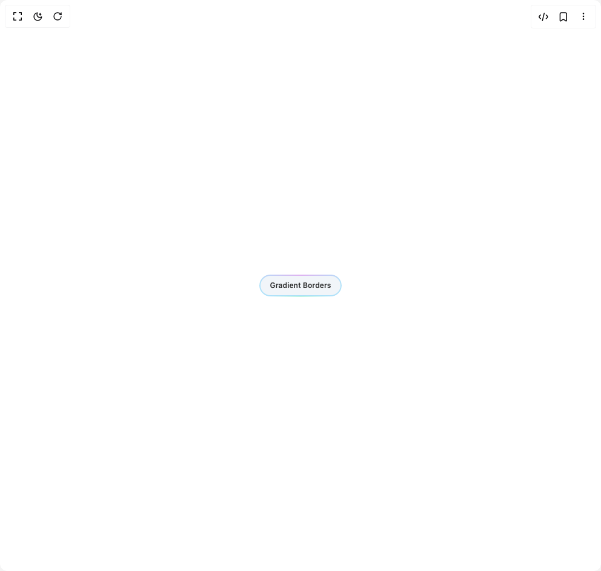

# Build Gradient Borders Button in BuilderStudio

> Build this component in our Agentic IDE: [BuilderStudio](https://builderstudio.dev).
>
> Join the BuilderStudio community on [Discord](https://discord.gg/QdWeSGCqfe) and [Reddit](https://reddit.com/r/builderstudio).



## Component

- Author group: `shatlyk1011`
- Component: `gradient-borders-button`
- Variant: `default`
- Rendered HTML snapshot: [`rendered.html`](rendered.html)

## BuilderStudio prompt

You are implementing a React component based on a component reference.

## Component identity

- Author: Shatlyk1011
- Component slug: gradient-borders-button
- Demo slug: default
- Title: gradient-borders-button
- Description: 

## Goal

Recreate this component in a React + TypeScript + Tailwind CSS project. Preserve the visual layout, spacing, colors, border radius, shadows, interaction behavior, animation behavior, responsive behavior, and dark mode behavior shown in the rendered demo.

## Implementation requirements

- Use React and TypeScript.
- Use Tailwind CSS classes whenever possible.
- Keep the component self-contained unless the source files require helper components.
- If the source uses CSS variables, custom CSS, animations, or keyframes, include them.
- If the source uses external packages, list and use the required packages.
- Preserve accessibility attributes, button semantics, links, keyboard behavior, and ARIA attributes when visible in the source.
- Do not replace the component with a simplified placeholder.
- Return complete production-ready code.

## Dependencies

No reference metadata available.

## Rendered DOM snapshot

This is the rendered demo HTML extracted from the live preview. Use it to verify structure, class names, visible content, and layout.

```html
<div id="root"><div class="w-screen min-h-screen flex justify-center items-center"><div class="w-screen min-h-screen flex justify-center items-center"><div class="flex items-center justify-center min-h-screen bg-background"><button class="group relative inline-block cursor-pointer rounded-full border-none bg-slate-100 p-0.5 text-xs leading-6 font-semibold text-white no-underline outline-none focus:ring-slate-400 focus:ring-offset-1 focus:ring-offset-slate-100 focus-visible:ring-1 dark:bg-slate-800 dark:focus:ring-slate-400 dark:focus:ring-offset-slate-950" type="button"><span class="absolute inset-0 overflow-hidden rounded-full"><span class="absolute inset-0 rounded-full bg-[radial-gradient(75%_100%_at_50%_0%,rgba(189,56,222,1)_0%,rgba(56,189,248,1)_75%)] opacity-40 transition-opacity duration-500 group-hover:opacity-100 dark:bg-[radial-gradient(75%_100%_at_50%_0%,rgba(189,56,222,0.8)_0%,rgba(56,189,248,0.4)_75%)] dark:opacity-0"></span></span><div class="relative z-10 flex h-8 items-center space-x-2 rounded-full bg-slate-100 px-4 text-black/80 ring-2 ring-white/10 dark:bg-slate-950 dark:text-white/80"><span>Gradient Borders</span></div><span class="absolute bottom-0 left-4.5 h-px w-[calc(100%-2.25rem)] bg-linear-to-r from-emerald-400/0 via-emerald-400/90 to-emerald-400/0 transition-opacity duration-500 group-hover:opacity-40"></span></button></div></div></div></div>
```

## Reference source files

No reference source files were available.
