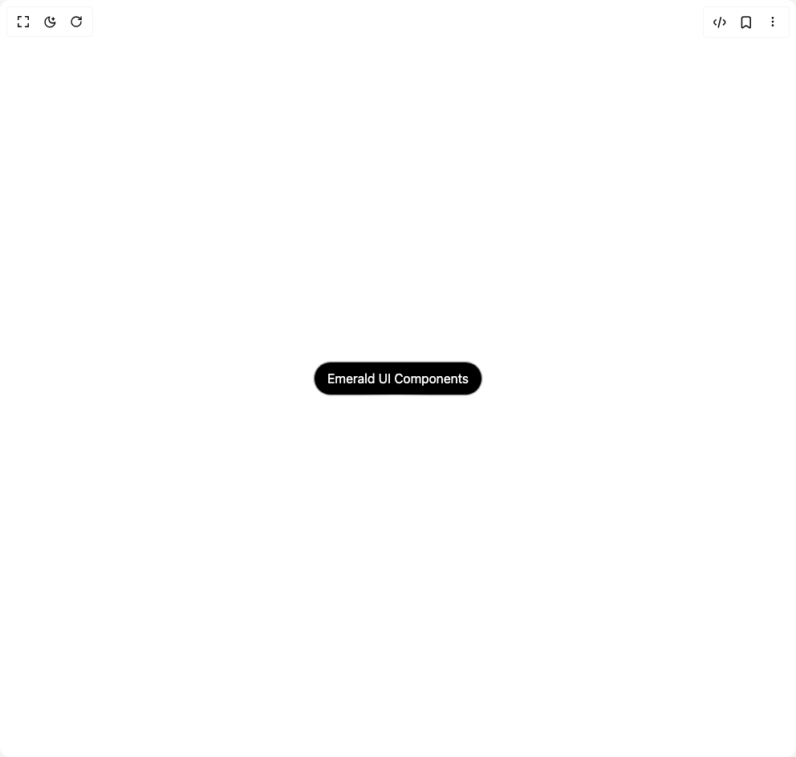

# Build Hover Border Gradient in BuilderStudio

> Build this component in our Agentic IDE: [BuilderStudio](https://builderstudio.dev).
>
> Join the BuilderStudio community on [Discord](https://discord.gg/QdWeSGCqfe) and [Reddit](https://reddit.com/r/builderstudio).



## Component

- Author group: `shatlyk1011`
- Component: `hover-border-gradient`
- Variant: `default`
- Rendered HTML snapshot: [`rendered.html`](rendered.html)

## BuilderStudio prompt

You are implementing a React component based on a component reference.

## Component identity

- Author: Shatlyk1011
- Component slug: hover-border-gradient
- Demo slug: default
- Title: hover-border-gradient
- Description: 

## Goal

Recreate this component in a React + TypeScript + Tailwind CSS project. Preserve the visual layout, spacing, colors, border radius, shadows, interaction behavior, animation behavior, responsive behavior, and dark mode behavior shown in the rendered demo.

## Implementation requirements

- Use React and TypeScript.
- Use Tailwind CSS classes whenever possible.
- Keep the component self-contained unless the source files require helper components.
- If the source uses CSS variables, custom CSS, animations, or keyframes, include them.
- If the source uses external packages, list and use the required packages.
- Preserve accessibility attributes, button semantics, links, keyboard behavior, and ARIA attributes when visible in the source.
- Do not replace the component with a simplified placeholder.
- Return complete production-ready code.

## Dependencies

No reference metadata available.

## Rendered DOM snapshot

This is the rendered demo HTML extracted from the live preview. Use it to verify structure, class names, visible content, and layout.

```html
<div id="root"><div class="w-screen min-h-screen flex justify-center items-center"><div class="w-screen min-h-screen flex justify-center items-center"><div class="flex items-center justify-center min-h-screen bg-background"><button class="relative flex h-min w-fit flex-col flex-nowrap content-center items-center justify-center gap-10 overflow-visible rounded-full border bg-black/40 box-decoration-clone p-px backdrop-blur-sm transition duration-500 hover:bg-black/60 dark:bg-white/20"><div class="z-10 w-auto rounded-[inherit] bg-black px-4 py-2 text-white"><span>Emerald UI Components</span></div><div class="absolute inset-0 z-0 flex-none overflow-hidden rounded-[inherit]" style="filter: blur(2px); position: absolute; width: 100%; height: 100%; background: radial-gradient(20.6507% 49.9036% at 50.5478% 99.4478%, rgb(255, 255, 255) 0%, rgba(255, 255, 255, 0) 100%);"></div><div class="absolute inset-0.5 z-1 flex-none rounded-[100px] bg-black"></div></button></div></div></div></div>
```

## Reference source files

No reference source files were available.
