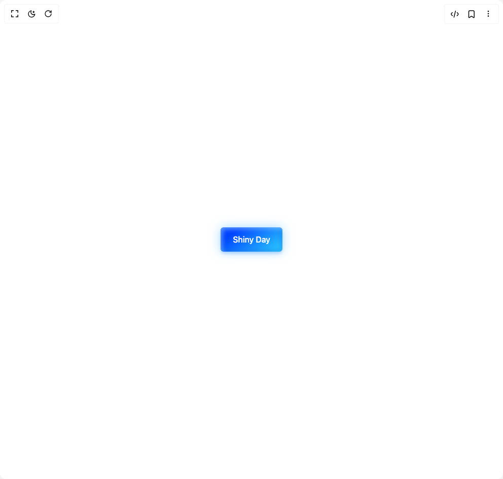

# Build Shiny Button in BuilderStudio

> Build this component in our Agentic IDE: [BuilderStudio](https://builderstudio.dev).
>
> Join the BuilderStudio community on [Discord](https://discord.gg/QdWeSGCqfe) and [Reddit](https://reddit.com/r/builderstudio).



## Component

- Author group: `shatlyk1011`
- Component: `shiny-button`
- Variant: `default`
- Rendered HTML snapshot: [`rendered.html`](rendered.html)

## BuilderStudio prompt

You are implementing a React component based on a component reference.

## Component identity

- Author: Shatlyk1011
- Component slug: shiny-button
- Demo slug: default
- Title: shiny-button
- Description: 

## Goal

Recreate this component in a React + TypeScript + Tailwind CSS project. Preserve the visual layout, spacing, colors, border radius, shadows, interaction behavior, animation behavior, responsive behavior, and dark mode behavior shown in the rendered demo.

## Implementation requirements

- Use React and TypeScript.
- Use Tailwind CSS classes whenever possible.
- Keep the component self-contained unless the source files require helper components.
- If the source uses CSS variables, custom CSS, animations, or keyframes, include them.
- If the source uses external packages, list and use the required packages.
- Preserve accessibility attributes, button semantics, links, keyboard behavior, and ARIA attributes when visible in the source.
- Do not replace the component with a simplified placeholder.
- Return complete production-ready code.

## Dependencies

No reference metadata available.

## Rendered DOM snapshot

This is the rendered demo HTML extracted from the live preview. Use it to verify structure, class names, visible content, and layout.

```html
<div id="root"><div class="w-screen min-h-screen flex justify-center items-center"><div class="w-screen min-h-screen flex justify-center items-center"><div class="flex items-center justify-center min-h-screen bg-background"><button class="h-12 w-max rounded-sm border-none bg-[linear-gradient(325deg,#0044ff_0%,#2ccfff_55%,#0044ff_90%)] bg-size-[280%_auto] px-6 py-2 font-medium text-white shadow-[0px_0px_20px_rgba(71,184,255,0.5),0px_5px_5px_-1px_rgba(58,125,233,0.25),inset_4px_4px_8px_rgba(175,230,255,0.5),inset_-4px_-4px_8px_rgba(19,95,216,0.35)] transition-[background] duration-700 hover:bg-top-right focus:ring-blue-400 focus:ring-offset-1 focus:ring-offset-white focus:outline-none focus-visible:ring-2 dark:focus:ring-blue-500 dark:focus:ring-offset-black" type="button">Shiny Day</button></div></div></div></div>
```

## Reference source files

No reference source files were available.
